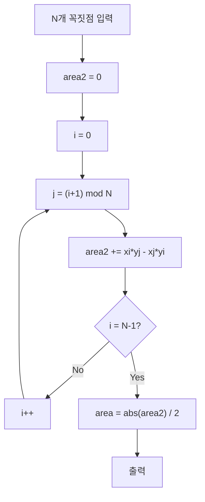

## 정의

**그린 정리 (Green's Theorem)** 는 평면 위의 폐곡선 C 에 대한 선적분(line integral) 과 그 내부 영역 D 에 대한 이중 적분(double integral) 을 연결: ∮_C (L dx + M dy) = ∬_D (∂M/∂x - ∂L/∂y) dA. 곡선 C 는 반시계 방향(counterclockwise)으로 양의 방향.

## 문제 상황과 동기

폐곡선으로 둘러싸인 영역의 넓이를 선적분만으로 계산.

- **Naive 접근**: 영역을 작은 사각형으로 분할해 Riemann 합. mesh size 에 의존.
- **핵심 통찰**: Green 정리의 특수한 경우: ∮_C x dy = area(D). 즉, 경계선을 따라 x dy 만 적분하면 면적.
- **PS 위치**: [[Shoelace|신발끈 공식]] 이 Green 정리의 이산 버전. 다각형의 면적 O(N). 좌표 기하 문제에서 면적을 직접 계산해야 할 때.

## 시각화

```anim:green
{}
```

## 핵심 아이디어

```
Green 정리 (일반):
  ∮_C (L dx + M dy) = ∬_D (∂M/∂x - ∂L/∂y) dA

면적 공식 (L = -y/2, M = x/2):
  Area(D) = ∮_C (x dy - y dx) / 2 = ∮_C x dy

다각형 면적 (Shoelace, 이산 버전):
  Area = (1/2) * | Σ (x_i * y_{i+1} - x_{i+1} * y_i) |
```

증명 스케치: ∂M/∂x - ∂L/∂y 가 1 이 되도록 L, M 을 잡으면 우변은 area.

## 알고리즘

```text
polygon_area(vertices[0..N-1]):
    area2 = 0
    for i = 0..N-1:
        j = (i+1) % N
        area2 += vertices[i].x * vertices[j].y
        area2 -= vertices[j].x * vertices[i].y
    return abs(area2) / 2.0
```

## 알고리즘 흐름도



## 구현

<CodeWithOutput
  variants={[
    {
      language: "cpp",
      label: "C++",
      code: `// Green 정리 기반 shoelace 공식으로 다각형 면적
#include <bits/stdc++.h>
using namespace std;
using ll = long long;
struct Pt { ll x, y; };
int main() {
    int n; cin >> n;
    vector<Pt> p(n);
    for (auto& v : p) cin >> v.x >> v.y;
    ll area2 = 0;
    for (int i = 0; i < n; i++) {
        int j = (i + 1) % n;
        area2 += p[i].x * p[j].y;
        area2 -= p[j].x * p[i].y;
    }
    area2 = abs(area2);
    cout << "Area: " << area2 / 2;
    if (area2 % 2) cout << ".5";
    cout << "\\n";
}`,
    },
    {
      language: "python",
      label: "Python",
      code: `# Green 정리로 다각형 면적 (shoelace)
def polygon_area(p):
    area2 = 0
    n = len(p)
    for i in range(n):
        j = (i + 1) % n
        area2 += p[i][0] * p[j][1] - p[j][0] * p[i][1]
    area2 = abs(area2)
    area = area2 // 2
    return area, area2 % 2
n = int(input())
p = [tuple(map(int, input().split())) for _ in range(n)]
area, half = polygon_area(p)
print(f"Area: {area}" + (".5" if half else ""))`,
    },
    {
      language: "java",
      label: "Java",
      code: `import java.util.*;
import java.io.*;
public class Main {
    public static void main(String[] args) throws IOException {
        BufferedReader br = new BufferedReader(new InputStreamReader(System.in));
        int n = Integer.parseInt(br.readLine());
        long[] x = new long[n], y = new long[n];
        for (int i = 0; i < n; i++) {
            StringTokenizer st = new StringTokenizer(br.readLine());
            x[i] = Long.parseLong(st.nextToken());
            y[i] = Long.parseLong(st.nextToken());
        }
        long a2 = 0;
        for (int i = 0; i < n; i++) {
            int j = (i + 1) % n;
            a2 += x[i] * y[j] - x[j] * y[i];
        }
        a2 = Math.abs(a2);
        System.out.print("Area: " + a2 / 2);
        if (a2 % 2 == 1) System.out.print(".5");
        System.out.println();
    }
}`,
    },
  ]}
  cases={[
    {
      label: "직사각형 (0,0)-(4,0)-(4,3)-(0,3)",
      input: `4
0 0
4 0
4 3
0 3`,
      output: `Area: 12`,
    },
    {
      label: "삼각형 (0,0)-(6,0)-(0,8)",
      input: `3
0 0
6 0
0 8`,
      output: `Area: 24`,
    },
    {
      label: "오각형",
      input: `5
0 0
5 0
6 3
2 5
-1 2`,
      output: `Area: 24`,
    },
  ]}
/>

## 복잡도

| 항목 | 값 |
|:---|:---|
| **시간** | O(N) |
| **공간** | O(1) (incremental) |
| **선적분 변환** | O(1) per edge |

## 변형 / 활용

- **Shoelace (신발끈 공식)**: Green 정리의 이산 버전. 정수 좌표 다각형의 면적.
- **Stokes 정리**: 3차원 일반화. Green 은 Stokes 의 2D 특수 케이스.
- **발산 정리 (Divergence Theorem)**: ∮ F·n ds = ∬ div F dA (flux form).
- **응용**: 유체 역학에서 circulation, CAD 에서 면적 계산, GIS.

## 수학적 유도

Green 정리에서 면적 공식을 유도하는 과정:

$$\oint_C (L \, dx + M \, dy) = \iint_D \left(\frac{\partial M}{\partial x} - \frac{\partial L}{\partial y}\right) dA$$

$L = 0,\; M = x$ 를 대입:
- $\frac{\partial M}{\partial x} = 1$, $\frac{\partial L}{\partial y} = 0$
- 우변: $\iint_D 1 \, dA = \text{Area}(D)$
- 좌변: $\oint_C x \, dy = \text{Area}(D)$

대칭적으로 $L = -y,\; M = 0$ 이면 $\oint_C (-y \, dx) = \text{Area}(D)$.

두 공식의 평균 (대칭 Shoelace):

$$\text{Area}(D) = \frac{1}{2} \oint_C (x \, dy - y \, dx) = \frac{1}{2} \left|\sum_{i=0}^{N-1}(x_i y_{i+1} - x_{i+1} y_i)\right|$$

이산 다각형에서 선적분을 유한 합으로 치환하면 정확히 **신발끈 공식**.

## Pick 정리와의 관계

정수 좌표 단순 다각형에서 Green 정리로 면적 A 를 구하고, Pick 정리로 내부 격자점 I 를 역산:

$$A = I + \frac{B}{2} - 1 \;\Longrightarrow\; I = A - \frac{B}{2} + 1$$

- $A$: Shoelace 로 계산
- $B$: 경계 격자점 수 = 각 변의 $\gcd(|\Delta x|, |\Delta y|)$ 합
- $I$: 위 식으로 역산

활용: "격자 다각형 내부 정수 점 개수" 유형.

## 함정

### 1. 방향

시계 방향(clockwise) 입력이면 면적이 음수. 반드시 `abs()` 처리.

### 2. 정수 좌표 .5 문제

면적이 2 로 나누어떨어지지 않으면 .5 단위. 코드에서 `area2` (2배 값) 를 유지해야 정밀도 손실 없음.

### 3. 자기 교차 다각형

자기 교차하는 폴리곤은 Green 정리의 단순 폐곡선 조건을 만족하지 않음. signed area 개념으로 확장 가능.

## BOJ 연습 문제

| 번호 | 제목 | 정답률 | 링크 |
|:---|:---|---:|:---|
| BOJ 2166 | 다각형의 면적 | - | [kokoa-lab](https://github.com/kokoa-lab/boj-problems/tree/main/organize_problems/2100-2199/2166) |
| BOJ 1485 | 정사각형 | - | [kokoa-lab](https://github.com/kokoa-lab/boj-problems/tree/main/organize_problems/1400-1499/1485) |
| BOJ 1358 | 하키 | - | [kokoa-lab](https://github.com/kokoa-lab/boj-problems/tree/main/organize_problems/1300-1399/1358) |
| BOJ 1004 | 어린 왕자 | - | [kokoa-lab](https://github.com/kokoa-lab/boj-problems/tree/main/organize_problems/1000-1099/1004) |

## 참고

- [[Shoelace|신발끈 공식]]
- [[Pick|Pick 정리]]
- [[Geometry Basic|기하 기본]]
