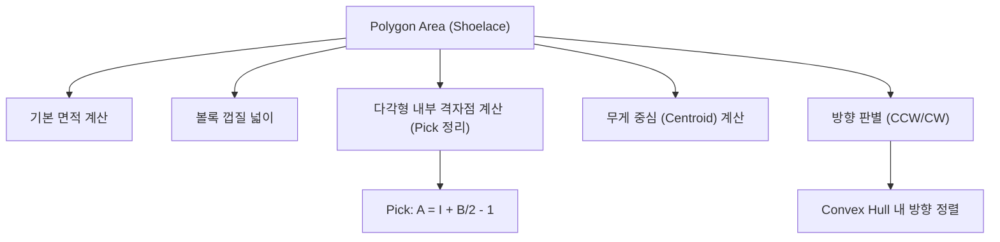

## 정의

**다각형 넓이 (Polygon Area)** 는 2D 평면 위 **단순다각형 (non-self-intersecting polygon)** 의 면적을 **신발끈 공식 (Shoelace Formula)** 으로 O(N) 에 계산하는 알고리즘.

신발끈 공식의 핵심 속성:
- **단순다각형 범용**: 볼록(convex) / 오목(concave) 모두 동작.
- **방향 무관**: 시계(CW) / 반시계(CCW) 방향에 관계없이 절대값 취하면 정확.
- **부호 있는 넓이**: 부호로 다각형 방향(CCW: 양수, CW: 음수) 판별 가능.
- **정수 좌표 친화적**: 중간 계산이 모두 정수. 최종에만 2 로 나누면 됨.

## 문제 상황과 동기

다각형의 넓이는 기하 문제에서 가장 빈번하게 등장하는 연산.

- **Naive**: 삼각형 분할 후 각각 넓이 합산. O(N) 이지만 구현이 번거롭고 분할 방식을 결정해야 함.
- **Shoelace**: 각 변의 기여도를 외적 하나로 계산. O(N) 에 통일된 공식.

핵심 통찰: *다각형의 부호 있는 넓이는 각 변 (i, i+1) 의 외적의 합의 절반*. 즉 `0.5 * | sum (x_i * y_{i+1} - x_{i+1} * y_i) |`.

이 공식은 다각형이 볼록인지 오목인지, 시계/반시계 방향인지 관계없이 항상 성립.

### 어디서 쓰이는가?



## 시각화

```anim:polygon-area
{}
```

## 핵심 아이디어

다각형의 꼭짓점을 `P[0], P[1], ..., P[N-1]` (반시계 또는 시계). 각 변 `P[i] -> P[i+1]` 에 대해, **사다리꼴의 부호 있는 넓이** 를 더한다.

```text
S = 0
for i in 0..N-1:
    j = (i + 1) % N
    S += P[i].x * P[j].y
    S -= P[j].x * P[i].y
area = abs(S) / 2
```

이론적 근거: 그린 정리 (Green's theorem) 의 이산 버전. 각 변의 사다리꼴 넓이가 모두 더해지면 내부는 중첩되고 외부는 상쇄됨.

부호: `S > 0` 이면 반시계 방향, `S < 0` 이면 시계 방향.

### 삼각형 예시로 직관 이해

```text
P0=(0,0), P1=(3,0), P2=(0,4) (직각삼각형)

S = P0.x*P1.y - P1.x*P0.y   = 0*0 - 3*0   = 0
  + P1.x*P2.y - P2.x*P1.y   = 3*4 - 0*0   = 12
  + P2.x*P0.y - P0.x*P2.y   = 0*0 - 0*4   = 0

S = 12
area = |12| / 2 = 6.0  (맞음! 밑변 3 × 높이 4 / 2 = 6)
```

## 알고리즘

```text
polygon_area(P[0..N-1]):
    sum = 0
    for i = 0 to N-1:
        j = (i + 1) % N
        sum += P[i].x * P[j].y
        sum -= P[j].x * P[i].y
    return abs(sum) / 2.0
```

## 구현

<CodeWithOutput
  variants={[
    {
      language: "cpp",
      label: "C++",
      code: `// Polygon area (shoelace), O(N)
#include <bits/stdc++.h>
using namespace std;
using ll = long long;

struct Point { ll x, y; };

double polygon_area(vector<Point>& p) {
    ll sum = 0;
    int n = p.size();
    for (int i = 0; i < n; i++) {
        int j = (i + 1) % n;
        sum += p[i].x * p[j].y;
        sum -= p[j].x * p[i].y;
    }
    return abs(sum) / 2.0;
}

int main() {
    vector<Point> poly = {{0,0}, {4,0}, {5,2}, {2,5}, {-1,2}};
    cout << fixed << setprecision(1) << polygon_area(poly) << "\\n";
    vector<Point> tri = {{0,0}, {3,0}, {0,4}};
    cout << fixed << setprecision(1) << polygon_area(tri) << "\\n";
}`,
    },
    {
      language: "python",
      label: "Python",
      code: `# Shoelace formula, O(N)
def polygon_area(poly):
    n = len(poly)
    s = 0
    for i in range(n):
        j = (i + 1) % n
        s += poly[i][0] * poly[j][1]
        s -= poly[j][0] * poly[i][1]
    return abs(s) / 2.0

poly = [(0,0), (4,0), (5,2), (2,5), (-1,2)]
print(f"{polygon_area(poly):.1f}")
tri = [(0,0), (3,0), (0,4)]
print(f"{polygon_area(tri):.1f}")`,
    },
    {
      language: "java",
      label: "Java",
      code: `import java.util.*;
public class Main {
    static double polygonArea(long[][] p) {
        long sum = 0;
        int n = p.length;
        for (int i = 0; i < n; i++) {
            int j = (i + 1) % n;
            sum += p[i][0] * p[j][1];
            sum -= p[j][0] * p[i][1];
        }
        return Math.abs(sum) / 2.0;
    }

    public static void main(String[] args) {
        long[][] poly = {{0,0}, {4,0}, {5,2}, {2,5}, {-1,2}};
        System.out.printf("%.1f%n", polygonArea(poly));
        long[][] tri = {{0,0}, {3,0}, {0,4}};
        System.out.printf("%.1f%n", polygonArea(tri));
    }
}`,
    },
  ]}
  cases={[
    {
      label: "오각형 + 삼각형",
      input: ``,
      output: `19.0
6.0`,
    },
  ]}
/>

## 복잡도

| 항목 | 값 |
|:---|---:|
| **시간** | O(N) (N = 꼭짓점 수) |
| **공간** | O(1) 추가 (입력 배열 제외) |

## 변형 / 활용

### 1. 볼록다각형 여부 (방향 일관성)

Shoelace 의 `sum` 부호로 다각형이 반시계(양수)인지 시계(음수)인지 판별. 모든 연속 세 점의 CCW 가 방향과 일치하는지 확인.

### 2. 다각형의 무게 중심

면적으로 가중치를 준 꼭짓점 평균으로 centroid 계산 가능.

```text
cx = sum((x_i + x_{i+1}) * (x_i*y_{i+1} - x_{i+1}*y_i)) / (6 * area)
cy = sum((y_i + y_{i+1}) * (x_i*y_{i+1} - x_{i+1}*y_i)) / (6 * area)
```

```python
def centroid(poly):
    n = len(poly)
    cx = cy = 0.0
    area = 0.0
    for i in range(n):
        j = (i + 1) % n
        cross = poly[i][0] * poly[j][1] - poly[j][0] * poly[i][1]
        cx += (poly[i][0] + poly[j][0]) * cross
        cy += (poly[i][1] + poly[j][1]) * cross
        area += cross
    area /= 2
    return cx / (6 * area), cy / (6 * area)
```

### 3. 오목 다각형에서도 동작

Shoelace 는 내부 영역의 중첩과 상쇄가 자동으로 처리되므로 오목 다각형에서도 올바른 값.

### 4. 정수 좌표 + long long

좌표가 정수이면 넓이는 `.0` 또는 `.5`. 정수 배율 결과가 필요하면 `abs(sum)` 반환 후 따로 2 로 나누기.

### 5. Pick's Theorem 과 조합

격자점 다각형에서 내부 격자점 수 I 를 구하는 데 Shoelace 를 활용.

```
A = I + B/2 - 1
I = A - B/2 + 1
```

- A = Shoelace 로 계산한 넓이
- B = 경계 위의 격자점 수 (각 변의 gcd 합)
- I = 내부 격자점 수

## 함정

### 1. 오버플로우

`x_i * y_j` 가 `10^6 * 10^6 = 10^12`. N=10^5 면 sum 은 `10^17` 까지 가능. C++ `long long` (9e18) 은 OK, `int` 는 무조건 overflow.

```cpp
// 위험: int 로 합산하면 overflow
int sum = 0;  // WRONG: 10^17 은 int 범위 초과

// 올바름
long long sum = 0;
```

### 2. 다각형 방향

입력이 시계(cw)인지 반시계(ccw)인지 모를 수 있음. `abs(sum)` 으로 절대값 처리.

### 3. 마지막 변

i=N-1 일 때 j=0 으로 돌아오는 것 (`(i+1) % N`) 이 중요. 열린 폴리라인이 아닌 닫힌 다각형이어야 함.

### 4. 정수 나눗셈

C++ 에서 `abs(sum) / 2` 는 정수 나눗셈. `2.0` 으로 나누거나 `(double)` 캐스팅 필요.

### 5. 자기 교차 다각형

Shoelace 는 **단순다각형 (non-self-intersecting)** 에서만 올바르다. 모래시계 모양 (자기 교차) 등에서는 내부/외부 영역이 상쇄되어 실제 넓이보다 작게 나온다.

## BOJ 연습 문제

| 번호 | 제목 | 정답률 | 링크 |
|:---|:---|---:|:---|
| BOJ 2166 | 다각형의 면적 | 39.5% | [kokoa-lab](https://github.com/kokoa-lab/boj-problems/tree/main/organize_problems/2100-2199/2166) |
| BOJ 2477 | 참외밭 | 44.5% | [kokoa-lab](https://github.com/kokoa-lab/boj-problems/tree/main/organize_problems/2400-2499/2477) |
| BOJ 1004 | 어린 왕자 | 33.2% | [kokoa-lab](https://github.com/kokoa-lab/boj-problems/tree/main/organize_problems/1000-1099/1004) |
| BOJ 1709 | (관련: 원의 넓이) | (수집 안 됨) | [kokoa-lab](https://github.com/kokoa-lab/boj-problems/tree/main/organize_problems/1700-1799/1709) |

## 참고

- [[CCW]] (외적의 기초)
- [[Convex Hull]] (볼록 껍질에서도 같은 공식)
- [[Geometry]] (기하 기본)
