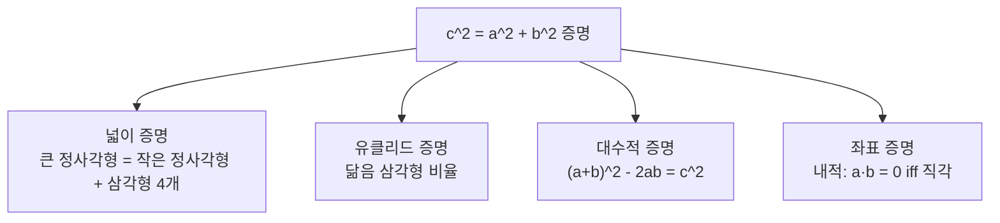

## 정의

**피타고라스 정리**는 직각삼각형에서 빗변 c 의 제곱이 두 직각변 a, b 의 제곱의 합과 같다는 정리: c^2 = a^2 + b^2. 기원전 6세기 그리스 수학자 피타고라스가 증명. **피타고라스 수 (Pythagorean triple)** 는 이 등식을 만족하는 세 자연수 (a, b, c) 쌍으로 (3, 4, 5) 가 가장 잘 알려짐.

## 문제 상황과 동기

2D 평면에서 두 점 사이의 거리, 직각 판별, 원의 방정식 등 기하의 거의 모든 곳에서 피타고라스 정리가 쓰임.

- **Naive 접근**: 세 변이 주어졌을 때 a^2 + b^2 = c^2 를 확인하려면 세 변을 정렬한 후 O(1).
- **핵심 통찰**: c 가 항상 가장 크므로 정렬 후 한 번의 검사로 직각 판별 가능.
- **PS 위치**: 두 점 거리의 제곱을 그대로 비교해 실수 연산 회피. 좌표 기하 문제의 가장 기초.

## 시각화

```anim:pythagoras
{}
```

## 핵심 아이디어

```
c^2 = a^2 + b^2

직각삼각형:
- a, b: 직각변 (legs)
- c: 빗변 (hypotenuse), 항상 가장 긴 변

Euclid 공식 (primitive triple 생성):
a = m^2 - n^2
b = 2mn
c = m^2 + n^2
조건: m > n, gcd(m,n)=1, m-n 은 홀수
```

## 증명 방법들

피타고라스 정리의 주요 증명 접근:



**넓이 증명** (가장 직관적): 변 길이 `(a+b)` 인 큰 정사각형 안에 변 `c` 인 정사각형을 내접시키면, 남은 넓이가 삼각형 4 개. 식으로 정리하면 `c^2 = a^2 + b^2`.

**내적 증명** (벡터 기하와 연결): 벡터 `u`, `v` 의 내적 `u·v = |u||v|cos θ`. 직각이면 `cos 90° = 0` 이므로 `u·v = 0`. 이때 `|u+v|^2 = |u|^2 + 2(u·v) + |v|^2 = |u|^2 + |v|^2`.

## 알고리즘

```text
is_right_triangle(a, b, c):
    sides = [a, b, c] 정렬
    return sides[0]^2 + sides[1]^2 == sides[2]^2

generate_triples(limit):
    for m = 2..sqrt(limit):
        for n = 1..m-1:
            if (m-n) is even: continue
            if gcd(m, n) != 1: continue
            a = m^2 - n^2, b = 2mn, c = m^2 + n^2
            if c > limit: continue
            for k = 1; k*c <= limit; k++:
                output (k*a, k*b, k*c)
```

## 구현

<CodeWithOutput
  variants={[
    {
      language: "cpp",
      label: "C++",
      code: `// 피타고라스 수 생성 + 직각 판별
#include <bits/stdc++.h>
using namespace std;
int main() {
    int limit; cin >> limit;
    vector<tuple<int,int,int>> triples;
    for (int m = 2; m*m <= limit; m++) {
        for (int n = 1; n < m; n++) {
            if ((m-n) % 2 == 0) continue;
            if (gcd(m, n) != 1) continue;
            int a = m*m - n*n, b = 2*m*n, c = m*m + n*n;
            if (c > limit) continue;
            for (int k = 1; k*c <= limit; k++)
                triples.push_back({k*a, k*b, k*c});
        }
    }
    cout << "Found " << triples.size() << " triples:\\n";
    for (auto& [a,b,c] : triples)
        cout << a << " " << b << " " << c << "\\n";
    int x, y, z; cin >> x >> y >> z;
    vector<int> v = {x, y, z};
    sort(v.begin(), v.end());
    bool right = v[0]*v[0] + v[1]*v[1] == v[2]*v[2];
    cout << (right ? "RIGHT" : "NOT RIGHT") << "\\n";
}`,
    },
    {
      language: "python",
      label: "Python",
      code: `from math import gcd
def generate_triples(limit):
    triples = []
    for m in range(2, int(limit**0.5)+1):
        for n in range(1, m):
            if (m-n) % 2 == 0: continue
            if gcd(m, n) != 1: continue
            a, b, c = m*m - n*n, 2*m*n, m*m + n*n
            if c > limit: continue
            k = 1
            while k*c <= limit:
                triples.append((k*a, k*b, k*c))
                k += 1
    return triples
limit = int(input())
triples = generate_triples(limit)
print(f"Found {len(triples)} triples")
for t in triples: print(*t)
x, y, z = sorted(map(int, input().split()))
print("RIGHT" if x*x + y*y == z*z else "NOT RIGHT")`,
    },
    {
      language: "java",
      label: "Java",
      code: `import java.util.*;
import java.io.*;
public class Main {
    static int gcd(int a, int b) { return b==0 ? a : gcd(b, a%b); }
    public static void main(String[] args) throws IOException {
        BufferedReader br = new BufferedReader(new InputStreamReader(System.in));
        int limit = Integer.parseInt(br.readLine());
        List<String> out = new ArrayList<>();
        int cnt = 0;
        for (int m = 2; m*m <= limit; m++) {
            for (int n = 1; n < m; n++) {
                if ((m-n)%2==0) continue;
                if (gcd(m,n)!=1) continue;
                int a = m*m-n*n, b = 2*m*n, c = m*m+n*n;
                if (c > limit) continue;
                for (int k = 1; k*c <= limit; k++) {
                    out.add((k*a)+" "+(k*b)+" "+(k*c));
                    cnt++;
                }
            }
        }
        System.out.println("Found " + cnt + " triples");
        out.forEach(System.out::println);
        StringTokenizer st = new StringTokenizer(br.readLine());
        int[] v = {Integer.parseInt(st.nextToken()),
                   Integer.parseInt(st.nextToken()),
                   Integer.parseInt(st.nextToken())};
        Arrays.sort(v);
        boolean right = v[0]*v[0]+v[1]*v[1]==v[2]*v[2];
        System.out.println(right ? "RIGHT" : "NOT RIGHT");
    }
}`,
    },
  ]}
  cases={[
    {
      label: "기본",
      input: `50
3 4 5`,
      output: `Found 5 triples
3 4 5
5 12 13
8 15 17
7 24 25
20 21 29
RIGHT`,
    },
  ]}
/>

## 복잡도

| 항목 | 값 |
|:---|:---|
| **직각 판별 (3 변)** | O(1) |
| **Triple 생성 (limit L)** | O(L log L) |
| **Triple 생성 공간** | O(L) |

## 변형 / 활용

| 응용 | 설명 |
|:---|:---|
| **유클리드 거리** | sqrt((x1-x2)^2 + (y1-y2)^2) |
| **제곱 거리 비교** | sqrt 없이 제곱 상태로 비교 (실수 오차 회피) |
| **내적과 직각** | 두 벡터의 내적이 0 이면 직각. 좌표 기하에서 활용 |

## 좌표 기하 응용

### 두 점 사이 거리

```python
# 부동소수점 오차를 피하려면 제곱 거리로 비교
def dist_sq(x1, y1, x2, y2):
    return (x1 - x2) ** 2 + (y1 - y2) ** 2

# "거리가 R 이하인가?" 판별
r_sq = R * R
if dist_sq(px, py, cx, cy) <= r_sq:
    print("원 안에 있음")
```

### 직각 판별 (내적)

세 점 A, B, C 에서 B 가 직각인지 확인:

```python
def is_right_angle_at_b(ax, ay, bx, by, cx, cy):
    # BA 벡터와 BC 벡터의 내적
    ba = (ax - bx, ay - by)
    bc = (cx - bx, cy - by)
    dot = ba[0] * bc[0] + ba[1] * bc[1]
    return dot == 0
```

### 원 위의 점 판별

원 중심 `(cx, cy)`, 반지름 `r`: `(x-cx)^2 + (y-cy)^2 = r^2`.

PS 에서 `r` 이 정수가 아닌 경우(`r = sqrt(...)`) 에도 양변을 제곱해서 정수 연산으로 비교 가능.

### 3D 확장

공간에서 두 점 거리: `dist_sq = (x2-x1)^2 + (y2-y1)^2 + (z2-z1)^2`. 피타고라스 정리를 두 번 적용한 것과 같다 (먼저 xy 평면, 그 뒤 z 축).

> [!WARNING]
> 3D 에서도 오버플로우 주의. 좌표 범위 `|x|, |y|, |z| <= 10^6` 이면 `dist_sq` 가 최대 `3 * 10^12`. `long long` 또는 `int64` 가 필수.

## 함정

### 1. 빗변 식별 실수

가장 큰 변을 빗변으로 지정해야 함. 정렬 없이 a^2 + b^2 == c^2 만 검사하면 c 가 빗변이 아닐 때 오답.

### 2. 오버플로우

N=10^5 에서 좌표 제곱은 10^10 -> 32-bit int 초과. 반드시 `long long` 사용.

### 3. 실수 sqrt 비교

sqrt(a^2 + b^2) == c 는 부동소수점 오차 유발. 반드시 정수 제곱으로 비교.

## BOJ 연습 문제

| 번호 | 제목 | 정답률 | 링크 |
|:---|:---|---:|:---|
| BOJ 4153 | 직각삼각형 | - | [kokoa-lab](https://github.com/kokoa-lab/boj-problems/tree/main/organize_problems/4100-4199/4153) |
| BOJ 3000 | 직각삼각형 | - | [kokoa-lab](https://github.com/kokoa-lab/boj-problems/tree/main/organize_problems/3000-3099/3000) |
| BOJ 1711 | 직각삼각형 | - | [kokoa-lab](https://github.com/kokoa-lab/boj-problems/tree/main/organize_problems/1700-1799/1711) |
| BOJ 1485 | 정사각형 | - | [kokoa-lab](https://github.com/kokoa-lab/boj-problems/tree/main/organize_problems/1400-1499/1485) |

## 참고

- [[Geometry Basic|기하 기본]]
- [[convex-hull|볼록 껍질]]
