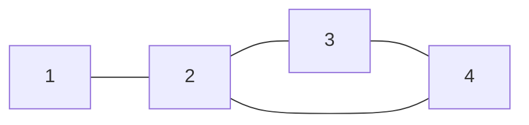

## 정의

그래프에 **사이클이 존재하는가**, 또는 **어느 사이클인가** 를 찾는 문제.

- **무향 그래프**: 한 정점에서 출발해 다시 그 정점으로 돌아오는 경로.
- **유향 그래프**: 방향을 따라가며 이미 방문 중인 정점으로 돌아오는 경로.

## 문제 상황

위상 정렬, 의존성 검사, DAG 판별 등에서 사이클 존재 여부가 핵심이다.

- **패키지 의존성**: A -> B -> C -> A 이면 설치 불가 (순환 의존).
- **작업 스케줄링**: 작업 간 선후관계에 사이클이 있으면 스케줄 불가능.
- **코스 선수과목**: 수강 순서에 사이클이 있으면 모순.

## 시각화

### 무향 그래프 사이클



2 - 3 - 4 - 2 가 사이클. Union-Find 에서 4-2 간선 삽입 시 `find(4) == find(2)` 로 탐지.

### 유향 그래프 사이클 (DFS 3색)


3 -> 2 back edge: 회색(처리 중) 정점으로 가는 간선 = 사이클.

## 핵심 아이디어

### 무향 그래프: Union-Find

간선 (u, v) 를 삽입할 때 `find(u) == find(v)` 이면 u, v 가 이미 같은 컴포넌트 = 사이클.

```text
for each edge (u, v):
    if find(u) == find(v): CYCLE!
    else: union(u, v)
```

### 유향 그래프: DFS 3색

- **흰색 (0)**: 미방문
- **회색 (1)**: 현재 DFS 스택에 있음 (처리 중)
- **검은색 (2)**: 처리 완료

회색 정점으로 향하는 간선 = **back edge** = 사이클 존재.

### 유향 그래프: Kahn's 알고리즘

위상 정렬로 처리된 정점 수 < N 이면 사이클 존재 (일부 정점의 indegree 가 0이 되지 않음).

## 알고리즘

### 무향 그래프: Union-Find

```cpp
struct DSU {
    vector<int> par, rank_;
    DSU(int n) : par(n), rank_(n, 0) { iota(par.begin(), par.end(), 0); }

    int find(int x) {
        if (par[x] != x) par[x] = find(par[x]);  // path compression
        return par[x];
    }

    bool same(int a, int b) { return find(a) == find(b); }

    void merge(int a, int b) {
        a = find(a); b = find(b);
        if (a == b) return;
        if (rank_[a] < rank_[b]) swap(a, b);
        par[b] = a;
        if (rank_[a] == rank_[b]) rank_[a]++;
    }
};

bool hasCycle_undirected(int n, vector<pair<int,int>>& edges) {
    DSU dsu(n);
    for (auto [u, v] : edges) {
        if (dsu.same(u, v)) return true;
        dsu.merge(u, v);
    }
    return false;
}
```

### 유향 그래프: DFS 3색

```cpp
vector<int> color;  // 0=흰, 1=회, 2=검

bool dfs(int u, vector<vector<int>>& adj) {
    color[u] = 1;  // 회색: 처리 시작
    for (int v : adj[u]) {
        if (color[v] == 1) return true;              // back edge: 사이클
        if (color[v] == 0 && dfs(v, adj)) return true;
    }
    color[u] = 2;  // 검은색: 처리 완료
    return false;
}

bool hasCycle_directed(int n, vector<vector<int>>& adj) {
    color.assign(n, 0);
    for (int i = 0; i < n; i++)
        if (color[i] == 0 && dfs(i, adj)) return true;
    return false;
}
```

### 유향 그래프: Kahn's 알고리즘

```cpp
bool hasCycle_kahn(int n, vector<vector<int>>& adj) {
    vector<int> indeg(n, 0);
    for (int u = 0; u < n; u++)
        for (int v : adj[u]) indeg[v]++;

    queue<int> q;
    for (int i = 0; i < n; i++)
        if (indeg[i] == 0) q.push(i);

    int cnt = 0;
    while (!q.empty()) {
        int u = q.front(); q.pop(); cnt++;
        for (int v : adj[u])
            if (--indeg[v] == 0) q.push(v);
    }
    return cnt < n;  // 처리 못한 정점 있으면 사이클
}
```

## 구현

<CodeWithOutput
  variants={[
    {
      language: "cpp",
      label: "C++ (유향 그래프 DFS 3색)",
      code: `#include <bits/stdc++.h>
using namespace std;

int n, m;
vector<vector<int>> adj;
vector<int> color;  // 0=흰, 1=회, 2=검

bool dfs(int u) {
    color[u] = 1;
    for (int v : adj[u]) {
        if (color[v] == 1) return true;
        if (color[v] == 0 && dfs(v)) return true;
    }
    color[u] = 2;
    return false;
}

int main() {
    ios::sync_with_stdio(false);
    cin.tie(nullptr);

    cin >> n >> m;
    adj.resize(n + 1);
    for (int i = 0; i < m; i++) {
        int u, v; cin >> u >> v;
        adj[u].push_back(v);
    }

    color.assign(n + 1, 0);
    bool cycle = false;
    for (int i = 1; i <= n; i++)
        if (color[i] == 0 && dfs(i)) { cycle = true; break; }

    cout << (cycle ? "YES" : "NO") << "\\n";
}`,
    },
    {
      language: "python",
      label: "Python (Kahn's 알고리즘)",
      code: `import sys
from collections import deque
input = sys.stdin.readline

def solve():
    n, m = map(int, input().split())
    adj = [[] for _ in range(n + 1)]
    indeg = [0] * (n + 1)
    for _ in range(m):
        u, v = map(int, input().split())
        adj[u].append(v)
        indeg[v] += 1

    q = deque()
    for i in range(1, n + 1):
        if indeg[i] == 0:
            q.append(i)

    cnt = 0
    while q:
        u = q.popleft()
        cnt += 1
        for v in adj[u]:
            indeg[v] -= 1
            if indeg[v] == 0:
                q.append(v)

    print("YES" if cnt < n else "NO")

solve()`,
    },
  ]}
  cases={[
    {
      label: "사이클 있음",
      input: `4 4
1 2
2 3
3 4
4 2`,
      output: `YES`,
    },
    {
      label: "사이클 없음 (DAG)",
      input: `3 2
1 2
2 3`,
      output: `NO`,
    },
  ]}
/>

## 복잡도

| 방법 | 시간 | 공간 | 적용 대상 |
|:---|:---:|:---:|:---|
| **Union-Find** | O(E * alpha(N)) | O(N) | 무향 그래프 |
| **DFS 3색** | O(V + E) | O(V) | 유향 그래프 |
| **Kahn's 알고리즘** | O(V + E) | O(V) | 유향 그래프 |

Union-Find 는 alpha(N) (역 Ackermann): 사실상 O(1). DFS 3색과 Kahn's 는 동일 복잡도지만 용도가 다름:

- DFS 3색: 사이클 경로 자체를 복원할 때 유리.
- Kahn's: 위상 정렬을 동시에 얻을 때 유리.

## 함정

### 1. 무향 그래프에서 부모 방문을 사이클로 혼동

DFS 기반 무향 그래프 사이클 탐지 시, 간선 (u, v) 에서 v 를 방문할 때 **부모 방향으로 돌아가는 것**을 back edge 로 착각하는 실수.

```cpp
// 잘못: 부모(par)로 돌아가는 것도 사이클 취급
bool dfs(int u, int par, ...) {
    visited[u] = true;
    for (int v : adj[u]) {
        if (!visited[v]) { dfs(v, u, ...); }
        else return true;  // 부모 방문도 true -> 오류!
    }
}

// 올바름: 부모 제외
bool dfs(int u, int par, ...) {
    visited[u] = true;
    for (int v : adj[u]) {
        if (v == par) continue;  // 부모 방향 skip
        if (!visited[v]) { if (dfs(v, u, ...)) return true; }
        else return true;  // 부모 아닌 방문 완료 정점 = back edge
    }
    return false;
}
```

> [!WARNING]
> 멀티 그래프 (같은 정점 사이 간선 여러 개) 는 간선 인덱스로 부모를 추적해야 한다.

### 2. 유향 그래프에서 흰색/검은색 혼동

검은색 (처리 완료) 정점으로 가는 간선은 **forward edge** 또는 **cross edge** 로 사이클이 아니다. 오직 **회색 (처리 중)** 정점으로 가는 back edge 만 사이클.

> [!CAUTION]
> 방문 여부만 체크 (`visited[]`)하면 유향 그래프에서 오답. 반드시 3색 or 스택 상태 구분.

### 3. Kahn's 로 경로 복원 불가

Kahn's 알고리즘은 사이클 **존재 여부**만 알 수 있고, 어떤 정점이 사이클에 포함되는지 직접 알기 어렵다. 사이클 정점 목록이 필요하면 DFS 3색으로 복원.

## BOJ 연습 문제

| 번호 | 제목 | 비고 |
|:---|:---|:---|
| BOJ 9466 | 텀 프로젝트 | 유향 그래프 사이클 (DFS) |
| BOJ 1516 | 게임 개발 | 위상 정렬 + 사이클 없음 보장 |
| BOJ 2252 | 줄 세우기 | 위상 정렬 기본 |
| BOJ 10451 | 순열 사이클 | 무향 그래프 사이클 카운트 |

## 참고

- [[topological-sorting|위상 정렬 (Topological Sorting)]]
- [[disjoint-set|Union-Find (Disjoint Set)]]
- [[tarjan-scc|Tarjan SCC]] (강한 연결 요소)
- [[graph|그래프 기초]]
- [[dfs|DFS (깊이 우선 탐색)]]
