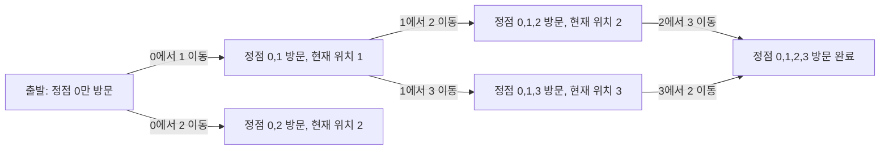

## 정의

**Hamiltonian Path** 는 그래프의 **모든 정점을 정확히 한 번씩** 방문하는 경로. 시작 = 끝이면 **Hamiltonian Cycle**.

일반 그래프에서 **NP-complete**. Euler path (모든 간선을 한 번씩) 와 대비: Euler 는 다항 시간(Hierholzer 알고리즘).

## 문제 상황

N개의 정점과 M개의 간선으로 이루어진 그래프에서 모든 정점을 정확히 한 번씩 방문하는 경로가 존재하는가?

**naive (백트래킹)**: 모든 정점 순열을 시도. O(N! x N). N=15 이상이면 불가능.

**핵심 통찰**: "방문한 정점 집합" 자체를 상태로 만들어 DP. `dp[mask][v]`를 "방문 집합 = mask, 현재 v에 있을 때 도달 가능 여부"로 정의. 상태 수 O(2^N x N), 전이 O(N).

## 시각화

### Bitmask DP 상태 전이 (N=4, 정점 0에서 출발)



### Bitmask 표현 (N=4)

| mask (이진) | 십진 | 방문 정점 집합 |
|:---|:---:|:---|
| 0001 | 1 | {0} |
| 0011 | 3 | {0, 1} |
| 0101 | 5 | {0, 2} |
| 0111 | 7 | {0, 1, 2} |
| 1111 | 15 | {0, 1, 2, 3} (전체) |

## 핵심 아이디어

**상태**: `dp[mask][v]` = "방문 집합 = mask, 현재 v에 있는 상태가 도달 가능한가."

**초기**: `dp[1 << s][s] = true` (출발 정점 s 하나만 방문).

**전이**: 현재 상태 (mask, u)에서 미방문 정점 v로 이동.

```text
if dp[mask][u] and edge(u,v) and v not in mask:
    dp[mask | (1 << v)][v] = true
```

**답**: `full = (1 << N) - 1`인 전체 집합을 포함하는 mask에서 도달 가능한 v가 존재하면 YES.

- Hamiltonian **Path**: `any(dp[full][v] for v in 0..N-1)` → 경로만 확인
- Hamiltonian **Cycle**: `any(dp[full][v] and edge(v, start) for v in 0..N-1)` → 시작점 복귀

### 비트 연산 정리

| 연산 | 코드 |
|:---|:---|
| v 방문 여부 확인 | `mask & (1 << v)` |
| v 추가 | `mask | (1 << v)` |
| v 제거 | `mask & ~(1 << v)` |
| 전체 집합 | `(1 << N) - 1` |

## 알고리즘

```text
# Hamiltonian Path Bitmask DP
# 단일 출발점 s 기준

dp[1 << s][s] = true
for mask = 1 to (1<<N) - 1:
    for u = 0 to N-1:
        if not dp[mask][u]: continue
        if not (mask & (1 << u)): continue   # 유효 상태 체크
        for v in adj[u]:
            if mask & (1 << v): continue      # 이미 방문
            dp[mask | (1 << v)][v] = true

full = (1 << N) - 1
answer = any(dp[full][v] for v in 0..N-1)
```

## 구현

<CodeWithOutput
  variants={[
    {
      language: "cpp",
      label: "C++",
      code: `#include <bits/stdc++.h>
using namespace std;

int main() {
    ios::sync_with_stdio(false);
    cin.tie(nullptr);

    int n, m;
    cin >> n >> m;

    vector<vector<int>> adj(n);
    for (int i = 0; i < m; i++) {
        int u, v;
        cin >> u >> v;
        adj[u].push_back(v);
        adj[v].push_back(u);  // 무방향 그래프
    }

    // dp[mask][v]: mask 집합 방문 후 v에 위치 가능한가
    int FULL = (1 << n) - 1;
    vector<vector<bool>> dp(1 << n, vector<bool>(n, false));

    // 모든 정점을 출발점으로 시도
    for (int s = 0; s < n; s++)
        dp[1 << s][s] = true;

    for (int mask = 1; mask <= FULL; mask++) {
        for (int u = 0; u < n; u++) {
            if (!dp[mask][u]) continue;
            if (!(mask & (1 << u))) continue;
            for (int v : adj[u]) {
                if (mask & (1 << v)) continue;  // 이미 방문
                dp[mask | (1 << v)][v] = true;
            }
        }
    }

    bool found = false;
    for (int v = 0; v < n; v++)
        if (dp[FULL][v]) { found = true; break; }

    cout << (found ? "YES" : "NO") << "\\n";
    return 0;
}`,
    },
    {
      language: "python",
      label: "Python",
      code: `import sys
input = sys.stdin.readline

def solve():
    n, m = map(int, input().split())
    adj = [[] for _ in range(n)]
    for _ in range(m):
        u, v = map(int, input().split())
        adj[u].append(v)
        adj[v].append(u)

    FULL = (1 << n) - 1
    # dp[mask][v]: mask 집합 방문 후 v에 위치 가능한가
    dp = [[False] * n for _ in range(1 << n)]

    for s in range(n):
        dp[1 << s][s] = True

    for mask in range(1, FULL + 1):
        for u in range(n):
            if not dp[mask][u]:
                continue
            if not (mask >> u & 1):
                continue
            for v in adj[u]:
                if mask >> v & 1:
                    continue  # 이미 방문
                dp[mask | (1 << v)][v] = True

    found = any(dp[FULL][v] for v in range(n))
    print("YES" if found else "NO")

solve()`,
    },
  ]}
  cases={[
    {
      label: "경로 존재",
      input: `4 5
0 1
1 2
2 3
0 2
1 3`,
      output: `YES`,
    },
    {
      label: "경로 없음",
      input: `4 2
0 1
2 3`,
      output: `NO`,
    },
  ]}
/>

## 복잡도

| 항목 | 값 |
|:---|:---|
| **시간** | O(2^N x N^2) |
| **공간** | O(2^N x N) |
| **N=15** | 2^15 x 225 ~ 7.4M (여유) |
| **N=20** | 2^20 x 400 ~ 420M (타이트) |
| **실용 한계** | N <= 20 |

> [!NOTE]
> N=20 기준 메모리: `bool dp[2^20][20]` = 약 20MB. `int` 사용 시 80MB.

## 함정

### 1. 유효 상태 체크 누락

```cpp
if (!(mask & (1 << u))) continue;
// 이 체크가 없으면 u가 mask에 없는 잘못된 상태에서 전이 발생
```

### 2. 출발 정점 범위

Hamiltonian Path는 어떤 정점에서도 시작 가능. 모든 s에 대해 `dp[1<<s][s]=true`로 초기화. 시작점을 0으로 고정하면 방향 있는 경우에만 유효.

### 3. 방향 vs 무방향

- 무방향: `adj[u].push_back(v)` 와 `adj[v].push_back(u)` 둘 다
- 방향: 단방향만. Hamiltonian Cycle 존재 조건이 달라짐.

### 4. Cycle vs Path 혼동

Cycle: 마지막 정점 v에서 출발점 s로 돌아올 수 있는 간선 존재 확인 필요.

```cpp
// Hamiltonian Cycle 확인 (출발 s 고정 시)
for (int v = 0; v < n; v++)
    if (dp[FULL][v] && adj_matrix[v][s]) found = true;
```

### 5. 백트래킹 vs DP

N <= 12 정도는 백트래킹도 빠름. N=15~20에서 DP가 확실히 유리. N > 20은 모두 불가.

## BOJ 연습 문제

| 번호 | 제목 | 난이도 | 알고리즘 |
|:---|:---|:---|:---|
| BOJ 1194 | 달이 차오른다, 가자. | Gold 1 | BFS + bitmask |
| BOJ 2098 | 외판원 순회 | Gold 1 | TSP, bitmask DP |
| BOJ 1987 | 알파벳 | Gold 4 | 백트래킹 |
| BOJ 17471 | 게리맨더링 | Gold 4 | 부분집합 + bitmask |

## 참고

- [[tsp|TSP]] (Hamiltonian Cycle + 최소 비용)
- [[dp-bitfield|Bitmask DP]] (비트 연산 상세)
- [[dp-on-bitmask|DP on Bitmask]]
