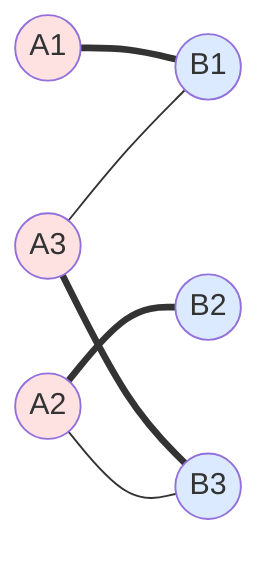

## 정의

그래프 $G = (V, E)$ 에서 **매칭 (Matching)** 은 간선의 부분집합 $M \subseteq E$ 이면서 **어느 두 간선도 공통 정점을 공유하지 않는** 것.

- 각 정점은 매칭 안 최대 1개 간선에 속함
- **최대 매칭 (Maximum Matching)**: 매칭 크기가 최대
- **완벽 매칭 (Perfect Matching)**: 모든 정점이 매칭에 포함

## 시각화

**이분 그래프 매칭 예시** (직원 ↔ 업무):



- 굵은 선 (`===`) = 매칭 안 간선
- 가는 선 (`---`) = 가능하지만 미사용
- 크기 3 매칭 (A1-B1, A2-B2, A3-B3) = perfect

## 이분 그래프 매칭 (Bipartite Matching)

가장 흔한 문제. 정점을 두 집합 $L, R$ 로 나눌 수 있고 모든 간선이 $L \times R$.

### 응용

- **작업 할당**: 직원 - 업무
- **결혼 문제**: 남자 - 여자 (안정 매칭)
- **네트워크 라우팅**: 요청 - 서버
- **광고 배치**: 광고 - 슬롯
- **강의실 배정**

## 알고리즘

### 1. 증가 경로 (Augmenting Path) - Hungarian 스타일

기본 알고리즘. **DFS/BFS 로 매칭을 확장**.

**증가 경로**: 매칭 안 정점에서 시작, 매칭 밖/안 간선 번갈아, 다른 매칭 안 정점에서 끝.

경로 전체를 뒤집으면 (매칭 안 ↔ 매칭 밖) 매칭 크기 +1.

```text
findMatching(L, R, adj):
    match_R = [None] * |R|

    for u in L:
        visited = [False] * |R|
        dfs(u, adj, match_R, visited)

    return match_R

dfs(u, adj, match_R, visited):
    for v in adj[u]:
        if visited[v]: continue
        visited[v] = True
        if match_R[v] is None or dfs(match_R[v], adj, match_R, visited):
            match_R[v] = u
            return True
    return False
```

**시간 복잡도**: $O(V \cdot E)$

**구현 예시** (C++):

```cpp
#include <bits/stdc++.h>
using namespace std;

vector<int> adj[MAXN];
int match_R[MAXN];
bool visited[MAXN];

bool dfs(int u) {
    for (int v : adj[u]) {
        if (visited[v]) continue;
        visited[v] = true;
        if (match_R[v] == -1 || dfs(match_R[v])) {
            match_R[v] = u;
            return true;
        }
    }
    return false;
}

int bipartiteMatching(int L) {
    memset(match_R, -1, sizeof(match_R));
    int result = 0;
    for (int u = 0; u < L; u++) {
        memset(visited, false, sizeof(visited));
        if (dfs(u)) result++;
    }
    return result;
}
```

### 2. Hopcroft-Karp

BFS + DFS 조합. **여러 증가 경로 병행**.

**시간 복잡도**: $O(E \sqrt{V})$

큰 그래프에서 훨씬 빠름. 구현 복잡.

### 3. Max Flow 로 환원

이분 매칭 = 최대 유량:

```
Source → 모든 L 정점 (용량 1)
모든 L → 모든 R (간선 있으면, 용량 1)
모든 R → Sink (용량 1)
```

Max flow 값 = 최대 매칭 크기.

**시간 복잡도**: 유량 알고리즘에 의존 (Dinic $O(E \sqrt{V})$).

Max flow 알고리즘 하나 있으면 이분 매칭 자동 해결.

## Hall 의 정리

**이분 그래프에서 $L$ 을 완전히 매칭 가능** $\iff$ 모든 $S \subseteq L$ 에 대해 $|N(S)| \geq |S|$.

- $N(S)$: $S$ 의 이웃 정점 집합
- **직관**: "$k$ 명이 $k$ 종류 이상의 업무에 지원할 수 있어야 매칭 가능"

## König 의 정리

**이분 그래프**: 최대 매칭 크기 = 최소 정점 커버 크기.

- **정점 커버 (Vertex Cover)**: 모든 간선의 끝점이 커버 집합에 포함
- 일반 그래프에서 정점 커버는 NP-hard, 이분 그래프는 다항 시간 (König)

## 일반 그래프 매칭 (Non-bipartite)

훨씬 어려움. **Blossom 알고리즘 (Edmonds)** $O(V^3)$.

경쟁 프로그래밍에서 잘 안 나옴 (구현 복잡). 대개 이분 매칭.

## 가중 매칭 (Weighted Matching)

간선에 가중치. **최대/최소 가중치 매칭**.

- **Hungarian Algorithm**: 이분 그래프, $O(V^3)$
- **일반 그래프**: Blossom 확장

**응용**: 작업 배정에 비용, 최소 비용 매칭.

## 안정 매칭 (Stable Matching)

Gale-Shapley 알고리즘. "결혼 문제":

- 각자 선호도 목록
- **안정**: 어떤 쌍도 서로 상대를 현재 매칭보다 선호하지 않음

$O(V^2)$. **응용**: 의사 - 병원 매칭 (미국 매칭), 학생 - 대학.

2012년 Nobel 경제학상 (Roth, Shapley).

## 실전 문제 유형

### 1. 작업 배정

$N$ 명 직원, $M$ 개 업무. 각 직원이 할 수 있는 업무 목록. **최대 몇 개 업무 배정 가능?**

→ 이분 매칭, $O(V \cdot E)$

### 2. 지붕 덮개

$N \times M$ 격자, 몇몇 칸 사용 금지. $1 \times 2$ 도미노로 덮기.

→ 격자를 체스판 색칠 → 이분 그래프 → 매칭

### 3. Minimum Vertex Cover

König 로 이분 그래프에서 다항 시간.

### 4. Maximum Independent Set (이분)

$V - $ (최대 매칭 or 최소 정점 커버). König 활용.

## BOJ 연습 문제

| 번호 | 제목 | 링크 |
|:---|:---|:---|
| BOJ 11375 | 열혈강호 | [BOJ](https://www.acmicpc.net/problem/11375) |
| BOJ 11376 | 열혈강호 2 | [BOJ](https://www.acmicpc.net/problem/11376) |
| BOJ 2188 | 축사 배정 | [BOJ](https://www.acmicpc.net/problem/2188) |
| BOJ 9576 | 책 나눠주기 | [BOJ](https://www.acmicpc.net/problem/9576) |

## 함정

> [!WARNING]
> **일반 그래프 매칭은 훨씬 어려움**. 이분인지 먼저 확인.

> [!CAUTION]
> **DFS 방문 배열 초기화**. 각 $u$ 마다 새로 초기화 안 하면 오답.

> [!WARNING]
> **가중 매칭 시 max flow 만으로 부족**. Min-cost flow 나 Hungarian 필요.

> [!IMPORTANT]
> **`match_R` 만 관리**. `match_L` 은 대칭이라 필요 없음 (이분 매칭 표준 구현).

## 관련 위키

- [[graph-theory-basics|그래프 이론]]
- [[maximum-flow|최대 유량]]
- [[bfs|BFS]]
- [[dfs|DFS]]
- [[minimum-vertex-cover|최소 정점 커버]]
- [[combinatorics-basics|조합론]]
