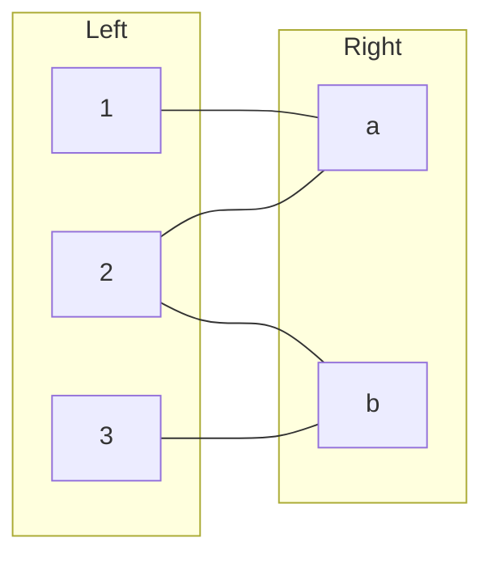
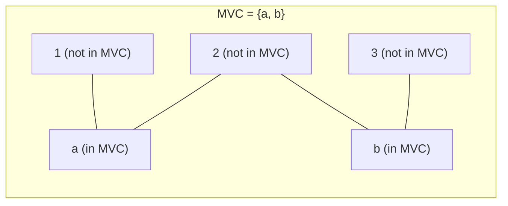

## 정의

**Vertex Cover** 는 그래프의 **모든 간선이 최소 한 끝점을 포함**하도록 하는 정점 집합입니다.

```text
S 가 vertex cover <=> 모든 간선 (u, v) 에 대해 u in S 또는 v in S
```

**Minimum Vertex Cover (MVC)** 는 크기가 최소인 vertex cover 를 찾는 문제입니다.

- **일반 그래프**: NP-hard (다항 시간 알고리즘 없음)
- **이분 그래프**: **König's Theorem** 으로 최대 매칭 = 최소 정점 덮개, [[bipartite-matching|이분 매칭]] 으로 다항 시간 해결

## 문제 상황과 동기

감시 카메라 배치 문제: 모든 통로 (간선) 를 감시하려면 최소 몇 개의 교차로 (정점) 에 카메라를 설치해야 하는가?

| 그래프 종류 | 복잡도 | 방법 |
|:---|:---:|:---|
| 일반 그래프 | NP-hard | 2-근사 알고리즘 |
| 이분 그래프 | P | König's Theorem + 이분 매칭 |
| 트리 | O(N) | DP |
| 평면 그래프 | NP-hard | 특수 알고리즘 존재 |

**최대 독립 집합** 과의 관계: V \ MVC = 최대 독립 집합. 즉 MVC 를 구하면 최대 독립 집합도 구할 수 있습니다.

## 시각화

이분 그래프 예시 (Left: {1, 2, 3}, Right: {a, b}):



최대 매칭 M = {(1, a), (3, b)}, 크기 2.

König's Theorem 으로 MVC 구성:
- 비매칭 왼쪽 정점: {2}
- 2 에서 교대 경로 BFS: 2 -> a (비매칭 간선) -> 1 (매칭 간선) -> (끝)
- 2 에서 교대 경로 BFS: 2 -> b (비매칭 간선) -> 3 (매칭 간선) -> (끝)
- 방문된 Left = {2, 1, 3}, 방문된 Right = {a, b}
- MVC = (Left \ 방문된 Left) ∪ 방문된 Right = {} ∪ {a, b} = **{a, b}**

검증: (1,a) - a 포함, (2,a) - a 포함, (2,b) - b 포함, (3,b) - b 포함. 모든 간선 커버.



## König's Theorem (이분 그래프)

> **|최소 vertex cover| = |최대 매칭|** (이분 그래프에서)

### 증명 개요

**|MVC| >= |최대 매칭|**: 매칭의 각 간선은 서로 다른 정점을 공유하지 않으므로, vertex cover 는 각 매칭 간선에서 최소 1개 정점을 포함해야 합니다. 따라서 |MVC| >= |M|.

**|MVC| <= |최대 매칭|**: 아래 구성으로 |M| 크기의 vertex cover 를 만들 수 있습니다.

### MVC 구성 알고리즘

최대 매칭 M 을 구한 뒤:

```text
1. U = 왼쪽에서 M 에 포함되지 않은 정점 집합
2. Z = U 에서 시작하는 교대 경로 (alternating path) 로 도달 가능한 정점 집합
   - 교대 경로: 비매칭 간선 -> 매칭 간선 -> 비매칭 간선 -> ...
3. MVC = (Left \ Z_L) ∪ Z_R
   - Z_L = Z 에 속하는 왼쪽 정점
   - Z_R = Z 에 속하는 오른쪽 정점
```

## 알고리즘

### 이분 그래프에서 MVC

```text
minimum_vertex_cover(G):
    // 1. 최대 매칭 M 구하기 (Hopcroft-Karp 또는 Kuhn)
    M = max_bipartite_matching(G)
    
    // 2. 비매칭 왼쪽 정점에서 교대 경로 BFS
    unmatched_left = { v in Left : v not in M }
    visited_left, visited_right = BFS_alternating(G, M, unmatched_left)
    
    // 3. MVC 구성
    MVC = (Left \ visited_left) ∪ visited_right
    return MVC
```

### 교대 경로 BFS

```text
BFS_alternating(G, M, start):
    queue = start
    visited_L = set(start)
    visited_R = {}
    while queue not empty:
        u = queue.pop()  // 왼쪽 정점
        for v in neighbors(u):  // 비매칭 간선으로 오른쪽 이동
            if v not in visited_R:
                visited_R.add(v)
                if M[v] exists:  // 매칭 간선으로 왼쪽 이동
                    w = M[v]
                    if w not in visited_L:
                        visited_L.add(w)
                        queue.push(w)
    return visited_L, visited_R
```

### 일반 그래프 2-근사

```text
2_approx_vertex_cover(G):
    cover = {}
    for each edge (u, v) not yet covered:
        cover.add(u)
        cover.add(v)
        // u, v 에 인접한 모든 간선 제거
    return cover
```

최대 매칭의 양 끝점을 모두 취하는 방법. |MVC| <= 2 * |OPT|.

## 구현

<CodeWithOutput
  variants={[
    {
      language: "cpp",
      label: "C++",
      code: `// 이분 그래프 최소 정점 덮개 (König's Theorem)
// 입력: 왼쪽 n개, 오른쪽 m개, 간선 목록
#include <bits/stdc++.h>
using namespace std;

const int MAXN = 505;
vector<int> adj[MAXN];  // 왼쪽 -> 오른쪽 인접 리스트
int matchL[MAXN], matchR[MAXN];  // 매칭 결과
bool visited[MAXN];
int n, m;

bool dfs(int u) {
    for (int v : adj[u]) {
        if (!visited[v]) {
            visited[v] = true;
            if (matchR[v] == -1 || dfs(matchR[v])) {
                matchL[u] = v; matchR[v] = u;
                return true;
            }
        }
    }
    return false;
}

int max_matching() {
    fill(matchL, matchL + n + 1, -1);
    fill(matchR, matchR + m + 1, -1);
    int result = 0;
    for (int u = 1; u <= n; u++) {
        fill(visited, visited + m + 1, false);
        if (dfs(u)) result++;
    }
    return result;
}

// König's: 교대 경로 BFS
// visitedL[u] = true: 왼쪽 u 가 Z 에 속함
// visitedR[v] = true: 오른쪽 v 가 Z 에 속함
bool visitedL[MAXN], visitedR[MAXN];

void alternating_bfs() {
    queue<int> q;
    // 비매칭 왼쪽 정점에서 시작
    for (int u = 1; u <= n; u++) {
        if (matchL[u] == -1) {
            visitedL[u] = true;
            q.push(u);
        }
    }
    while (!q.empty()) {
        int u = q.front(); q.pop();
        for (int v : adj[u]) {
            if (!visitedR[v]) {
                visitedR[v] = true;
                int w = matchR[v];
                if (w != -1 && !visitedL[w]) {
                    visitedL[w] = true;
                    q.push(w);
                }
            }
        }
    }
}

int main() {
    ios::sync_with_stdio(0); cin.tie(0);
    int e; cin >> n >> m >> e;
    while (e--) {
        int u, v; cin >> u >> v;
        adj[u].push_back(v);
    }
    int matching = max_matching();
    alternating_bfs();

    // MVC = (Left \\ visitedL) ∪ visitedR
    vector<pair<char,int>> mvc;
    for (int u = 1; u <= n; u++)
        if (!visitedL[u]) mvc.push_back({'L', u});
    for (int v = 1; v <= m; v++)
        if (visitedR[v]) mvc.push_back({'R', v});

    cout << "Matching size: " << matching << "\\n";
    cout << "MVC size: " << mvc.size() << "\\n";
    for (auto [side, idx] : mvc)
        cout << side << idx << " ";
    cout << "\\n";
}`,
    },
    {
      language: "python",
      label: "Python",
      code: `# 이분 그래프 최소 정점 덮개 (König's Theorem)
import sys
from collections import deque
input = sys.stdin.readline

def solve():
    n, m, e = map(int, input().split())
    adj = [[] for _ in range(n + 1)]
    for _ in range(e):
        u, v = map(int, input().split())
        adj[u].append(v)

    matchL = [-1] * (n + 1)
    matchR = [-1] * (m + 1)

    def dfs(u, visited):
        for v in adj[u]:
            if not visited[v]:
                visited[v] = True
                if matchR[v] == -1 or dfs(matchR[v], visited):
                    matchL[u] = v; matchR[v] = u
                    return True
        return False

    matching = 0
    for u in range(1, n + 1):
        visited = [False] * (m + 1)
        if dfs(u, visited):
            matching += 1

    # König's: 교대 경로 BFS
    visitedL = [False] * (n + 1)
    visitedR = [False] * (m + 1)
    q = deque()
    for u in range(1, n + 1):
        if matchL[u] == -1:
            visitedL[u] = True
            q.append(u)

    while q:
        u = q.popleft()
        for v in adj[u]:
            if not visitedR[v]:
                visitedR[v] = True
                w = matchR[v]
                if w != -1 and not visitedL[w]:
                    visitedL[w] = True
                    q.append(w)

    # MVC = (Left \\ visitedL) ∪ visitedR
    mvc = []
    for u in range(1, n + 1):
        if not visitedL[u]: mvc.append(f"L{u}")
    for v in range(1, m + 1):
        if visitedR[v]: mvc.append(f"R{v}")

    print(f"Matching size: {matching}")
    print(f"MVC size: {len(mvc)}")
    print(*mvc)

solve()`,
    },
    {
      language: "java",
      label: "Java",
      code: `// 이분 그래프 최소 정점 덮개 (König's Theorem)
import java.util.*;
import java.io.*;

public class Main {
    static int n, m;
    static List<Integer>[] adj;
    static int[] matchL, matchR;
    static boolean[] visited;

    static boolean dfs(int u) {
        for (int v : adj[u]) {
            if (!visited[v]) {
                visited[v] = true;
                if (matchR[v] == -1 || dfs(matchR[v])) {
                    matchL[u] = v; matchR[v] = u; return true;
                }
            }
        }
        return false;
    }

    @SuppressWarnings("unchecked")
    public static void main(String[] args) throws IOException {
        BufferedReader br = new BufferedReader(new InputStreamReader(System.in));
        StringTokenizer st = new StringTokenizer(br.readLine());
        n = Integer.parseInt(st.nextToken());
        m = Integer.parseInt(st.nextToken());
        int e = Integer.parseInt(st.nextToken());

        adj = new List[n + 1];
        for (int i = 1; i <= n; i++) adj[i] = new ArrayList<>();
        matchL = new int[n + 1]; matchR = new int[m + 1];
        Arrays.fill(matchL, -1); Arrays.fill(matchR, -1);

        for (int i = 0; i < e; i++) {
            st = new StringTokenizer(br.readLine());
            int u = Integer.parseInt(st.nextToken());
            int v = Integer.parseInt(st.nextToken());
            adj[u].add(v);
        }

        int matching = 0;
        visited = new boolean[m + 1];
        for (int u = 1; u <= n; u++) {
            Arrays.fill(visited, false);
            if (dfs(u)) matching++;
        }

        // König's: 교대 경로 BFS
        boolean[] visitedL = new boolean[n + 1];
        boolean[] visitedR = new boolean[m + 1];
        Queue<Integer> q = new LinkedList<>();
        for (int u = 1; u <= n; u++) {
            if (matchL[u] == -1) { visitedL[u] = true; q.add(u); }
        }
        while (!q.isEmpty()) {
            int u = q.poll();
            for (int v : adj[u]) {
                if (!visitedR[v]) {
                    visitedR[v] = true;
                    int w = matchR[v];
                    if (w != -1 && !visitedL[w]) { visitedL[w] = true; q.add(w); }
                }
            }
        }

        StringBuilder sb = new StringBuilder();
        sb.append("Matching size: ").append(matching).append('\\n');
        List<String> mvc = new ArrayList<>();
        for (int u = 1; u <= n; u++) if (!visitedL[u]) mvc.add("L" + u);
        for (int v = 1; v <= m; v++) if (visitedR[v]) mvc.add("R" + v);
        sb.append("MVC size: ").append(mvc.size()).append('\\n');
        for (String s : mvc) sb.append(s).append(' ');
        System.out.println(sb);
    }
}`,
    },
  ]}
  cases={[
    {
      label: "König 예시",
      input: `3 2 4
1 1
2 1
2 2
3 2`,
      output: `Matching size: 2
MVC size: 2
Ra Rb `,
    },
  ]}
/>

## 복잡도

| 항목 | 값 |
|:---|:---|
| **최대 매칭 (Kuhn)** | O(VE) |
| **최대 매칭 (Hopcroft-Karp)** | O(E * sqrt(V)) |
| **König's MVC 구성** | O(V + E) (BFS) |
| **2-근사 (일반 그래프)** | O(V + E) |

## 관련 정리

### 최대 독립 집합 (Maximum Independent Set)

```text
|MIS| = |V| - |MVC|
```

이분 그래프에서 MVC 를 구하면 MIS 도 O(V + E) 에 구할 수 있습니다. 일반 그래프에서 MIS 는 NP-hard 입니다.

### 최소 경로 덮개 (Minimum Path Cover, DAG)

DAG 에서 최소 경로 덮개 크기 = |V| - 최대 이분 매칭.

DAG 의 각 정점 v 를 v_out (왼쪽) 과 v_in (오른쪽) 으로 분리하고, 간선 (u, v) 를 (u_out, v_in) 으로 변환하면 이분 그래프가 됩니다.

### Max Flow Min Cut (MFMC)

[[mfmc|Max Flow Min Cut 정리]] 와 König's Theorem 은 같은 원리입니다. 이분 매칭을 최대 유량으로 모델링하면 최소 컷 = 최소 정점 덮개가 됩니다.

## 함정

> [!WARNING]
> 구현 시 자주 발생하는 실수들.

### 1. 일반 그래프에 König 적용

König's Theorem 은 **이분 그래프에서만** 성립합니다. 일반 그래프에서는 최대 매칭 크기 != 최소 정점 덮개 크기입니다.

### 2. 교대 경로 BFS 방향

BFS 는 **비매칭 왼쪽 정점** 에서 시작합니다. 비매칭 오른쪽 정점에서 시작하면 틀립니다.

### 3. MVC 구성 공식

MVC = **(Left \ visitedL) ∪ visitedR** 입니다. visitedL 이 아니라 Left 전체에서 visitedL 을 빼야 합니다.

### 4. 최대 독립 집합과 혼동

MVC 와 MIS 는 서로 보완 관계입니다. MVC 에 속하지 않는 정점들이 MIS 입니다. 두 집합을 혼동하지 마세요.

### 5. 방향 그래프

방향 그래프에서 vertex cover 는 정의가 다릅니다. 방향 그래프의 최소 경로 덮개는 별도 알고리즘이 필요합니다.

## BOJ 연습 문제

| 번호 | 제목 | 설명 |
|:---|:---|:---|
| BOJ 1867 | 돌멩이 제거 | 최소 정점 덮개 = 최대 이분 매칭 |
| BOJ 2051 | 최소 버텍스 커버 | König's Theorem 직접 적용 |
| BOJ 1298 | 노트북의 주인을 찾아서 | 이분 매칭 기본 |
| BOJ 11375 | 열혈강호 | 이분 매칭 응용 |

## 관련 위키

- [[bipartite-matching|이분 매칭]]
- [[maximum-flow|최대 유량]]
- [[mfmc|Max Flow Min Cut]]
- [[bipartite-graph|이분 그래프]]
- [[matching|매칭]]
- [[hall|Hall's Theorem]]
