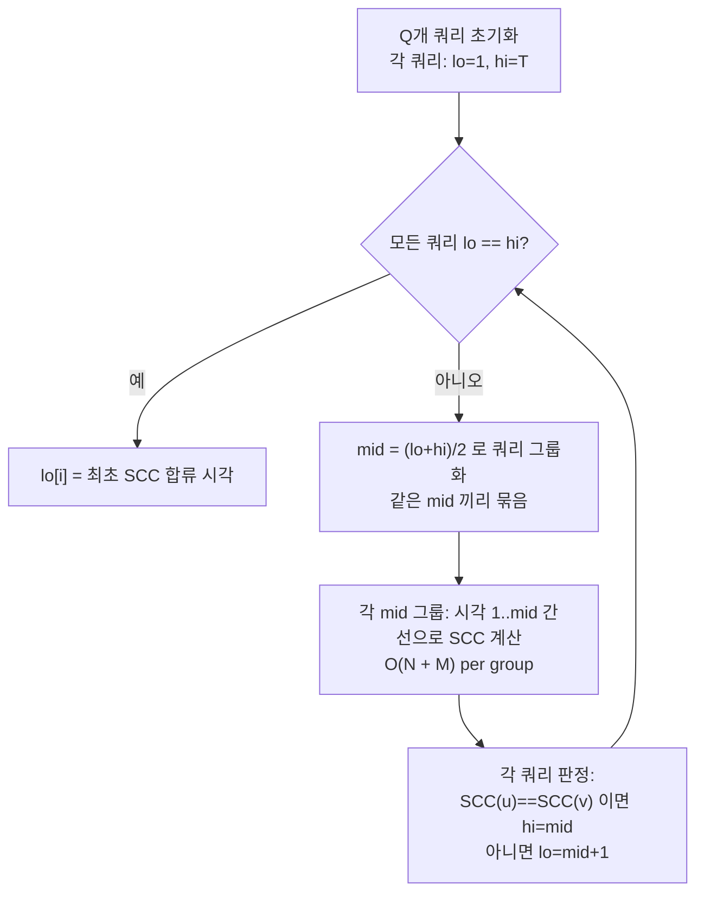

## 정의

**Offline Incremental SCC** 는 *간선이 시간 순서대로 추가만 되는* 유향 그래프에서, *두 정점이 같은 SCC 에 처음 속하는 시각* 을 모든 쌍에 대해 오프라인으로 구하는 알고리즘. 핵심 도구는 **parallel binary search** + 분할정복.

**Offline Dynamic MST** 는 *간선의 가중치가 시간에 따라 바뀌는* 또는 *간선 삽입/삭제가 섞이는* 환경에서, 각 시점의 MST 비용 / 구조를 오프라인으로 구하는 알고리즘. **link-cut tree + offline divide & conquer** 의 결합.

오프라인 (모든 쿼리를 미리 알아야 함) 인 대신 *온라인 대비 한 단계 더 빠른 복잡도* 를 얻는다.

## 문제 상황과 동기

간선이 시간 순서대로 추가만 일어나는 환경에서 *두 정점이 처음 같은 SCC 에 속한 시각* 을 모든 쿼리 `(u, v)` 에 대해 알아내야 한다. Naive 는 *각 쿼리마다 시각 1부터 T까지 이분탐색* → 매 mid 마다 SCC 돌려 O(Q · log T · (N+M)) = O(Q(N+M) log T). Q=N² 이면 O(N²(N+M) log T).

핵심 아이디어: *모든 쿼리를 동시에 이분탐색*. 같은 mid 값을 가진 쿼리들을 묶어 한 번의 SCC 판정으로 모두 처리하면 *모든 쿼리가 같은 log T 깊이* 만 공유하므로 O((N+M) log T). 각 쿼리는 `[lo, hi]` 범위를 유지하고, 같은 mid 인 쿼리들끼리 그룹화해 시뮬레이션.

Dynamic connectivity 문제 (MST 포함) 는 온라인에서 O(log² N) / amortized O(log N) 가 최선이지만, 오프라인 + 분할정복으로 *전체 쿼리 O(M log T)* 에 처리 가능. PS 에서는 *100만 간선, 10만 쿼리* 수준에 등장.

## 시각화

```anim:offline-incremental-scc
{}
```

## 핵심 아이디어: Parallel Binary Search

각 정점쌍 `(u, v)` 에 대해 *답이 되는 시각* 을 이분탐색. 각 쌍을 따로 하면 O(Q²). 모든 쌍을 동시에 이분탐색하면서 *현재 이분탐색 mid 가 같은 쌍들을 묶어 한 번에 처리* 하면 `O((N + Q) log Q)`.

**Invariant**: 각 쿼리 `q` 는 `[lo_q, hi_q]` 범위를 유지. 답은 이 범위 안에 있다. 같은 mid 를 가진 쿼리들은 *한 번의 그래프 시뮬레이션으로 모두 판정*. 매 라운드마다 모든 쿼리의 범위가 절반으로 줄어 O(log T) 라운드에 수렴.

```text
parallel_bsearch:
    각 쿼리 q 에 [lo_q, hi_q] = [1, T]
    while 모든 q 가 lo == hi 가 아닌:
        mid_q = (lo_q + hi_q) // 2
        같은 mid 인 쿼리들끼리 묶음
        시간 순서로 1..mid 까지 그래프 시뮬레이션
        각 q 에 대해 mid 가 답을 만족하는지 판단
        만족 -> hi_q = mid, 아니면 lo_q = mid + 1
```

매 단계마다 union-find 를 처음부터 다시 빌드해 O((N+M) log T).

### 예시 추적 (SCC 쿼리)

쿼리 3 개: `Q1=(1,2)`, `Q2=(3,4)`, `Q3=(2,4)`. 간선 10 개가 시각 1~10 에 추가.

```text
라운드 1: mid = 5
  - Q1, Q2, Q3 모두 [1, 10] -> mid = 5
  - 시각 1~5 간선으로 SCC 계산
  - Q1: SCC(1) != SCC(2) -> lo=6
  - Q2: SCC(3) == SCC(4) -> hi=5
  - Q3: SCC(2) != SCC(4) -> lo=6

라운드 2:
  - Q1: mid=8, Q3: mid=8  (둘 다 [6,10])
  - Q2: mid=3           ([1,5])
  - 그룹 [mid=3]: 시각 1~3 간선 -> SCC -> Q2 판정
  - 그룹 [mid=8]: 시각 1~8 간선 -> SCC -> Q1, Q3 판정

... log T 라운드 후 모든 쿼리 수렴
```

매 라운드마다 서로 다른 mid 값은 최대 O(Q) 개. 각 mid 마다 O(N+M) SCC 계산. 총 O((N+M) log T) (모든 쿼리가 log T 깊이를 공유).

## 구현 (C++)

```cpp
// O((N+M) log T). Parallel Binary Search for Offline Incremental SCC.
#include <bits/stdc++.h>
using namespace std;

struct Edge { int u, v, t; }; // 간선 (u->v) 가 시각 t 에 추가됨
vector<Edge> edges;
vector<pair<int,int>> queries; // (u, v) 쌍
int n, m, q;

// Tarjan SCC: 시각 t_max 까지의 간선만 사용
vector<int> scc_id;
int scc_count;
void tarjan_scc(int t_max) {
    scc_id.assign(n+1, -1);
    scc_count = 0;
    // ... (표준 Tarjan / Kosaraju SCC 구현, 시각 <= t_max 간선만 사용)
    // 생략: stack 기반 DFS, low/dfn 배열, SCC numbering
}

vector<int> solve_offline_scc() {
    vector<int> ans(q);
    vector<int> lo(q, 1), hi(q, edges.back().t);
    
    while (true) {
        // 모든 쿼리가 수렴했는지 확인
        bool done = true;
        for (int i = 0; i < q; i++) {
            if (lo[i] < hi[i]) { done = false; break; }
        }
        if (done) break;
        
        // 쿼리를 mid 값으로 그룹화
        map<int, vector<int>> groups; // mid -> 쿼리 인덱스들
        for (int i = 0; i < q; i++) {
            if (lo[i] < hi[i]) {
                int mid = (lo[i] + hi[i]) / 2;
                groups[mid].push_back(i);
            }
        }
        
        // 각 mid 그룹마다 SCC 계산
        for (auto& [mid, qlist] : groups) {
            tarjan_scc(mid); // 시각 1~mid 간선으로 SCC 계산
            
            for (int qi : qlist) {
                auto [u, v] = queries[qi];
                if (scc_id[u] == scc_id[v]) {
                    // mid 시각에 이미 같은 SCC -> 답은 mid 이하
                    hi[qi] = mid;
                } else {
                    // 아직 다른 SCC -> 답은 mid 초과
                    lo[qi] = mid + 1;
                }
            }
        }
    }
    
    for (int i = 0; i < q; i++) ans[i] = lo[i];
    return ans; // 각 쿼리 (u,v) 가 같은 SCC 가 된 최초 시각
}
```

**핵심**: `groups` 맵으로 같은 mid 를 가진 쿼리들을 묶어 *한 번의 SCC 계산으로 모두 판정*. 매 라운드마다 모든 쿼리 범위가 절반씩 줄어 log T 라운드 수렴.

### 구현 팁

1. **Union-Find 로 대체 가능**: SCC 대신 단순 연결성 (무향 그래프) 이면 Tarjan 대신 DSU 사용 → 더 단순.
2. **간선 정렬**: `edges` 를 시각 순으로 정렬. 각 mid 마다 이분탐색으로 사용할 간선 범위 결정.
3. **메모리**: 매 라운드마다 SCC 상태를 복사하지 않고 재계산. O(N) 메모리로 충분.

## 수렴 과정 시각화



매 라운드마다 모든 쿼리의 `[lo, hi]` 범위가 절반으로 줄어, **log T 라운드 후 수렴**. 같은 mid 를 공유하는 쿼리들은 SCC 한 번으로 모두 판정하므로 총 SCC 계산 횟수는 라운드당 최대 Q 번이 아니라 O(Q) 개 mid 값에 비례.

## Offline Incremental SCC 응용

- 시간 t 에 추가되는 간선만 사용했을 때 두 정점이 처음 같은 SCC 에 속한 t = 답
- 응용: 시간에 따른 도달성 / 강한 연결 컴포넌트 변천 분석

## Offline Dynamic MST 응용

- 간선 가중치가 시간에 따라 바뀌고, 각 시점의 MST 비용 출력
- 간선 삽입/삭제가 섞인 MST 추적
- 핵심: 각 간선이 *MST 에 속한 시간 구간* 을 분할정복으로 결정

## 복잡도

| 문제 | 비용 |
|:---|:---|
| Offline Incremental SCC | O((N + M) log T) |
| Offline Dynamic MST | O((N + M) log² T) 또는 link-cut tree + divide & conquer |

T = 시간 단계 수.

## Offline Dynamic MST 상세

Dynamic MST 는 간선이 추가/삭제되는 환경에서 각 시점의 MST 를 구하는 문제다. 오프라인 + 분할정복으로 O((N + M) log M) 에 처리 가능.

### 핵심 아이디어: 간선의 활성 구간

각 간선 `e` 가 *시간 구간 [L_e, R_e]* 동안 존재한다면, 분할정복 트리를 구성해 각 레벨에서 해당 구간이 커버하는 노드에 간선을 추가한다.

```text
분할정복 구간 [ql, qr], 처리 대상 간선 집합 E_cur:
    mid = (ql + qr) / 2
    
    // E_cur 중 [ql, qr] 전체를 커버하는 간선 -> link-cut tree 에 추가
    link_all(E_cur_cover)
    
    if ql == qr:
        // 단일 시점: 현재 link-cut tree 의 MST 비용 출력
        print_mst_cost()
    else:
        solve([ql, mid], E_cur_left)   // [ql, qr] 왼쪽 절반에만 있는 간선
        solve([mid+1, qr], E_cur_right)
    
    // 역순으로 link 제거 (backtrack)
    unlink_all(E_cur_cover)
```

Link-Cut Tree 의 `link` / `cut` 이 O(log N) 이고 재귀 깊이가 O(log M) 이므로 총 O((N + M) log M).

### Link-Cut Tree 와의 결합

MST 에 새 간선 e = (u, v, w) 를 추가할 때:
1. u-v 경로의 최대 가중치 간선 `max_e` 를 찾음 (LCT path query)
2. `w < max_e.weight` 이면 `max_e` 를 제거하고 `e` 를 추가

이 교체 연산을 분할정복의 각 단계에서 수행. 단, 분할정복 backtrack 시 LCT 상태도 원복해야 한다. **롤백 가능한 Union-Find** 또는 **링크/컷 + 오프라인 undo** 를 사용.

### 복잡도 비교

| 방법 | 복잡도 | 조건 |
|:---|:---|:---|
| 매 시점 MST 재계산 (Kruskal) | O(M^2 log M) | 비효율 |
| Offline divide & conquer | O((N + M) log M) | 간선 삽입/삭제 모두 오프라인 |
| ET-Tree + offline | O(M log^2 N) | 삭제 지원 동적 연결성 |

## 함정

### 1. 온라인이면 사용 불가

쿼리가 답에 의존적이거나 (interactive) 순서대로 답을 출력해야 하면 오프라인 불가.

### 2. 분할정복의 메모리

매 레벨에서 부모 union-find / link-cut 상태를 복사하면 메모리 O(N log T). 신중한 구현 필요.

### 3. SCC 알고리즘은 매번 다시

매 mid 에서 SCC 를 처음부터 (Tarjan / Kosaraju) 돌린다. amortized 분석으로 O((N+M) log T) 보장.

## BOJ 연습 문제

### SCC

| 번호 | 제목 | 링크 |
|:---|:---|:---|
| BOJ 19028 | Link Cut Diagraph | [kokoa-lab](https://github.com/kokoa-lab/boj-problems/tree/main/organize_problems/19000-19099/19028) |
| BOJ 8496 | Godzilla | [kokoa-lab](https://github.com/kokoa-lab/boj-problems/tree/main/organize_problems/8400-8499/8496) |

### MST

| 번호 | 제목 | 링크 |
|:---|:---|:---|
| BOJ 10724 | 판게아 2 | [kokoa-lab](https://github.com/kokoa-lab/boj-problems/tree/main/organize_problems/10700-10799/10724) |

## 참고

- [[Dynamic Tree]] (Link/Cut Tree 와 결합)
- [[Directed MST]]
