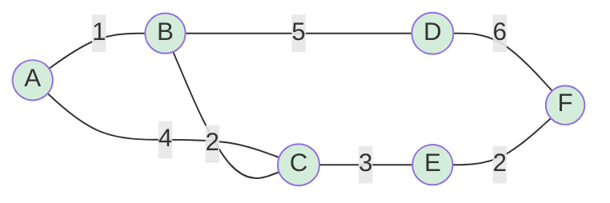

## 정의

**Spanning Tree** 는 그래프의 모든 정점을 포함하는 부분 트리입니다. 정점 N 개이면 간선 N-1 개.

**MST (Minimum Spanning Tree)** 는 간선 가중치 합이 최소인 spanning tree.

- MST 는 유일하지 않을 수 있음 (같은 가중치 간선이 존재할 때)
- 가중치 합이 같은 MST 가 여러 개이면 모두 최적

## 문제 상황

N 개 도시를 최소 비용으로 연결하는 도로 네트워크, 전기 배선, 클러스터링 등.

- 간선 수 E 가 많을 때: **Kruskal** (E log E 정렬 지배)
- 정점 수 V 가 많고 간선이 dense 할 때: **Prim** (priority queue, E log V)
- 병렬 처리가 필요할 때: **Boruvka** (O(E log V))

| 알고리즘 | 시간 | 적합 |
|:---|:---:|:---|
| Kruskal | O(E log E) | sparse graph |
| Prim | O(E log V) | dense graph |
| Boruvka | O(E log V) | 병렬/외부 메모리 |

## 시각화

6개 정점의 weighted 그래프에서 MST 선택 과정.



Kruskal 로 간선 (1), (2), (2), (3) 선택 → 총 비용 8. 사이클 없이 N-1 = 5 간선.

MST 간선 시각화 (굵게 표시 대신 순서 설명):
1. A-B 가중치 1 (선택)
2. B-C 가중치 2 (선택)
3. E-F 가중치 2 (선택)
4. C-E 가중치 3 (선택)
5. B-D 가중치 5 (선택, 마지막 연결)

## 핵심 아이디어

### Cut Property (MST 보장 원리)

어떤 **컷 (S, V-S)** 에 대해 크로스 간선 중 최소 가중치 간선은 반드시 MST 에 포함됩니다.

Kruskal 과 Prim 은 모두 이 cut property 를 그리디하게 활용합니다.

### Cycle Property

사이클의 최대 가중치 간선은 MST 에 포함되지 않습니다.

## 알고리즘

### Kruskal

1. 모든 간선을 가중치 오름차순 정렬
2. 간선 (u, v, w) 를 순서대로 확인
3. u 와 v 가 다른 컴포넌트이면 (Union-Find) 간선 추가
4. N-1 개 간선이 선택되면 종료

```text
sort edges by weight ascending
dsu = Union-Find(n)
mst_weight = 0
for (w, u, v) in edges:
    if dsu.find(u) != dsu.find(v):
        dsu.union(u, v)
        mst_weight += w
```

### Prim

1. 임의 시작 정점 선택, priority queue 에 삽입
2. 최소 가중치 간선으로 확장 가능한 정점 반복 추가
3. 이미 방문한 정점은 스킵

```text
vis = [false] * n
pq = min-heap [(0, start)]
mst_weight = 0
while pq not empty:
    (w, u) = pq.pop()
    if vis[u]: continue
    vis[u] = true
    mst_weight += w
    for (v, ew) in adj[u]:
        if not vis[v]: pq.push((ew, v))
```

### Boruvka

1. 각 컴포넌트에서 최소 outgoing edge 동시 선택
2. 선택한 간선으로 컴포넌트 합병
3. 컴포넌트가 1개가 될 때까지 반복 (최대 log V 라운드)

## 구현

<CodeWithOutput
  language="cpp"
  label="C++ (Kruskal + Prim)"
  outputLanguage="text"
  outputLabel="결과"
  title="MST 두 가지 방법으로"
  code={`#include <bits/stdc++.h>
using namespace std;

// ---- Union-Find ----
struct DSU {
    vector<int> p, rank_;
    DSU(int n) : p(n), rank_(n, 0) { iota(p.begin(), p.end(), 0); }
    int find(int x) { return p[x] == x ? x : p[x] = find(p[x]); }
    bool merge(int x, int y) {
        x = find(x); y = find(y);
        if (x == y) return false;
        if (rank_[x] < rank_[y]) swap(x, y);
        p[y] = x;
        if (rank_[x] == rank_[y]) rank_[x]++;
        return true;
    }
};

// ---- Kruskal ----
long long kruskal(int n, vector<tuple<int,int,int>>& edges) {
    sort(edges.begin(), edges.end());
    DSU dsu(n);
    long long total = 0;
    for (auto& [w, u, v] : edges)
        if (dsu.merge(u, v)) total += w;
    return total;
}

// ---- Prim ----
long long prim(int n, vector<vector<pair<int,int>>>& adj) {
    vector<bool> vis(n, false);
    priority_queue<pair<int,int>,
                   vector<pair<int,int>>,
                   greater<>> pq;
    pq.push({0, 0});
    long long total = 0;
    while (!pq.empty()) {
        auto [w, u] = pq.top(); pq.pop();
        if (vis[u]) continue;
        vis[u] = true;
        total += w;
        for (auto [v, ew] : adj[u])
            if (!vis[v]) pq.push({ew, v});
    }
    return total;
}

int main() {
    ios::sync_with_stdio(false);
    cin.tie(nullptr);
    int n, m;
    cin >> n >> m;
    vector<tuple<int,int,int>> edges;
    vector<vector<pair<int,int>>> adj(n);
    for (int i = 0; i < m; i++) {
        int u, v, w; cin >> u >> v >> w; u--; v--;
        edges.push_back({w, u, v});
        adj[u].push_back({v, w});
        adj[v].push_back({u, w});
    }
    cout << "Kruskal: " << kruskal(n, edges) << "\\n";
    cout << "Prim:    " << prim(n, adj) << "\\n";
    return 0;
}`}
  output={`// 예: 4 정점, 5 간선
// 0-1:1, 0-2:4, 1-2:2, 1-3:5, 2-3:3
Kruskal: 6
Prim:    6`}
/>

## 복잡도

| 알고리즘 | 시간 | 공간 | 비고 |
|:---|:---:|:---:|:---|
| Kruskal | O(E log E) | O(V) | Union-Find path compression |
| Prim + 이진 힙 | O(E log V) | O(V + E) | priority_queue |
| Prim + Fibonacci 힙 | O(E + V log V) | O(V + E) | 이론적 최적, 구현 복잡 |
| Boruvka | O(E log V) | O(V + E) | 병렬 친화적 |

실전: E ~ V² (dense) 이면 Prim, E ~ V (sparse) 이면 Kruskal 이 더 나은 경향.

## 함정

> [!WARNING]
> **비연결 그래프에서 MST 미정의**: 그래프가 연결되지 않으면 spanning tree 자체가 없음. Kruskal 에서 선택한 간선 수가 N-1 개인지 확인해야 함.

> [!WARNING]
> **Prim 에서 vis 배열 없이 사용**: priority queue 에서 이미 방문한 정점이 다시 나올 수 있음. `vis[u]` 체크 없으면 간선 중복 처리 → 오답.

> [!CAUTION]
> **방향 그래프 (Directed) 에서 MST**: Kruskal/Prim 은 무방향 그래프 전용. 방향 그래프의 최소 신장 구조는 **DMST (Directed MST = 최소 비용 수형도)** 로 Edmonds' algorithm (O(VE)) 를 사용해야 함.

- 간선 가중치가 같을 때 MST 가 여러 개이면, 특정 MST 를 구하라는 조건이 붙는 경우가 있음.
- **Second MST** (두 번째 최소 신장 트리): MST 에서 간선 하나 교체.

## 응용

- **네트워크 설계**: 최소 비용으로 전체 연결
- **클러스터링**: MST 에서 가장 긴 간선을 자르면 k 개 클러스터
- **Steiner Tree**: 일부 정점만 연결하는 최소 트리 (NP-hard 일반, 소수 정점에는 DP)
- **Offline Dynamic Connectivity**: Boruvka 기반 병렬 Union-Find

## BOJ

| 문제 | 설명 |
|:---|:---|
| [BOJ 1197 최소 스패닝 트리](https://www.acmicpc.net/problem/1197) | MST 기본 |
| [BOJ 1922 네트워크 연결](https://www.acmicpc.net/problem/1922) | Kruskal/Prim 선택 |
| [BOJ 6497 전력난](https://www.acmicpc.net/problem/6497) | MST 비용 계산 |
| [BOJ 17472 다리 만들기 2](https://www.acmicpc.net/problem/17472) | BFS + Kruskal |
| [BOJ 4386 별자리 만들기](https://www.acmicpc.net/problem/4386) | 완전 그래프 MST |

## 관련 위키

- [[disjoint-set|Union-Find]] (Kruskal 의 핵심)
- [[priority-queue-heap|Priority Queue]] (Prim 의 핵심)
- [[shortest-path|Shortest Path]] (MST 와 다름, 단일 출발점)
- [[directed-mst|Directed MST]] (방향 그래프용)
- [[graph-dp|Graph DP]] (트리 DP 응용)
