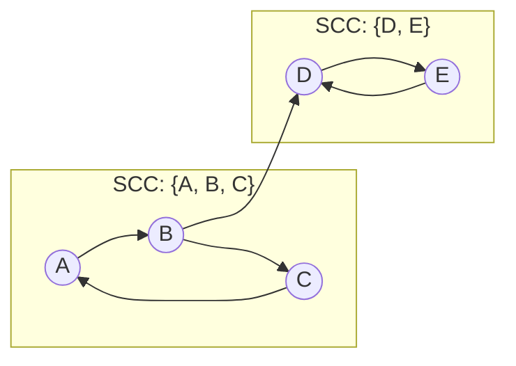

## 정의

**Strongly Connected Component (SCC)** 는 유향 그래프에서 서로 도달 가능한 정점들의 극대 집합입니다.

즉, SCC 내 임의 두 정점 u, v 에 대해 u → v 경로와 v → u 경로가 모두 존재.

**Tarjan's algorithm** 은 단일 DFS 로 SCC 를 O(V + E) 에 구합니다.

- 각 정점에 `disc` (방문 순서) 와 `low` (도달 가능한 최소 disc) 를 부여
- DFS 스택으로 현재 SCC 후보군 관리

## 문제 상황

유향 그래프에서:

- 서로 도달 가능한 정점 집합 파악
- **2-SAT**: 함의 그래프의 SCC
- **DAG 축약**: SCC 를 단일 노드로 압축 → DAG
- 의존성 사이클 탐지

| 알고리즘 | 시간 | DFS 횟수 | 특징 |
|:---|:---:|:---:|:---|
| **Tarjan** | O(V+E) | 1회 | disc/low, 스택 |
| Kosaraju | O(V+E) | 2회 | 역그래프, 이해 쉬움 |
| Gabow | O(V+E) | 1회 | 두 스택 사용 |

## 시각화

5개 정점 그래프에서 SCC 탐색. 화살표는 간선 방향.



SCC 축약 후 DAG: SCC1 → SCC2.

## 핵심 아이디어

각 정점 v 에 두 값 부여:

- **disc[v]**: DFS 방문 순서 (타임스탬프)
- **low[v]**: v 의 서브트리에서 back edge / cross edge 를 이용해 도달 가능한 최소 disc

**SCC 루트 조건**: `disc[v] == low[v]` 인 정점 v 가 SCC 의 루트.

DFS 스택 (`stk`) 에 방문 정점 저장. 루트 감지 시 스택에서 v 까지 pop 하면 하나의 SCC.

```
DFS(v):
    disc[v] = low[v] = idx++
    stk.push(v); on_stack[v] = true
    for u in adj[v]:
        if not visited:   DFS(u); low[v] = min(low[v], low[u])
        elif on_stack[u]: low[v] = min(low[v], disc[u])
    // SCC 루트 감지
    if low[v] == disc[v]:
        pop from stk until v -> 하나의 SCC
```

## 알고리즘

### DFS 기반 (재귀)

```text
idx = 0, cnt = 0
disc = [-1]*V, low = [-1]*V, comp = [-1]*V
stk = [], on_stack = [false]*V

dfs(u):
    disc[u] = low[u] = idx++
    stk.append(u); on_stack[u] = true
    for v in adj[u]:
        if disc[v] == -1:
            dfs(v)
            low[u] = min(low[u], low[v])
        elif on_stack[v]:
            low[u] = min(low[u], disc[v])
    if low[u] == disc[u]:
        while true:
            v = stk.pop()
            on_stack[v] = false
            comp[v] = cnt
            if v == u: break
        cnt++

for u in 0..V:
    if disc[u] == -1: dfs(u)
```

### 반복 (스택 기반, 깊은 그래프용)

재귀 깊이 V 까지 가면 stack overflow. 명시적 스택으로 DFS 를 반복문으로 구현.

```text
explicit_dfs(start):
    call_stack = [(start, 0)]  // (정점, adj[정점] 인덱스)
    while call_stack:
        u, i = call_stack[-1]
        if i == 0:
            disc[u] = low[u] = idx++
            stk.append(u); on_stack[u] = true
        found_child = false
        while i < len(adj[u]):
            v = adj[u][i]; i++
            if disc[v] == -1:
                call_stack[-1] = (u, i)
                call_stack.append((v, 0))
                found_child = true
                break
            elif on_stack[v]:
                low[u] = min(low[u], disc[v])
        if not found_child:
            call_stack.pop()
            if call_stack:
                parent = call_stack[-1][0]
                low[parent] = min(low[parent], low[u])
            if low[u] == disc[u]:
                // SCC pop
```

## 구현

<CodeWithOutput
  language="cpp"
  label="C++ (Tarjan SCC)"
  outputLanguage="text"
  outputLabel="결과"
  title="강한 연결 요소 분리 + DAG 축약"
  code={`#include <bits/stdc++.h>
using namespace std;

struct TarjanSCC {
    int V, idx_cnt = 0, scc_cnt = 0;
    vector<vector<int>>& adj;
    vector<int> disc, low, comp;
    vector<bool> on_stk;
    vector<int> stk;

    TarjanSCC(int V, vector<vector<int>>& adj)
        : V(V), adj(adj),
          disc(V, -1), low(V), comp(V, -1), on_stk(V, false) {}

    void dfs(int u) {
        disc[u] = low[u] = idx_cnt++;
        stk.push_back(u);
        on_stk[u] = true;
        for (int v : adj[u]) {
            if (disc[v] == -1) {
                dfs(v);
                low[u] = min(low[u], low[v]);
            } else if (on_stk[v]) {
                low[u] = min(low[u], disc[v]);
            }
        }
        if (low[u] == disc[u]) {
            while (true) {
                int v = stk.back(); stk.pop_back();
                on_stk[v] = false;
                comp[v] = scc_cnt;
                if (v == u) break;
            }
            scc_cnt++;
        }
    }

    int solve() {
        for (int u = 0; u < V; u++)
            if (disc[u] == -1) dfs(u);
        return scc_cnt;
    }
};

int main() {
    ios::sync_with_stdio(false);
    cin.tie(nullptr);
    int V, E;
    cin >> V >> E;
    vector<vector<int>> adj(V);
    for (int i = 0; i < E; i++) {
        int u, v; cin >> u >> v; u--; v--;
        adj[u].push_back(v);
    }
    TarjanSCC tarjan(V, adj);
    int scc_cnt = tarjan.solve();
    cout << "SCC 개수: " << scc_cnt << "\\n";
    // comp[v] = v 의 SCC 번호 (역위상 순서)
    for (int i = 0; i < V; i++)
        cout << "V" << i+1 << " -> SCC " << tarjan.comp[i] << "\\n";

    // DAG 축약 (SCC 간 간선)
    vector<set<int>> dag(scc_cnt);
    for (int u = 0; u < V; u++)
        for (int v : adj[u])
            if (tarjan.comp[u] != tarjan.comp[v])
                dag[tarjan.comp[u]].insert(tarjan.comp[v]);
    cout << "DAG 간선:\\n";
    for (int s = 0; s < scc_cnt; s++)
        for (int t : dag[s])
            cout << "SCC " << s << " -> SCC " << t << "\\n";
    return 0;
}`}
  output={`// 입력: 5 정점, 6 간선
// 1->2, 2->3, 3->1, 2->4, 4->5, 5->4
SCC 개수: 3
V1 -> SCC 2
V2 -> SCC 2
V3 -> SCC 2
V4 -> SCC 0
V5 -> SCC 0
DAG 간선:
SCC 2 -> SCC 0`}
/>

## 복잡도

| 연산 | 시간 | 공간 |
|:---|:---:|:---:|
| Tarjan SCC | O(V+E) | O(V) |
| DAG 축약 | O(V+E) | O(V+E) |
| 위상 정렬 (DAG) | O(V+E) | O(V) |

**Tarjan 의 comp 번호는 역위상 순서**: comp 번호가 작을수록 위상 정렬 상 나중에 처리. DAG 를 위상 순서로 처리하려면 `scc_cnt - 1 - comp[v]` 또는 comp 순서 반전.

## 함정

> [!WARNING]
> **comp 번호 방향 혼동**: Tarjan 의 comp 번호는 DFS finish 역순 → 위상 정렬의 역방향. 2-SAT 에서 `comp[x] > comp[~x]` 조건 검사 시 방향이 헷갈림.

> [!WARNING]
> **on_stack 조건 누락**: `on_stack[v]` 확인 없이 `disc[v] != -1` 만 체크하면 cross edge 를 back edge 로 잘못 처리 → low 값 오류 → SCC 오분류.

> [!CAUTION]
> **깊은 그래프에서 재귀 스택 오버플로**: V = 10^5, 체인형 그래프 → 재귀 깊이 10^5 → default stack 2MB 초과. 반복 구현 사용 또는 `ulimit -s unlimited`.

- Kosaraju 는 2번 DFS 이지만 코드가 직관적, 빠른 구현에 유리.
- **SCC 개수 = 1** 이면 그래프 전체가 강연결 (strongly connected).

## 응용

### 2-SAT

변수 x 에 대해 x (참) 와 ~x (거짓) 을 정점으로 하는 함의 그래프 구성. SCC 로 해결:

- `comp[x] == comp[~x]` 이면 모순 → UNSAT
- 그렇지 않으면 SAT. `comp[x] > comp[~x]` 이면 x = true

### DAG 최단경로 / 최장경로

SCC 축약 후 DAG 에서 [[dag|DAG]] 위상정렬 + DP.

### 의존성 순환 탐지

빌드 시스템, 패키지 의존성 그래프에서 순환 = SCC 크기 > 1.

## BOJ

| 문제 | 설명 |
|:---|:---|
| [BOJ 2150 Strongly Connected Component](https://www.acmicpc.net/problem/2150) | SCC 기본 |
| [BOJ 4196 도미노](https://www.acmicpc.net/problem/4196) | SCC + DAG 축약 |
| [BOJ 11279 2-SAT - 4](https://www.acmicpc.net/problem/11279) | 2-SAT |
| [BOJ 3747 완전 이분 매칭](https://www.acmicpc.net/problem/3747) | SCC 응용 |
| [BOJ 1671 상어의 저녁식사](https://www.acmicpc.net/problem/1671) | SCC 기반 최적화 |

## 관련 위키

- [[cycle-detection|Cycle Detection]] (무방향 사이클)
- [[topological-sorting|Topological Sorting]] (DAG 처리)
- [[2-sat|2-SAT]] (SCC 의 대표 응용)
- [[scc|SCC 총론]] (Kosaraju, Gabow 비교)
- [[dag|DAG]] (SCC 축약 후 처리)
- [[dfs|DFS]] (기반 탐색)
