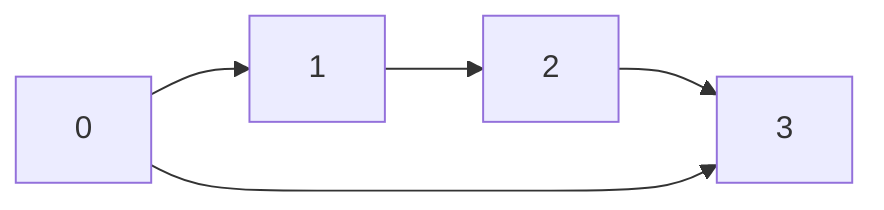
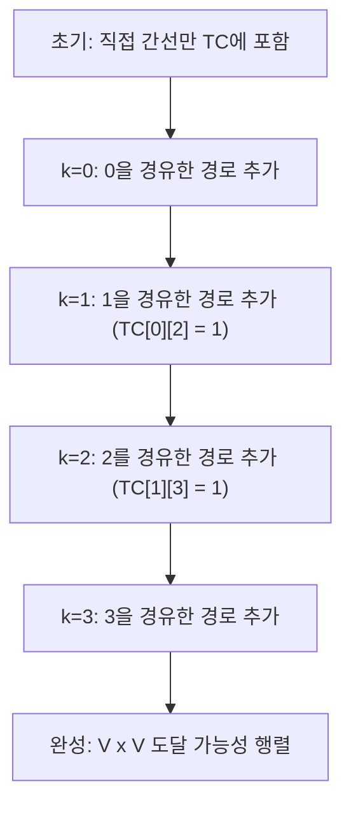

## 정의

**Transitive Closure (이행 폐포)** 는 그래프의 모든 정점 쌍 (u, v) 에 대해 u 에서 v 로 도달 가능한지를 담은 부울 행렬입니다.

$$
TC[i][j] = \begin{cases} 1 & \text{i에서 j로 경로 존재} \\ 0 & \text{경로 없음} \end{cases}
$$

자기 자신 (TC[i][i] = 1) 은 항상 도달 가능으로 간주합니다.

## 문제 상황과 동기

### 언제 필요한가

- **의존성 분석**: 패키지 A가 패키지 C를 간접 의존하는가?
- **접근 제어 (RBAC)**: 역할 A가 역할 B의 권한을 상속받는가?
- **DAG 분석**: 컴파일 유닛 간 전이 의존 관계, 선수 과목 체계
- **그래프 축약**: SCC 압축 후 DAG에서 이행 폐포로 도달 가능 판단

### 단순 BFS 대비 TC의 장점

- "A에서 B까지 갈 수 있나?" 단일 쿼리: BFS 1번, O(V+E)
- 모든 쌍 (u, v) 에 대한 도달 가능성 전처리: TC를 한 번 구축하면 이후 쿼리 O(1)

| 방법 | 전처리 | 쿼리 | 조건 |
|:---|:---|:---|:---|
| BFS per source | O(V(V+E)) | O(1) | Sparse 그래프 유리 |
| Floyd-Warshall TC | O(V³) | O(1) | Dense 그래프 유리 |
| Bitset 최적화 TC | O(V³/64) | O(1) | V 크고 Dense 일 때 |

## 시각화

### 예시 그래프



직접 간선: 0→1, 1→2, 2→3, 0→3.

이행 폐포가 추가하는 간선: 0→2 (경로: 0→1→2), 1→3 (경로: 1→2→3).

### Floyd-Warshall 순서로 구축되는 TC

중간 경유 정점 k를 순서대로 처리하며 점진적으로 완성됩니다.



k=1 처리 후: TC[0][1]=1, TC[1][2]=1 이므로 TC[0][2] = 1 추가.
k=2 처리 후: TC[1][2]=1, TC[2][3]=1 이므로 TC[1][3] = 1 추가.

## 핵심 아이디어

### Floyd-Warshall 변형

최단 경로 대신 도달 가능성을 다루도록 변환. 핵심 점화식:

$$
TC[i][j] = TC[i][j] \;\lor\; (TC[i][k] \;\land\; TC[k][j])
$$

"i에서 k로, 그리고 k에서 j로 갈 수 있으면 i에서 j로 갈 수 있다."

```text
# Floyd-Warshall TC 초기화
for u in 0..V-1: TC[u][u] = true
for (u, v) in edges: TC[u][v] = true

# 경유 정점 k 순서로 갱신
for k in 0..V-1:
    for i in 0..V-1:
        for j in 0..V-1:
            TC[i][j] = TC[i][j] OR (TC[i][k] AND TC[k][j])
```

최적화: `if TC[i][k]` 체크로 내부 루프 스킵 가능.

### DFS/BFS per Source

모든 정점 s에서 BFS/DFS를 실행해 도달 가능한 정점을 표시. O(V(V+E)). Sparse 그래프에서 Floyd-Warshall 보다 유리.

```text
for s in 0..V-1:
    TC[s][s] = true
    BFS/DFS from s:
        TC[s][v] = true for each visited v
```

### Bitset 최적화

TC의 각 행을 bitset으로 표현하면 OR 연산이 64비트 단위로 처리됩니다.

$$
\text{시간}: O\left(\frac{V^3}{64}\right), \quad V = 10^4 \text{ 이상에서 실전 유리}
$$

C++ `bitset<V>` 배열: 각 `TC[i] |= TC[k]` 가 비트셋 OR 연산 하나.

## 알고리즘

### Floyd-Warshall TC (Dense, V <= 5000)

```text
TC[i][j] = 직접 간선 + 대각선
for k = 0..V-1:
    for i = 0..V-1:
        if not TC[i][k]: continue   # 최적화
        TC[i] |= TC[k]              # 비트셋 가정 시 한 줄
```

### BFS per Source (Sparse, V 크고 E 작을 때)

```text
for s = 0..V-1:
    queue = {s}, visited = {s}
    while queue not empty:
        u = pop(queue)
        TC[s][u] = true
        for v in adj[u]:
            if not TC[s][v]:
                TC[s][v] = true
                push(queue, v)
```

### DAG 최적화: 위상 정렬 역순

DAG라면 위상 정렬 역순으로 처리해 각 정점에서 후계 정점들의 TC를 OR 합산. O(V+E) 전처리 + O(V) OR 합산.

## 구현

<CodeWithOutput
  variants={[
    {
      language: "cpp",
      label: "C++",
      code: `// Transitive Closure: Floyd-Warshall + Bitset 최적화
#include <bits/stdc++.h>
using namespace std;

// 방법 1: Floyd-Warshall (O(V^3))
vector<vector<bool>> tc_floyd(int V, vector<pair<int,int>>& edges) {
    vector<vector<bool>> tc(V, vector<bool>(V, false));
    for (int u = 0; u < V; u++) tc[u][u] = true;
    for (auto [u, v] : edges) tc[u][v] = true;
    for (int k = 0; k < V; k++)
        for (int i = 0; i < V; i++)
            if (tc[i][k])
                for (int j = 0; j < V; j++)
                    tc[i][j] = tc[i][j] || tc[k][j];
    return tc;
}

// 방법 2: BFS per Source (O(V(V+E)), Sparse 유리)
vector<vector<bool>> tc_bfs(int V, vector<vector<int>>& adj) {
    vector<vector<bool>> tc(V, vector<bool>(V, false));
    for (int s = 0; s < V; s++) {
        tc[s][s] = true;
        queue<int> q;
        q.push(s);
        while (!q.empty()) {
            int u = q.front(); q.pop();
            for (int v : adj[u]) {
                if (!tc[s][v]) {
                    tc[s][v] = true;
                    q.push(v);
                }
            }
        }
    }
    return tc;
}

int main() {
    int V = 4;
    vector<pair<int,int>> edges = {{0,1},{1,2},{2,3},{0,3}};
    vector<vector<int>> adj(V);
    for (auto [u, v] : edges) adj[u].push_back(v);

    auto tc1 = tc_floyd(V, edges);
    cout << "Floyd-Warshall TC:\\n";
    for (int i = 0; i < V; i++) {
        for (int j = 0; j < V; j++) cout << tc1[i][j] << " ";
        cout << "\\n";
    }

    auto tc2 = tc_bfs(V, adj);
    cout << "BFS TC:\\n";
    for (int i = 0; i < V; i++) {
        for (int j = 0; j < V; j++) cout << tc2[i][j] << " ";
        cout << "\\n";
    }
    return 0;
}`,
    },
    {
      language: "python",
      label: "Python",
      code: `from collections import deque

def tc_floyd(n, edges):
    """Floyd-Warshall Transitive Closure O(V^3)"""
    tc = [[False]*n for _ in range(n)]
    for u in range(n):
        tc[u][u] = True
    for u, v in edges:
        tc[u][v] = True
    for k in range(n):
        for i in range(n):
            if tc[i][k]:
                for j in range(n):
                    if tc[k][j]:
                        tc[i][j] = True
    return tc

def tc_bfs(n, edges):
    """BFS per Source O(V(V+E)), Sparse 그래프 유리"""
    adj = [[] for _ in range(n)]
    for u, v in edges:
        adj[u].append(v)
    tc = [[False]*n for _ in range(n)]
    for s in range(n):
        tc[s][s] = True
        q = deque([s])
        while q:
            u = q.popleft()
            for v in adj[u]:
                if not tc[s][v]:
                    tc[s][v] = True
                    q.append(v)
    return tc

def print_tc(tc, label):
    print(f"{label}:")
    for row in tc:
        print(" ".join("1" if x else "0" for x in row))

n = 4
edges = [(0,1),(1,2),(2,3),(0,3)]
print_tc(tc_floyd(n, edges), "Floyd-Warshall TC")
print_tc(tc_bfs(n, edges), "BFS TC")`,
    },
  ]}
  cases={[
    {
      label: "예시 그래프 (4 정점)",
      input: "V=4, edges: 0->1, 1->2, 2->3, 0->3",
      output: "Floyd-Warshall TC:\n1 1 1 1 \n0 1 1 1 \n0 0 1 1 \n0 0 0 1 \nBFS TC:\n1 1 1 1 \n0 1 1 1 \n0 0 1 1 \n0 0 0 1 ",
    },
  ]}
/>

## 복잡도

| 항목 | Floyd-Warshall | BFS per Source | Bitset TC |
|:---|:---|:---|:---|
| **전처리 시간** | O(V³) | O(V(V+E)) | O(V³/64) |
| **공간** | O(V²) | O(V²) | O(V²/8) |
| **쿼리** | O(1) | O(1) | O(1) |
| **유리한 조건** | Dense, V <= 3000 | Sparse, E << V² | V <= 10000 |

V = 3000 이면 Floyd-Warshall 약 2.7 x 10^10 연산 (비트 조작) → 실전에서 Bitset 최적화 필요.

## Bitset 최적화 코드 (V 클 때)

```cpp
// Bitset Transitive Closure - O(V^3 / 64)
const int MAXV = 3000;
bitset<MAXV> tc[MAXV];

void build_tc_bitset(int V, vector<pair<int,int>>& edges) {
    for (int u = 0; u < V; u++) tc[u][u] = 1;
    for (auto [u, v] : edges) tc[u][v] = 1;
    for (int k = 0; k < V; k++)
        for (int i = 0; i < V; i++)
            if (tc[i][k]) tc[i] |= tc[k];
}
// 쿼리: tc[i][j] == 1 이면 i에서 j 도달 가능
```

## 함정

### 1. 자기 루프 (대각선) 초기화 누락

> [!WARNING]
> `TC[u][u] = true` 초기화를 빠뜨리면 자기 자신 도달 가능성이 false 로 나옵니다. SCC 내에서 임의 정점 사이 경로 판단 시 오답.

### 2. Floyd-Warshall 루프 순서 고정 (k가 최외곽)

k 루프가 반드시 최외곽이어야 합니다. i, j 루프가 바깥이면 중간 경유점 갱신 전에 사용해 잘못된 결과.

```cpp
// 잘못된 순서
for (int i = 0; i < V; i++)
    for (int j = 0; j < V; j++)
        for (int k = 0; k < V; k++)  // k가 안쪽 -> 오류
```

### 3. 무방향 그래프에서 양방향 추가 누락

방향 없는 간선이면 `TC[u][v]` 와 `TC[v][u]` 모두 초기화.

### 4. 음수 가중치 vs TC

TC는 도달 가능성만 담습니다. 최단 거리가 필요하면 [[floyd-warshall]] 원본 알고리즘 사용.

### 5. SCC 압축 후 적용 권장

사이클이 많은 그래프는 먼저 [[tarjan-scc|Tarjan SCC]] 로 응축 DAG를 만들면 TC 크기가 V' x V' (V' = SCC 수) 로 줄어 훨씬 효율적.

## 응용

### DAG 선수 과목

`TC[i][j] = true` 이면 과목 i 수강 전에 과목 j 선수 필요. 수강 계획 자동 생성.

### 관계 추론

`reaches(A, B)` = "A가 B보다 권한이 높은가?" 를 실시간 조회 없이 전처리된 TC로 O(1).

### 그래프 동치 클래스

TC에서 `TC[i][j] && TC[j][i]` 이면 i, j 가 같은 SCC에 속함. SCC를 명시적으로 계산하지 않아도 그룹 판별 가능.

## BOJ 연습 문제

| 번호 | 제목 | 유형 |
|:---|:---|:---|
| BOJ 11403 | 경로 찾기 | Floyd-Warshall TC 기본 |
| BOJ 1389 | 케빈 베이컨의 6단계 법칙 | 도달 가능 거리 합산 |
| BOJ 9070 | 섬 | DAG TC + DP |
| BOJ 1516 | 게임 개발 | 선수 관계 TC |
| BOJ 14567 | 선수 과목 | DAG 도달 가능성 |

## 참고

- [[floyd-warshall|Floyd-Warshall]] (최단 경로 원본)
- [[tarjan-scc|Tarjan SCC]] (SCC 압축 후 TC 적용)
- [[scc|SCC]] (강연결 요소 개념)
- [[dag|DAG]] (DAG에서 TC 최적화)
- [[bfs]] / [[dfs]] (per-source 탐색)
- [[bitset-optimization|Bitset 최적화]] (O(V³/64))
