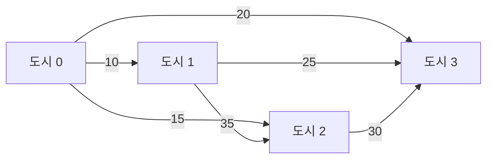

## 정의

N 개 도시를 정확히 한 번씩 방문 후 시작점으로 돌아오는 **최소 비용 경로**. **NP-hard**.

공식 표현: N 개 정점의 완전 그래프에서 Hamiltonian Cycle 중 최소 가중치를 구하라.

## 문제 상황

도시 4개 (0, 1, 2, 3), 비용 행렬이 주어졌을 때 모든 도시를 순회하는 최소 경로 비용?

완전 탐색 시 경우의 수: (N-1)! = 3! = 6 (N=4). N=20 이면 19! ≈ 1.2 × 10^17. **완전 탐색 불가**.

## 시각화



Bitmask DP 탐색: 0 -> 1 -> 3 -> 2 -> 0 (비용 10+25+30+15 = 80) vs 0 -> 2 -> 3 -> 1 -> 0 (15+30+25+35 = 105). 최소 경로를 DP로 찾는다.

## 핵심 아이디어

**상태 압축**: 방문 집합을 N 비트 정수(bitmask)로 표현. N = 20 이면 2^20 ≈ 10^6 가지 상태.

**부분 문제**: `dp[mask][i]` = "방문 집합이 mask, 현재 도시가 i" 일 때의 최소 비용.

**전이**: 아직 방문 안 한 도시 j 로 이동:

```text
dp[mask | (1<<j)][j] = min(dp[mask | (1<<j)][j], dp[mask][i] + cost[i][j])
```

**최적 부분 구조**: 마지막 방문 도시를 i 라 할 때, mask 집합을 방문하면서 i 에 도착하는 최소 비용은 이전 부분 문제의 최적값에 의존한다.

## 알고리즘

### Bitmask DP (N <= 20)

1. `dp[1][0] = 0` 으로 초기화 (도시 0에서 출발, 0만 방문).
2. 모든 mask, i 에 대해 아직 방문 안 한 j 로 전이.
3. 전체 방문 `all = (1<<N) - 1` 에서 임의 도시 i -> 0 으로 복귀.

```cpp
int dp[1<<20][20];  // INF 초기화

dp[1][0] = 0;   // 도시 0 에서 출발
for (int mask = 1; mask < (1<<n); mask++) {
    for (int i = 0; i < n; i++) {
        if (!(mask & (1<<i)) || dp[mask][i] == INF) continue;
        for (int j = 0; j < n; j++) {
            if (mask & (1<<j)) continue;
            int nm = mask | (1<<j);
            dp[nm][j] = min(dp[nm][j], dp[mask][i] + cost[i][j]);
        }
    }
}

int ans = INF;
int all = (1<<n) - 1;
for (int i = 1; i < n; i++)
    ans = min(ans, dp[all][i] + cost[i][0]);
```

시간 O(2^N * N^2), 공간 O(2^N * N).

### 경로 복원 (Backtracking)

```cpp
int par[1<<20][20];  // par[mask][i] = i 에 오기 직전 도시

// ... DP 계산 후 ...

int cur = 0, mask = all;
vector<int> path;
// 마지막 도시 찾기
for (int i = 1; i < n; i++)
    if (dp[all][i] + cost[i][0] == ans) { cur = i; break; }

while (mask) {
    path.push_back(cur);
    int prev = par[mask][cur];
    mask ^= (1 << cur);
    cur = prev;
}
path.push_back(0);
reverse(path.begin(), path.end());
```

## 구현

<CodeWithOutput
  variants={[
    {
      language: "cpp",
      label: "C++",
      code: `#include <bits/stdc++.h>
using namespace std;

const int INF = 1e9;

int main() {
    ios::sync_with_stdio(false);
    cin.tie(nullptr);

    int n;
    cin >> n;
    vector<vector<int>> cost(n, vector<int>(n));
    for (int i = 0; i < n; i++)
        for (int j = 0; j < n; j++)
            cin >> cost[i][j];

    vector<vector<int>> dp(1<<n, vector<int>(n, INF));
    dp[1][0] = 0;

    for (int mask = 1; mask < (1<<n); mask++) {
        for (int i = 0; i < n; i++) {
            if (!(mask & (1<<i)) || dp[mask][i] == INF) continue;
            for (int j = 0; j < n; j++) {
                if (mask & (1<<j)) continue;
                int nm = mask | (1<<j);
                dp[nm][j] = min(dp[nm][j], dp[mask][i] + cost[i][j]);
            }
        }
    }

    int all = (1<<n) - 1, ans = INF;
    for (int i = 1; i < n; i++)
        ans = min(ans, dp[all][i] + cost[i][0]);

    cout << ans << "\\n";
}`,
    },
    {
      language: "python",
      label: "Python",
      code: `import sys
input = sys.stdin.readline

def solve():
    n = int(input())
    cost = [list(map(int, input().split())) for _ in range(n)]
    INF = float('inf')
    dp = [[INF] * n for _ in range(1<<n)]
    dp[1][0] = 0

    for mask in range(1, 1<<n):
        for i in range(n):
            if not (mask & (1<<i)) or dp[mask][i] == INF:
                continue
            for j in range(n):
                if mask & (1<<j):
                    continue
                nm = mask | (1<<j)
                if dp[mask][i] + cost[i][j] < dp[nm][j]:
                    dp[nm][j] = dp[mask][i] + cost[i][j]

    all_mask = (1<<n) - 1
    ans = min(dp[all_mask][i] + cost[i][0] for i in range(1, n))
    print(ans)

solve()`,
    },
  ]}
  cases={[
    {
      label: "4개 도시",
      input: `4
0 10 15 20
10 0 35 25
15 35 0 30
20 25 30 0`,
      output: `80`,
    },
  ]}
/>

## 복잡도

| 항목 | Bitmask DP | 완전 탐색 |
|:---|:---:|:---:|
| **시간** | O(2^N * N^2) | O(N!) |
| **공간** | O(2^N * N) | O(N) |
| **N = 15** | ~7M ops | ~1.3T ops |
| **N = 20** | ~400M ops | 불가 |

실전: N <= 20 이면 Bitmask DP, N <= 12 이면 완전 탐색도 가능 (단, 시간 제한 여유 확인).

## 근사 알고리즘 (N이 큰 경우)

| 알고리즘 | 근사비 | 조건 |
|:---|:---:|:---|
| **MST + DFS (Twice-around-the-tree)** | 2 | metric TSP (삼각 부등식) |
| **Christofides** | 1.5 | metric TSP |
| **LKH (Lin-Kernighan-Helsgott)** | 실전 최강 | 휴리스틱, 보장 없음 |
| **Greedy (nearest neighbor)** | 보장 없음 | 빠름 |

## 함정

### 1. 방문 집합 비트 vs 도시 인덱스 혼동

`mask & (1<<i)` 에서 i 는 도시 번호 (0-indexed). 도시가 1-indexed 이면 `i-1` 로 변환.

> [!WARNING]
> `dp[1][0] = 0` 은 "도시 0 방문, 현재 도시 0" 상태. 출발 도시를 0 으로 고정하면 복귀도 0 으로.

### 2. 복귀 비용 빠뜨리기

마지막에 `dp[all][i] + cost[i][0]` 으로 복귀 비용 더해야 함. 빠뜨리면 Hamiltonian Path 풀이.

### 3. N = 1 에지 케이스

N = 1 이면 `all = 1`, `dp[1][0] = 0`, 복귀 비용 `cost[0][0] = 0`. 답 = 0. 별도 처리 불필요.

### 4. 메모리 초과

N = 20: `dp[1<<20][20]` = 4M * 20 = 80M int = 320 MB. 메모리 제한 확인.
N > 20: Bitmask DP 불가. 근사 알고리즘 필요.

## BOJ 연습 문제

| 번호 | 제목 | 비고 |
|:---|:---|:---|
| BOJ 2098 | 외판원 순회 | N<=15, Bitmask DP 기본 |
| BOJ 2097 | 순서 | 경로 복원 포함 |
| BOJ 16991 | 외판원 순회 2 | N<=10, 좌표 기반 |

## 참고

- [[hamiltonian-path|Hamiltonian Path]]
- [[dp-bitfield|DP Bitmask (Bitmask DP)]]
- [[spanning-tree|MST (최소 신장 트리)]]
- [[graph|그래프 기초]]
