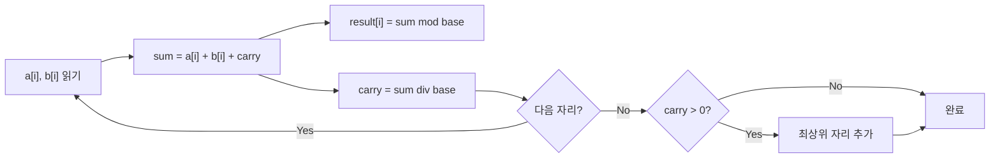
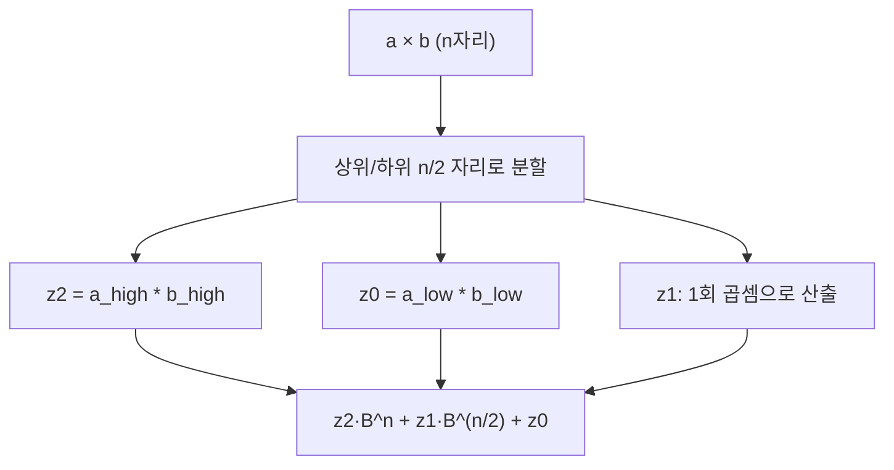

## 정의

**임의 정밀도 (Arbitrary Precision)** 또는 **큰 수 산술 (Big Integer / Bignum)** 은 고정된 바이트 한계(32-bit, 64-bit) 없이 메모리가 허용하는 한 임의로 큰 정수를 표현하고 연산하는 기법. 배열에 자릿수를 저장하고 학교 교과서 방식 (O(n^2)) 또는 Karatsuba (O(n^{1.585})), FFT/NTT (O(n log n)) 곱셈으로 구현.

## 문제 상황과 동기

C `long long` (64-bit, 약 ±9.22×10^18) 으로 표현 불가능한 수를 다룬다. 10000자리 소수 곱셈, 암호학 (RSA 2048-bit key), 조합론 (nCr, n≤100000) 등.

- **naive**: built-in 64-bit overflow. 해결 불가.
- **string/vector 기반**: Base 10 또는 Base 10^9 표현. 덧셈/뺄셈 O(n), 곱셈 O(n^2) (schoolbook) / O(n^{1.585}) (Karatsuba) / O(n log n) (FFT).

핵심 통찰: *큰 수를 작은 단위(자릿수)로 분할. 올림(carry)을 순차 전파.*

## 시각화

```anim:arbitrary-precision
{}
```

## 핵심 아이디어

숫자를 자릿수 배열로 표현. `a[0]` = 일의 자리. 덧셈은 각 자리별 덧셈 + 올림 전파.

```text
10^N base 표현 (각 원소가 0~9):
  n = a_0 + a_1·10 + a_2·10^2 + ... + a_{k-1}·10^{k-1}

덧셈:
  for i = 0..k-1:
    sum = a_i + b_i + carry
    result_i = sum % 10
    carry = sum / 10

곱셈 (schoolbook):
  for i = 0..ka-1:
    for j = 0..kb-1:
      result[i+j] += a_i * b_j
  // 올림 정리
```

### 덧셈 올림 전파 흐름



## 구현

<CodeWithOutput
  variants={[
    {
      language: "cpp",
      label: "C++",
      code: `// String 기반 큰 수 더하기 (Base 10)
#include <bits/stdc++.h>
using namespace std;

string add(string a, string b) {
    if (a.size() < b.size()) swap(a, b);
    int carry = 0;
    for (int i = a.size() - 1, j = b.size() - 1; i >= 0; i--, j--) {
        int sum = (a[i] - '0') + (j >= 0 ? b[j] - '0' : 0) + carry;
        a[i] = (sum % 10) + '0';
        carry = sum / 10;
    }
    if (carry) a = char(carry + '0') + a;
    return a;
}

int main() {
    string a, b; cin >> a >> b;
    cout << add(a, b);
    return 0;
}`,
    },
    {
      language: "python",
      label: "Python",
      code: `# Python int 는 arbitrary precision 내장
import sys
a, b = map(int, sys.stdin.readline().split())
print(a + b)
print(a * b)`,
    },
    {
      language: "java",
      label: "Java",
      code: `// Java BigInteger
import java.util.*;
import java.math.*;
import java.io.*;
public class Main {
    public static void main(String[] args) throws IOException {
        BufferedReader br = new BufferedReader(new InputStreamReader(System.in));
        StringTokenizer st = new StringTokenizer(br.readLine());
        BigInteger a = new BigInteger(st.nextToken());
        BigInteger b = new BigInteger(st.nextToken());
        System.out.println(a.add(b));
        System.out.println(a.multiply(b));
    }
}`,
    },
  ]}
  cases={[
    {
      label: "기본",
      input: `1234 5678`,
      output: `6912
7006652`,
    },
    {
      label: "큰 수 (10000자리)",
      input: `12345678901234567890 98765432109876543210`,
      output: `111111111011111111100
1219326311370217952237464381113512636900`,
    },
  ]}
/>

## 복잡도

| 항목 | 값 |
|:---|:---|
| **덧셈/뺄셈 (시간)** | O(n) |
| **곱셈 (schoolbook)** | O(n^2) |
| **곱셈 (Karatsuba)** | O(n^{log_2 3}) ≈ O(n^{1.585}) |
| **곱셈 (FFT/NTT)** | O(n log n) |
| **공간** | O(n) |

## 변형 / 활용

### Karatsuba 곱셈

큰 수를 반으로 분할: `a = a1·B^m + a0`, `b = b1·B^m + b0`. 곱셈 3회로 축소 (n^2 -> n^{1.585}).

```
z2 = a1·b1
z0 = a0·b0
z1 = (a1+a0)·(b1+b0) - z2 - z0
결과 = z2·B^{2m} + z1·B^m + z0
```

### Karatsuba 분할 트리



### FFT/NTT 곱셈

convolution 으로 변환하여 O(n log n). 수십만 자리 이상에서 실용적. [[FFT/NTT]] 문서 참조.

### Base 변환

10진 입출력에 유리한 Base 10 vs 연산 효율의 Base 10^9. 내부 Base 2^64 (GMP 스타일).

### 큰 수 곱셈 구조 (schoolbook)

```text
multiply(a, b):
  result = array of zeros, size = len(a) + len(b)
  for i in 0..len(a)-1:
    for j in 0..len(b)-1:
      result[i+j]   += a[i] * b[j]
  // 올림 정리 패스
  for i in 0..len(result)-2:
    result[i+1] += result[i] / base
    result[i]   %= base
  return result
```

### 표준 라이브러리 Big Integer

- **Java**: `java.math.BigInteger` 내장. RSA 등 암호화에 활용.
- **Python**: 내장 `int` 가 임의 정밀도. 별도 구현 불필요.
- **C++**: GMP (GNU Multiple Precision), Boost.Multiprecision. PS 에서는 직접 구현이 일반적.

> [!TIP]
> Python 으로 제출하면 임의 정밀도 문제를 거의 공짜로 해결할 수 있다. C++ 구현 실력을 키우려면 C++ 로도 도전해볼 것.

## 함정

### 1. 음수 처리

뺄셈에서 부호 결정. `sign` 플래그 분리 또는 보수 표현.

### 2. leading zero

연산 후 앞쪽 불필요한 0 제거. 결과가 0이면 하나의 0 유지.

### 3. 캐리 전파 지연

덧셈/곱셈 후 올림이 연쇄 전파될 수 있음. 한 번의 정리 패스로 해결.

### 4. FFT 반올림 오차

복소수 FFT 는 부동소수점 오차 발생. NTT (정수 mod prime) 로 대체.

## BOJ 연습 문제

PS 에서 임의 정밀도 문제는 보통 큰 수 사칙연산, 팩토리얼, nCr, 피보나치 등. Python 으로 제출하면 즉시 해결되므로 C++ 구현 연습 효과가 크다.

| 번호 | 제목 | 정답률 | 링크 |
|:---|:---|---:|:---|
| BOJ 10757 | 큰 수 A+B | 51.3% | [kokoa-lab](https://github.com/kokoa-lab/boj-problems/tree/main/organize_problems/10700-10799/10757) |
| BOJ 2338 | 긴자리 계산 | 49.9% | [kokoa-lab](https://github.com/kokoa-lab/boj-problems/tree/main/organize_problems/2300-2399/2338) |
| BOJ 1271 | 엄청난 부자2 | 35.6% | [kokoa-lab](https://github.com/kokoa-lab/boj-problems/tree/main/organize_problems/1200-1299/1271) |
| BOJ 2407 | 조합 | 42.6% | [kokoa-lab](https://github.com/kokoa-lab/boj-problems/tree/main/organize_problems/2400-2499/2407) |
| BOJ 13277 | 큰 수 곱셈 | - | [풀기](https://www.acmicpc.net/problem/13277) |
| BOJ 10430 | 나머지 | - | [풀기](https://www.acmicpc.net/problem/10430) |

## 참고

- [[FFT/NTT]] (고속 곱셈)
- [[Exponentiation by Squaring|분할 정복을 이용한 거듭제곱]]
- [[Arithmetic|사칙연산]]
- cp-algorithms: [Big Integer](https://cp-algorithms.com/algebra/big-integer.html)
- GMP (GNU Multiple Precision Arithmetic Library): 실전 C++ 큰 수 라이브러리
