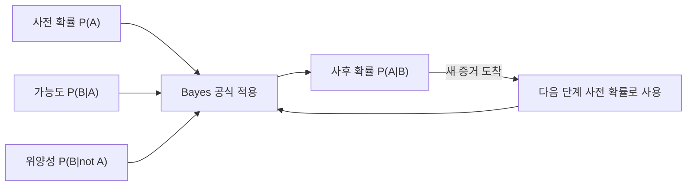

## 정의

**베이즈 정리 (Bayes Theorem)** 는 조건부 확률의 대칭성을 이용해 P(A|B) 를 P(B|A) 로 표현하는 공식:

```
P(A|B) = P(B|A) * P(A) / P(B)
```

- P(A): **사전 확률 (prior)** - 증거를 보기 전 A 의 확률
- P(B|A): **가능도 (likelihood)** - A 가 참일 때 B 가 관측될 확률
- P(A|B): **사후 확률 (posterior)** - B 관측 후 A 의 확률
- P(B): **증거 (evidence)** - B 가 관측될 총 확률 (정규화 상수)

## 문제 상황과 동기

**진단 문제**: 어떤 병의 유병률이 1% (prior). 검사의 정확도가 99% (likelihood). 양성 판정을 받았을 때 실제 병에 걸렸을 확률은?

- **intuition**: "99% 정확도니까 99%!" -> 틀림.
- **Bayes 계산**: (0.99 * 0.01) / (0.99 * 0.01 + 0.01 * 0.99) = 50%. 가짜 양성 (false positive) 이 prior 가 낮을 때 큰 영향을 줌.
- **핵심 통찰**: *증거의 가치는 prior 에 의해 크게 좌우됨.*

Bayesian updating: 새 증거가 들어올 때마다 사후 확률이 다음 단계의 사전 확률이 됨. 반복적 학습의 수학적 기반.

## 시각화

```anim:bayes
{}
```

## 베이지안 업데이트 흐름



## 핵심 아이디어

Bayes 정리는 **역확률 (inverse probability)** 을 구하는 도구. 원인 -> 결과 는 알지만, 결과 -> 원인 은 모를 때 사용.

분모 P(B) 는 전확률 공식 (law of total probability) 으로 전개:

```
P(B) = P(B|A) * P(A) + P(B|not A) * P(not A)
```

따라서:

```
P(A|B) = P(B|A) * P(A) / (P(B|A)*P(A) + P(B|not A)*P(not A))
```

- A: 가설 (hypothesis)
- B: 데이터 / 증거 (evidence)
- 사후 확률 = (가능도 * 사전 확률) / 증거

**Bayesian updating**: P(A|B) 가 다음 단계의 P(A) 가 됨. 데이터가 쌓일수록 사후 확률은 true 값으로 수렴.

### 혼동 행렬과 Bayes 의 관계

| | 실제 양성 (A) | 실제 음성 (not A) |
|:---|:---:|:---:|
| **검사 양성 (B)** | TP: P(B|A) * P(A) | FP: P(B|not A) * P(not A) |
| **검사 음성 (not B)** | FN | TN |

`P(A|B) = TP / (TP + FP)` = 정밀도 (Precision). 유병률 (prior) 이 낮을수록 FP 가 TP 를 압도.

## 알고리즘

```text
Bayes(prior, likelihood, falsePos):
    evidence = likelihood * prior + falsePos * (1 - prior)
    posterior = (likelihood * prior) / evidence
    return posterior

Bayesian_update(prior_list, likelihood_func, observation_sequence):
    posterior = prior_list
    for each obs in observation_sequence:
        posterior = Bayes(posterior, likelihood_func(obs), ...)
    return posterior
```

## 구현

<CodeWithOutput
  variants={[
    {
      language: "cpp",
      label: "C++",
      code: `// Bayesian posterior probability calculator
#include <bits/stdc++.h>
using namespace std;
int main() {
    // prior: P(A), likelihood: P(B|A), falsePos: P(B|not A)
    double prior, likelihood, falsePos;
    cin >> prior >> likelihood >> falsePos;
    double evidence = likelihood * prior + falsePos * (1.0 - prior);
    double posterior = (likelihood * prior) / evidence;
    cout << fixed << setprecision(6);
    cout << "Posterior P(A|B) = " << posterior << "\\n";
    cout << "Evidence   P(B)  = " << evidence << "\\n";
    return 0;
}`,
    },
    {
      language: "python",
      label: "Python",
      code: `def bayes(prior: float, likelihood: float, false_pos: float):
    evidence = likelihood * prior + false_pos * (1 - prior)
    posterior = (likelihood * prior) / evidence
    return posterior, evidence

prior, like, fp = map(float, input().split())
post, evid = bayes(prior, like, fp)
print(f"Posterior P(A|B) = {post:.6f}")
print(f"Evidence   P(B)  = {evid:.6f}")`,
    },
    {
      language: "java",
      label: "Java",
      code: `import java.util.*;
public class Main {
    public static void main(String[] args) {
        Scanner sc = new Scanner(System.in);
        double prior = sc.nextDouble();
        double like = sc.nextDouble();
        double fp = sc.nextDouble();
        double evid = like * prior + fp * (1.0 - prior);
        double post = (like * prior) / evid;
        System.out.printf("Posterior P(A|B) = %.6f%n", post);
        System.out.printf("Evidence   P(B)  = %.6f%n", evid);
    }
}`,
    },
  ]}
  cases={[
    {
      label: "의료 진단 (유병률 1%, 정확도 99%)",
      input: "0.01 0.99 0.01",
      output: "Posterior P(A|B) = 0.500000\nEvidence   P(B)  = 0.019800",
    },
    {
      label: "높은 사전 확률 (50%, 정확도 95%)",
      input: "0.50 0.95 0.05",
      output: "Posterior P(A|B) = 0.950000\nEvidence   P(B)  = 0.500000",
    },
    {
      label: "드문 질병 + 낮은 위양성 (0.1%, 99.9%)",
      input: "0.001 0.999 0.001",
      output: "Posterior P(A|B) = 0.500000\nEvidence   P(B)  = 0.001998",
    },
  ]}
/>

## 복잡도

| 항목 | 값 |
|:---|:---|
| **시간 (단일 추론)** | O(1) |
| **공간** | O(1) |
| **수렴 (Bayesian updating)** | O(N) 증거에 대해 선형 수렴 |
| **안정성** | - |

## 변형 / 활용

- **Bayesian updating**: 새 증거가 들어올 때마다 사후 -> 사전으로 업데이트. sequential decision making.
- **Naive Bayes classifier**: P(class | features) ~ P(class) * prod P(feature_i | class). 텍스트 분류, 스팸 필터링의 강력한 baseline.
- **Bayesian network**: 변수 간 조건부 의존성을 DAG 로 모델링. 진단, 예측, 인과 추론.
- **Gaussian Naive Bayes**: 연속형 feature 에 정규 분포 가정.
- **A/B testing**: Bayesian approach 로 전환율의 사후 분포 추정. frequentist 접근 대비 직관적 해석.

## Naive Bayes Classifier

문서 분류 예시. 단어 w_1, ..., w_k 가 주어졌을 때 스팸 여부:

```text
P(spam | w_1..w_k)
  ∝ P(spam) * P(w_1|spam) * P(w_2|spam) * ... * P(w_k|spam)

P(ham | w_1..w_k)
  ∝ P(ham) * P(w_1|ham) * ... * P(w_k|ham)
```

log-sum trick 으로 곱을 합으로 변환 (수치 안정성):

```text
log P(spam | ...) = log P(spam) + Σ log P(w_i | spam)
log P(ham | ...)  = log P(ham)  + Σ log P(w_i | ham)

스팸 = argmax 둘 중 큰 값
```

훈련: 스팸/정상 메일 각 클래스에서 단어 빈도를 세고 Laplace smoothing 적용.

```python
# Naive Bayes 학습 (Python, 간략)
from collections import defaultdict, Counter
import math

class NaiveBayes:
    def fit(self, docs, labels):
        self.priors = Counter(labels)
        self.word_freq = defaultdict(Counter)
        for doc, label in zip(docs, labels):
            for w in doc:
                self.word_freq[label][w] += 1
        self.vocab = set(w for c in self.word_freq.values() for w in c)

    def predict(self, doc):
        scores = {}
        n = sum(self.priors.values())
        for cls, cnt in self.priors.items():
            score = math.log(cnt / n)
            total = sum(self.word_freq[cls].values())
            V = len(self.vocab)
            for w in doc:
                score += math.log((self.word_freq[cls][w] + 1) / (total + V))
            scores[cls] = score
        return max(scores, key=scores.get)
```

## 함정

### 1. Base rate fallacy (기저율 오류)

prior (base rate) 를 무시하고 likelihood 만 보는 오류. "검사 정확도 99%" 에 속아 prior 1% 를 잊으면 50% 인 실제 확률을 99% 로 오인.

### 2. P(B) = 0 인 경우

증거 B 의 확률이 0이면 정리가 성립하지 않음 (0으로 나누기). 이는 B 가 절대 발생하지 않는 사건임을 의미.

### 3. 독립 가정 위반

Naive Bayes 의 "naive" = feature 간 조건부 독립 가정. 실제로 위반되는 경우가 많지만 classification 성능은 여전히 좋음. 그러나 calibrated probability 추정은 부정확.

### 4. Prior 선택의 영향

prior 가 부적절하면 (극단적이거나 잘못된 domain knowledge) 사후 확률이 데이터가 많아도 수렴이 느리거나 잘못된 값으로 bias.

### 5. 수치 언더플로우

Naive Bayes 에서 작은 확률을 여러 개 곱하면 float 언더플로우. log-sum 으로 변환하거나 log-domain 에서 전체 계산 필요.

> [!WARNING]
> base rate fallacy 는 직관과 반대되는 결과를 줄 수 있다. 유병률 1% + 검사 정확도 99% = 양성 시 실제 확률 50%. 숫자를 믿고 계산하는 습관 필수.

## BOJ 연습 문제

| 번호 | 제목 | 정답률 | 링크 |
|:---|:---|---:|:---|
| BOJ 13251 | 조약돌 꺼내기 | (수집 안 됨) | [kokoa-lab](https://github.com/kokoa-lab/boj-problems/tree/main/organize_problems/13200-13299/13251) |
| BOJ 11051 | 이항 계수 3 | (수집 안 됨) | [kokoa-lab](https://github.com/kokoa-lab/boj-problems/tree/main/organize_problems/11000-11099/11051) |
| BOJ 1010 | 다리 놓기 | (수집 안 됨) | [kokoa-lab](https://github.com/kokoa-lab/boj-problems/tree/main/organize_problems/1000-1099/1010) |

## 참고

- [[Probability|확률]]
- [[Combinatorics|조합론]]
