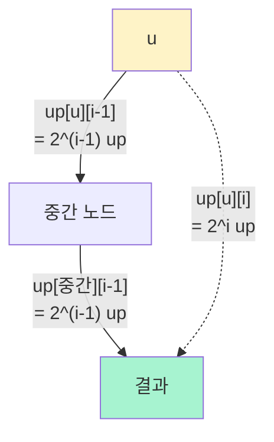

## 정의

**Binary Lifting (이진 상승, doubling)** 은 트리 (또는 functional graph) 에서 정점의 **$2^k$ 번째 조상** 을 미리 계산해 두어 **임의의 $k$ 번째 조상, LCA, 경로 쿼리** 를 $O(\log N)$ 안에 답하는 기법입니다.

## 왜 가능한가 (핵심 통찰)

### 아이디어 1: 임의 $k$ 는 이진 분해

모든 양의 정수 $k$ 는 유일한 이진 표현을 가집니다.

$$
k = \sum_{i : \text{bit}_i(k) = 1} 2^i
$$

**예**: $k = 13 = 8 + 4 + 1 = 2^3 + 2^2 + 2^0$

$u$ 의 13번째 조상을 찾으려면 **$2^3$ 번째 → $2^2$ 번째 → $2^0$ 번째** 를 순차 적용. 3번의 점프 = $\lceil \log_2 13 \rceil$.

일반적으로 $k$ 의 조상을 찾는데 최대 $\lceil \log_2 k \rceil$ 번의 점프.

### 아이디어 2: $2^i$ 점프는 $2^{i-1}$ 점프의 합성

**핵심 재귀 관계**:

$$
\text{up}[u][i] = \text{up}[\ \text{up}[u][i-1]\ ][i-1]
$$

즉, "$u$ 에서 $2^i$ 만큼 위로" = "$u$ 에서 $2^{i-1}$ 위로 간 다음, 거기서 다시 $2^{i-1}$ 위로".

$$
2^i = 2^{i-1} + 2^{i-1}
$$

이 항등식이 doubling 의 근본. 매 단계마다 도달 거리를 **두 배로** 증가시킬 수 있음.

## 시각화: 왜 $2^i$ 점프 테이블만으로 충분한가

### 예: 깊이 20 인 정점 $u$ 에서 $k = 13$ 번째 조상 찾기

```
u (depth 20)
│
▼ 2^0 = 1 step
● (depth 19)
│
▼ 2^2 = 4 steps
● (depth 15)
│
▼ 2^3 = 8 steps
● (depth 7)
= 13번째 조상 ✓
```

**핵심**: 트리에서 $u$ 로부터 $x$ 조상은 **경로가 유일**. 어느 순서로 점프하든 최종 결과 동일.

### 이진 표현 시각화

```
k = 13 = 0b1101

  bit i:   3   2   1   0
        ┌───┬───┬───┬───┐
        │ 1 │ 1 │ 0 │ 1 │
        └───┴───┴───┴───┘
          ↑   ↑       ↑
          점프 점프    점프
         2^3=8 2^2=4  2^0=1

  합 = 8 + 4 + 1 = 13 ✓
```

**모든 정수** 가 $\{2^0, 2^1, 2^2, ..., 2^{\lceil \log N \rceil}\}$ 의 부분합으로 표현됨 -> $\log N$ 개 테이블로 모든 $k$ 커버.

### Doubling 테이블 구축 시각화

```
u ── (2^0=1) ──▶ ●
u ────── (2^1=2) ─────▶ ●
u ────────── (2^2=4) ──────────▶ ●
u ────────────── (2^3=8) ──────────────▶ ●
```

각 행을 채우는 규칙:

```
up[u][0] = parent[u]                        (직접 부모)
up[u][1] = up[ up[u][0] ][0]                (1 위 → 1 위 → 2 위)
up[u][2] = up[ up[u][1] ][1]                (2 위 → 2 위 → 4 위)
up[u][3] = up[ up[u][2] ][2]                (4 위 → 4 위 → 8 위)
...
```

**"이미 계산된 절반 결과를 재사용"** 이 doubling 이라는 이름의 유래.

### 재귀 관계 시각적 증명



$2^i = 2^{i-1} + 2^{i-1}$ 이므로 두 개의 절반 크기 점프 = 한 개의 완전 점프.

## 왜 $O(\log N)$ 인가

### 전처리 크기

- 각 정점 $u$ 에 대해 $\lceil \log_2 N \rceil$ 개의 $2^i$ 조상 저장
- 전체: $O(N \log N)$ 공간
- 채우는 데도 $O(N \log N)$ 시간 (각 셀 계산 O(1))

### 쿼리 시간

$k$ 번째 조상을 찾을 때 이진 표현의 **set bit 수만큼** 점프. 최대 $\lceil \log_2 k \rceil$.

$k \leq N$ 이면 $O(\log N)$.

## 알고리즘: k번째 조상

```text
전처리 (트리 DFS):
    up[u][0] = parent[u]
    for i in 1..LOG:
        up[u][i] = up[up[u][i-1]][i-1] if up[u][i-1] >= 0 else -1

kthAncestor(u, k):
    for i in 0..LOG:
        if k & (1 << i):
            u = up[u][i]
            if u < 0: return -1     # 조상 없음
    return u
```

$\text{LOG} = \lceil \log_2 N \rceil + 1$. $N \leq 5 \times 10^5$ 이면 `LOG = 20`.

## 알고리즘: LCA

$u, v$ 의 [[lca|LCA]] 를 doubling 으로:

```text
lca(u, v):
    # 1) 깊이를 맞춤 (더 깊은 쪽을 올림)
    if depth[u] < depth[v]: swap(u, v)
    diff = depth[u] - depth[v]
    for i in 0..LOG:
        if diff & (1 << i):
            u = up[u][i]

    # 2) 이미 같으면 답
    if u == v: return u

    # 3) 같은 조상 밑까지 함께 올림 (top-down)
    for i in LOG-1..0:
        if up[u][i] != up[v][i]:
            u = up[u][i]
            v = up[v][i]

    return up[u][0]
```

**Top-down** 방식이 이유: **가능한 가장 큰 점프부터** 시도. 만약 위에 갔더니 같아지면 그건 이미 공통 조상. 다시 안 겹치는 최소 위치까지 함께 올림.

## 응용

### 1. K번째 조상

자세한 것은 [[kth-ancestor|K번째 조상]] 참조.

### 2. LCA

O(log N) per query. 자세한 것은 [[lca|LCA]] 참조.

### 3. Path sum on tree

경로 값의 합. LCA + 루트-접두합 조합. 자세한 것은 [[path-sum-on-tree|Path sum on tree]] 참조.

### 4. Functional graph K-th successor

트리가 아닌 **각 정점이 하나의 다음 정점을 가리키는 그래프** 에서 $k$ 번째 후속자.

$f(f(f(\ldots f(u))))$ 를 $O(\log k)$ 안에.

`up[u][i]` = "$u$ 에서 $2^i$ 번 함수 적용 결과".

**예**: BOJ 17435 합성함수와 쿼리.

### 5. 경로 위 최댓값 / 최솟값

Doubling 테이블에 $2^i$ 조상뿐 아니라 **그 사이 최댓값** 도 함께 저장. Idempotent 연산 (max, min, gcd, and, or, xor) 은 모두 이 확장 가능.

$$
\text{maxUp}[u][i] = \max(\text{maxUp}[u][i-1], \text{maxUp}[\text{up}[u][i-1]][i-1])
$$

### 6. Sparse Table (배열 RMQ)

같은 doubling 아이디어를 배열에 적용:

$$
\text{sparse}[i][j] = \min(\text{sparse}[i][j-1], \text{sparse}[i + 2^{j-1}][j-1])
$$

O(1) query for idempotent operations. 자세한 것은 [[sparse-table|Sparse Table]] 참조.

## 함정

### 1. LOG 부족

$N = 5 \times 10^5$ 일 때 `LOG = 19` 는 부족. `LOG = 20` 이상.

### 2. 채우는 순서

`up[u][i]` 를 계산할 때 `up[?][i-1]` 이 이미 채워져 있어야. DFS 순서로 처리하면 부모 이후 자식 -> `up[u][i-1]` 이 이미 있으므로 안전.

### 3. Off-by-one

- `kth(u, 0) = u`
- `kth(u, 1) = parent(u)`
- LCA 에서 깊이 조절 후 `u == v` 인 경우 즉시 반환 (자기 자신이 LCA)

### 4. 재귀 스택 한계

큰 트리는 iterative DFS 로 (Python 은 특히).

### 5. Functional graph 는 서비스 그래프

트리와 달리 사이클 있을 수 있음. Binary lifting 은 여전히 유효하나 `depth` 없음.

## 참고

- [[kth-ancestor|K번째 조상]]
- [[lca|LCA]]
- [[path-sum-on-tree|Path sum on tree]]
- [[euler-tour-technique|Euler Tour]]
- [[sparse-table|Sparse Table]]
- [[hld|Heavy-Light Decomposition]]
