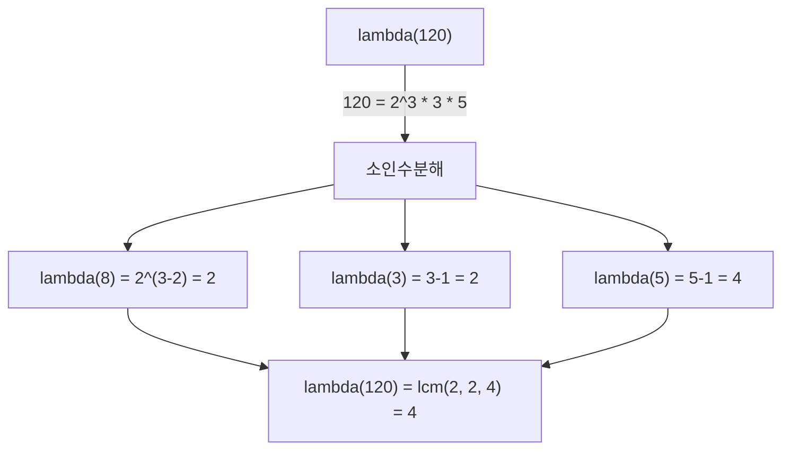
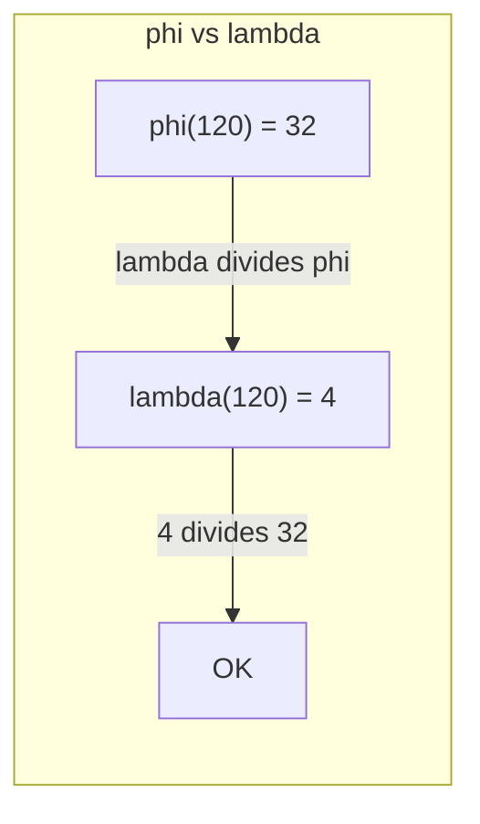

## 정의

**Carmichael function** λ(n) 은 gcd(a, n) = 1 인 **모든** a 에 대해 a^m ≡ 1 (mod n) 을 만족하는 **최소 양의 정수** m 입니다.

```text
λ(n) = min{ m > 0 : a^m ≡ 1 (mod n) for all a with gcd(a, n) = 1 }
```

**핵심 성질**: 항상 λ(n) | φ(n). [[euler-phi-function|오일러 피 함수]] φ(n) 은 항상 유효하지만 tight 하지 않을 수 있습니다.

예시:
- λ(1) = 1
- λ(5) = 4 = φ(5) (소수이므로 같음)
- λ(8) = 2, φ(8) = 4 (λ < φ)
- λ(12) = 2, φ(12) = 4 (λ < φ)

## 계산법

### 소수 거듭제곱에서의 값

| 경우 | λ 값 |
|:---|:---|
| λ(1) | 1 |
| λ(2) | 1 |
| λ(4) | 2 |
| λ(2^k), k >= 3 | 2^(k-2) |
| λ(p^k), p 홀수 소수 | p^(k-1) * (p - 1) |

2^k 에서 k >= 3 이면 λ(2^k) = 2^(k-2) 인 이유: 2^k 의 원시근이 존재하지 않고, 최대 위수가 2^(k-2) 이기 때문입니다.

### 일반 n 에서의 값

n = p1^a1 * p2^a2 * ... * pk^ak 이면:

```text
λ(n) = lcm(λ(p1^a1), λ(p2^a2), ..., λ(pk^ak))
```

예: λ(60) = λ(2^2 * 3 * 5) = lcm(λ(4), λ(3), λ(5)) = lcm(2, 2, 4) = 4

## 시각화

λ(n) 계산 과정 (n = 120 = 2^3 * 3 * 5):



φ(n) 과 λ(n) 의 관계 비교:



## φ(n) 과의 관계

λ(n) 은 항상 φ(n) 의 약수입니다:

```text
λ(n) | φ(n)
```

- φ(n) 은 a^φ(n) ≡ 1 (mod n) 을 보장하는 지수 (오일러 정리)
- λ(n) 은 그 중 **최소** 지수
- λ(n) < φ(n) 이면 φ(n) 을 지수로 쓰는 것은 낭비

실용적 의미: RSA 에서 개인 키 지수 d 를 계산할 때 φ(n) 대신 λ(n) 을 쓰면 d 가 더 작아져 복호화가 빠릅니다.

## 카마이클 수 (Carmichael Number)

**카마이클 수** 는 합성수 n 이지만 모든 gcd(a, n) = 1 인 a 에 대해 a^(n-1) ≡ 1 (mod n) 을 만족하는 수입니다.

조건: λ(n) | (n - 1) 이고 n 이 합성수.

가장 작은 카마이클 수: 561 = 3 * 11 * 17
- λ(561) = lcm(2, 10, 16) = 80
- 80 | 560 (= 561 - 1) 이므로 카마이클 수

> [!IMPORTANT]
> 카마이클 수는 [[flt|페르마 소정리]] 기반 소수 판별을 속입니다. [[miller-rabin|밀러-라빈 소수 판별]] 을 사용해야 합니다.

## 알고리즘

### 단일 n 에 대한 λ(n)

[[prime-factorization|소인수분해]] 후 각 소수 거듭제곱의 λ 를 lcm 으로 합칩니다. O(sqrt(n)).

```text
carmichael(n):
    result = 1
    for each prime power p^k dividing n:
        if p == 2 and k >= 3:
            lam = 2^(k-2)
        else:
            lam = p^(k-1) * (p - 1)
        result = lcm(result, lam)
    return result
```

### 1 부터 N 까지 일괄 계산

[[sieve|에라토스테네스의 체]] 변형으로 O(N log log N) 에 계산합니다.

```text
carmichael_sieve(N):
    lam[1] = 1
    for i in 2..N:
        lam[i] = i - 1   // 소수 가정으로 초기화
    for p in 2..N:
        if lam[p] == p - 1:   // p 가 소수
            for j in p, 2p, 3p, ..., N:
                // j 에서 p 의 기여를 lcm 으로 반영
                lam[j] = lcm(lam[j], p - 1)
    // 소수 거듭제곱 처리는 별도 필요
    return lam
```

실제 구현은 소인수분해 기반이 더 간단합니다.

## 구현

<CodeWithOutput
  variants={[
    {
      language: "cpp",
      label: "C++",
      code: `// Carmichael Function lambda(n)
#include <bits/stdc++.h>
using namespace std;
typedef long long ll;

ll gcd(ll a, ll b) { return b ? gcd(b, a % b) : a; }
ll lcm(ll a, ll b) { return a / gcd(a, b) * b; }

// lambda(p^k) 계산
ll lambda_pk(ll p, int k) {
    if (p == 2) {
        if (k == 1) return 1;
        if (k == 2) return 2;
        ll pk2 = 1;
        for (int i = 0; i < k - 2; i++) pk2 *= 2;
        return pk2;  // 2^(k-2)
    }
    // 홀수 소수: p^(k-1) * (p-1)
    ll pk1 = 1;
    for (int i = 0; i < k - 1; i++) pk1 *= p;
    return pk1 * (p - 1);
}

ll carmichael(ll n) {
    ll result = 1;
    for (ll p = 2; p * p <= n; p++) {
        if (n % p == 0) {
            int k = 0;
            while (n % p == 0) { n /= p; k++; }
            result = lcm(result, lambda_pk(p, k));
        }
    }
    if (n > 1) result = lcm(result, n - 1);  // n 이 소수
    return result;
}

// 검증: gcd(a, n) = 1 인 모든 a 에 대해 a^lambda(n) ≡ 1 (mod n)
ll power(ll base, ll exp, ll mod) {
    ll result = 1;
    base %= mod;
    while (exp > 0) {
        if (exp & 1) result = result * base % mod;
        base = base * base % mod;
        exp >>= 1;
    }
    return result;
}

int main() {
    ios::sync_with_stdio(0); cin.tie(0);
    int t; cin >> t;
    while (t--) {
        ll n; cin >> n;
        ll lam = carmichael(n);
        cout << "lambda(" << n << ") = " << lam << "\\n";
    }
}`,
    },
    {
      language: "python",
      label: "Python",
      code: `# Carmichael Function lambda(n)
import sys
from math import gcd
input = sys.stdin.readline

def lcm(a, b): return a // gcd(a, b) * b

def lambda_pk(p, k):
    """lambda(p^k) 계산"""
    if p == 2:
        if k == 1: return 1
        if k == 2: return 2
        return 2 ** (k - 2)
    # 홀수 소수: p^(k-1) * (p-1)
    return p ** (k - 1) * (p - 1)

def carmichael(n):
    """lambda(n) 계산, O(sqrt(n))"""
    result = 1
    p = 2
    while p * p <= n:
        if n % p == 0:
            k = 0
            while n % p == 0:
                n //= p; k += 1
            result = lcm(result, lambda_pk(p, k))
        p += 1
    if n > 1:
        result = lcm(result, n - 1)  # n 이 소수
    return result

def power(base, exp, mod):
    return pow(base, exp, mod)

t = int(input())
for _ in range(t):
    n = int(input())
    lam = carmichael(n)
    print(f"lambda({n}) = {lam}")`,
    },
    {
      language: "java",
      label: "Java",
      code: `// Carmichael Function lambda(n)
import java.util.*;
import java.io.*;

public class Main {
    static long gcd(long a, long b) { return b == 0 ? a : gcd(b, a % b); }
    static long lcm(long a, long b) { return a / gcd(a, b) * b; }

    static long lambdaPk(long p, int k) {
        if (p == 2) {
            if (k == 1) return 1;
            if (k == 2) return 2;
            return 1L << (k - 2);  // 2^(k-2)
        }
        long pk1 = 1;
        for (int i = 0; i < k - 1; i++) pk1 *= p;
        return pk1 * (p - 1);
    }

    static long carmichael(long n) {
        long result = 1;
        for (long p = 2; p * p <= n; p++) {
            if (n % p == 0) {
                int k = 0;
                while (n % p == 0) { n /= p; k++; }
                result = lcm(result, lambdaPk(p, k));
            }
        }
        if (n > 1) result = lcm(result, n - 1);
        return result;
    }

    public static void main(String[] args) throws IOException {
        BufferedReader br = new BufferedReader(new InputStreamReader(System.in));
        int t = Integer.parseInt(br.readLine());
        StringBuilder sb = new StringBuilder();
        while (t-- > 0) {
            long n = Long.parseLong(br.readLine());
            long lam = carmichael(n);
            sb.append("lambda(").append(n).append(") = ").append(lam).append('\\n');
        }
        System.out.print(sb);
    }
}`,
    },
  ]}
  cases={[
    {
      label: "기본",
      input: `5
1
8
12
60
120`,
      output: `lambda(1) = 1
lambda(8) = 2
lambda(12) = 2
lambda(60) = 4
lambda(120) = 4`,
    },
  ]}
/>

## 복잡도

| 항목 | 값 |
|:---|:---|
| **단일 λ(n)** | O(sqrt(n)) |
| **공간** | O(1) |

## RSA 와의 관계

RSA 에서 n = p * q (p, q 는 큰 소수) 일 때:

- φ(n) = (p-1)(q-1)
- λ(n) = lcm(p-1, q-1)

개인 키 지수 d 는 e * d ≡ 1 (mod λ(n)) 으로 계산합니다. 원래 RSA 는 φ(n) 을 사용했지만, λ(n) 을 쓰면 d 가 더 작아져 복호화가 빠릅니다. 두 방법 모두 올바른 복호화를 보장합니다 (λ(n) | φ(n) 이므로).

## 함정

> [!WARNING]
> 구현 시 자주 발생하는 실수들.

### 1. 2^k 의 특수 처리

p = 2, k >= 3 이면 λ(2^k) = 2^(k-2) 입니다. 일반 공식 p^(k-1)(p-1) = 2^(k-1) 을 쓰면 틀립니다. 2^k 에서는 원시근이 존재하지 않기 때문입니다.

### 2. lcm 오버플로우

lcm(a, b) = a / gcd(a, b) * b 에서 나눗셈을 먼저 해야 합니다. `a * b / gcd(a, b)` 로 하면 중간 값이 오버플로우할 수 있습니다.

### 3. 카마이클 수와 소수 판별

λ(n) | (n-1) 이라고 해서 n 이 소수인 것은 아닙니다. 카마이클 수가 이 조건을 만족하는 합성수입니다. 소수 판별에는 [[miller-rabin|밀러-라빈]] 을 사용하세요.

### 4. φ(n) 과 혼동

λ(n) <= φ(n) 이지만 같지 않을 수 있습니다. RSA 구현 시 어느 것을 쓰는지 명확히 해야 합니다.

## BOJ 연습 문제

| 번호 | 제목 | 설명 |
|:---|:---|:---|
| BOJ 17646 | 소수의 개수와 소인수분해 | 소인수분해 기반 계산 |
| BOJ 15711 | 환상의 짝꿍 | 수론 응용 |

## 관련 위키

- [[euler-phi-function|오일러 피 함수]]
- [[euler-phi|오일러 피 함수 (본 위키)]]
- [[flt|페르마 소정리]]
- [[miller-rabin|밀러-라빈 소수 판별]]
- [[prime-factorization|소인수분해]]
- [[modular-arithmetic|모듈러 산술]]
- [[number-theory|정수론]]
