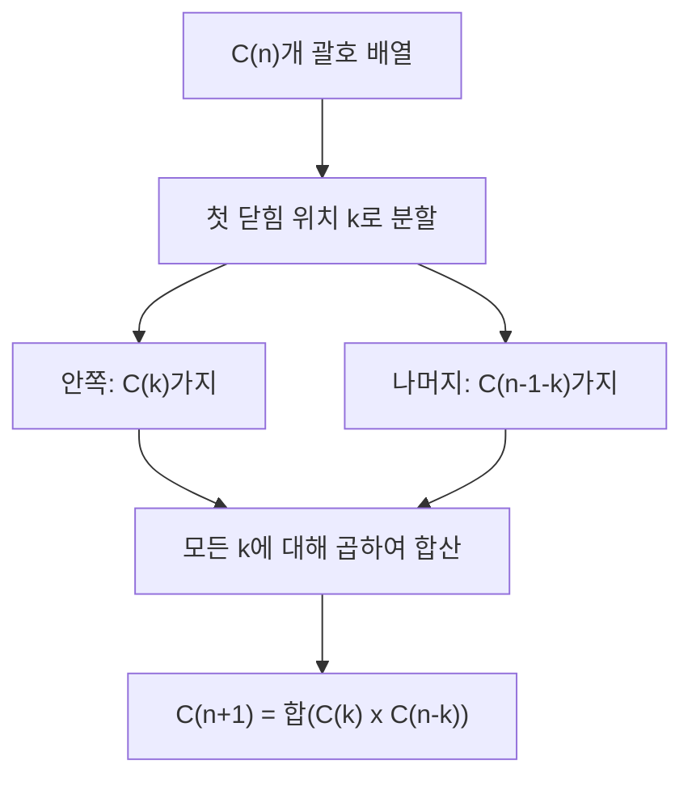
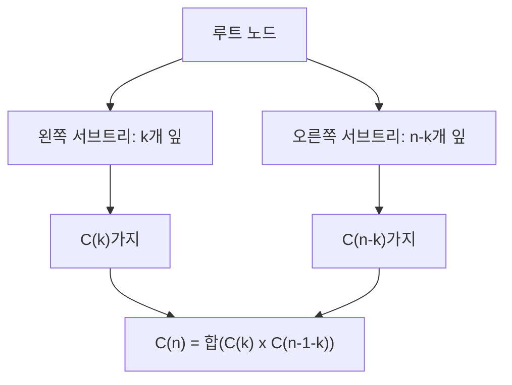

## 정의

**Catalan number** 는 조합론에서 자주 등장하는 수열. 닫힌 형식(closed form):

$$
C_n = \frac{1}{n+1} \binom{2n}{n} = \frac{(2n)!}{(n+1)!\, n!}
$$

초기값: C_0 = 1, C_1 = 1, C_2 = 2, C_3 = 5, C_4 = 14, C_5 = 42, C_6 = 132, C_7 = 429.

## 문제 상황과 동기

"경우의 수를 구하라" 문제에서 아래 패턴이 보이면 Catalan number 의심:

- n 쌍의 괄호를 올바르게 배치하는 경우의 수
- n+1 개 잎을 가진 완전 이진 트리의 개수
- n+2 각형의 삼각 분할 개수
- 격자 경로 중 대각선을 넘지 않는 단조 경로 (Dyck path)
- n 개의 원소를 스택으로 정렬 가능한 순열 수

핵심 통찰: *구조의 첫 번째 닫힘 지점을 기준으로 좌/우 분할하면 Catalan 점화식이 자연스럽게 등장.*

## 시각화

### 점화식의 직관

n 쌍 괄호에서 맨 첫 `(` 와 짝을 이루는 `)` 의 위치를 k 로 고정:



이 분해가 Catalan 점화식의 본질:

$$
C_{n+1} = \sum_{i=0}^{n} C_i \cdot C_{n-i}
$$

등가 점화식:

$$
C_n = \frac{2(2n-1)}{n+1} \cdot C_{n-1}
$$

### 이진 트리 재귀 분해



n+1 개 잎 이진 트리를 루트에서 좌/우 분할하면 동일 점화식 유도.

## 응용 (모두 C_n 개)

| 구조 | 파라미터 | 개수 |
|:---|:---|:---|
| 올바른 괄호 배열 | n 쌍 | C_n |
| 완전 이진 트리 | n+1 개 잎 | C_n |
| 볼록 다각형 삼각 분할 | n+2 각형 | C_n |
| Dyck 경로 | 길이 2n | C_n |
| 스택 정렬 가능 순열 | 1..n | C_n |
| 단조 격자 경로 (대각 이하) | n x n 격자 | C_n |

## 핵심 아이디어

### DP 점화식

$$
dp[0] = 1
$$
$$
dp[i] = \sum_{k=0}^{i-1} dp[k] \cdot dp[i-1-k]
$$

시간 O(N^2), 공간 O(N).

### 이항계수로 직접 계산

$$
C_n = \binom{2n}{n} \cdot \frac{1}{n+1}
$$

모듈러 역원 (p 소수):

$$
C_n \bmod p = \binom{2n}{n} \cdot (n+1)^{-1} \bmod p
$$

## 알고리즘

### 점화식 반복

```text
dp[0] = 1
for i in 1..n:
    dp[i] = 0
    for k in 0..i-1:
        dp[i] += dp[k] * dp[i-1-k]
```

### 비율 점화식 (정수 나눗셈, 단조로움 활용)

```text
C_0 = 1
C_n = C_{n-1} * 2*(2n-1) / (n+1)
```

항상 정수로 나누어 떨어짐 (귀납법으로 증명). 모듈러 없이 큰 수 계산 시 유용.

## 구현

<CodeWithOutput
  variants={[
    {
      language: "cpp",
      label: "C++",
      code: `// Catalan number: DP + 이항계수 두 방법
#include <bits/stdc++.h>
using namespace std;
const long long MOD = 1e9 + 7;

long long power(long long a, long long b, long long mod) {
    long long res = 1; a %= mod;
    for (; b; b >>= 1) {
        if (b & 1) res = res * a % mod;
        a = a * a % mod;
    }
    return res;
}

// 방법 1: DP
vector<long long> catalan_dp(int n) {
    vector<long long> dp(n + 1, 0);
    dp[0] = 1;
    for (int i = 1; i <= n; i++)
        for (int k = 0; k < i; k++)
            dp[i] = (dp[i] + dp[k] * dp[i - 1 - k]) % MOD;
    return dp;
}

// 방법 2: 이항계수 + 모듈러 역원
long long catalan_binom(int n) {
    vector<long long> fact(2 * n + 2);
    fact[0] = 1;
    for (int i = 1; i <= 2 * n + 1; i++) fact[i] = fact[i-1] * i % MOD;
    long long binom = fact[2*n] % MOD
                    * power(fact[n], MOD-2, MOD) % MOD
                    * power(fact[n], MOD-2, MOD) % MOD;
    return binom * power(n + 1, MOD - 2, MOD) % MOD;
}

int main() {
    auto dp = catalan_dp(10);
    for (int i = 0; i <= 10; i++)
        cout << "C(" << i << ") = " << dp[i] << "\\n";
    cout << "C(10) via binom = " << catalan_binom(10) << "\\n";
}`,
    },
    {
      language: "python",
      label: "Python",
      code: `# Catalan number: DP + 비율 점화식
MOD = 10**9 + 7

def catalan_dp(n):
    dp = [0] * (n + 1)
    dp[0] = 1
    for i in range(1, n + 1):
        for k in range(i):
            dp[i] = (dp[i] + dp[k] * dp[i - 1 - k]) % MOD
    return dp

def catalan_ratio(n):
    """C_n = C_{n-1} * 2(2n-1) / (n+1). 항상 정수로 나누어 떨어짐."""
    c = 1
    result = [1]
    for i in range(1, n + 1):
        c = c * 2 * (2 * i - 1) // (i + 1)
        result.append(c % MOD)
    return result

# DP 방식
dp = catalan_dp(10)
for i, v in enumerate(dp):
    print(f"C({i}) = {v}")

# 비율 점화식 (모듈러 없이 정확한 정수)
rat = catalan_ratio(10)
print("비율 점화식:", rat)`,
    },
    {
      language: "java",
      label: "Java",
      code: `// Catalan number DP
import java.util.*;
public class Main {
    static final long MOD = 1_000_000_007L;

    public static void main(String[] args) {
        int n = 10;
        long[] dp = new long[n + 1];
        dp[0] = 1;
        for (int i = 1; i <= n; i++) {
            for (int k = 0; k < i; k++) {
                dp[i] = (dp[i] + dp[k] * dp[i - 1 - k]) % MOD;
            }
        }
        for (int i = 0; i <= n; i++) {
            System.out.println("C(" + i + ") = " + dp[i]);
        }
    }
}`,
    },
  ]}
  cases={[
    {
      label: "C(0) ~ C(10)",
      input: "n = 10",
      output: `C(0) = 1
C(1) = 1
C(2) = 2
C(3) = 5
C(4) = 14
C(5) = 42
C(6) = 132
C(7) = 429
C(8) = 1430
C(9) = 4862
C(10) = 16796`,
    },
  ]}
/>

## 복잡도

| 방법 | 시간 | 공간 |
|:---|:---|:---|
| DP 점화식 | O(N^2) | O(N) |
| 이항계수 (팩토리얼 전처리) | O(N) | O(N) |
| 비율 점화식 | O(N) | O(N) |

큰 N 에서 모듈러 연산 필요. C_30 이 이미 long long 범위를 초과.

## 함정

### 1. n+2각형 삼각분할은 C_n 이지 C_{n+2} 아님

6각형 삼각분할 수 = C_4 = 14. n = (꼭짓점 수) - 2.

### 2. 비율 점화식의 모듈러 주의

`C_n = C_{n-1} * 2*(2n-1) / (n+1)` 는 정수지만, 모듈러 연산 후 나눗셈은 역원 필요.

```python
# 틀린 방법 (모듈러 후 나눗셈)
c = c * 2 * (2*i-1) % MOD // (i+1)   # WRONG

# 올바른 방법 1: 모듈러 전에 정수 나눗셈 (정확히 나누어짐)
c = c * 2 * (2*i-1) // (i+1) % MOD   # OK

# 올바른 방법 2: 모듈러 역원
c = c * 2 * (2*i-1) % MOD * pow(i+1, MOD-2, MOD) % MOD  # OK
```

### 3. 스택 정렬 불가능 순열 수

1..n 을 스택으로 정렬 가능한 순열: C_n 개. 불가능한 순열: n! - C_n 개.

### 4. 오버플로우

Python 은 자동 bigint, C++/Java 는 MOD 없이 long long 으로 C_18 부터 오버플로우.

## BOJ 연습 문제

| 번호 | 제목 | 정답률 | 링크 |
|:---|:---|---:|:---|
| BOJ 10422 | 괄호 | 41.7% | [kokoa-lab](https://github.com/kokoa-lab/boj-problems/tree/main/organize_problems/10400-10499/10422) |
| BOJ 1720 | 타일 코드 | 45.2% | [kokoa-lab](https://github.com/kokoa-lab/boj-problems/tree/main/organize_problems/1700-1799/1720) |
| BOJ 2622 | 삼각형만들기 | 52.3% | [kokoa-lab](https://github.com/kokoa-lab/boj-problems/tree/main/organize_problems/2600-2699/2622) |
| BOJ 11722 | 가장 긴 감소하는 부분 수열 | 49.6% | [kokoa-lab](https://github.com/kokoa-lab/boj-problems/tree/main/organize_problems/11700-11799/11722) |

## 참고

- [[combinatorics|조합론]]
- [[pascal-triangle|Pascal Triangle]]
