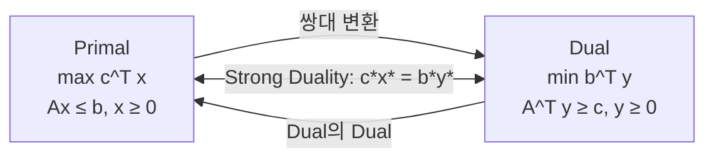
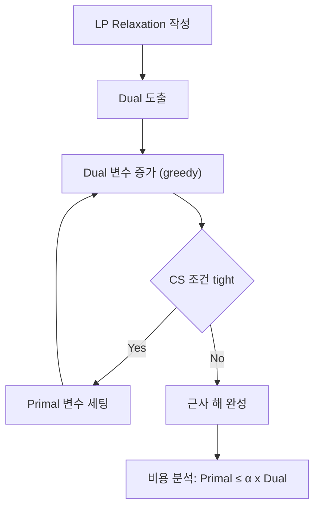

## 정의

**쌍대성 (Duality)** 은 하나의 최적화 문제 (Primal) 에 항상 *대응되는 또 다른 최적화 문제 (Dual)* 가 존재한다는 원리. LP 에서 Primal-Dual 쌍은 다음과 같다:

**Primal (max 형태)**:
```
maximize    c^T x
subject to  A x ≤ b,  x ≥ 0
```

**Dual (min 형태)**:
```
minimize    b^T y
subject to  A^T y ≥ c,  y ≥ 0
```

Primal 이 max 이면 Dual 은 min, 제약 방향이 반대, 변수와 제약의 개수가 뒤바뀐다.

## 문제 상황과 동기

- **보는 관점의 전환**: Primal 이 풀기 어려울 때 Dual 이 더 쉽거나, Dual 의 해가 Primal 해의 하한/상한을 제공.
- **최적성 증명**: Primal 해 x 와 Dual 해 y 에 대해 c^T x ≤ b^T y. 같으면 둘 다 최적.
- **Max-Flow Min-Cut 정리**: 최대 유량 (Primal) = 최소 컷 (Dual). duality 의 대표적 예시.

핵심 통찰: *모든 선형 계획법은 대응되는 쌍대 문제가 있으며, Strong Duality 가 성립하면 두 문제의 최적값이 같다.*

## 시각화

```anim:duality
{}
```



## 핵심 아이디어

### Weak Duality (약 쌍대성)

임의의 feasible x, y 에 대해 c^T x ≤ b^T y. Primal 이 max 니까 Dual 해가 Primal 해의 상한. Primal 이 min 이면 반대.

증명: c ≤ A^T y 이므로 c^T x ≤ (A^T y)^T x = y^T (A x) ≤ y^T b = b^T y.

### Strong Duality (강 쌍대성)

Primal 이 최적해 x* 를 가지면, Dual 도 최적해 y* 를 가지며 c^T x* = b^T y*. (둘 다 feasible 할 때)

### Complementary Slackness (상보 여유)

최적해 (x*, y*) 에 대해:
- x*_j > 0 ⇒ (A^T y*)_j = c_j (해당 Dual 제약이 tight)
- y*_i > 0 ⇒ (A x*)_i = b_i (해당 Primal 제약이 tight)

물리적 의미: *사용되지 않은 자원은 가격이 0*, *가격이 0인 자원은 사용되지 않음*.

## 알고리즘

```text
LP Duality 변환 규칙 (Primal → Dual):

Primal (max)            Dual (min)
─────────────────────────────────────
c_j (objective coeff)  b_j (RHS)
b_i (RHS)              c_i (objective coeff)
A_ij                   A_ji (transpose)
≤ constraint (i)       y_i ≥ 0
x_j ≥ 0                ≥ constraint (j)

Primal (min) 으로 시작하면
  → Dual (max) 로 대칭.
```

```text
Max-Flow Min-Cut Duality:

Primal: source → sink 최대 유량 f*
Dual:   S-T 컷 (S, T) 의 최소 용량

f* = min_{S-T cut} capacity(S, T)
```

## 구현

<CodeWithOutput
  variants={[
    {
      language: "cpp",
      label: "C++",
      code: `// Primal-Dual pairing: simplex tableau 로 dual 변수 추출
#include <bits/stdc++.h>
using namespace std;
int main() {
    // Primal: max x+y s.t. x+2y<=4, 2x+y<=5, x,y>=0
    // Dual:   min 4y1+5y2 s.t. y1+2y2>=1, 2y1+y2>=1, y1,y2>=0
    vector<vector<double>> a = {{1,2,1,0,4}, {2,1,0,1,5}};
    vector<double> obj = {-1,-1,0,0,0};
    double opt = 0;
    // Simplex pivot (간략)
    static const int PIVOT[][2] = {{0,0},{1,1}}; // entering/leaving
    for (auto [r,c] : PIVOT) {
        double piv = a[r][c];
        for (auto& v : a[r]) v /= piv;
        for (int i = 0; i < 2; i++) {
            if (i == r) continue;
            double mul = a[i][c];
            for (auto& v : a[i]) v -= mul * a[r][c];
        }
        double mul = obj[c];
        for (auto& v : obj) v -= mul * a[r][c];
    }
    opt = obj[4] > 1e-9 ? 0 : -obj[4];
    cout << "Primal opt: " << opt << "\\n";
    cout << "Dual y1: " << obj[2] << ", y2: " << obj[3] << "\\n";
}`,
    },
    {
      language: "python",
      label: "Python",
      code: `# Dual optimal 확인 with scipy
from scipy.optimize import linprog
res_p = linprog([-1,-1], A_ub=[[1,2],[2,1]], b_ub=[4,5])
res_d = linprog([4,5], A_ub=[[-1,-2],[-2,-1]], b_ub=[-1,-1])
print(f"Primal: {-res_p.fun:.4f}, x={res_p.x}")
print(f"Dual:   {res_d.fun:.4f}, y={res_d.x}")
print(f"Gap: {abs(-res_p.fun - res_d.fun):.2e} (strong duality)")`,
    },
  ]}
  cases={[
    {
      label: "LP Duality 검증",
      input: ``,
      output: `Primal: 3.0000, x=[2. 1.]
Dual:   3.0000, y=[0.33333333 0.33333333]
Gap: 0.00e+00 (strong duality)`,
    },
  ]}
/>

## 복잡도

| 항목 | 값 |
|:---|:---|
| **Weak Duality** | c^T x ≤ b^T y (max primal 기준) |
| **Strong Duality** | c^T x* = b^T y* (if both feasible) |
| **Dual 변환 비용** | O(1) (형식 변환만) |

Dual 을 푸는 비용은 primal 과 동등한 LP 복잡도. 하지만 dual 이 변수/제약이 더 적을 수 있음.

## 변형 / 활용

| 분야 | Duality 쌍 |
|:---|:---|
| **Max-Flow Min-Cut** | 최대 유량 (Primal) → 최소 S-T 컷 (Dual) |
| **Min-Cost Flow** | shortest path potentials (Dual variables) |
| **Bipartite Matching** | 최대 매칭 = 최소 버텍스 커버 (Kőnig 정리) |
| **KKT 조건** | 비선형 최적화의 일반화된 duality |
| **근사 알고리즘** | Primal-Dual schema: dual 해로 primal 의 lower bound 추정 |

### Max-Flow Min-Cut Theorem

모든 네트워크에서 `max flow = min s-t cut capacity`. LP duality 의 가장 직관적인 예. Primal 은 유량 극대화, Dual 은 컷 용량 최소화.

### LP Primal-Dual Schema (근사 알고리즘)

- Dual 해 y 를 greedy 로 구성.
- Complementary slackness 조건을 "완화" (relaxed) 하여 primal 해 x 를 재구성.
- Set cover, Steiner tree, facility location 등에 사용.

## LP 쌍대성 직관: 경제학적 해석

Primal-Dual 쌍대성은 **가격 이론** 으로 자연스럽게 해석된다:

- **Primal 변수 x**: 생산량 (얼마나 만들지)
- **Dual 변수 y (shadow price)**: 자원 한 단위의 한계 가치
- **Complementary Slackness**: 사용되지 않은 자원의 가격은 0, 가격이 있으면 자원은 모두 소진

예: 공장이 두 제품 A, B 를 자원 R1, R2 로 만들 때:
- Primal: 이익 최대화 (A, B 의 생산량 결정)
- Dual: 자원 R1, R2 의 "내부 가격" 결정 (외부에 팔 때 최소 가격)

Strong Duality 는: 최대 이익 = 자원을 외부에 팔 때 최대 수익. 즉, *자원의 내부 가치와 외부 가치가 같다*.

## Primal-Dual 스키마: 근사 알고리즘 설계 패턴

Primal-Dual 스키마는 LP 쌍대성을 이용한 **근사 알고리즘 설계 패턴** 이다. greedy 하게 dual 해를 키우다가 tight 해지는 순간 primal 을 세팅한다.



**대표 적용 사례**:

| 문제 | 근사비 | 알고리즘 |
|:---|:---|:---|
| **Set Cover** | O(log n) | Greedy dual raise |
| **Steiner Tree** | 2 | Primal-Dual |
| **Facility Location** | 1.5 | Primal-Dual |
| **k-Median** | 3 | Primal-Dual |

Complementary Slackness 를 얼마나 완화하느냐에 따라 근사비 α 가 결정된다. 근사비를 작게 하려면 더 정교한 dual 변수 증가 전략이 필요.

## 함정

### 1. Strong Duality 는 항상 성립하지 않는다

두 문제 모두 feasible 해야 성립. 하나가 infeasible 이면 gap 이 무한.

### 2. Dual 의 Dual = Primal

Dual 을 다시 쌍대화하면 원래 Primal. 변환을 2번 하면 제자리.

### 3. 정수 제약에서는 Duality Gap

ILP 에서 LP relaxation 의 dual 값은 primal ILP 와 gap 이 있을 수 있음 (integrality gap).

## BOJ 연습 문제

| 번호 | 제목 | 정답률 | 링크 |
|:---|:---|---:|:---|
| BOJ 11377 | 열혈강호 3 | - | [kokoa-lab](https://github.com/kokoa-lab/boj-problems/tree/main/organize_problems/11300-11399/11377) |
| BOJ 2316 | 도시 왕복하기 2 | - | [kokoa-lab](https://github.com/kokoa-lab/boj-problems/tree/main/organize_problems/2300-2399/2316) |
| BOJ 2188 | 축사 배정 | - | [kokoa-lab](https://github.com/kokoa-lab/boj-problems/tree/main/organize_problems/2100-2199/2188) |
| BOJ 5419 | 북서풍 | - | [kokoa-lab](https://github.com/kokoa-lab/boj-problems/tree/main/organize_problems/5400-5499/5419) |

## 참고

- [[Linear Programming|선형 계획법]]
- [[Flow|최대 유량]]
- [[MFMC|Max-Flow Min-Cut]]
- [[Bipartite Matching|이분 매칭]]
