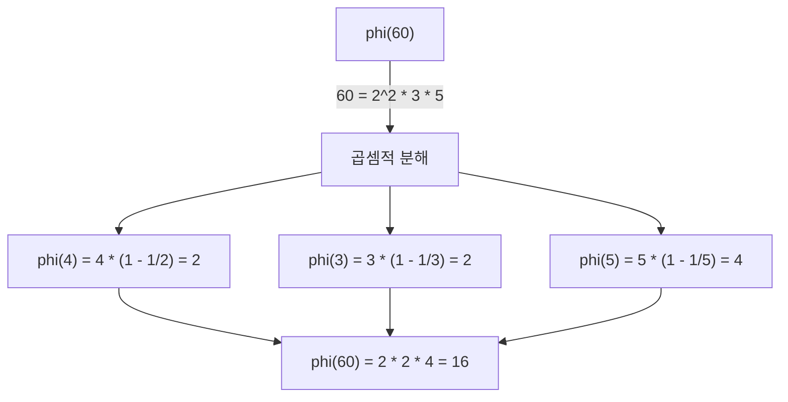
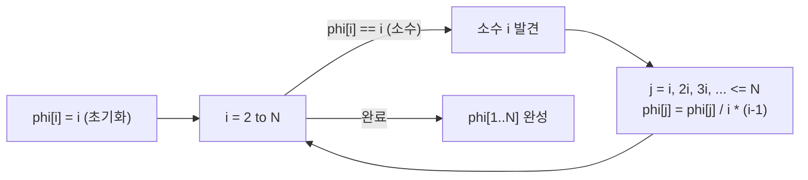

## 정의

**Euler Phi Function** φ(n) 은 1 이상 n 이하 정수 중 n 과 **서로소 (gcd = 1)** 인 정수의 개수입니다.

```text
φ(n) = |{ k : 1 <= k <= n, gcd(k, n) = 1 }|
```

예시:
- φ(1) = 1 (1은 모든 수와 서로소)
- φ(6) = 2 (1, 5 만 6과 서로소)
- φ(7) = 6 (소수이므로 1~6 모두 서로소)
- φ(12) = 4 (1, 5, 7, 11)

## 핵심 성질

### 소수에서의 값

소수 p 에 대해:

```text
φ(p) = p - 1
```

1 부터 p-1 까지 모두 p 와 서로소이기 때문입니다.

### 소수 거듭제곱

```text
φ(p^k) = p^k - p^(k-1) = p^(k-1) * (p - 1)
```

1 부터 p^k 까지 중 p 의 배수는 p^(k-1) 개이므로, 서로소인 수는 p^k - p^(k-1) 개입니다.

### 곱셈적 함수 (Multiplicative Function)

gcd(a, b) = 1 이면:

```text
φ(ab) = φ(a) * φ(b)
```

이 성질로 소인수분해를 이용한 일반 공식을 유도할 수 있습니다.

### 일반 공식

n = p1^a1 * p2^a2 * ... * pk^ak 이면:

```text
φ(n) = n * Π (1 - 1/pi)   (pi: n 의 서로 다른 소인수)
     = n * (p1-1)/p1 * (p2-1)/p2 * ... * (pk-1)/pk
```

예: φ(12) = φ(2^2 * 3) = 12 * (1 - 1/2) * (1 - 1/3) = 12 * 1/2 * 2/3 = 4

### 오일러 정리 (Euler's Theorem)

gcd(a, n) = 1 이면:

```text
a^φ(n) ≡ 1 (mod n)
```

[[flt|페르마 소정리]] 의 일반화입니다. 소수 p 에서 φ(p) = p-1 이므로 a^(p-1) ≡ 1 (mod p) 가 됩니다.

### 합 공식

```text
Σ_{d | n} φ(d) = n
```

n 의 모든 약수 d 에 대한 φ(d) 의 합은 n 입니다.

## 시각화

φ(n) 의 곱셈적 분해 과정 (n = 60 = 2^2 * 3 * 5):



1 부터 60 까지 60 과 서로소인 수는 16 개입니다.

[[sieve|에라토스테네스의 체]] 방식으로 1 부터 N 까지 φ 를 일괄 계산하는 흐름:



## 알고리즘

### 단일 n 에 대한 φ(n)

[[prime-factorization|소인수분해]] 를 이용합니다. O(sqrt(n)).

```text
euler_phi(n):
    result = n
    p = 2
    while p * p <= n:
        if n % p == 0:
            while n % p == 0:
                n /= p
            result = result / p * (p - 1)   // 정수 나눗셈 순서 주의
        p += 1
    if n > 1:
        result = result / n * (n - 1)       // n 이 소수
    return result
```

### 1 부터 N 까지 일괄 계산 (시브)

[[sieve|에라토스테네스의 체]] 변형. O(N log log N).

```text
euler_sieve(N):
    phi[1] = 1
    for i in 2..N:
        phi[i] = i
    for i in 2..N:
        if phi[i] == i:   // i 가 소수 (아직 변경 안 됨)
            for j in i, 2i, 3i, ..., N:
                phi[j] = phi[j] / i * (i - 1)
    return phi
```

### 선형 시브 (Linear Sieve)

O(N). 각 합성수를 정확히 한 번만 처리합니다.

```text
linear_sieve_phi(N):
    phi[1] = 1
    primes = []
    for i in 2..N:
        if not composite[i]:
            primes.append(i)
            phi[i] = i - 1
        for p in primes:
            if i * p > N: break
            composite[i * p] = true
            if i % p == 0:
                phi[i * p] = phi[i] * p       // p^2 | i*p
                break
            else:
                phi[i * p] = phi[i] * (p - 1) // gcd(i, p) = 1
    return phi
```

## 구현

<CodeWithOutput
  variants={[
    {
      language: "cpp",
      label: "C++",
      code: `// Euler Phi: 단일 값 + 시브
#include <bits/stdc++.h>
using namespace std;
typedef long long ll;

// 단일 n 에 대한 phi(n), O(sqrt(n))
ll euler_phi(ll n) {
    ll result = n;
    for (ll p = 2; p * p <= n; p++) {
        if (n % p == 0) {
            while (n % p == 0) n /= p;
            result = result / p * (p - 1);
        }
    }
    if (n > 1) result = result / n * (n - 1);
    return result;
}

// 1..N 시브, O(N log log N)
vector<int> euler_sieve(int N) {
    vector<int> phi(N + 1);
    iota(phi.begin(), phi.end(), 0);  // phi[i] = i
    for (int i = 2; i <= N; i++) {
        if (phi[i] == i) {  // i 가 소수
            for (int j = i; j <= N; j += i) {
                phi[j] = phi[j] / i * (i - 1);
            }
        }
    }
    return phi;
}

int main() {
    ios::sync_with_stdio(0); cin.tie(0);
    int t; cin >> t;
    while (t--) {
        ll n; cin >> n;
        cout << euler_phi(n) << "\\n";
    }
}`,
    },
    {
      language: "python",
      label: "Python",
      code: `# Euler Phi: 단일 값 + 시브
import sys
input = sys.stdin.readline

def euler_phi(n):
    """단일 n 에 대한 phi(n), O(sqrt(n))"""
    result = n
    p = 2
    while p * p <= n:
        if n % p == 0:
            while n % p == 0:
                n //= p
            result = result // p * (p - 1)
        p += 1
    if n > 1:
        result = result // n * (n - 1)
    return result

def euler_sieve(N):
    """1..N 시브, O(N log log N)"""
    phi = list(range(N + 1))
    for i in range(2, N + 1):
        if phi[i] == i:  # i 가 소수
            for j in range(i, N + 1, i):
                phi[j] = phi[j] // i * (i - 1)
    return phi

t = int(input())
for _ in range(t):
    n = int(input())
    print(euler_phi(n))`,
    },
    {
      language: "java",
      label: "Java",
      code: `// Euler Phi: 단일 값 + 시브
import java.util.*;
import java.io.*;

public class Main {
    static long eulerPhi(long n) {
        long result = n;
        for (long p = 2; p * p <= n; p++) {
            if (n % p == 0) {
                while (n % p == 0) n /= p;
                result = result / p * (p - 1);
            }
        }
        if (n > 1) result = result / n * (n - 1);
        return result;
    }

    static int[] eulerSieve(int N) {
        int[] phi = new int[N + 1];
        for (int i = 0; i <= N; i++) phi[i] = i;
        for (int i = 2; i <= N; i++) {
            if (phi[i] == i) {  // i 가 소수
                for (int j = i; j <= N; j += i) {
                    phi[j] = phi[j] / i * (i - 1);
                }
            }
        }
        return phi;
    }

    public static void main(String[] args) throws IOException {
        BufferedReader br = new BufferedReader(new InputStreamReader(System.in));
        int t = Integer.parseInt(br.readLine());
        StringBuilder sb = new StringBuilder();
        while (t-- > 0) {
            long n = Long.parseLong(br.readLine());
            sb.append(eulerPhi(n)).append('\\n');
        }
        System.out.print(sb);
    }
}`,
    },
  ]}
  cases={[
    {
      label: "기본",
      input: `5
1
6
7
12
60`,
      output: `1
2
6
4
16`,
    },
  ]}
/>

## 복잡도

| 항목 | 값 |
|:---|:---|
| **단일 φ(n)** | O(sqrt(n)) |
| **시브 φ(1..N)** | O(N log log N) |
| **선형 시브 φ(1..N)** | O(N) |
| **공간** | O(N) (시브) |

## 응용

### 모듈러 역원

[[modular-multiplicative-inverse|모듈러 역원]] 계산: gcd(a, n) = 1 이면 a^(φ(n)-1) ≡ a^(-1) (mod n).

n 이 소수이면 φ(n) = n-1 이므로 a^(n-2) mod n 으로 계산합니다.

### 이산 로그 / 지수 주기

[[discrete-log|이산 로그]] 에서 지수의 주기가 φ(n) 의 약수임을 이용합니다.

### 오일러 정리 응용

a^b mod n 에서 b 가 매우 클 때: b >= φ(n) 이면 a^b ≡ a^(b mod φ(n) + φ(n)) (mod n).

### 곱셈적 함수 시브

φ 는 곱셈적 함수이므로 [[sieve|선형 시브]] 로 O(N) 에 계산 가능합니다. 다른 곱셈적 함수 (약수 개수, 약수 합 등) 도 같은 방식으로 계산합니다.

## 함정

> [!WARNING]
> 구현 시 자주 발생하는 실수들.

### 1. 정수 나눗셈 순서

`result = result / p * (p - 1)` 에서 `/p` 를 먼저 해야 합니다. `result * (p-1) / p` 로 하면 중간 값이 오버플로우할 수 있습니다.

### 2. 시브에서 소수 판별

`phi[i] == i` 조건으로 소수를 판별합니다. 초기화 시 `phi[i] = i` 로 설정하고, 소수의 배수를 처리할 때만 값이 바뀝니다.

### 3. n = 1 처리

φ(1) = 1 입니다. 단일 계산 함수에서 루프 후 `n > 1` 체크가 없으면 φ(1) = 0 이 됩니다.

### 4. 오일러 정리 조건

a^φ(n) ≡ 1 (mod n) 은 **gcd(a, n) = 1** 일 때만 성립합니다. gcd(a, n) > 1 이면 성립하지 않습니다.

### 5. 큰 지수 계산

a^b mod n 에서 b >= φ(n) 일 때 b mod φ(n) 으로 줄이는 공식은 gcd(a, n) = 1 일 때만 정확합니다. gcd(a, n) > 1 이면 별도 처리가 필요합니다.

## BOJ 연습 문제

| 번호 | 제목 | 설명 |
|:---|:---|:---|
| BOJ 11712 | 오일러 피 함수 | φ(n) 직접 계산 |
| BOJ 17646 | 소수의 개수와 소인수분해 | 시브 + 소인수분해 |
| BOJ 1837 | 암호제작 | 서로소 조건 활용 |

## 관련 위키

- [[euler-phi|오일러 피 함수 (본 위키)]]
- [[flt|페르마 소정리]]
- [[sieve|에라토스테네스의 체]]
- [[prime-factorization|소인수분해]]
- [[modular-arithmetic|모듈러 산술]]
- [[modular-multiplicative-inverse|모듈러 역원]]
- [[carmichael-function|카마이클 함수]]
