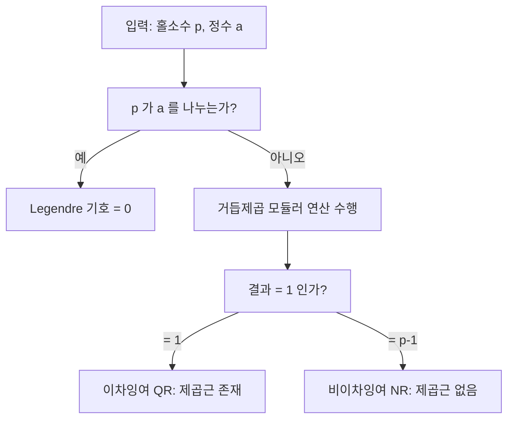

## 정의

홀소수 p에 대해 정수 a가 mod p에서 **이차잉여 (Quadratic Residue, QR)** 인지 판정하는 기준:

$$
a^{(p-1)/2} \equiv \begin{cases} 1 \pmod{p} & \text{a가 mod p의 이차잉여} \\ -1 \pmod{p} & \text{a가 mod p의 비이차잉여} \end{cases}
$$

**Legendre 기호** $(a/p)$는 위 결과를 -1, 0, 1로 인코딩:

$$
\left(\frac{a}{p}\right) = \begin{cases} 0 & p \mid a \\ 1 & a \text{ is QR mod } p \\ -1 & a \text{ is NR mod } p \end{cases}
$$

## 문제 상황

이차잉여 판정이 필요한 상황:

- **제곱근 mod p 계산**: $x^2 \equiv a \pmod{p}$ 의 해 존재 여부 먼저 확인
- **Tonelli-Shanks 알고리즘**: QR 여부 판정 후 실제 제곱근 계산
- **Solovay-Strassen 소수 판정**: Euler's criterion을 합성수 판별에 활용
- **이차 상호 법칙**: Legendre 기호 계산 및 이차 방정식 mod p 풀이

## 시각화



## 핵심 아이디어

### 증명

[[flt|Fermat's Little Theorem]]: $a^{p-1} \equiv 1 \pmod{p}$ (단, $p \nmid a$).

따라서 $\left(a^{(p-1)/2}\right)^2 \equiv 1 \pmod{p}$, 즉 $a^{(p-1)/2} \equiv \pm 1 \pmod{p}$.

**QR 방향**: $a \equiv b^2 \pmod{p}$ 이면

$$
a^{(p-1)/2} \equiv b^{p-1} \equiv 1 \pmod{p}
$$

**NR 방향**: $\mathbb{Z}_p^*$는 순환군 (원시근 g 존재). $a = g^k$로 쓰면:

- k가 짝수: $a = (g^{k/2})^2$ 이므로 QR, $a^{(p-1)/2} \equiv 1$
- k가 홀수: NR, $g^{(p-1)/2} \equiv -1$ (원시근 성질)이므로 $a^{(p-1)/2} \equiv -1$

### p=7 구체 예시

p=7에서 $(p-1)/2 = 3$. 각 a에 대해 $a^3 \bmod 7$ 계산:

| a | $a^3 \bmod 7$ | Legendre $(a/7)$ | 판정 |
|:---|:---|:---|:---|
| 1 | 1 | 1 | QR ($1^2 \equiv 1$) |
| 2 | 1 | 1 | QR ($3^2 \equiv 2$) |
| 3 | 6 | -1 | NR |
| 4 | 1 | 1 | QR ($2^2 \equiv 4$) |
| 5 | 6 | -1 | NR |
| 6 | 6 | -1 | NR |

p=7에서 QR: {1, 2, 4}, NR: {3, 5, 6}. QR 개수 = NR 개수 = (p-1)/2 = 3.

### Legendre 기호 성질

$$
\left(\frac{ab}{p}\right) = \left(\frac{a}{p}\right)\left(\frac{b}{p}\right)
$$

- QR × QR = QR
- QR × NR = NR
- NR × NR = QR

## 알고리즘

```text
# Euler's Criterion: a가 mod p의 이차잉여인지 판정
function legendre(a, p):
    a = a mod p
    if a == 0: return 0          # Legendre 기호 = 0
    result = pow(a, (p-1)//2, p)
    if result == 1: return 1     # QR
    else: return -1              # NR (result == p-1)
```

핵심: `pow(a, (p-1)//2, p)` 는 빠른 거듭제곱으로 O(log p).

## 구현

<CodeWithOutput
  variants={[
    {
      language: "cpp",
      label: "C++",
      code: `#include <bits/stdc++.h>
using namespace std;
typedef long long ll;

// 빠른 거듭제곱 (모듈러)
ll power(ll base, ll exp, ll mod) {
    ll result = 1;
    base %= mod;
    while (exp > 0) {
        if (exp & 1) result = result * base % mod;
        base = base * base % mod;
        exp >>= 1;
    }
    return result;
}

// Euler's Criterion: Legendre 기호 반환 (-1, 0, 1)
int legendre(ll a, ll p) {
    a %= p;
    if (a < 0) a += p;
    if (a == 0) return 0;
    ll val = power(a, (p - 1) / 2, p);
    return (val == 1) ? 1 : -1;
}

int main() {
    ios::sync_with_stdio(false);
    cin.tie(nullptr);

    ll a, p;
    cin >> a >> p;

    int result = legendre(a, p);
    if (result == 0)
        cout << a << " is divisible by " << p << "\\n";
    else if (result == 1)
        cout << a << " is a quadratic residue mod " << p << "\\n";
    else
        cout << a << " is a non-residue mod " << p << "\\n";

    return 0;
}`,
    },
    {
      language: "python",
      label: "Python",
      code: `def legendre(a, p):
    """Euler's Criterion: Legendre 기호 반환 (-1, 0, 1)"""
    a %= p
    if a == 0:
        return 0
    val = pow(a, (p - 1) // 2, p)
    return 1 if val == 1 else -1

def main():
    a, p = map(int, input().split())
    result = legendre(a, p)
    if result == 0:
        print(f"{a} is divisible by {p}")
    elif result == 1:
        print(f"{a} is a quadratic residue mod {p}")
    else:
        print(f"{a} is a non-residue mod {p}")

main()`,
    },
  ]}
  cases={[
    {
      label: "p=7, a=2 (QR)",
      input: `2 7`,
      output: `2 is a quadratic residue mod 7`,
    },
    {
      label: "p=7, a=3 (NR)",
      input: `3 7`,
      output: `3 is a non-residue mod 7`,
    },
    {
      label: "p=7, a=7 (0)",
      input: `7 7`,
      output: `7 is divisible by 7`,
    },
  ]}
/>

## 복잡도

| 항목 | 값 |
|:---|:---|
| **시간** | O(log p) |
| **공간** | O(1) |
| **핵심 연산** | 빠른 거듭제곱 (모듈러 지수) |

## 응용

### 1. Tonelli-Shanks 알고리즘

$x^2 \equiv a \pmod{p}$ 의 실제 해를 구하는 알고리즘. Euler's criterion으로 QR 여부 먼저 확인 후 실행.

[[discrete-sqrt|Tonelli-Shanks]] 참조.

### 2. Solovay-Strassen 소수 판정

합성수 n에 대해 $a^{(n-1)/2} \not\equiv (a/n) \pmod{n}$ 인 a가 존재하면 n은 합성수. 확률적 소수 판정에 활용.

### 3. Jacobi 기호 (일반화)

Legendre 기호를 홀수 합성수 n으로 확장:

$$
\left(\frac{a}{n}\right) = \prod_{i} \left(\frac{a}{p_i}\right)^{e_i} \quad (n = \prod p_i^{e_i})
$$

Jacobi 기호가 -1이면 반드시 NR. 1이면 QR이거나 합성수.

### 4. 이차 방정식 mod p

$ax^2 + bx + c \equiv 0 \pmod{p}$ 의 판별식 $\Delta = b^2 - 4ac$:

- $(\Delta/p) = 1$: 두 해 존재
- $(\Delta/p) = 0$: 중근
- $(\Delta/p) = -1$: 해 없음

## 함정

### 1. p가 소수가 아닌 경우

Euler's criterion은 **홀소수 p에서만** 성립. 합성수에서는 Jacobi 기호를 사용.

> [!WARNING]
> p가 합성수일 때 $a^{(p-1)/2} \equiv 1 \pmod{p}$ 이어도 QR이 아닐 수 있음.

### 2. a=0 처리 누락

$p \mid a$ 이면 Legendre 기호 = 0. 이 경우를 별도 처리하지 않으면 오답.

### 3. 결과 p-1과 -1 혼동

`pow(a, (p-1)/2, p)` 의 결과가 `p-1`이면 이는 $-1 \pmod{p}$. NR 판정.

### 4. 정수 오버플로

C++에서 `a * a % p` 계산 시 `a`가 `int` 범위이면 `a * a`가 오버플로. `long long` 사용 필수.

### 5. 음수 a 처리

a가 음수이면 `a %= p` 후 음수가 될 수 있음. `if (a < 0) a += p;` 추가 필요.

## BOJ 연습 문제

| 번호 | 제목 | 관련 개념 |
|:---|:---|:---|
| BOJ 11401 | 이항 계수 3 | 모듈러 역원 (FLT 응용) |
| BOJ 13977 | 이항 계수와 쿼리 | 모듈러 지수 |
| BOJ 17831 | 이차잉여 | Euler's criterion 직접 적용 |

## 관련 위키

- [[flt|Fermat's Little Theorem]]
- [[discrete-sqrt|Tonelli-Shanks]]
- [[quadratic-residue|Quadratic Residue]]
