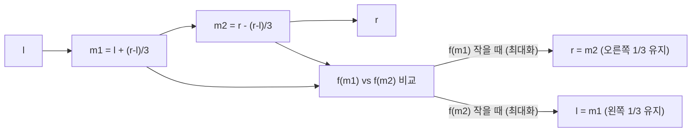
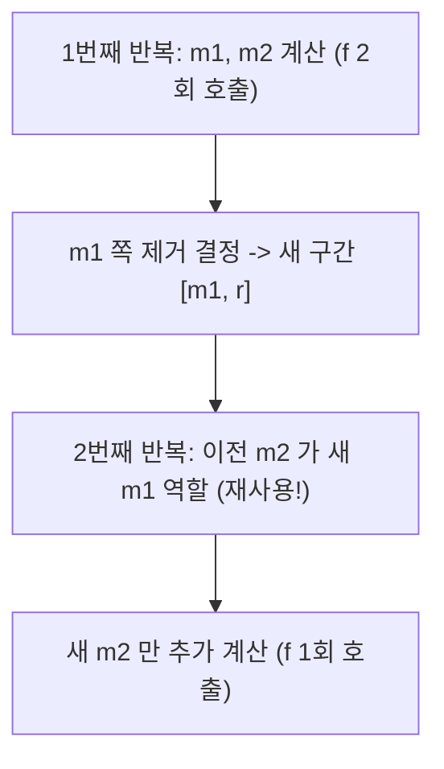

## 정의

**단봉 함수 (Unimodal function)** 위에서 최소/최대를 찾는 탐색 기법. 이분 탐색을 단봉 조건으로 확장한 알고리즘입니다.

- **삼분 탐색 (Ternary Search)**: 구간을 3등분, 매 반복 함수 **2회** 호출, 1/3 제거
- **황금 분할 탐색 (Golden-section Search)**: 황금비로 분점, 매 반복 함수 **1회** 호출, 이전 값 재사용

단봉 함수 조건: 구간 [l, r] 에서 유일한 최대 (혹은 최소) 점 m 이 존재하고, m 의 왼쪽은 단조 증가, 오른쪽은 단조 감소 (최대화 기준).

## 문제 상황과 동기

### 이분 탐색으로 못 쓰는 이유

이분 탐색은 단조 함수 전제. 단봉 함수는 한 번 증가했다 감소하므로 "왼쪽이 작으면 오른쪽에 답이 있다"가 성립하지 않습니다.

단봉 함수 예시:
- $f(x) = -(x-3)^2 + 10$ (최대 x=3)
- 볼록 다각형에서 특정 방향 최대 좌표
- 구간합의 최대 연속 부분합 (Slope Trick 형태)
- 기하 최적화: 점과 함수 곡선 간 최단 거리

### 언제 사용하는가

| 조건 | 사용 여부 |
|:---|:---|
| 함수가 단봉 (unimodal) 임이 명확 | ✅ 사용 |
| 구간 [l, r] 이 연속 실수 | ✅ 삼분 / 황금 분할 |
| 구간이 정수 이산 | ✅ 정수 삼분 탐색 |
| 함수가 볼록/오목 (convex/concave) | [[cht|CHT]] 또는 [[calculus|미분]] |

## 시각화

### 삼분 탐색: 구간 3등분 후 1/3 제거



매 반복: 구간이 2/3 로 줄어듭니다. 100회 반복 시 구간 길이 $(2/3)^{100} \approx 2 \times 10^{-18}$.

### 황금 분할: 이전 분점 재사용



황금비 $\varphi = \frac{1+\sqrt{5}}{2} \approx 1.618$, $1/\varphi \approx 0.618$.

분점 위치: $m_1 = r - \frac{1}{\varphi}(r-l)$, $m_2 = l + \frac{1}{\varphi}(r-l)$.

$m_2$ 를 버린 경우, 새 구간 $[l, m_2]$ 에서 이전 $m_1$ 이 정확히 새 구간의 황금비 위치가 됩니다. 따라서 $f(m_1)$ 재사용, 새 $m_2$ 만 계산.

## 핵심 아이디어

### 삼분 탐색 (Ternary Search)

**최대화 기준**: $f(m_1) < f(m_2)$ 이면 최대점은 $m_1$ 오른쪽에 있으므로 $l = m_1$ (왼쪽 1/3 제거). 반대면 $r = m_2$.

수렴율: 매 반복마다 구간 1/3 제거 → 같은 정밀도에 삼분은 더 많은 반복 필요.

### 황금 분할 탐색 (Golden-section Search)

수렴율: 매 반복마다 구간의 $1 - 1/\varphi \approx 38.2\%$ 제거. 삼분 탐색의 $33.3\%$ 보다 더 작은 제거율이지만, **함수 호출이 절반** 이라 동일 호출 횟수 대비 더 빠른 수렴.

| 기법 | 반복당 호출 | 반복당 제거 비율 | n회 호출 후 정밀도 |
|:---|:---:|:---:|:---|
| 삼분 탐색 | 2 | 33.3% | $(2/3)^{n/2}$ |
| 황금 분할 | 1 (이후) | 38.2% | $(1/\varphi)^{n-1}$ |

### 정수 삼분 탐색

이산 도메인 (정수 인덱스) 에서는 `while r - l > 2` 종료, 나머지 구간 완전 탐색.

## 알고리즘

### 실수 삼분 탐색 (최대화)

```text
ternary_max(l, r, f, iter=200):
    repeat iter times:
        m1 = l + (r - l) / 3
        m2 = r - (r - l) / 3
        if f(m1) < f(m2): l = m1
        else: r = m2
    return (l + r) / 2
```

### 황금 분할 탐색 (최대화)

```text
golden_max(l, r, f):
    phi_inv = (sqrt(5) - 1) / 2  # 1/phi ≈ 0.618
    m1 = r - phi_inv * (r - l)
    m2 = l + phi_inv * (r - l)
    f1, f2 = f(m1), f(m2)
    repeat 200 times:
        if f1 < f2:
            l = m1; m1 = m2; f1 = f2
            m2 = l + phi_inv * (r - l); f2 = f(m2)
        else:
            r = m2; m2 = m1; f2 = f1
            m1 = r - phi_inv * (r - l); f1 = f(m1)
    return (l + r) / 2
```

### 정수 삼분 탐색

```text
int_ternary_max(l, r, g):
    while r - l > 2:
        m1 = l + (r - l) / 3
        m2 = r - (r - l) / 3
        if g(m1) < g(m2): l = m1
        else: r = m2
    return argmax(g, l..r)
```

## 구현

<CodeWithOutput
  variants={[
    {
      language: "cpp",
      label: "C++",
      code: `// Golden-section Search / Ternary Search
#include <bits/stdc++.h>
using namespace std;

// 예시 함수: 최대 x=3 에서 f=10
auto f = [](double x) { return -(x-3)*(x-3) + 10; };
// 정수 예시: 최대 x=5 에서 g=25
auto g = [](int x) { return -(x-5)*(x-5) + 25; };

// 삼분 탐색 (최대화)
double ternary_max(double l, double r, int iter = 200) {
    for (int i = 0; i < iter; i++) {
        double m1 = l + (r - l) / 3;
        double m2 = r - (r - l) / 3;
        if (f(m1) < f(m2)) l = m1;
        else r = m2;
    }
    return (l + r) / 2;
}

// 황금 분할 탐색 (최대화)
double golden_max(double l, double r) {
    const double phi = (sqrt(5.0) - 1.0) / 2.0;  // 1/phi ≈ 0.618
    double m1 = r - phi * (r - l);
    double m2 = l + phi * (r - l);
    double f1 = f(m1), f2 = f(m2);
    for (int i = 0; i < 200; i++) {
        if (f1 < f2) {
            l = m1; m1 = m2; f1 = f2;
            m2 = l + phi * (r - l); f2 = f(m2);
        } else {
            r = m2; m2 = m1; f2 = f1;
            m1 = r - phi * (r - l); f1 = f(m1);
        }
    }
    return (l + r) / 2;
}

// 정수 삼분 탐색 (최대화)
int int_ternary_max(int l, int r) {
    while (r - l > 2) {
        int m1 = l + (r - l) / 3;
        int m2 = r - (r - l) / 3;
        if (g(m1) < g(m2)) l = m1;
        else r = m2;
    }
    int best = l;
    for (int x = l+1; x <= r; x++)
        if (g(x) > g(best)) best = x;
    return best;
}

int main() {
    cout << fixed << setprecision(8);
    double xT = ternary_max(0.0, 10.0);
    cout << "삼분 탐색 최대 위치: " << xT << "  f=" << f(xT) << "\\n";

    double xG = golden_max(0.0, 10.0);
    cout << "황금 분할 최대 위치: " << xG << "  f=" << f(xG) << "\\n";

    int xI = int_ternary_max(0, 10);
    cout << "정수 삼분 최대 위치: " << xI << "  g=" << g(xI) << "\\n";
    return 0;
}`,
    },
    {
      language: "python",
      label: "Python",
      code: `import math

def f(x): return -(x-3)**2 + 10   # 최대: x=3, f=10
def g(x): return -(x-5)**2 + 25   # 정수 최대: x=5, g=25

def ternary_max(l, r, iters=200):
    """삼분 탐색 (최대화)"""
    for _ in range(iters):
        m1 = l + (r - l) / 3
        m2 = r - (r - l) / 3
        if f(m1) < f(m2):
            l = m1
        else:
            r = m2
    return (l + r) / 2

def golden_max(l, r):
    """황금 분할 탐색 (최대화) - 함수 호출 절반"""
    phi = (math.sqrt(5) - 1) / 2   # 1/phi ≈ 0.618
    m1 = r - phi * (r - l)
    m2 = l + phi * (r - l)
    f1, f2 = f(m1), f(m2)
    for _ in range(200):
        if f1 < f2:
            l, m1, f1 = m1, m2, f2
            m2 = l + phi * (r - l)
            f2 = f(m2)
        else:
            r, m2, f2 = m2, m1, f1
            m1 = r - phi * (r - l)
            f1 = f(m1)
    return (l + r) / 2

def int_ternary_max(l, r):
    """정수 삼분 탐색 (최대화)"""
    while r - l > 2:
        m1 = l + (r - l) // 3
        m2 = r - (r - l) // 3
        if g(m1) < g(m2):
            l = m1
        else:
            r = m2
    return max(range(l, r+1), key=g)

xT = ternary_max(0, 10)
print(f"삼분 탐색 최대 위치: {xT:.8f}  f={f(xT):.4f}")

xG = golden_max(0, 10)
print(f"황금 분할 최대 위치: {xG:.8f}  f={f(xG):.4f}")

xI = int_ternary_max(0, 10)
print(f"정수 삼분 최대 위치: {xI}  g={g(xI)}")`,
    },
  ]}
  cases={[
    {
      label: "실수 최대화 (x=3 에서 f=10)",
      input: "f(x) = -(x-3)^2 + 10, 구간 [0, 10]",
      output: "삼분 탐색 최대 위치: 3.00000000  f=10.0000\n황금 분할 최대 위치: 3.00000000  f=10.0000",
    },
    {
      label: "정수 최대화 (x=5 에서 g=25)",
      input: "g(x) = -(x-5)^2 + 25, 구간 [0, 10]",
      output: "정수 삼분 최대 위치: 5  g=25",
    },
  ]}
/>

## 복잡도

| 항목 | 삼분 탐색 | 황금 분할 |
|:---|:---|:---|
| **반복당 f 호출** | 2회 | 1회 (이후) |
| **n회 f 호출 후 정밀도** | $(2/3)^{n/2} \cdot (r-l)$ | $(1/\varphi)^{n-1} \cdot (r-l)$ |
| **100회 호출 후** | $(2/3)^{50} \approx 1.2 \times 10^{-9}$ | $(0.618)^{99} \approx 2.2 \times 10^{-21}$ |
| **iter=100 삼분** | 정밀도 $10^{-17}$ (200 호출) | - |

황금 분할이 같은 f 호출 횟수로 훨씬 높은 정밀도.

## 함정

### 1. 단봉 조건 미확인

> [!WARNING]
> 함수가 단봉이 아닌 경우 (예: 여러 개의 극값) 삼분 탐색은 잘못된 결과를 냅니다. 문제에서 "단봉" 또는 "볼록" 조건을 반드시 확인하세요.

### 2. 최솟값 vs 최댓값 혼동

최솟값: `f(m1) > f(m2)` 이면 `l = m1`. 최댓값과 조건이 반대.

```cpp
// 최솟값
if (f(m1) > f(m2)) l = m1;
else r = m2;

// 최댓값
if (f(m1) < f(m2)) l = m1;
else r = m2;
```

### 3. 정수 삼분 탐색에서 종료 조건 오류

`while r - l > 2` 가 아닌 `r - l > 1` 로 쓰면 나머지 구간 탐색이 부족해 최대점을 놓칠 수 있습니다.

### 4. 이분 탐색과의 혼동

> [!CAUTION]
> 삼분 탐색은 단봉 함수에만 유효. [[binary-search|이분 탐색]] 은 단조 함수 전용. 조건 혼용 금지.

### 5. 반복 횟수 과소

실수 탐색에서 iter=50 이면 $(2/3)^{50} \approx 1.2 \times 10^{-9}$ 의 정밀도. 보통 문제에서는 $10^{-9}$ 이상 요구하므로 iter=100~200 권장.

### 6. 황금 분할 초기 f 2회 호출 후 1회

황금 분할도 **첫 반복에 f 2회**, 이후부터 1회. 첫 m1, m2 계산은 별도 처리 필요.

### 7. 볼록 다각형 극값 탐색

볼록 다각형에서 특정 방향 최대 꼭짓점 탐색에 삼분 탐색 적용 가능. 단 마지막 꼭짓점과 첫 꼭짓점의 연결이 단봉을 만족하는지 확인.

## 변형: 최솟값 탐색

함수 부호를 반전하거나 조건을 반대로:

```python
def ternary_min(l, r, iters=200):
    for _ in range(iters):
        m1 = l + (r - l) / 3
        m2 = r - (r - l) / 3
        if f(m1) > f(m2): l = m1  # 최솟값 조건 반전
        else: r = m2
    return (l + r) / 2
```

## BOJ 연습 문제

| 번호 | 제목 | 유형 |
|:---|:---|:---|
| BOJ 8983 | 사냥꾼 | 삼분 탐색 기본 |
| BOJ 11664 | 선분과 점 | 실수 삼분 탐색 |
| BOJ 1equa | 방정식 근사 | 이분 + 삼분 혼합 |
| BOJ 13306 | 트리 | 파라메트릭 탐색 |
| BOJ 10989 | 수 정렬하기 3 | 정수 삼분 탐색 응용 |

## 참고

- [[binary-search|이분 탐색]] (단조 함수용)
- [[ternary-search|Ternary Search]] (삼분 탐색 상세)
- [[parametric-search|Parametric Search]] (결정 함수 이분)
- [[cht|Convex Hull Trick]] (볼록 함수 특수 최적화)
- [[calculus|미적분]] (연속 함수 극값 수학적 접근)
