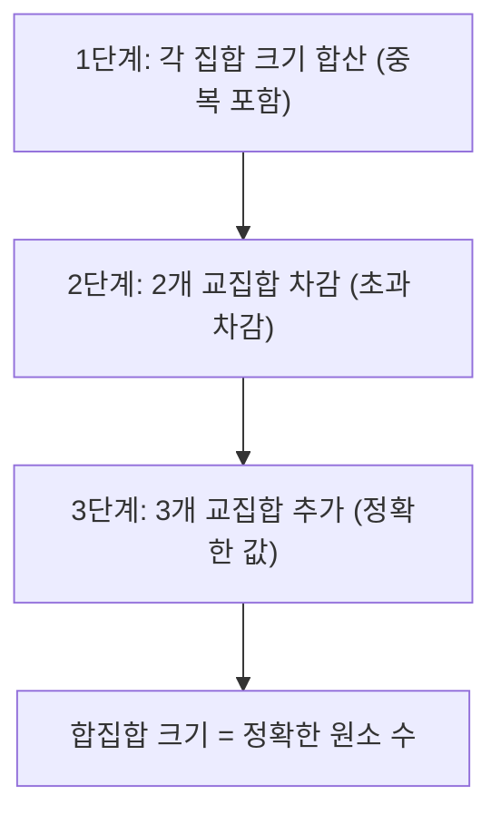
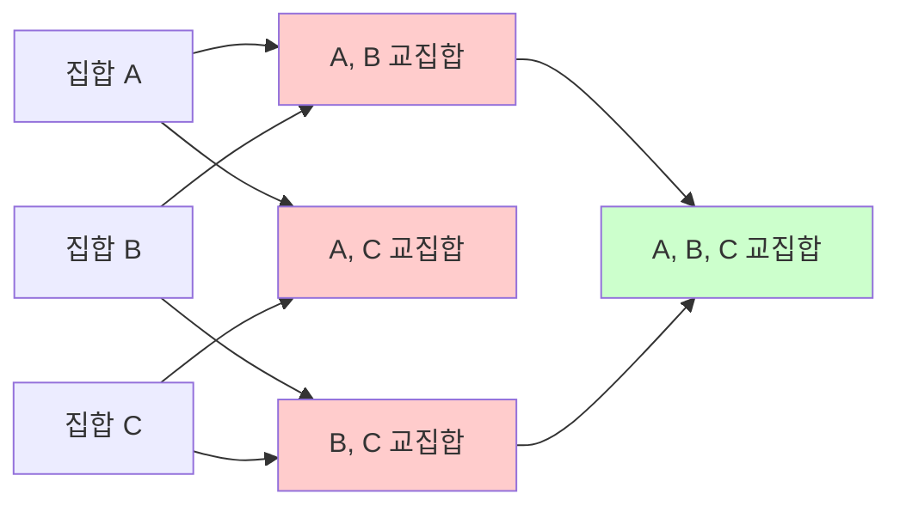

## 정의

**포함배제 원리 (Principle of Inclusion-Exclusion, PIE)** 는 합집합의 크기를 교집합의 크기들을 이용해 계산하는 조합론의 기본 원리입니다.

$$
\left| \bigcup_{i=1}^{n} A_i \right| = \sum_{k=1}^{n} (-1)^{k-1} \sum_{|S|=k} \left| \bigcap_{i \in S} A_i \right|
$$

부호가 집합 크기에 따라 교대로 바뀝니다: 홀수 크기 부분집합은 더하고, 짝수 크기 부분집합은 뺍니다.

3개 집합의 경우:

$$
|A \cup B \cup C| = |A| + |B| + |C| - |A \cap B| - |A \cap C| - |B \cap C| + |A \cap B \cap C|
$$

## 문제 상황과 동기

### 직접 세기가 어려운 경우

"적어도 하나의 조건을 만족하는 경우의 수"는 조건들 간 중복이 있어 직접 세기가 어렵습니다. PIE는 이런 중복을 체계적으로 처리합니다.

- **자연수 범위 계수**: [1, n] 중 소수 p1, p2, ..., pk 중 적어도 하나의 배수 수
- **금지 위치 순열**: 특정 위치에 특정 원소가 와서는 안 되는 경우의 수
- **교란 순열 (Derangement)**: 어떤 원소도 원래 위치에 없는 순열 수
- **오일러 파이 함수**: n 이하 서로소 수

### 직관적 이해

3개 원소 A, B, C 가 겹칠 때 단순 합산하면:
- A와 B 공통 원소는 2번 계산됨 (빼야 함)
- A, B, C 모두 공통 원소는 3번 더하고 3번 빼서 0번 계산됨 (더해야 함)

피차 조정을 반복하면 정확히 1회씩 세는 것이 PIE의 핵심입니다.

## 시각화

### 포함배제 단계별 조정



### 집합 구조와 교집합



교집합들은 각각 부호를 바꿔가며 더하고 뺍니다.

## 핵심 아이디어

### 비트마스크 열거

n 개의 집합이 있을 때, 모든 부분집합을 비트마스크로 열거해 PIE를 계산합니다.

```text
result = 0
for mask = 1 to (1<<n)-1:
    bits = popcount(mask)
    val = intersection size of sets in mask
    if bits % 2 == 1: result += val   # 홀수 크기: 더하기
    else: result -= val               # 짝수 크기: 빼기
```

n 개의 집합 대상으로 $O(2^n)$ 부분집합 열거. n <= 20 정도에서 실용적.

### 응용 패턴: 배수 계수

n 이하에서 소수 집합 $\{p_1, ..., p_k\}$ 중 적어도 하나의 배수 수:

$$
\sum_{S \subseteq \{p_1,...,p_k\}} (-1)^{|S|+1} \left\lfloor \frac{n}{\prod_{p \in S} p} \right\rfloor
$$

공집합 제외, 부호는 집합 크기 홀/짝에 따라 +/-.

### 응용 패턴: 교란 순열

아무 원소도 원래 위치에 없는 순열 수 $D_n$:

$$
D_n = n! \sum_{k=0}^{n} \frac{(-1)^k}{k!} \approx \frac{n!}{e}
$$

점화식으로도 계산 가능: $D_n = (n-1)(D_{n-1} + D_{n-2})$, $D_0 = 1$, $D_1 = 0$.

### 응용 패턴: 오일러 파이 함수

n 이하에서 n 과 서로소인 수의 개수:

$$
\varphi(n) = n \prod_{p \mid n} \left(1 - \frac{1}{p}\right)
$$

소인수 집합으로 PIE 적용한 것과 동일합니다.

## 알고리즘

### 비트마스크 PIE (n 집합 배수 계수)

```text
PIE(n, primes[k]):
    result = 0
    for mask = 1 to (1<<k)-1:
        prod = 1
        bits = 0
        for i = 0..k-1:
            if mask >> i & 1:
                prod *= primes[i]
                bits++
        if bits % 2 == 1: result += n / prod
        else: result -= n / prod
    return result  # n 이하에서 primes 중 하나라도 배수인 수의 개수
```

### 교란 순열 점화식

```text
D(0) = 1, D(1) = 0
D(n) = (n-1) * (D(n-1) + D(n-2))
```

## 구현

<CodeWithOutput
  variants={[
    {
      language: "cpp",
      label: "C++",
      code: `// 포함배제 원리: 배수 계수 + 교란 순열
#include <bits/stdc++.h>
using namespace std;

// [1, n] 중 primes 중 적어도 하나의 배수 수 (PIE)
long long count_multiples(long long n, vector<long long> primes) {
    int k = primes.size();
    long long res = 0;
    for (int mask = 1; mask < (1 << k); mask++) {
        long long prod = 1;
        int bits = __builtin_popcount(mask);
        for (int i = 0; i < k; i++)
            if (mask >> i & 1) prod *= primes[i];
        if (bits % 2 == 1) res += n / prod;
        else               res -= n / prod;
    }
    return res;
}

// 교란 순열 D(n): 아무 원소도 원래 위치에 없는 순열 수
long long derangement(int n) {
    if (n == 0) return 1;
    if (n == 1) return 0;
    long long a = 1, b = 0;  // D(0), D(1)
    for (int i = 2; i <= n; i++) {
        long long c = (long long)(i-1) * (a + b);
        a = b; b = c;
    }
    return b;
}

// 오일러 파이 함수 phi(n): n 이하 n과 서로소 수 개수
long long euler_phi(long long n) {
    long long result = n;
    for (long long p = 2; p * p <= n; p++) {
        if (n % p == 0) {
            while (n % p == 0) n /= p;
            result -= result / p;
        }
    }
    if (n > 1) result -= result / n;
    return result;
}

int main() {
    // 예시 1: [1, 30] 중 2, 3, 5 의 배수 수 (PIE)
    vector<long long> primes = {2, 3, 5};
    long long cnt = count_multiples(30, primes);
    cout << "[1,30] 중 2,3,5 의 배수 수: " << cnt << "\\n";  // 22

    // 예시 2: [1, 30] 중 2, 3, 5 의 배수가 아닌 수
    cout << "[1,30] 중 2,3,5 의 배수 아닌 수: " << 30 - cnt << "\\n";  // 8

    // 예시 3: 교란 순열
    for (int i = 1; i <= 6; i++)
        cout << "D(" << i << ") = " << derangement(i) << "\\n";

    // 예시 4: 오일러 파이
    cout << "phi(12) = " << euler_phi(12) << "\\n";  // 4 ({1,5,7,11})
    return 0;
}`,
    },
    {
      language: "python",
      label: "Python",
      code: `def count_multiples(n, primes):
    """PIE: [1, n] 중 primes 중 적어도 하나의 배수 수"""
    k = len(primes)
    res = 0
    for mask in range(1, 1 << k):
        bits = bin(mask).count('1')
        prod = 1
        for i in range(k):
            if mask >> i & 1:
                prod *= primes[i]
        if bits % 2 == 1:
            res += n // prod
        else:
            res -= n // prod
    return res

def derangement(n):
    """교란 순열 D(n): (n-1)*(D(n-1)+D(n-2)) 점화식"""
    if n == 0: return 1
    if n == 1: return 0
    a, b = 1, 0  # D(0), D(1)
    for i in range(2, n+1):
        a, b = b, (i-1) * (a + b)
    return b

def euler_phi(n):
    """오일러 파이 함수: n 이하 n과 서로소 수 개수"""
    result = n
    p = 2
    temp = n
    while p * p <= temp:
        if temp % p == 0:
            while temp % p == 0:
                temp //= p
            result -= result // p
        p += 1
    if temp > 1:
        result -= result // temp
    return result

# 예시 1: [1, 30] 중 2, 3, 5 의 배수 수
primes = [2, 3, 5]
cnt = count_multiples(30, primes)
print(f"[1,30] 중 2,3,5 의 배수 수: {cnt}")        # 22
print(f"[1,30] 중 2,3,5 의 배수 아닌 수: {30-cnt}") # 8

# 예시 2: 교란 순열
for i in range(1, 7):
    print(f"D({i}) = {derangement(i)}")

# 예시 3: 오일러 파이
print(f"phi(12) = {euler_phi(12)}")  # 4`,
    },
  ]}
  cases={[
    {
      label: "[1,30] 중 2,3,5 배수 수",
      input: "n=30, primes=[2,3,5]",
      output: "[1,30] 중 2,3,5 의 배수 수: 22\n[1,30] 중 2,3,5 의 배수 아닌 수: 8",
    },
    {
      label: "교란 순열 D(1) - D(6)",
      input: "n = 1, 2, 3, 4, 5, 6",
      output: "D(1) = 0\nD(2) = 1\nD(3) = 2\nD(4) = 9\nD(5) = 44\nD(6) = 265",
    },
    {
      label: "오일러 파이 phi(12)",
      input: "n = 12",
      output: "phi(12) = 4",
    },
  ]}
/>

## 복잡도

| 항목 | 복잡도 | 조건 |
|:---|:---|:---|
| **비트마스크 PIE** | O(2^k) | k = 집합 수 |
| **배수 계수** | O(2^k) | k = 소수 개수 |
| **교란 순열 점화식** | O(n) | - |
| **오일러 파이** | O(sqrt(n)) | 단일 n |

k <= 20 이면 비트마스크 PIE 가능 (2^20 = 10^6). k > 20 이면 다른 방법 (뫼비우스 함수 등) 필요.

## 주요 응용 정리

### 금지 위치 순열 (Forbidden Positions)

n 개 원소, k 개의 금지 위치 쌍 (i, j) 이 있을 때 조건을 모두 피하는 순열 수:

$$
\text{count} = \sum_{S \subseteq \text{forbidden}} (-1)^{|S|} \cdot (\text{S의 조건 동시 만족 순열 수})
$$

### Derangement 공식 (직접 PIE)

$$
D_n = \sum_{k=0}^{n} (-1)^k \binom{n}{k} (n-k)! = n! \sum_{k=0}^{n} \frac{(-1)^k}{k!}
$$

k 개 원소가 제자리에 있는 경우를 PIE로 제거. $D_n \approx n!/e$ 근사.

### 에라토스테네스 체 변형

[1, n] 중 집합 P의 소수들로 나누어지지 않는 수의 개수:

$$
\left\lfloor n \right\rfloor - \sum_p \lfloor n/p \rfloor + \sum_{p<q} \lfloor n/pq \rfloor - \cdots
$$

[[sieve|에라토스테네스 체]] 와 PIE 조합.

## 함정

### 1. 공집합 마스크 포함 오류

> [!WARNING]
> mask = 0 (공집합) 은 교집합 크기가 전체 n 이므로 PIE 합산에서 제외해야 합니다. `for mask = 1 to ...` 로 시작.

### 2. 부호 혼동 (홀수/짝수 반전)

홀수 크기 부분집합은 **더하고** (부호 +), 짝수 크기는 **빼는** (부호 -) 것이 기본. "합집합에서 빼야 할 것"을 구하는 문제에서 부호가 반전됨 주의.

### 3. 곱이 n 초과 시 0 처리

배수 계수에서 `prod > n` 이면 `n / prod = 0`. 곱 계산 시 `prod > n` 체크로 조기 스킵 가능.

```cpp
for (int i = 0; i < k; i++) {
    if (mask >> i & 1) {
        if (prod > n / primes[i]) { prod = n + 1; break; }  // 오버플로우 방지
        prod *= primes[i];
    }
}
if (prod > n) continue;
```

### 4. 대규모 k 에서 2^k 폭발

> [!CAUTION]
> k >= 30 이면 2^k > 10^9 로 비트마스크 PIE가 불가능합니다. [[mobius-function|뫼비우스 함수]] 기반 알고리즘으로 전환.

### 5. 교란 순열 오버플로우

$D_{20} \approx 8.95 \times 10^{17}$, long long 한계 (약 $9.2 \times 10^{18}$) 이내. $D_{21}$ 부터 unsigned long long 또는 모듈러 연산 필요.

### 6. 오일러 파이 vs 배수 계수 혼동

$\varphi(n)$ 은 n 이하 n 과 서로소인 수. count_multiples 는 [1, n] 중 특정 소수 배수. 두 공식이 비슷해 보여도 적용 문맥이 다릅니다.

## 고급 응용

### LGV 정리와의 연결

격자 경로 계수에서 PIE를 체계화한 것이 [[lgv-theorem|Lindstrom-Gessel-Viennot 정리]].

### 뫼비우스 함수

[[mobius-function|뫼비우스 함수]] $\mu(n)$ 은 PIE의 수론적 일반화. $\mu(n) = (-1)^k$ (k = 서로 다른 소인수 수), $\mu(n) = 0$ (중복 소인수 있으면).

### Burnside's Lemma

대칭을 고려한 계수에서 PIE의 변형. 군론 기반.

## BOJ 연습 문제

| 번호 | 제목 | 유형 |
|:---|:---|:---|
| BOJ 1947 | 선물 전달 | 교란 순열 |
| BOJ 1735 | 분수 합산 | 서로소 |
| BOJ 1036 | 36진수 | 배수 계수 |
| BOJ 1456 | 거의 소수 | 에라토스테네스 + 배수 |
| BOJ 2960 | 에라토스테네스의 체 | 배수 계수 |
| BOJ 16565 | N포커 | 이항계수 + PIE |
| BOJ 14182 | 쌍의 합 | 집합 계수 PIE |

## 참고

- [[euler-phi-function|Euler Phi Function]] (PIE 응용 대표)
- [[combinatorics|조합론]] (계수 기초)
- [[mobius-function|뫼비우스 함수]] (PIE 수론 일반화)
- [[number-theory|수론]] (배수/약수 이론)
- [[sieve|에라토스테네스 체]] (소수 배수 열거)
