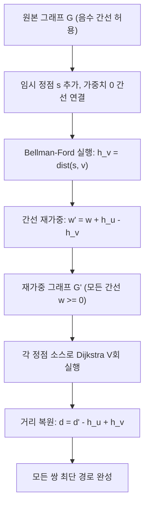

## 정의

**Johnson's algorithm**은 음수 간선이 있는 sparse graph의 all-pairs shortest paths (APSP)를 **O(VE log V)**에 계산. Bellman-Ford로 potential을 구한 뒤 간선을 재가중하여 Dijkstra를 V번 실행.

$$
\text{복잡도: } O(VE \log V) \quad \text{(sparse graph에서 Floyd-Warshall O(V^3)보다 빠름)}
$$

## 문제 상황

APSP 알고리즘 선택 기준:

- **Floyd-Warshall**: 음수 간선 허용, O(V³), dense graph에 적합
- **Dijkstra × V**: 음수 간선 불가, O(V(E + V) log V)
- **Johnson**: 음수 간선 허용, O(VE log V), sparse graph에 최적

음수 사이클이 있으면 최단 경로가 정의되지 않으므로 Bellman-Ford 단계에서 탐지.

## 시각화



## 핵심 아이디어

### 왜 Dijkstra가 음수 간선에서 실패하는가

Dijkstra는 "이미 확정된 정점의 거리는 최소"라는 greedy 가정에 의존. 음수 간선이 있으면 나중에 더 짧은 경로가 발견될 수 있어 이 가정이 깨짐.

### 재가중 (Reweighting)의 핵심

potential 함수 h를 이용해 모든 간선을 비음수로 변환:

$$
w'(u, v) = w(u, v) + h[u] - h[v]
$$

**성질 1**: $w'(u, v) \geq 0$ (Bellman-Ford 최단 경로 조건에 의해)

**성질 2**: 경로 $u \to v$의 재가중 거리 = 원래 거리 + h[u] - h[v]

따라서 최단 경로의 순서는 변하지 않음. 재가중 후 Dijkstra로 구한 최단 경로를 원래 거리로 복원 가능.

### 증명: w'(u,v) >= 0

Bellman-Ford로 구한 h는 최단 경로 거리이므로:

$$
h[v] \leq h[u] + w(u, v) \implies w(u, v) + h[u] - h[v] \geq 0
$$

### 거리 복원

재가중 그래프에서 Dijkstra로 구한 d'[u][v]에서 원래 거리 복원:

$$
d[u][v] = d'[u][v] - h[u] + h[v]
$$

## 알고리즘

```text
# Johnson's Algorithm
1. 임시 정점 s 추가
   for each vertex v: add edge (s, v) with weight 0

2. Bellman-Ford(s)로 h[v] = dist(s, v) 계산
   if 음수 사이클 탐지: "음수 사이클 존재" 출력 후 종료

3. 간선 재가중
   for each edge (u, v, w):
       w'(u, v) = w + h[u] - h[v]

4. 각 정점 u에서 Dijkstra 실행 (재가중 그래프)
   d'[u][v] = Dijkstra(u, G')

5. 원래 거리 복원
   d[u][v] = d'[u][v] - h[u] + h[v]
```

## 구현

<CodeWithOutput
  variants={[
    {
      language: "cpp",
      label: "C++",
      code: `#include <bits/stdc++.h>
using namespace std;
typedef long long ll;
typedef pair<ll,int> pli;
const ll INF = 1e18;

int V, E;
vector<pair<int,ll>> adj[505];

// Bellman-Ford: s에서 모든 정점까지 최단 거리
// 음수 사이클 있으면 false 반환
bool bellman_ford(int s, vector<ll>& dist) {
    dist.assign(V + 1, INF);
    dist[s] = 0;
    for (int i = 0; i < V; i++) {
        for (int u = 0; u <= V; u++) {
            if (dist[u] == INF) continue;
            for (auto [v, w] : adj[u]) {
                if (dist[u] + w < dist[v])
                    dist[v] = dist[u] + w;
            }
        }
    }
    for (int u = 0; u <= V; u++) {
        if (dist[u] == INF) continue;
        for (auto [v, w] : adj[u])
            if (dist[u] + w < dist[v]) return false;
    }
    return true;
}

// Dijkstra: src에서 모든 정점까지 최단 거리
vector<ll> dijkstra(int src, vector<vector<pair<int,ll>>>& g) {
    vector<ll> dist(V + 1, INF);
    priority_queue<pli, vector<pli>, greater<pli>> pq;
    dist[src] = 0;
    pq.push({0, src});
    while (!pq.empty()) {
        auto [d, u] = pq.top(); pq.pop();
        if (d > dist[u]) continue;
        for (auto [v, w] : g[u]) {
            if (dist[u] + w < dist[v]) {
                dist[v] = dist[u] + w;
                pq.push({dist[v], v});
            }
        }
    }
    return dist;
}

int main() {
    ios::sync_with_stdio(false);
    cin.tie(nullptr);

    cin >> V >> E;
    for (int i = 0; i < E; i++) {
        int u, v; ll w;
        cin >> u >> v >> w;
        adj[u].push_back({v, w});
    }

    // 임시 정점 V: 모든 정점에 가중치 0 간선
    for (int v = 0; v < V; v++)
        adj[V].push_back({v, 0});

    vector<ll> h;
    if (!bellman_ford(V, h)) {
        cout << "음수 사이클 존재\\n";
        return 0;
    }

    // 재가중 그래프 구성
    vector<vector<pair<int,ll>>> g(V + 1);
    for (int u = 0; u < V; u++)
        for (auto [v, w] : adj[u])
            g[u].push_back({v, w + h[u] - h[v]});

    // 각 정점에서 Dijkstra 후 거리 복원
    for (int u = 0; u < V; u++) {
        auto d = dijkstra(u, g);
        for (int v = 0; v < V; v++) {
            ll dist = (d[v] == INF) ? -1 : d[v] - h[u] + h[v];
            cout << dist;
            if (v < V - 1) cout << " ";
        }
        cout << "\\n";
    }

    return 0;
}`,
    },
    {
      language: "python",
      label: "Python",
      code: `import heapq
import sys
input = sys.stdin.readline
INF = float('inf')

def bellman_ford(s, V, adj):
    dist = [INF] * (V + 1)
    dist[s] = 0
    for _ in range(V):
        for u in range(V + 1):
            if dist[u] == INF:
                continue
            for v, w in adj[u]:
                if dist[u] + w < dist[v]:
                    dist[v] = dist[u] + w
    for u in range(V + 1):
        if dist[u] == INF:
            continue
        for v, w in adj[u]:
            if dist[u] + w < dist[v]:
                return None  # 음수 사이클
    return dist

def dijkstra(src, V, g):
    dist = [INF] * (V + 1)
    dist[src] = 0
    pq = [(0, src)]
    while pq:
        d, u = heapq.heappop(pq)
        if d > dist[u]:
            continue
        for v, w in g[u]:
            if dist[u] + w < dist[v]:
                dist[v] = dist[u] + w
                heapq.heappush(pq, (dist[v], v))
    return dist

def main():
    V, E = map(int, input().split())
    adj = [[] for _ in range(V + 1)]
    for _ in range(E):
        u, v, w = map(int, input().split())
        adj[u].append((v, w))

    for v in range(V):
        adj[V].append((v, 0))

    h = bellman_ford(V, V, adj)
    if h is None:
        print("음수 사이클 존재")
        return

    g = [[] for _ in range(V + 1)]
    for u in range(V):
        for v, w in adj[u]:
            g[u].append((v, w + h[u] - h[v]))

    for u in range(V):
        d = dijkstra(u, V, g)
        row = []
        for v in range(V):
            dist = -1 if d[v] == INF else int(d[v] - h[u] + h[v])
            row.append(str(dist))
        print(' '.join(row))

main()`,
    },
  ]}
  cases={[
    {
      label: "3정점 음수 간선 그래프",
      input: `3 4
0 1 -1
0 2 4
1 2 3
2 1 -2`,
      output: `0 -1 2
-1 0 3
-1 -2 0`,
    },
    {
      label: "음수 사이클 탐지",
      input: `3 3
0 1 1
1 2 -3
2 0 1`,
      output: `음수 사이클 존재`,
    },
  ]}
/>

## 복잡도

| 방법 | 복잡도 | 음수 간선 | 적합한 그래프 |
|:---|:---|:---|:---|
| **Floyd-Warshall** | O(V³) | 허용 | Dense |
| **Johnson** | O(VE log V) | 허용 | Sparse |
| **Dijkstra × V** | O(V(E+V) log V) | 불가 | Sparse |

Sparse (E = O(V)) 일 때: Johnson O(V² log V) vs Floyd-Warshall O(V³).
Dense (E = O(V²)) 일 때: Johnson O(V³ log V) > Floyd-Warshall O(V³). Dense에는 Floyd-Warshall 사용.

## 함정

### 1. 음수 사이클 미탐지

Bellman-Ford 단계에서 음수 사이클을 탐지하지 않으면 잘못된 결과. V번 완화 후 한 번 더 완화 시도로 탐지.

> [!WARNING]
> 음수 사이클이 있으면 최단 경로가 정의되지 않음. 반드시 탐지 후 처리.

### 2. 임시 정점 인덱스 충돌

기존 정점 0..V-1에 임시 정점 V를 추가. 배열 크기를 V+1로 할당.

### 3. 거리 복원 공식 오류

재가중 거리 d'[u][v]에서 원래 거리 복원: `d[u][v] = d'[u][v] - h[u] + h[v]`. 부호 혼동 주의.

### 4. Dense graph에서 비효율

E = O(V²)이면 Johnson O(V³ log V)로 Floyd-Warshall O(V³)보다 느림. Dense graph에는 Floyd-Warshall 사용.

### 5. 정수 오버플로

h[u] - h[v]가 음수일 수 있으므로 `long long` 사용. 재가중 후 w'가 음수가 되면 안 됨.

## BOJ 연습 문제

| 번호 | 제목 | 관련 개념 |
|:---|:---|:---|
| BOJ 11404 | 플로이드 | Floyd-Warshall (비교) |
| BOJ 1865 | 웜홀 | Bellman-Ford (음수 사이클) |
| BOJ 1753 | 최단경로 | Dijkstra (기반 알고리즘) |
| BOJ 11657 | 타임머신 | Bellman-Ford SSSP |

## 관련 위키

- [[floyd-warshall|Floyd-Warshall]]
- [[dijkstra|Dijkstra]]
- [[bellman-ford|Bellman-Ford]]
