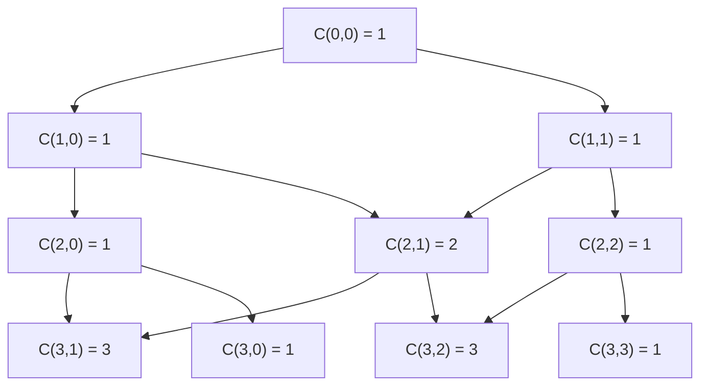

## 정의

**Pascal Triangle** 은 각 원소가 위 두 원소의 합인 삼각형. 행 n, 열 k 의 원소가 이항계수 $\binom{n}{k}$.

```
1
1 1
1 2 1
1 3 3 1
1 4 6 4 1
1 5 10 10 5 1
```

이항계수 $\binom{n}{k}$: n 개 중 k 개를 순서 없이 선택하는 경우의 수.

$$
\binom{n}{k} = \frac{n!}{k! \cdot (n-k)!}
$$

## 문제 상황

$\binom{n}{k}$ 를 팩토리얼로 직접 계산하면:
- $n!$ 이 빠르게 오버플로우
- MOD 연산 시 나눗셈 처리 복잡

**해결**: 점화식 DP 로 MOD 아래서 정확하게 계산.

재귀 점화식:

$$
\binom{n}{k} = \binom{n-1}{k-1} + \binom{n-1}{k}
$$

경계 조건: $\binom{n}{0} = \binom{n}{n} = 1$.

## 시각화



## 핵심 아이디어

### DP 계산

2D 배열 `C[i][j]`에 파스칼 삼각형 저장. 이전 행에서 두 값을 더하는 O(N^2) 방법.

단일 쿼리라면 1D 배열로 공간 최적화:
- 배열을 오른쪽에서 왼쪽으로 갱신 → in-place 업데이트

### MOD 처리

대부분 문제는 답을 $10^9 + 7$ 로 나눈 나머지 요구.

DP 점화식은 덧셈만 사용하므로 MOD 연산 자연스럽게 적용:

$$
C[i][j] = (C[i-1][j-1] + C[i-1][j]) \bmod M
$$

### Lucas' Theorem (대형 n)

n 이 매우 크고 소수 p 로 나눈 나머지를 구할 때:

$$
\binom{n}{k} \equiv \prod_{i} \binom{n_i}{k_i} \pmod{p}
$$

여기서 $n = \sum n_i p^i$, $k = \sum k_i p^i$ 는 p 진법 표현.

## 알고리즘

### 알고리즘 1: 2D 파스칼 삼각형 (O(N^2) 공간/시간)

```cpp
// C[i][j] = C(i, j) mod MOD
const int MOD = 1e9 + 7;
vector<vector<long long>> C(n + 1, vector<long long>(n + 1, 0));
for (int i = 0; i <= n; i++) {
    C[i][0] = 1;
    for (int j = 1; j <= i; j++)
        C[i][j] = (C[i-1][j-1] + C[i-1][j]) % MOD;
}
// C[n][k] = C(n, k) mod MOD
```

### 알고리즘 2: 1D 공간 최적화 (O(N) 공간)

```cpp
vector<long long> C(n + 1, 0);
C[0] = 1;
for (int i = 1; i <= n; i++)
    for (int j = i; j >= 1; j--)  // 오른쪽에서 왼쪽으로
        C[j] = (C[j] + C[j-1]) % MOD;
// C[k] = C(n, k) mod MOD
```

### 알고리즘 3: 팩토리얼 + 역원 (단일 쿼리 O(N) 전처리)

n 이 크고 다중 쿼리일 때: 팩토리얼과 모듈러 역원을 전처리.

```cpp
const int MAXN = 2e5 + 5;
const int MOD = 1e9 + 7;
long long fact[MAXN], inv_fact[MAXN];

long long power(long long a, long long b, long long mod) {
    long long res = 1; a %= mod;
    for (; b > 0; b >>= 1) {
        if (b & 1) res = res * a % mod;
        a = a * a % mod;
    }
    return res;
}

void precompute(int n) {
    fact[0] = 1;
    for (int i = 1; i <= n; i++) fact[i] = fact[i-1] * i % MOD;
    inv_fact[n] = power(fact[n], MOD - 2, MOD);
    for (int i = n - 1; i >= 0; i--) inv_fact[i] = inv_fact[i+1] * (i+1) % MOD;
}

long long C(int n, int k) {
    if (k < 0 || k > n) return 0;
    return fact[n] % MOD * inv_fact[k] % MOD * inv_fact[n-k] % MOD;
}
```

## 구현

<CodeWithOutput
  variants={[
    {
      language: "cpp",
      label: "C++",
      code: `#include <bits/stdc++.h>
using namespace std;
const int MOD = 1e9 + 7;

int main() {
    int n;
    cin >> n;
    // 파스칼 삼각형 출력
    vector<long long> C(n + 1, 0);
    C[0] = 1;
    for (int i = 0; i < n; i++) {
        vector<long long> nxt(n + 1, 0);
        for (int j = 0; j <= i; j++) {
            nxt[j] = (nxt[j] + C[j]) % MOD;
            nxt[j + 1] = (nxt[j + 1] + C[j]) % MOD;
        }
        C = nxt;
        for (int j = 0; j <= i + 1; j++)
            cout << C[j] << " \\n"[j == i + 1];
    }
    // C(n, k) 출력
    int k;
    cin >> k;
    cout << C[k] << "\\n";
    return 0;
}`,
    },
    {
      language: "python",
      label: "Python",
      code: `MOD = 10**9 + 7

def pascal(n):
    C = [0] * (n + 1)
    C[0] = 1
    rows = []
    rows.append(C[:1])
    for i in range(1, n + 1):
        nxt = [0] * (n + 1)
        for j in range(i + 1):
            if j > 0: nxt[j] = (nxt[j] + C[j-1]) % MOD
            nxt[j] = (nxt[j] + C[j]) % MOD
        C = nxt
        rows.append(C[:i+1])
    return C, rows

n = int(input())
C, rows = pascal(n)
for row in rows:
    print(*row)
k = int(input())
print(C[k])`,
    },
  ]}
  cases={[
    {
      label: "기본 (n=5, k=2)",
      input: `5
2`,
      output: `1
1 1
1 2 1
1 3 3 1
1 4 6 4 1
1 5 10 10 5 1
10`,
    },
  ]}
/>

## 성질

| 성질 | 수식 | 의미 |
|:---|:---|:---|
| 행 합 | $\sum_{k=0}^{n} \binom{n}{k} = 2^n$ | n 개 원소 부분집합 수 |
| 홀짝 행 합 | $\sum_{k \text{ even}} \binom{n}{k} = 2^{n-1}$ | 짝수 선택 수 |
| Hockey stick | $\sum_{i=r}^{n} \binom{i}{r} = \binom{n+1}{r+1}$ | 대각선 합 |
| Vandermonde | $\sum_{k} \binom{m}{k}\binom{n}{r-k} = \binom{m+n}{r}$ | 합성 |
| 대칭 | $\binom{n}{k} = \binom{n}{n-k}$ | 삼각형 대칭 |

## 복잡도

| 방법 | 시간 | 공간 | 용도 |
|:---|:---:|:---:|:---|
| 2D DP | $O(N^2)$ | $O(N^2)$ | 소규모, n 전체 테이블 |
| 1D DP | $O(N^2)$ | $O(N)$ | 공간 절약 |
| 팩토리얼 전처리 | $O(N)$ 전처리, $O(1)$ 쿼리 | $O(N)$ | 다중 쿼리, 대규모 |
| Lucas' Theorem | $O(\log_p N)$ 쿼리 | $O(p)$ | n 극히 크고 소수 MOD |

## 함정

> [!WARNING]
> **MOD 로 나눈 후 나눗셈 불가**: $\binom{n}{k} \neq \frac{fact[n]}{fact[k] \cdot fact[n-k]}$ MOD 세계에서는 직접 나눗셈 대신 모듈러 역원 사용.

> [!WARNING]
> **k > n 이면 0**: 경계 조건 $\binom{n}{k} = 0$ $(k > n$ 또는 $k < 0)$ 를 반드시 처리.

> [!CAUTION]
> **오버플로우**: `fact[n]` 을 long long 으로 선언해도 n 이 크면 `fact[n] * inv_fact[k]` 중간에 오버플로우. 각 곱셈마다 `% MOD` 적용.

### 흔한 실수

1. `C[i][j]` 인덱스 오류: j > i 일 때 0 처리 안 함
2. 1D DP 갱신 시 왼쪽에서 오른쪽으로 갱신하면 이미 갱신된 값 사용 (오류)
3. 대형 n 에서 DP 테이블 메모리 초과, 팩토리얼 방법 사용 안 함

## BOJ 연습 문제

| 번호 | 제목 | 키워드 |
|:---|:---|:---|
| BOJ 11050 | 이항 계수 1 | 기본 계산 |
| BOJ 11051 | 이항 계수 2 | MOD 계산 |
| BOJ 2608 | 파스칼의 삼각형 | 삼각형 출력 |
| BOJ 1862 | 2진수 표현 | 이항계수 응용 |
| BOJ 13977 | 이항 계수와 쿼리 | 팩토리얼 전처리 |
| BOJ 11401 | 이항 계수 3 | 큰 n, 역원 |

## 참고

- [[combinatorics|조합론]]
- [[catalan-number|Catalan Number]]
- [[inclusion-exclusion|Inclusion-Exclusion]]
- [[arithmetic|산술 기초]]
