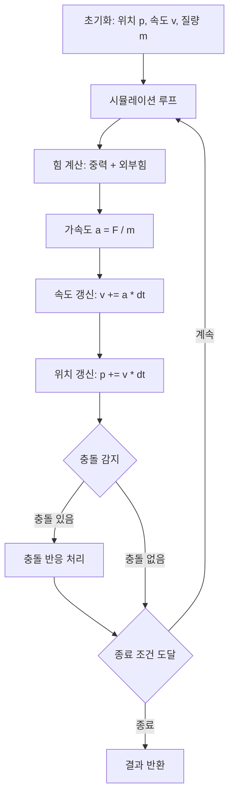
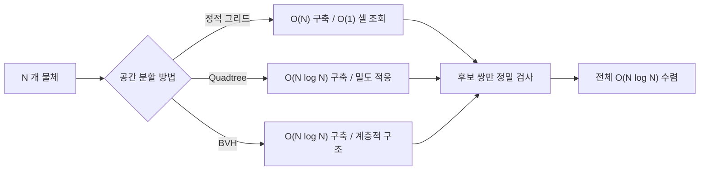

## 정의

**물리 시뮬레이션 (Physics Simulation)** 은 뉴턴 역학의 운동 방정식 (F=ma, 속도, 가속도) 을 수치적으로 적분하여 시간 경과에 따른 물체의 위치와 속도를 계산하는 기법. 게임 엔진, 로봇 공학, 과학 계산에서 실제 물리 현상을 모의하는 데 사용.

## 문제 상황과 동기

N 개의 물체가 있고, 각 물체는 위치, 속도, 가속도를 가진다. 매 시간 단계마다 힘을 받아 가속도가 결정되고, 속도와 위치가 갱신된다. 추가로 물체 간 충돌을 감지하고 반응해야 한다.

- **naive**: 매 시간 단계마다 모든 물체 쌍을 확인. O(N^2) 충돌 검사. N=1000 이면 10^6 번 거리 계산, 초당 60 프레임이면 6·10^7 연산. 느림.
- **핵심 통찰**: 시간을 작은 dt 로 이산화하고, 각 단계에서 상태 (위치, 속도) 를 갱신. 공간 분할 (grid, quadtree) 로 충돌 검사를 O(N log N) 으로 가속.

## 시각화

```anim:physics
{}
```

## 시뮬레이션 루프 흐름



## 핵심 아이디어

**Euler 적분**: 현재 상태 (위치 p, 속도 v) 에서 다음 상태로 진행.

```text
a = F / m                    (뉴턴 제2법칙)
v_new = v + a * dt           (속도 갱신)
p_new = p + v_new * dt       (위치 갱신)
```

**Verlet 적분**: 속도를 명시적으로 저장하지 않고, 이전 위치를 기억. 스프링이나 천 시뮬레이션에서 더 안정적.

```text
p_new = 2 * p - p_old + a * dt^2
```

**충돌 감지**: 원형 물체는 거리 비교. 축 정렬 경계 상자 (AABB) 는 각 축 범위 겹침 확인.

**충돌 반응**: 운동량 보존. 두 물체가 충돌하면 속도를 교환하거나, 반발 계수 (restitution) 를 곱해 에너지 손실 표현.

## 알고리즘

```text
simulate(bodies, forces, dt, gravity):
    for each body in bodies:
        a = (forces[body] + gravity) / mass[body]
        v[body] += a * dt
        p[body] += v[body] * dt
    
    for i = 0 to N-1:
        for j = i+1 to N-1:
            if collides(bodies[i], bodies[j]):
                resolve_collision(bodies[i], bodies[j])
```

### 탄성 충돌 반응 공식

1D 탄성 충돌에서 운동량과 에너지 보존:

```text
m1, m2: 충돌하는 두 물체의 질량
v1, v2: 충돌 전 속도

v1' = (m1 - m2) / (m1 + m2) * v1 + 2*m2 / (m1 + m2) * v2
v2' = 2*m1 / (m1 + m2) * v1 + (m2 - m1) / (m1 + m2) * v2
```

비탄성 충돌은 반발 계수 `e` 도입:

```text
v_rel' = -e * v_rel    (e=1: 완전 탄성, e=0: 완전 비탄성)
```

### 적분 방법 비교

| 방법 | 장점 | 단점 | 추천 상황 |
|:---|:---|:---|:---|
| Euler | 구현 단순 | 에너지 증가, 큰 dt 불안정 | 학습, 프로토타입 |
| Semi-implicit Euler | 안정적, 단순 | 정밀도 낮음 | 게임 물리 |
| Verlet | 에너지 보존 우수 | 속도 직접 저장 불가 | 스프링, 천 |
| RK4 | 고정밀도 | 연산 4배 | 궤도 역학, 과학 계산 |

> [!TIP]
> 게임에서는 Semi-implicit Euler 가 안정성과 속도 균형이 좋음. v 갱신 후 새 v 로 p 를 갱신.

## 구현

<CodeWithOutput
  variants={[
    {
      language: "cpp",
      label: "C++",
      code: `// 1D 낙하 + 바닥 충돌, Euler 적분
#include <bits/stdc++.h>
using namespace std;
int main() {
    double y = 300, v = 0, g = -9.8, dt = 0.1;
    double ground = 400, restitution = 0.8;
    int steps = 50;
    
    for (int i = 0; i < steps; i++) {
        v += g * dt;
        y += v * dt;
        
        if (y >= ground) {
            y = ground;
            v = -v * restitution;
        }
        
        cout << fixed << setprecision(2) << "t=" << i*dt 
             << " y=" << y << " v=" << v << "\\n";
    }
    return 0;
}`,
    },
    {
      language: "python",
      label: "Python",
      code: `# 1D 낙하 + 바닥 충돌, Euler 적분
y, v = 300, 0
g, dt = -9.8, 0.1
ground, restitution = 400, 0.8
steps = 50

for i in range(steps):
    v += g * dt
    y += v * dt
    
    if y >= ground:
        y = ground
        v = -v * restitution
    
    print(f"t={i*dt:.1f} y={y:.2f} v={v:.2f}")`,
    },
    {
      language: "java",
      label: "Java",
      code: `// 1D 낙하 + 바닥 충돌, Euler 적분
public class Physics {
    public static void main(String[] args) {
        double y = 300, v = 0, g = -9.8, dt = 0.1;
        double ground = 400, restitution = 0.8;
        int steps = 50;
        
        for (int i = 0; i < steps; i++) {
            v += g * dt;
            y += v * dt;
            
            if (y >= ground) {
                y = ground;
                v = -v * restitution;
            }
            
            System.out.printf("t=%.1f y=%.2f v=%.2f%n", 
                i*dt, y, v);
        }
    }
}`,
    },
  ]}
  cases={[
    {
      label: "낙하 및 반동",
      input: `초기: y=300, v=0, g=-9.8, dt=0.1, restitution=0.8`,
      output: `t=0.0 y=300.00 v=0.00
t=0.1 y=299.95 v=-0.98
t=0.2 y=299.80 v=-1.96
t=0.3 y=299.55 v=-2.94
t=0.4 y=299.21 v=-3.92`,
    },
  ]}
/>

## 복잡도

| 항목 | 값 |
|:---|:---|
| **상태 갱신 (N 물체)** | O(N) |
| **충돌 감지 (naive)** | O(N^2) |
| **충돌 감지 (spatial hash)** | O(N log N) |
| **충돌 반응** | O(1) per collision |
| **전체 (per frame)** | O(N) ~ O(N^2) |

## 변형 / 활용

- **Verlet 적분**: 속도 명시 저장 없음. 천, 스프링 시뮬레이션에 안정적.
- **RK4 (Runge-Kutta 4차)**: 더 높은 정확도. 계산 비용 4배.
- **Impulse-based 충돌**: 운동량 보존으로 정확한 반응.
- **Penalty method**: 침투 깊이에 비례한 복원력. 간단하지만 부정확.
- **Spatial partitioning**: Grid, Quadtree, BVH 로 충돌 검사 가속.

## 공간 분할 전략

충돌 검사를 O(N²) 에서 줄이는 세 가지 주요 방법:



- **정적 그리드**: 물체 크기가 균일할 때 최고. 셀 크기 = 물체 최대 반지름 * 2.
- **Quadtree**: 밀도 불균형 분포에 유리. 군집 + 희소 혼재 시나리오.
- **BVH**: 게임 엔진 표준. 동적 물체와 복잡한 형상에 강함.

## 함정

### 1. dt 너무 크면 불안정 (tunneling)

dt 가 크면 물체가 한 프레임에 벽을 뚫고 지나갈 수 있다. 연속 충돌 감지 (CCD) 필요.

### 2. 부동소수점 오차 누적

오래 시뮬레이션하면 위치 오차가 누적. 주기적으로 정규화 필요.

### 3. 충돌 반응 후 중복 충돌

물체가 벽에 박혀 있으면 매 프레임 충돌 감지. 충돌 상태 플래그 필요.

### 4. 적분 방법 선택 오류

RK4 가 항상 더 좋다는 오해. dt 가 작으면 Euler 와 큰 차이 없고, 4배 연산 낭비. 목적에 맞는 방법 선택 필요.

### 5. 동시 다중 충돌 순서 문제

N 개 물체가 동시에 충돌할 때 처리 순서가 결과를 바꿈. impulse accumulation 방식으로 한 프레임의 모든 충돌을 모아서 한 번에 처리.

> [!WARNING]
> 복잡한 물리 시뮬레이션에서 부동소수점 오차 누적 + 잘못된 dt 선택 + 충돌 처리 순서 문제가 복합될 경우, 물체들이 서로 붙어버리거나 폭발적으로 튀어 나가는 현상이 발생한다. 각 문제를 독립적으로 진단하고 수정해야 한다.

## BOJ 연습 문제

| 번호 | 제목 | 정답률 | 링크 |
|:---|:---|---:|:---|
| BOJ 14503 | 로봇 청소기 | (수집 안 됨) | [kokoa-lab](https://github.com/kokoa-lab/boj-problems/tree/main/organize_problems/14500-14599/14503) |
| BOJ 15685 | 드래곤 커브 | (수집 안 됨) | [kokoa-lab](https://github.com/kokoa-lab/boj-problems/tree/main/organize_problems/15600-15699/15685) |
| BOJ 16234 | 인구 이동 | (수집 안 됨) | [kokoa-lab](https://github.com/kokoa-lab/boj-problems/tree/main/organize_problems/16200-16299/16234) |
| BOJ 17144 | 미세먼지 안녕! | (수집 안 됨) | [kokoa-lab](https://github.com/kokoa-lab/boj-problems/tree/main/organize_problems/17100-17199/17144) |

## 참고

- [[Simulation|시뮬레이션]]
- [[Sweeping|스위핑]]
- [[Geometry|기하 알고리즘]]
- [[BFS|너비 우선 탐색]] (격자 시뮬레이션)
