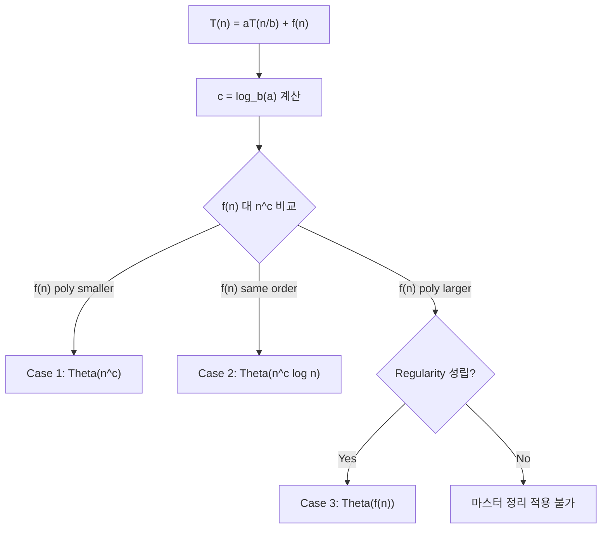

## 정의

**마스터 정리 (Master Theorem)** 는 분할 정복 알고리즘의 시간 복잡도를 표현하는 점화식을 **닫힌 형태 (closed form)** 로 풀어주는 공식입니다.

**적용 대상**: 다음 형태의 점화식

$$
T(n) = a \cdot T\left(\frac{n}{b}\right) + f(n)
$$

- $a \geq 1$: 하위 문제 수
- $b > 1$: 크기 축소 비율
- $f(n)$: 분할/병합 비용

**한 줄 요약**: "분할 정복 알고리즘의 $O(\cdot)$ 를 빠르게 판정".

## 세 경우

**임계 지수**: $c = \log_b a$

$n^c$ 와 $f(n)$ 의 상대적 크기로 세 경우:

### Case 1: $f(n) = O(n^{c - \epsilon})$ (분할 비용이 작음)

$$T(n) = \Theta(n^c) = \Theta(n^{\log_b a})$$

**의미**: 재귀 트리의 **잎 노드가 지배**. 각 레벨에서 아래로 갈수록 일 커짐.

**예**: $T(n) = 4 T(n/2) + n$
- $c = \log_2 4 = 2$, $f(n) = n = n^1$
- $1 < 2$ → Case 1
- $T(n) = \Theta(n^2)$

### Case 2: $f(n) = \Theta(n^c)$ (균형)

$$T(n) = \Theta(n^c \log n)$$

**의미**: 각 레벨의 일이 같음. 레벨 수 $\log n$ 배.

**예**: $T(n) = 2 T(n/2) + n$ (병합 정렬)
- $c = \log_2 2 = 1$, $f(n) = n = n^1$
- Case 2
- $T(n) = \Theta(n \log n)$

### Case 3: $f(n) = \Omega(n^{c + \epsilon})$ (분할 비용이 큼)

**+ regularity 조건** $a f(n/b) \leq k f(n)$ ($k < 1$):

$$T(n) = \Theta(f(n))$$

**의미**: 재귀 트리의 **루트 (최상위 호출) 가 지배**.

**예**: $T(n) = 2 T(n/2) + n^2$
- $c = 1$, $f(n) = n^2$
- $2 > 1$ → Case 3
- Regularity: $2 \cdot (n/2)^2 = n^2 / 2 \leq (1/2) n^2$ ✓
- $T(n) = \Theta(n^2)$

## 시각화: 재귀 트리

$T(n) = 2 T(n/2) + n$

```
Level 0:                    n                    총 = n
                          /   \
Level 1:              n/2     n/2                총 = n
                     /   \   /   \
Level 2:          n/4  n/4 n/4 n/4               총 = n
                     ...
Level log n:       1 1 1 ... 1 (n 개)            총 = n

전체 = n * log n
```

$\log_2 n$ 개 레벨, 각 레벨 $n$ → $\Theta(n \log n)$.

## 알고리즘 적용 예시

| 알고리즘 | 점화식 | 결과 | Case |
|:---|:---|:---|:---:|
| 이진 탐색 | $T(n) = T(n/2) + 1$ | $\Theta(\log n)$ | 2 |
| 병합 정렬 | $T(n) = 2T(n/2) + n$ | $\Theta(n \log n)$ | 2 |
| 퀵 정렬 (평균) | $T(n) = 2T(n/2) + n$ | $\Theta(n \log n)$ | 2 |
| 카라추바 곱셈 | $T(n) = 3T(n/2) + n$ | $\Theta(n^{\log_2 3}) \approx \Theta(n^{1.585})$ | 1 |
| Strassen 행렬곱 | $T(n) = 7T(n/2) + n^2$ | $\Theta(n^{\log_2 7}) \approx \Theta(n^{2.807})$ | 1 |
| 이분 탐색 트리 | $T(n) = T(n/2) + n$ | $\Theta(n)$ | 3 |
| Closest Pair (2D) | $T(n) = 2T(n/2) + n$ | $\Theta(n \log n)$ | 2 |

## 계산 절차

1. $a$, $b$, $f(n)$ 식별
2. $c = \log_b a$ 계산
3. $f(n)$ 을 $n^c$ 와 비교
4. Case 판정 → 결과

**예제**: $T(n) = 3 T(n/4) + n \log n$
- $a = 3$, $b = 4$, $f(n) = n \log n$
- $c = \log_4 3 \approx 0.79$
- $n \log n$ vs $n^{0.79}$: $n \log n$ 이 큼 (polynomially larger, $n = n^{1 - 0.79}$ 팩터)
- Case 3
- Regularity: $3 \cdot (n/4) \log(n/4) \leq k \cdot n \log n$ for some $k < 1$ ✓
- $T(n) = \Theta(n \log n)$

## 판정 흐름도



## Case 사이 gap

**모든 경우가 마스터 정리로 안 풀림**. 두 gap:

### Gap 1-2: $f(n) = \Theta(n^c / \log n)$

$n^c$ 보다 약간 작음, 하지만 polynomially not smaller. 마스터 정리 적용 X.

### Gap 2-3: $f(n) = \Theta(n^c \log n)$

$n^c$ 보다 큼, 하지만 polynomially not larger.

**확장 마스터 정리** (Case 2 확장):

$$T(n) = a T(n/b) + \Theta(n^c \log^k n) \implies T(n) = \Theta(n^c \log^{k+1} n)$$

**예**: $T(n) = 2 T(n/2) + n \log n$ → $\Theta(n \log^2 n)$

## Akra-Bazzi 방법

**일반화**된 마스터 정리. 다음 형태 처리:

$$
T(n) = \sum_{i=1}^{k} a_i T(n / b_i) + f(n)
$$

- 여러 분할 크기 ($n/b_1, n/b_2, \ldots$)
- 마스터 정리보다 광범

**예**: $T(n) = T(n/3) + T(2n/3) + n$ → $\Theta(n \log n)$

수학적 배경 (integral) 필요. 대회에는 잘 안 나옴.

## 마스터 정리 로 안 되는 예

### 1. 감소 (subtraction) 점화식

$T(n) = T(n-1) + O(1)$ → $\Theta(n)$

$T(n) = T(n-1) + O(n)$ → $\Theta(n^2)$

$T(n) = 2 T(n-1) + O(1)$ → $\Theta(2^n)$

**직접 풀기** (반복 대입 또는 트리).

### 2. 불규칙 크기

$T(n) = T(\sqrt{n}) + 1$ → 변수 치환 $m = \log n$ 후 $S(m) = S(m/2) + 1 = O(\log m) = O(\log \log n)$

### 3. 로그 팩터

$T(n) = 2 T(n/2) + n / \log n$ → 마스터 정리 gap. 다른 방법.

## 실전 팁

- **분할 정복 알고리즘 설계 후 즉시 확인**
- **재귀 트리 시각화** 로 직관
- **암기하지 말고 유도**
- **Regularity 조건** 잊지 말 것 (Case 3)

## 함정

> [!WARNING]
> **Case 3 regularity 확인 필수**. 안 성립하면 마스터 정리 못 씀.

> [!CAUTION]
> **$c$ 를 잘못 계산**. $\log_b a$ 이지 $\log_a b$ 아님.

> [!WARNING]
> **$T(n) = 2 T(n-1) + 1$** 은 감소 형태. 마스터 정리 대상 아님 ($\Theta(2^n)$).

> [!IMPORTANT]
> **재귀 트리로 확인**. 마스터 정리 결과가 이해 안 되면 직접 그려보자.

> [!CAUTION]
> **Polynomial difference** 필수. $f(n)$ 이 $n^c$ 와 다항적으로 (not just log) 커야 Case 1/3.

## 구현: 케이스 판정기

교육용 Python 스크립트. a, b, f 의 지수를 입력하면 케이스를 판정.

<CodeWithOutput
  variants={[
    {
      language: "python",
      label: "Python",
      code: `import math

def master_theorem(a, b, f_alpha, f_log_beta=0):
    """
    T(n) = a T(n/b) + n^f_alpha * log^f_log_beta(n) 케이스 판정.
    a: 하위 문제 수, b: 크기 축소 비율
    f_alpha: f(n) 의 n 지수, f_log_beta: log 지수 (기본 0)
    """
    c = math.log(a) / math.log(b)
    eps = 1e-9
    if f_alpha < c - eps:
        return f"Case 1: T(n) = Theta(n^{c:.4g})"
    elif abs(f_alpha - c) < eps:
        k = f_log_beta + 1
        if k > eps:
            return f"Case 2: T(n) = Theta(n^{c:.4g} log^{k:.4g} n)"
        else:
            return "Gap: 마스터 정리 직접 적용 불가"
    else:
        return f"Case 3: T(n) = Theta(f(n))  [c={c:.4g}, regularity 확인]"

# 병합 정렬: T(n) = 2T(n/2) + n
print(master_theorem(2, 2, 1))
# 이진 탐색: T(n) = T(n/2) + 1
print(master_theorem(1, 2, 0))
# 카라추바: T(n) = 3T(n/2) + n
print(master_theorem(3, 2, 1))
# Strassen: T(n) = 7T(n/2) + n^2
print(master_theorem(7, 2, 2))
# 확장 Case 2: T(n) = 2T(n/2) + n log n
print(master_theorem(2, 2, 1, 1))`,
    },
  ]}
  cases={[
    {
      label: "주요 알고리즘 케이스 판정",
      input: ``,
      output: `Case 2: T(n) = Theta(n^1 log^1 n)
Case 2: T(n) = Theta(n^0 log^1 n)
Case 1: T(n) = Theta(n^1.585)
Case 1: T(n) = Theta(n^2.807)
Case 2: T(n) = Theta(n^1 log^2 n)`,
    },
  ]}
/>

## 관련 위키

- [[recurrence-relations|점화식]]
- [[discrete-mathematics|이산수학]]
- [[time-complexity|시간 복잡도]]
- [[generating-function|생성함수]]
- [[proof-techniques|증명 기법]] - 귀납법
