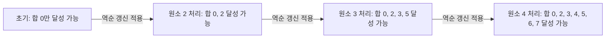
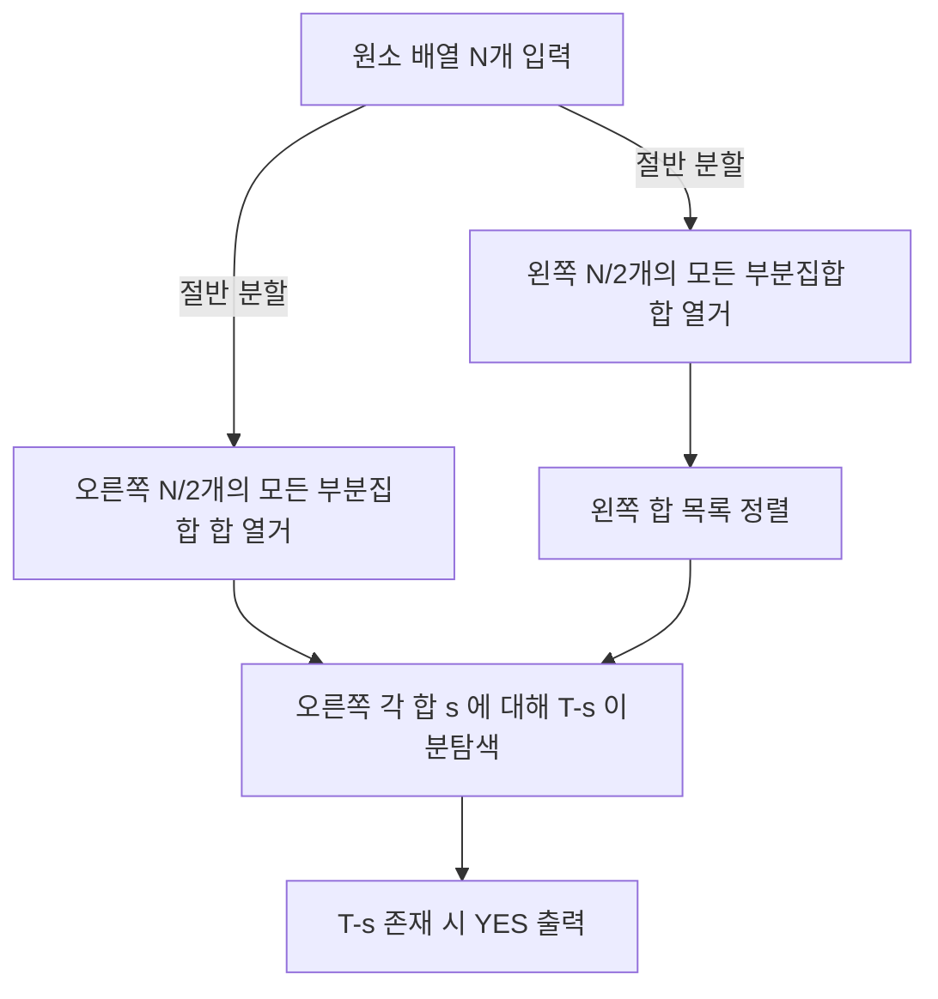

## 정의

집합 $\{a_1, \ldots, a_n\}$ 에서 **부분집합의 합이 정확히 T가 되는 부분집합이 존재하는가**를 묻는 결정 문제.

- 일반 경우: **NP-complete** (다항 시간 알고리즘 미발견)
- 원소 값이 작거나 T가 작으면: **의사 다항 시간 DP** O(N x T)
- N <= 40이면: **Meet-in-the-Middle** O(2^(N/2) x N)

## 문제 상황

배열 원소들의 부분집합 중 합이 T인 것이 있는가?

**naive (브루트포스)**: 2^N개 부분집합 모두 확인. N=20이면 ~1M, N=40이면 ~1조로 불가능.

**핵심 통찰**: `dp[s]`를 "합이 s인 부분집합 존재 여부"로 정의하고, 각 원소를 순서대로 처리. dp 테이블의 크기는 T+1이므로 T가 작으면 효율적.

## 시각화

### DP 갱신 과정 (원소 {2, 3, 4}, T=7)



### Meet-in-the-Middle 흐름 (N=40)



## 핵심 아이디어

### DP O(N x T)

**상태**: `dp[s]` = 합이 s인 부분집합 존재 여부 (boolean).

**초기**: `dp[0] = true`, 나머지 `false`.

**전이**: 각 원소 x에 대해, x를 포함할 수 있으면 dp 갱신.

$$
\text{dp}[s] \leftarrow \text{dp}[s] \lor \text{dp}[s - x] \quad (s \geq x)
$$

**역순 갱신** (s를 T에서 x까지 감소): 동일 원소의 중복 사용 방지.
순방향 갱신 시 한 원소를 여러 번 사용 가능한 Unbounded Knapsack이 됨.

### Meet-in-the-Middle O(2^(N/2) x N)

T가 너무 크거나 원소가 실수일 때 DP 적용 불가능. N <= 40 조건에서 사용:

1. 배열을 절반으로 분할: L = a[0..n/2-1], R = a[n/2..n-1]
2. 각 절반의 모든 2^(n/2)개 부분집합 합 열거
3. 왼쪽 합 목록 정렬 후, 오른쪽 각 합 s에 대해 T-s를 이분탐색

## 알고리즘

```text
# DP O(N*T)
dp[0] = true, dp[1..T] = false

for each x in a:
    for s = T downto x:       # 역순: x를 1번만 사용
        dp[s] = dp[s] OR dp[s - x]

return dp[T]
```

```text
# Meet-in-the-Middle O(2^(N/2)*N)
L = a[0..n/2-1],  R = a[n/2..n-1]

SumL = [subset sum of L for each 2^(n/2) subsets]
SumR = [subset sum of R for each 2^(n/2) subsets]
sort(SumL)

for s in SumR:
    if binary_search(SumL, T - s):
        return true
return false
```

## 구현

<CodeWithOutput
  variants={[
    {
      language: "cpp",
      label: "C++ (DP)",
      code: `#include <bits/stdc++.h>
using namespace std;

int main() {
    ios::sync_with_stdio(false);
    cin.tie(nullptr);

    int n, T;
    cin >> n >> T;
    vector<int> a(n);
    for (int i = 0; i < n; i++) cin >> a[i];

    vector<bool> dp(T + 1, false);
    dp[0] = true;

    for (int x : a) {
        for (int s = T; s >= x; s--) {  // 역순 갱신: 중복 사용 방지
            if (dp[s - x]) dp[s] = true;
        }
    }

    cout << (dp[T] ? "YES" : "NO") << "\\n";
    return 0;
}`,
    },
    {
      language: "python",
      label: "Python (DP)",
      code: `import sys
input = sys.stdin.readline

def solve():
    n, T = map(int, input().split())
    a = list(map(int, input().split()))

    dp = [False] * (T + 1)
    dp[0] = True

    for x in a:
        for s in range(T, x - 1, -1):  # 역순 갱신
            if dp[s - x]:
                dp[s] = True

    print("YES" if dp[T] else "NO")

solve()`,
    },
  ]}
  cases={[
    {
      label: "달성 가능",
      input: `4 9
1 2 3 5`,
      output: `YES`,
    },
    {
      label: "달성 불가",
      input: `3 10
2 3 4`,
      output: `NO`,
    },
    {
      label: "단일 원소",
      input: `1 5
5`,
      output: `YES`,
    },
  ]}
/>

## 복잡도

| 알고리즘 | 시간 | 공간 | 적용 조건 |
|:---|:---:|:---:|:---|
| 브루트포스 | O(2^N) | O(1) | N <= 20 |
| DP | O(N x T) | O(T) | T <= 10^6 정도 |
| Meet-in-the-Middle | O(2^(N/2) x N) | O(2^(N/2)) | N <= 40 |
| SOS DP | O(N x 2^N) | O(2^N) | 집합 합 전체 열거 시 |

> [!WARNING]
> T가 매우 크거나 (10^9 이상) 원소가 실수이면 DP 불가 → Meet-in-the-Middle 또는 근사 알고리즘.

## 함정

### 1. 역순 vs 순방향 갱신

역순 갱신(s = T downto x)을 빠뜨리고 순방향으로 갱신하면 동일 원소를 여러 번 사용하는 **Unbounded Knapsack**이 됩니다.

```cpp
// 잘못된 예 (같은 원소 중복 사용)
for (int s = x; s <= T; s++)
    if (dp[s - x]) dp[s] = true;

// 올바른 예 (0-1, 각 원소 최대 1번)
for (int s = T; s >= x; s--)
    if (dp[s - x]) dp[s] = true;
```

### 2. dp[0] 초기화 누락

합이 0인 공집합은 항상 존재. `dp[0] = true` 없이 시작하면 아무것도 true가 되지 않음.

### 3. T 초과 원소 스킵 누락

원소 x > T이면 어떤 부분집합에 넣어도 합이 T를 초과. `if (x > T) continue`로 스킵.

### 4. 음수 원소

원소에 음수가 있으면 인덱스가 음수가 되어 배열 접근 오류. 오프셋 처리 또는 다른 접근 필요.

### 5. Meet-in-the-Middle 에서 개수 세기

T-s를 이분탐색으로 존재 여부만 확인하면 되지만, **합이 T인 부분집합의 개수**를 세려면 이분탐색 upper_bound - lower_bound 차이 활용.

## BOJ 연습 문제

| 번호 | 제목 | 난이도 | 알고리즘 |
|:---|:---|:---|:---|
| BOJ 1182 | 부분수열의 합 | Silver 2 | 브루트포스 or DP |
| BOJ 1208 | 부분수열의 합 2 | Gold 1 | Meet-in-the-Middle |
| BOJ 2225 | 합분해 | Gold 5 | DP 변형 |
| BOJ 6603 | 로또 | Silver 2 | 부분집합 열거 |

## 참고

- [[knapsack|Knapsack]] (value 있는 확장, 0-1 배낭)
- [[dp-bitfield|DP Bitfield]]
- [[dp-sum-over-subsets|SOS DP]]
