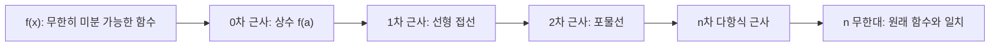

## 정의

무한히 미분 가능한 함수 f의 x = a 근방 급수 전개:

$$
f(x) = \sum_{n=0}^{\infty} \frac{f^{(n)}(a)}{n!} (x - a)^n
$$

**Maclaurin series**: a = 0인 특수 경우.

$$
f(x) = f(0) + f'(0)x + \frac{f''(0)}{2!}x^2 + \frac{f'''(0)}{3!}x^3 + \cdots
$$

## 문제 상황

알고리즘에서 Taylor series가 필요한 상황:

- **수치 근사**: 삼각함수, 지수함수를 다항식으로 근사하여 계산
- **생성함수**: 수열의 OGF/EGF를 다항식으로 표현
- **다항식 exp/log**: NTT 기반 다항식 연산에서 exp, log 계산
- **오차 분석**: 수치해석에서 근사 오차 상한 계산

## 시각화

항 수가 늘어날수록 원래 함수에 수렴:



## 핵심 아이디어

### 대표 Maclaurin 급수

$$
e^x = \sum_{n=0}^{\infty} \frac{x^n}{n!} = 1 + x + \frac{x^2}{2!} + \frac{x^3}{3!} + \cdots
$$

$$
\sin x = \sum_{n=0}^{\infty} \frac{(-1)^n x^{2n+1}}{(2n+1)!} = x - \frac{x^3}{3!} + \frac{x^5}{5!} - \cdots
$$

$$
\cos x = \sum_{n=0}^{\infty} \frac{(-1)^n x^{2n}}{(2n)!} = 1 - \frac{x^2}{2!} + \frac{x^4}{4!} - \cdots
$$

$$
\ln(1+x) = \sum_{n=1}^{\infty} \frac{(-1)^{n+1} x^n}{n} = x - \frac{x^2}{2} + \frac{x^3}{3} - \cdots \quad (|x| \leq 1)
$$

### 수렴 반경

급수가 수렴하는 x의 범위:

| 함수 | 수렴 반경 |
|:---|:---|
| $e^x$ | 모든 실수 (R = ∞) |
| $\sin x$, $\cos x$ | 모든 실수 (R = ∞) |
| $\ln(1+x)$ | -1 < x ≤ 1 (R = 1) |
| $\frac{1}{1-x}$ | -1 < x < 1 (R = 1) |

### Lagrange 나머지 (오차 상한)

n차 Taylor 다항식의 오차:

$$
R_n(x) = \frac{f^{(n+1)}(c)}{(n+1)!}(x-a)^{n+1} \quad \text{(어떤 c가 a와 x 사이에 존재)}
$$

항 수 n이 클수록 오차 감소. 수치해석에서 필요한 정밀도에 따라 n 결정.

### 점화식으로 효율적 계산

각 항을 이전 항에서 점화식으로 계산하면 O(k):

- $\sin x$: $t_{n+1} = t_n \cdot \frac{-x^2}{(2n+2)(2n+3)}$
- $e^x$: $t_{n+1} = t_n \cdot \frac{x}{n+1}$
- $\cos x$: $t_{n+1} = t_n \cdot \frac{-x^2}{(2n+1)(2n+2)}$

## 알고리즘

### sin(x) 근사 (k항까지)

```text
function sin_approx(x, k):
    result = 0
    term = x
    for n = 0 to k-1:
        result += term
        term *= -x*x / ((2*n+2) * (2*n+3))
    return result
```

### exp(x) 근사

```text
function exp_approx(x, k):
    result = 1
    term = 1
    for n = 1 to k:
        term *= x / n
        result += term
    return result
```

## 구현

<CodeWithOutput
  variants={[
    {
      language: "cpp",
      label: "C++",
      code: `#include <bits/stdc++.h>
using namespace std;

// sin(x) Taylor 근사 (k항)
double sin_taylor(double x, int k) {
    double result = 0, term = x;
    for (int n = 0; n < k; n++) {
        result += term;
        term *= -x * x / ((2.0*n+2) * (2.0*n+3));
    }
    return result;
}

// exp(x) Taylor 근사 (k항)
double exp_taylor(double x, int k) {
    double result = 1, term = 1;
    for (int n = 1; n <= k; n++) {
        term *= x / n;
        result += term;
    }
    return result;
}

int main() {
    ios::sync_with_stdio(false);
    cin.tie(nullptr);

    double x;
    int k;
    cin >> x >> k;

    cout << fixed << setprecision(6);
    cout << "sin(" << x << ") approx: " << sin_taylor(x, k) << "\\n";
    cout << "sin(" << x << ") exact:  " << sin(x) << "\\n";
    cout << "exp(" << x << ") approx: " << exp_taylor(x, k) << "\\n";
    cout << "exp(" << x << ") exact:  " << exp(x) << "\\n";

    return 0;
}`,
    },
    {
      language: "python",
      label: "Python",
      code: `import math

def sin_taylor(x, k):
    """sin(x) Taylor 근사 (k항)"""
    result = 0.0
    term = x
    for n in range(k):
        result += term
        term *= -x * x / ((2*n+2) * (2*n+3))
    return result

def exp_taylor(x, k):
    """exp(x) Taylor 근사 (k항)"""
    result = 1.0
    term = 1.0
    for n in range(1, k+1):
        term *= x / n
        result += term
    return result

def main():
    x = float(input())
    k = int(input())
    print(f"sin({x}) approx: {sin_taylor(x, k):.6f}")
    print(f"sin({x}) exact:  {math.sin(x):.6f}")
    print(f"exp({x}) approx: {exp_taylor(x, k):.6f}")
    print(f"exp({x}) exact:  {math.exp(x):.6f}")

main()`,
    },
  ]}
  cases={[
    {
      label: "x=1.0, k=10항",
      input: `1.0
10`,
      output: `sin(1.0) approx: 0.841471
sin(1.0) exact:  0.841471
exp(1.0) approx: 2.718282
exp(1.0) exact:  2.718282`,
    },
    {
      label: "x=0.5, k=5항",
      input: `0.5
5`,
      output: `sin(0.5) approx: 0.479426
sin(0.5) exact:  0.479426
exp(0.5) approx: 1.648721
exp(0.5) exact:  1.648721`,
    },
  ]}
/>

## 복잡도

| 항목 | 값 |
|:---|:---|
| **시간** | O(k) (k항 근사) |
| **공간** | O(1) |
| **정밀도** | k 증가에 따라 지수적으로 향상 |
| **실용 k** | double 정밀도: k=15~20 이면 충분 |

## 응용 (알고리즘)

### 1. 생성함수 (Generating Function)

수열 $a_n$의 OGF: $A(x) = \sum a_n x^n$. 다항식 연산으로 수열 합성곱 계산.

[[generating-function|Generating Function]] 참조.

### 2. 다항식 exp/log (NTT 기반)

형식적 멱급수 (Formal Power Series)에서:

$$
\exp(f(x)) = \sum_{n=0}^{\infty} \frac{f(x)^n}{n!} \pmod{x^N}
$$

Newton's method로 O(N log N) 계산. [[fft-ntt|FFT / NTT]] 참조.

### 3. 수치 적분

$\int_a^b f(x) dx$ 를 Taylor 급수로 근사 후 항별 적분. 닫힌 형식이 없는 함수에 유용.

### 4. 오일러 공식

$$
e^{ix} = \cos x + i \sin x
$$

복소수 지수와 삼각함수의 연결. 신호 처리, FFT의 이론적 기반.

## 함정

### 1. 수렴 반경 초과

$\ln(1+x)$는 $|x| > 1$에서 발산. 수렴 반경 밖에서 사용하면 오차가 무한히 커짐.

> [!WARNING]
> 수렴 반경 확인 없이 Taylor 급수를 사용하면 완전히 틀린 결과가 나올 수 있음.

### 2. 항 수 부족

k가 작으면 오차가 크다. 특히 x가 0에서 멀수록 더 많은 항이 필요.

### 3. 부동소수점 오차 누적

항 수가 너무 많으면 부동소수점 오차가 누적. 적절한 k 선택 필요.

### 4. 교대급수 소거 오차

$\sin x$, $\cos x$는 교대급수. 큰 x에서 큰 양수와 큰 음수가 소거되어 유효 자릿수 손실. 큰 x는 주기성을 이용해 $|x| \leq \pi/4$ 범위로 축소 후 계산.

### 5. 형식적 멱급수와 수렴 혼동

알고리즘에서 다항식 exp/log는 형식적 멱급수 (수렴 여부 무관). 수치 계산의 Taylor 급수와 다른 개념.

## BOJ 연습 문제

| 번호 | 제목 | 관련 개념 |
|:---|:---|:---|
| BOJ 1256 | 사전 | 이항 계수 (생성함수 응용) |
| BOJ 15824 | 너 봄에는 캡사이신이 맛있단다 | 기댓값 (EGF 응용) |
| BOJ 13725 | 수열의 합 | 다항식 연산 |

## 관련 위키

- [[generating-function|Generating Function]]
- [[fft-ntt|FFT / NTT]]
