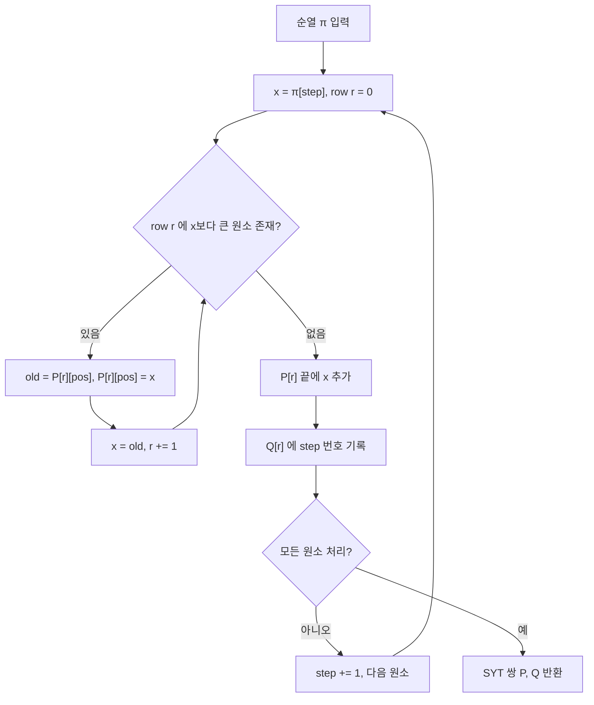

## 정의

**Young Diagram** 은 *행마다 길이가 단조 감소* 하는 칸들의 배열 (왼쪽 위 정렬). **Young Tableau** 는 그 칸에 1..n 을 채워 넣은 것 중 *행과 열 모두 증가* 하는 것 (Standard Young Tableau, SYT).

**RSK Correspondence (Robinson-Schensted-Knuth)** 는 *순열 ↔ 같은 모양 (shape) 의 SYT 쌍 (P, Q)* 사이의 전단사. PS 에서 *LIS / LDS / 순열의 chain 분해* 같은 통계를 한 자료구조로 환원.

## 문제 상황과 동기

순열의 LIS 길이는 DP 로 O(n log n) 이지만, *"disjoint LIS k 개의 최대 총 길이"* 같은 확장 질문은 naive greedy 로 불가능. RSK 는 **순열을 SYT 쌍으로 전단사** 시킴으로써 그런 통계를 *tableau shape 의 기하* 로 바꾼다.

Schensted 정리: RSK 로 만든 P 의 첫 행 길이 = LIS, 첫 열 길이 = LDS. Greene 정리: 처음 k 행 길이 합 = disjoint increasing 부분수열 k 개의 최대 총 길이.

이 구조는 순열 통계를 *기하 문제* 로 환원하고, SYT 개수 카운팅 (hook length formula), 표현론과도 연결되어 PS / 조합론 양쪽에서 핵심. Young tableau 없이 이런 문제를 풀 방법은 거의 없다.

## 시각화

```anim:young-tableau
{}
```

## RSK 삽입 흐름



## 핵심 사실

### Schensted 정리

순열 `π` 에 RSK 를 적용해 얻은 SYT 의 *첫 번째 행의 길이* = LIS(π).
*첫 번째 열의 길이* = LDS(π).

### Greene 정리 (일반화)

P-tableau 의 처음 k 행 길이 합 = `π` 의 *서로소 increasing 부분수열 k 개의 최대 길이 합*.

### Hook Length Formula

shape `λ` 의 SYT 개수 = `n! / Π_{cell} hook_length(cell)`.

각 셀의 hook length = (같은 행에서 오른쪽에 있는 셀 수) + (같은 열에서 아래에 있는 셀 수) + 1.

예: shape `λ = (3, 2, 1)`, n=6 일 때 SYT 개수:
```text
셀 (0,0): 오른쪽 2 + 아래 2 + 1 = 5
셀 (0,1): 오른쪽 1 + 아래 1 + 1 = 3
셀 (0,2): 오른쪽 0 + 아래 0 + 1 = 1
셀 (1,0): 오른쪽 1 + 아래 1 + 1 = 3
셀 (1,1): 오른쪽 0 + 아래 0 + 1 = 1
셀 (2,0): 오른쪽 0 + 아래 0 + 1 = 1

SYT 개수 = 6! / (5 * 3 * 1 * 3 * 1 * 1) = 720 / 45 = 16
```

## 구현

### LIS 길이만 빠르게 구하기

RSK 전체 계산 없이 P-tableau 첫 행 길이 (= LIS 길이) 만 필요하면, *patience sorting* 으로 O(n log n):

<CodeWithOutput
  variants={[
    {
      language: "cpp",
      label: "C++",
      code: `// LIS 길이: patience sorting (= RSK P[0] 길이)
#include <bits/stdc++.h>
using namespace std;
int main() {
    int n; cin >> n;
    vector<int> a(n);
    for (auto& x : a) cin >> x;
    
    vector<int> piles; // P-tableau 첫 행 (patience sorting)
    for (int x : a) {
        auto it = lower_bound(piles.begin(), piles.end(), x);
        if (it == piles.end()) piles.push_back(x);
        else *it = x;
    }
    cout << piles.size() << "\\n";
    return 0;
}`,
    },
    {
      language: "python",
      label: "Python",
      code: `import bisect, sys
input = sys.stdin.readline

n = int(input())
a = list(map(int, input().split()))

piles = []
for x in a:
    pos = bisect.bisect_left(piles, x)
    if pos == len(piles):
        piles.append(x)
    else:
        piles[pos] = x

print(len(piles))`,
    },
  ]}
  cases={[
    {
      label: "예제 1",
      input: "4\n3 1 4 2",
      output: "2",
    },
    {
      label: "LIS 길이 4",
      input: "6\n1 3 2 5 4 6",
      output: "4",
    },
  ]}
/>

### RSK insertion (full implementation)

```cpp
// O(N√N) RSK insertion (순열 -> (P, Q) SYT 쌍)
#include <vector>
#include <algorithm>
using namespace std;

using Tableau = vector<vector<int>>;

// Binary search bump: P[row] 에서 x 보다 큰 최소 원소를 찾아 교체.
// 없으면 row 끝에 x 추가 후 -1 반환.
int bump(vector<int>& row, int x) {
    auto it = upper_bound(row.begin(), row.end(), x);
    if (it == row.end()) {
        row.push_back(x);
        return -1;
    }
    int old = *it;
    *it = x;
    return old;
}

pair<Tableau, Tableau> rsk(vector<int> perm) {
    Tableau P, Q;
    int n = perm.size();
    
    for (int step = 0; step < n; step++) {
        int x = perm[step];
        int r = 0;
        
        // bump 하면서 내려가기
        while (true) {
            if (r >= (int)P.size()) {
                P.push_back({x});
                Q.push_back({step + 1}); // step+1 = insertion order
                break;
            }
            int old = bump(P[r], x);
            if (old == -1) {
                // x 가 row[r] 끝에 추가됨
                if (r >= (int)Q.size()) Q.resize(r + 1);
                Q[r].push_back(step + 1);
                break;
            }
            x = old;
            r++;
        }
    }
    return {P, Q};
}
```

### 작은 입력 step trace

```text
순열 π = [3, 1, 4, 2]

Step 0: insert 3
  P = [[3]]
  Q = [[1]]

Step 1: insert 1
  1 bumps 3 in row 0 → P[0] = [1], 3 goes to row 1
  P = [[1], [3]]
  Q = [[1], [2]]

Step 2: insert 4
  4 > 1, append to P[0]
  P = [[1, 4], [3]]
  Q = [[1, 2], [2]]

Step 3: insert 2
  2 bumps 4 in row 0 → P[0] = [1, 2], 4 goes to row 1
  4 bumps nothing in row 1, appends
  P = [[1, 2], [3, 4]]
  Q = [[1, 2], [2, 4]]

LIS = P[0] 길이 = 2 (실제 LIS: 1,2 또는 1,4 또는 3,4)
LDS = P 첫 열 길이 = 2
```

## 응용

### 1. LIS / LDS

Schensted: 첫 행 길이 = LIS, 첫 열 길이 = LDS. RSK 자체가 O(n²) 또는 O(n log n) (binary search bump) 로 LIS 와 동치.

### 2. Disjoint LIS / Three Investigators

Greene 정리로 *서로소 증가 수열 k 개 의 최대 총 길이* = 처음 k 행 길이 합.

BOJ 18461 (Disjoint LIS): RSK 삽입 후 처음 k 행의 합을 구하면 됨. k=1 이면 일반 LIS.

### 3. SYT 개수 카운팅

Hook length formula 로 다항 시간. 큰 n 에 modular.

실전 구현: 각 셀의 hook length 를 미리 계산 후 곱의 역원을 modular inverse 로.

### 4. 순열 사이클 구조

RSK 역변환: `(P, Q)` 쌍에서 원래 순열 복원 가능. 순열의 *행의 개수* = 순열의 최장 감소 부분수열, *열의 개수* = 최장 증가 부분수열.

### 5. Schur Polynomial / 표현론

대수적 응용 (PS 에서는 드묾). symmetric group S_n 의 표현론에서 SYT 가 basis.

## 복잡도

| 작업 | 비용 |
|:---|:---|
| RSK insert 한 원소 | O(√n) (binary search bump) |
| 전체 RSK | O(n √n) 또는 O(n log n) |
| Hook length formula | O(n) |

## 함정

### 1. shape 의 정의

행 길이 ≥ 행 길이의 약한 단조 감소. SYT 는 *행 / 열 둘 다* 증가.

### 2. P, Q 의 모양 일치

RSK 의 출력 `(P, Q)` 는 *항상 같은 shape*. 다른 shape 가 나오면 구현 버그.

### 3. Greene 정리 적용 범위

"서로소" 가 필수. *교차 가능* 한 경우의 합은 다른 정리.

### 4. RSK 의 역변환

RSK 는 전단사이므로 역변환 가능. `(P, Q)` 에서 원래 순열을 복원하려면 삽입을 역순으로 수행 (reverse bumping). 구현 복잡도는 정방향과 동일 O(n log n).

> [!WARNING]
> RSK 구현에서 Q-tableau 의 행 크기를 P-tableau 와 동기화하지 않으면 두 tableau 의 shape 가 달라져 RSK 전단사 성질이 깨진다. `P.size() == Q.size()` 를 항상 유지해야 한다.

## BOJ 연습 문제

| 번호 | 제목 | 링크 |
|:---|:---|:---|
| BOJ 18594 | Three Investigators | [kokoa-lab](https://github.com/kokoa-lab/boj-problems/tree/main/organize_problems/18500-18599/18594) |
| BOJ 18461 | Disjoint LIS | [kokoa-lab](https://github.com/kokoa-lab/boj-problems/tree/main/organize_problems/18400-18499/18461) |

## 참고

- [[LGV Theorem]]
- [[Generating Function]]
- [[Matroid]]
- [[LIS|최장 증가 부분수열]]
- [[lis|최장 증가 부분수열 (LIS)]]
