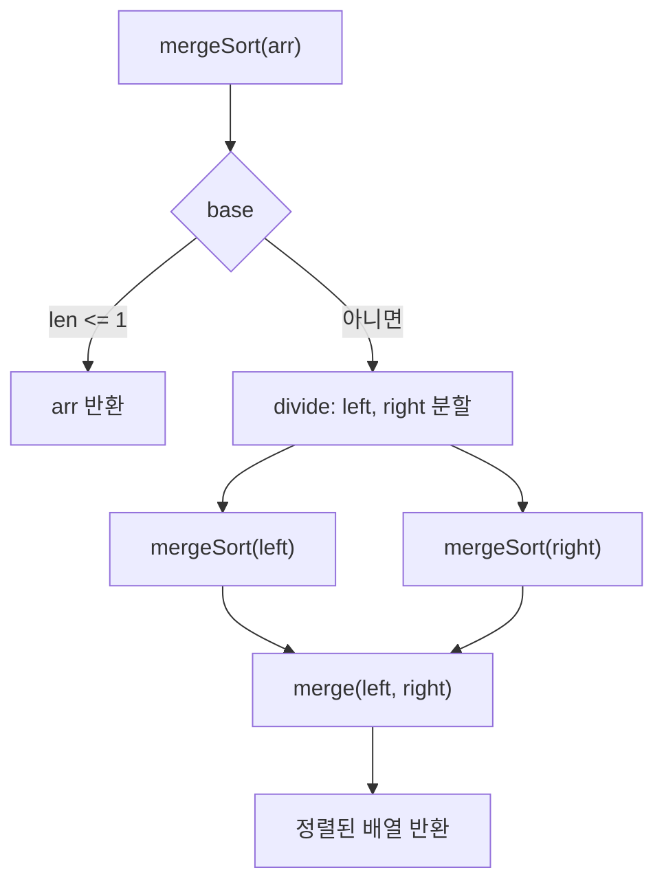

## 정의

**Merge Sort (병합 정렬)** 는 분할 정복 (Divide & Conquer) 으로 동작하는 비교 정렬. 배열을 반으로 나눠 각각 정렬한 뒤, 두 정렬된 부분을 *병합 (merge)* 한다.

John von Neumann 이 1945 년에 고안한 알고리즘. **모든 입력에 대해 O(n log n) 을 보장** 하고 **안정 정렬** 인 것이 특징. [[External Merge Sort]] 의 기초.

전체 비교는 [[정렬 알고리즘]] 참고. RDBMS 에서의 메모리 spill 메커니즘은 [[정렬·해시는 메모리가 부족하면 어디로 새는가, PGA, work_mem, Workspace Memory]] 참고.

## 시각화

```anim:merge-sort
{}
```

## 알고리즘

세 단계.

1. **Divide**: 배열을 중간에서 둘로 나눈다.
2. **Conquer**: 각 부분을 재귀적으로 Merge Sort.
3. **Combine (Merge)**: 정렬된 두 부분을 비교하며 합친다.

```text
mergeSort(arr):
  if length(arr) ≤ 1: return arr
  mid = length(arr) / 2
  left  = mergeSort(arr[0..mid])
  right = mergeSort(arr[mid..])
  return merge(left, right)

merge(left, right):
  result = []
  i = j = 0
  while i < len(left) and j < len(right):
    if left[i] ≤ right[j]:
      result.push(left[i]); i++
    else:
      result.push(right[j]); j++
  result.push(나머지 left, 나머지 right)
  return result
```

### Merge 단계가 핵심

두 정렬된 배열을 합치는 데 **선형 시간** 이 든다. 각 배열의 맨 앞만 비교하면 되기 때문.

```
left:  [1, 4, 7]
right: [2, 5, 6]

1 vs 2 → 1 채택       result = [1]
4 vs 2 → 2 채택       result = [1, 2]
4 vs 5 → 4 채택       result = [1, 2, 4]
7 vs 5 → 5 채택       result = [1, 2, 4, 5]
7 vs 6 → 6 채택       result = [1, 2, 4, 5, 6]
7 (남음)               result = [1, 2, 4, 5, 6, 7]
```

## 복잡도

| 항목 | 값 |
|:---|:---|
| **시간 (최선)** | O(n log n) |
| **시간 (평균)** | O(n log n) |
| **시간 (최악)** | O(n log n) |
| **공간** | O(n) (보조 배열) |
| **안정성** | ✓ Stable |
| **In-place** | ✗ (보조 배열 필요) |

### 왜 항상 O(n log n) 인가

재귀 트리의 깊이가 log₂ n. 각 깊이에서 모든 원소가 정확히 한 번씩 merge 됨 (총 n 비교 작업). 따라서 **log n × n = n log n** 회 작업.

```text
[8, 3, 1, 7, 0, 10, 2, 6]
       ↓ divide
[8, 3, 1, 7]  [0, 10, 2, 6]
       ↓ divide
[8,3] [1,7]  [0,10] [2,6]
       ↓ divide
[8][3] [1][7]  [0][10] [2][6]
       ↓ merge (level log n)
[3,8] [1,7]  [0,10] [2,6]
       ↓ merge
[1,3,7,8]  [0,2,6,10]
       ↓ merge
[0,1,2,3,6,7,8,10]
```

> [!IMPORTANT]
> **Quicksort 의 O(n²) 최악 케이스가 없다.** 입력이 어떻게 생겼든 정확히 같은 시간이 든다. 응답 시간 보장이 중요한 시스템 (실시간 / DB / 게임 서버) 에서 유리.

## 알고리즘 흐름도



재귀 트리의 각 레벨에서 모든 원소가 정확히 한 번 merge 된다. 레벨 수가 log₂ n 이므로 전체 O(n log n).

## In-place 변형

표준 Merge Sort 는 O(n) 보조 메모리를 쓰지만, **In-place Merge Sort** 도 가능하다. 다만 구현이 복잡하고 상수항이 크다. 실무에서 흔히 쓰는 변형은 다음.

### Bottom-up Merge Sort

재귀 대신 **반복** 으로 구현. 크기 1 → 2 → 4 → ... 의 부분 배열을 차례로 머지.

```javascript
function mergeSortBottomUp(arr) {
  const n = arr.length;
  const aux = new Array(n);
  for (let width = 1; width < n; width *= 2) {
    for (let lo = 0; lo < n - width; lo += 2 * width) {
      const mid = lo + width - 1;
      const hi = Math.min(lo + 2 * width - 1, n - 1);
      merge(arr, aux, lo, mid, hi);
    }
  }
  return arr;
}
```

재귀 호출 스택이 없어 **공간 O(log n) → O(1)** (보조 배열 외). DB 시스템이 자주 쓰는 패턴.

### Natural Merge Sort

입력에서 이미 정렬된 부분 (run) 을 찾아 그것을 단위로 merge. 거의 정렬된 입력에 O(n) 가까운 성능. Timsort 의 기초.

## Quicksort 와의 비교

| 항목 | Merge Sort | Quick Sort |
|:---|:---|:---|
| 평균 시간 | O(n log n) | O(n log n) |
| **최악 시간** | **O(n log n) 보장** | O(n²) (드물지만 가능) |
| 공간 | O(n) | O(log n) |
| 안정성 | ✓ Stable | ✗ Unstable |
| In-place | ✗ | ✓ (거의) |
| 캐시 친화 | △ (별도 메모리 접근) | ✓ (in-place) |
| 실제 속도 | Quick 보다 조금 느림 | 평균 더 빠름 |

> [!TIP]
> **선택 기준**: 안정성이 필요하거나 응답 시간 보장이 필요하면 Merge. 평균 성능과 메모리 효율이 우선이면 Quick. 둘 다 필요하면 **Timsort** (Merge + Insertion 하이브리드, Python / Java / Rust 표준).

## 실무 활용

### Timsort (Python / Java / Rust)

Tim Peters 가 2002 년 Python 용으로 만든 알고리즘. **현실 데이터에서 자주 보이는 정렬된 부분 (run)** 을 활용한 Merge Sort 변형.

```python
# Python
sorted([3, 1, 4, 1, 5, 9, 2, 6])  # Timsort
# Java
Arrays.sort(arr);  // 객체 배열은 Timsort
```

핵심 아이디어:
1. 입력에서 자연스러운 run (이미 정렬된 부분) 식별
2. run 이 너무 짧으면 Insertion Sort 로 길이 맞춤
3. run 들을 Merge Sort 방식으로 합침
4. 정렬된 입력에 O(n), 무작위 입력에 O(n log n)

### 외부 정렬의 기초

[[External Merge Sort]] 는 Merge Sort 를 **디스크 단위로 확장** 한 것:
- "정렬된 부분 배열" → "정렬된 Run 파일"
- "merge 단계" → "K-way Merge" (한 번에 여러 Run 합침)

RDBMS 의 `ORDER BY` 처리에서 데이터 > 메모리 일 때 사용.

### 연결 리스트 정렬에 최적

배열은 quicksort 가 빠르지만, **연결 리스트** 는 임의 접근이 비싸 quicksort 가 비효율. Merge Sort 는 순차 접근만 하므로 연결 리스트 정렬의 표준.

```javascript
// 연결 리스트 merge sort (LeetCode 148번)
function sortList(head) {
  if (!head || !head.next) return head;
  const mid = getMiddle(head);
  const right = mid.next;
  mid.next = null;
  return merge(sortList(head), sortList(right));
}
```

## 언제 Merge Sort 를 선택하는가

### Merge Sort 가 유리한 경우

| 상황 | 이유 |
|:---|:---|
| **안정 정렬이 필요할 때** | 동일 키의 원소 순서가 보존됨 |
| **응답 시간 보장이 필요할 때** | 최악도 O(n log n) |
| **연결 리스트 정렬** | 순차 접근만 필요, 임의 접근 불필요 |
| **외부 정렬** | 디스크 블록 단위로 자연스럽게 확장 |
| **병렬 정렬** | divide 가 독립적이라 fork/join 에 적합 |

### Quicksort 가 유리한 경우

- 임의 배열에서 최악 케이스 확률이 낮을 때
- 메모리가 빡빡할 때 (in-place)
- 캐시 지역성이 중요할 때 (in-place 접근 패턴)

> [!TIP]
> Python `sorted()`, Java `Arrays.sort(Object[])`, Rust `slice::sort()` 는 모두 Merge Sort 기반 Timsort 를 표준으로 사용한다. Java `Arrays.sort(int[])` (primitive 배열) 는 Dual-Pivot Quicksort 를 쓴다.

### 비용 요약

- 보조 배열 O(n): 메모리 민감 환경에서는 부담
- 상수항이 크다: 소규모 (n ≤ 32) 에서는 [[Insertion Sort]] 가 빠르다 (Timsort 가 이 점을 활용)
- 캐시 미스: 원본과 보조 배열을 번갈아 접근하므로 in-place Quicksort 보다 캐시 효율이 낮다

## 함정

### 1. 공간 비용

n=10⁹ 정렬에 추가 메모리 n=10⁹ 필요 → 메모리 부족하면 [[External Merge Sort]] 필요.

### 2. 캐시 미스

In-place 가 아니라 메모리 두 영역 (원본 + 보조) 을 번갈아 접근. 작은 n 에서는 quicksort 보다 캐시 효율이 떨어진다.

### 3. 작은 부분 배열에서의 비효율

Merge 의 상수항이 크다. 작은 부분 (예: n ≤ 16) 에서는 Insertion Sort 가 훨씬 빠르다. Timsort 가 이 점을 활용한다.

## 참고

- [[정렬 알고리즘]]
- [[Quick Sort]]
- [[External Merge Sort]]
- [[Heap Sort]]
- [[Insertion Sort]]
- [[정렬·해시는 메모리가 부족하면 어디로 새는가, PGA, work_mem, Workspace Memory]]
- Knuth, *The Art of Computer Programming, Vol. 3 §5.2.4*
