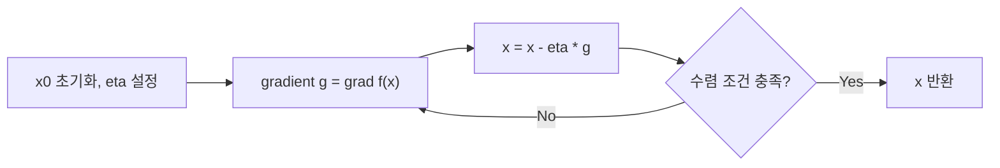

## 정의

**경사 하강법 (Gradient Descent, GD)** 은 미분 가능한 목적 함수 f(x) 의 **1차 도함수 (gradient)** 방향으로 반복 이동하며 극소값 (local minimum) 을 찾는 1차 최적화 알고리즘. 머신러닝 / 딥러닝 학습의 핵심 엔진.

## 문제 상황과 동기

f(x) 가 복잡하여 closed-form 해 (grad f = 0) 를 구할 수 없음. 특히 고차원 (d >> 1) 에서는 Newton 법 (Hessian 필요) 이 현실적으로 불가능.

- **Naive (grid search)**: 차원당 그리드 M -> M^d. d=1000 이면 천문학적.
- **Gradient Descent**: grad f 만 있으면 O(d) 반복. 차원에 선형적.

핵심 통찰: *함수가 국소적으로 선형 근사 가능하다면, 반대 방향으로 가면 함수값이 감소한다.*

## 시각화

```anim:gradient-descent
{}
```

## 핵심 아이디어

`x_{t+1} = x_t - eta * grad f(x_t)`

- `eta` (learning rate / step size): 한 step 의 크기
- `grad f(x_t)`: x_t 에서의 gradient (가장 가파른 증가 방향)
- `-grad f(x_t)`: 가장 가파른 감소 방향

**Convex** 함수: 전역 최소로 수렴 보장. **Non-convex**: saddle point / local min 에 빠질 수 있음.

## 알고리즘

반복 갱신 흐름:



수렴 조건 예시: `||g|| < eps` 또는 `|f(x_t) - f(x_{t-1})| < eps`.

```text
1. 초기 x0, learning rate eta 설정
2. for t = 0, 1, ... until convergence:
3.   g = grad f(x_t)
4.   x_{t+1} = x_t - eta * g
5.   if ||g|| < eps: break
6. return x_t
```

## 구현

<CodeWithOutput
  variants={[
    {
      language: "cpp",
      label: "C++",
      code: `// Gradient descent: f(x,y) = x^2 + 2y^2 (convex)
#include <bits/stdc++.h>
using namespace std;
int main() {
    double x = 3.0, y = 2.0;
    double lr = 0.1;
    int max_iter = 100;
    for (int i = 0; i < max_iter; i++) {
        double gx = 2 * x;
        double gy = 4 * y;
        x -= lr * gx;
        y -= lr * gy;
        cout << i << " " << x << " " << y << " "
             << (x*x + 2*y*y) << "\\n";
    }
}`,
    },
    {
      language: "python",
      label: "Python",
      code: `# Gradient descent: f(x,y) = x^2 + 2y^2
x, y = 3.0, 2.0
lr = 0.1
for i in range(100):
    gx, gy = 2*x, 4*y
    x -= lr * gx
    y -= lr * gy
    print(i, f"{x:.6f}", f"{y:.6f}", f"{x*x + 2*y*y:.6f}")`,
    },
  ]}
  cases={[
    {
      label: "기본 실행",
      input: "",
      output: `0 2.400000 1.200000 8.640000
1 1.920000 0.720000 4.723200
2 1.536000 0.432000 2.613888
...
98 0.000694 0.000014 4.894e-07
99 0.000555 0.000008 3.187e-07`,
    },
  ]}
/>

## 복잡도

| 항목 | 값 |
|:---|:---|
| **시간 (iteration 당)** | O(d) (gradient 계산) |
| **수렴 (convex, smooth)** | O(1/eps) 회 iteration |
| **수렴 (strongly convex)** | O(log(1/eps)) 회 (linear convergence) |
| **공간** | O(d) |

## 변형 / 활용

### 주요 변형 비교

| 변형 | 수식 핵심 | 특징 |
|:---|:---|:---|
| **Vanilla GD** | `x = x - eta * grad` | 기본. 수렴 느림 |
| **SGD** | 샘플 1개로 gradient 추정 | 빠름, 노이즈 많음 |
| **Mini-batch GD** | 배치 B 개 평균 gradient | SGD 와 GD 의 절충 |
| **Momentum** | `v = beta*v - eta*grad; x = x + v` | 관성으로 진동 억제, 수렴 빠름 |
| **RMSprop** | gradient 제곱의 이동 평균으로 lr 조절 | 적응형 lr |
| **Adam** | Momentum + RMSprop | 가장 널리 사용, 대부분의 딥러닝 기본값 |

### 머신러닝에서의 역할

- **Linear Regression**: MSE loss 의 gradient 는 `X^T(Xw - y)`, GD 로 최소화
- **Logistic Regression**: log loss 의 gradient, closed-form 없음 -> GD 필수
- **Neural Network**: backpropagation 으로 gradient 계산 + SGD/Adam 으로 갱신
- **최적제어, 로봇 공학**: 목적함수 (에너지, 오차) 최소화

### 학습률 스케줄링

학습률을 고정하지 않고 훈련 진행에 따라 조절:

| 방법 | 설명 |
|:---|:---|
| Step decay | N 에폭마다 eta *= gamma (예: 0.1씩 감소) |
| Cosine annealing | 코사인 곡선을 따라 감소 |
| Warmup | 처음 몇 에폭은 lr 을 작게 시작해 안정화 |

## 수렴 분석 (Convex Case)

f(x) = x^2 + 2y^2 은 strongly convex (Hessian = diag(2,4) > 0). GD 는 linear rate (기하급수적) 로 수렴:

```
||x_t - x*|| <= c^t * ||x_0 - x*||,   c = max(|1 - eta*L|, |1 - eta*mu|)
```

- L = 4 (Hessian 최대 eigenvalue = Lipschitz 상수)
- mu = 2 (Hessian 최소 eigenvalue = strong convexity 상수)
- eta = 0.1 일 때: c = max(|1 - 0.4|, |1 - 0.2|) = max(0.6, 0.8) = 0.8
- 100 step 후 오차: 0.8^100 ≈ 2e-10

최적 eta = 2/(L+mu) = 2/6 ≈ 0.333 이면 c = (L-mu)/(L+mu) = 2/6 ≈ 0.333 으로 수렴 최대화.

## 함정

### 1. Learning Rate 선택

eta 가 너무 크면 발산, 너무 작으면 수렴 느림.

```text
eta 크다: x 가 최소점을 넘어 진동 또는 발산
eta 작다: 수렴하지만 iteration 이 너무 많이 필요
적정 eta: f(x) 의 Lipschitz 상수 L 에 대해 eta <= 1/L 이면 수렴 보장 (convex smooth)
```

실용적 시작점: `eta = 0.01 ~ 0.001`. Grid search 또는 learning rate finder (lr_find) 활용.

### 2. Saddle Point

고차원 최적화에서는 local minimum 보다 **saddle point** (모든 방향으로 gradient 가 0 이지만 극소가 아닌 지점) 가 훨씬 많음. Gradient 가 0 이어도 수렴했다고 단정 금물.

Momentum 이나 Adam 을 쓰면 saddle point 탈출이 더 쉬움. SGD 의 노이즈도 saddle 탈출에 도움.

### 3. Feature Scaling

차원 간 scale 이 다르면 gradient 방향이 왜곡됨: 값이 큰 차원으로 지나치게 편향.

```text
예: x1 범위 [0, 1000], x2 범위 [0, 1]
gradient 는 x1 방향으로 훨씬 크게 계산 -> eta 선택 어려움, 수렴 느림
```

해결: StandardScaler (zero mean, unit variance) 또는 MinMaxScaler 적용.

### 4. Vanishing / Exploding Gradient

깊은 신경망에서 gradient 가 역전파 시 지수적으로 작아지거나 (vanishing) 커짐 (exploding). 대응:
- Batch Normalization
- Gradient Clipping (exploding 방지)
- ResNet 스킵 연결 (vanishing 완화)

### 5. 수렴 판정의 어려움

`||grad|| < eps` 는 필요 조건이지 충분 조건이 아님. saddle point 에서도 성립. 실무에서는 validation loss 가 더 이상 감소하지 않는 지점 (early stopping) 을 사용.

## 수렴 속도 비교

f(x) = x^2 + 2y^2 (strongly convex, L=4, mu=2):

| 알고리즘 | 수렴 특성 | 100 step 후 오차 |
|:---|:---|:---|
| Vanilla GD (eta=0.1) | 선형 수렴, c = max(0.6, 0.8) = 0.8 | 0.8^100 ~ 2e-10 |
| SGD (eta=0.1) | 선형 수렴 + 노이즈 | 수렴하나 oscillation |
| Momentum (beta=0.9) | 이차 수렴에 가까움 | 더 빠른 수렴 |
| Adam | adaptive lr | 빠른 초기 수렴 |

## BOJ 연습 문제

| 번호 | 제목 | 태그 |
|:---|:---|:---|
| BOJ 9735 | 삼차 방정식 풀기 | 수치해석 / Newton's method |
| BOJ 13147 | Dressing Up | GD 응용 / 최적화 |
| BOJ 2079 | 팰린드롬 문자열 | - |
| BOJ 15453 | 피자 배달 | Ternary Search (1D 최소화) |

## GD vs 다른 최적화 기법

| 기법 | 필요 정보 | 적용 | 특징 |
|:---|:---|:---|:---|
| **Gradient Descent** | 1차 도함수 (gradient) | 미분 가능 함수 | 빠름, 고차원 OK |
| **Newton's Method** | 2차 도함수 (Hessian) | 강 볼록 함수 | 이차 수렴, Hessian 역행렬 O(d^3) |
| **[[Ternary Search|삼분 탐색]]** | 함수 값 | 단봉 함수 (1D) | 미분 불필요, 1D 전용 |
| **[[Simulated Annealing|담금질 기법]]** | 함수 값 | 비볼록, 조합 최적화 | 확률적, 전역 최적 가능 |
| **[[Heuristics|휴리스틱]]** | - | 어떤 함수든 | 근사 해, 빠름 |

GD 는 미분 가능한 고차원 연속 최적화에서 사실상 표준.

## 참고

- [[Heuristics|휴리스틱]]
- [[Simulated Annealing|담금질 기법]]
- Cauchy, "Methode generale pour la resolution des systemes d'equations" (1847)
- Rumelhart, Hinton, Williams, "Learning representations by back-propagating errors" (1986)
