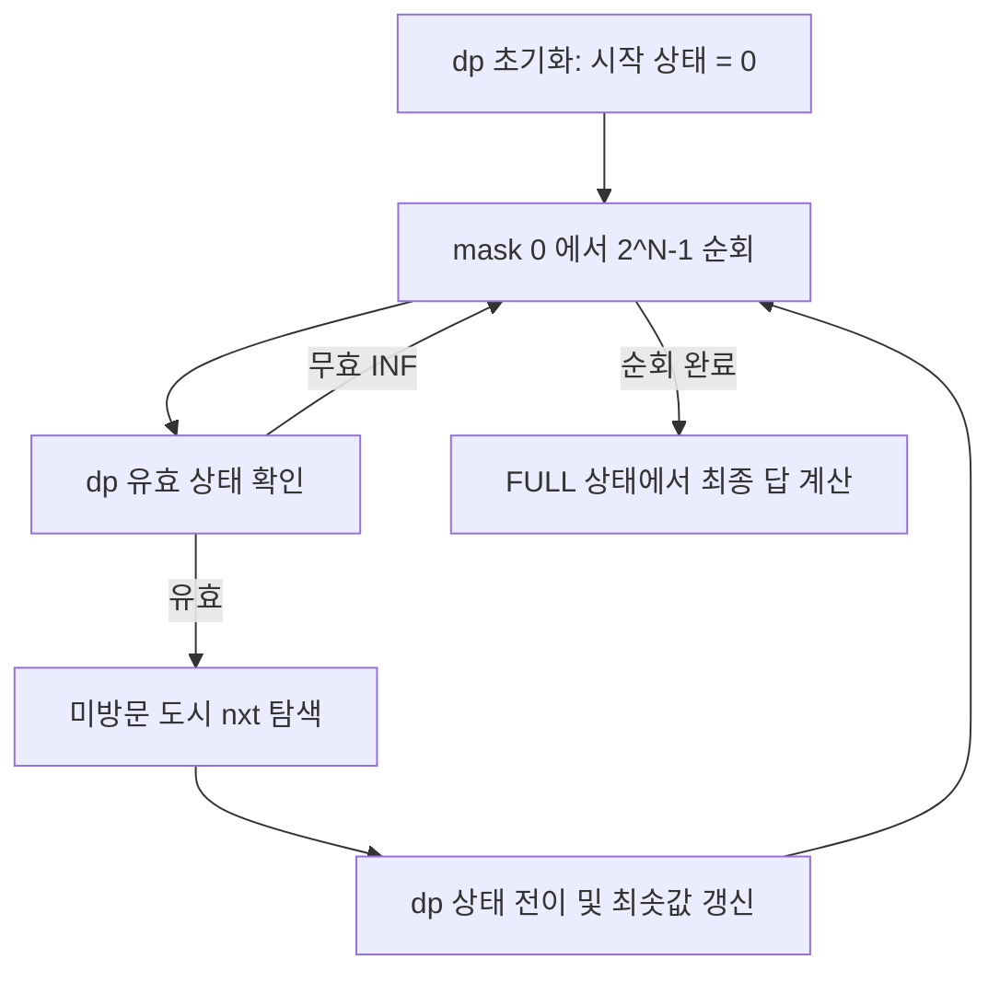

## 정의

**외판원 순회 문제 (TSP)** 는 N 개 도시를 모두 **정확히 한 번씩** 방문하고 시작 도시로 돌아오는 **최소 비용 경로 (Hamiltonian cycle)** 를 찾는 NP-hard 문제.

Held-Karp 알고리즘 (bitmask DP) 으로 O(2^N · N^2) 에 해결. N ≤ 20 정도에서 사용.

## 문제 상황과 동기

모든 도시 방문 최소 비용 경로.

- **naive (brute-force)**: N! 개의 순열 전부 탐색. N=12 이면 479M, N=20 이면 불가능.
- **Held-Karp DP**: 부분 경로를 비트마스크로 저장. 중복 계산 제거. O(2^N · N^2).

핵심 통찰: *"어떤 도시들을 방문했고, 마지막으로 어디에 있는가"* 만 기억하면, 방문 순서의 세부 사항은 무관. DP[mask][last] = 최소 비용.

## 시각화

```anim:tsp
{}
```

## 핵심 아이디어

```
DP[mask][last] = "mask 에 속한 도시를 방문하고, 마지막이 last 일 때 최소 비용"

초기화:
    DP[1 << start][start] = 0

점화식:
    for each next not in mask:
        DP[mask | (1 << next)][next]
            = min(DP[mask | (1 << next)][next],
                  DP[mask][last] + cost[last][next])

정답:
    min over last of DP[(1<<N)-1][last] + cost[last][start]
```

## 구현

<CodeWithOutput
  variants={[
    {
      language: "cpp",
      label: "C++",
      code: `// TSP bitmask DP, O(2^N * N^2)
#include <bits/stdc++.h>
using namespace std;
const int INF = 1e9;

int tsp(vector<vector<int>>& cost, int start) {
    int n = cost.size();
    int FULL = (1 << n) - 1;
    vector<vector<int>> dp(1 << n, vector<int>(n, INF));
    dp[1 << start][start] = 0;

    for (int mask = 1; mask <= FULL; mask++) {
        for (int last = 0; last < n; last++) {
            if (!(mask & (1 << last))) continue;
            if (dp[mask][last] == INF) continue;
            for (int nxt = 0; nxt < n; nxt++) {
                if (mask & (1 << nxt)) continue;
                int nmask = mask | (1 << nxt);
                dp[nmask][nxt] = min(dp[nmask][nxt],
                    dp[mask][last] + cost[last][nxt]);
            }
        }
    }

    int ans = INF;
    for (int last = 0; last < n; last++) {
        if (last == start) continue;
        ans = min(ans, dp[FULL][last] + cost[last][start]);
    }
    return ans;
}

int main() {
    vector<vector<int>> cost = {
        {0, 10, 15, 20},
        {10, 0, 35, 25},
        {15, 35, 0, 30},
        {20, 25, 30, 0}
    };
    cout << tsp(cost, 0);
    return 0;
}`,
    },
    {
      language: "python",
      label: "Python",
      code: `# TSP bitmask DP, O(2^N * N^2)
import sys
INF = 10**9

def tsp(cost, start=0):
    n = len(cost)
    FULL = (1 << n) - 1
    dp = [[INF] * n for _ in range(1 << n)]
    dp[1 << start][start] = 0

    for mask in range(1 << n):
        for last in range(n):
            if not (mask & (1 << last)):
                continue
            if dp[mask][last] == INF:
                continue
            for nxt in range(n):
                if mask & (1 << nxt):
                    continue
                nmask = mask | (1 << nxt)
                cand = dp[mask][last] + cost[last][nxt]
                if cand < dp[nmask][nxt]:
                    dp[nmask][nxt] = cand

    ans = INF
    for last in range(n):
        if last == start:
            continue
        ans = min(ans, dp[FULL][last] + cost[last][start])
    return ans

cost = [
    [0, 10, 15, 20],
    [10, 0, 35, 25],
    [15, 35, 0, 30],
    [20, 25, 30, 0]
]
print(tsp(cost, 0))`,
    },
  ]}
  cases={[
    {
      label: "4 도시",
      input: `4x4 대칭 행렬`,
      output: `80`,
    },
  ]}
/>

## 복잡도

| 항목 | 값 |
|:---|:---|
| **시간 (Held-Karp DP)** | O(2^N · N^2) |
| **시간 (Brute-force)** | O(N!) |
| **공간** | O(2^N · N) |
| **N 제한** | N ≤ 20 (DP), N ≤ 1000 (heuristic) |

## 변형 / 활용

- **DP with bitmask**: N ≤ 20, 정확 최적해.
- **Branch and Bound**: N=40~100, 정확 해, 가지치기 강력.
- **2-opt / 3-opt**: 휴리스틱, N=10^5 이상, 근사.
- **Christofides**: 1.5-근사, metric TSP.
- **Concorde**: TSP solver, N=10^4 이상 가능.
- **차량 경로 문제 (VRP)**: TSP 일반화.

## 함정

### 1. DP 배열 크기

N=20 일 때 dp[2^20][20] = 약 20M int. 80MB. N=22 부터 약 400MB.

### 2. 경로 복원

점화식만으로 경로를 알 수 없음. 별도의 parent 배열 필요.

### 3. 대칭 vs 비대칭 TSP

cost[i][j] != cost[j][i] 면 비대칭. 점화식은 동일하나 triangle inequality 가 없으면 approximation 더 어려움.

### 4. overflow

C++ int 는 N=20, cost 10^6 이면 int overflow. long long 추천.

## BOJ 연습 문제

| 번호 | 제목 | 정답률 | 링크 |
|:---|:---|---:|:---|
| BOJ 2098 | 외판원 순회 | - | [kokoa-lab](https://github.com/kokoa-lab/boj-problems/tree/main/organize_problems/2000-2099/2098) |
| BOJ 10971 | 외판원 순회 2 | - | [kokoa-lab](https://github.com/kokoa-lab/boj-problems/tree/main/organize_problems/10900-10999/10971) |
| BOJ 16198 | 에너지 모으기 | - | [kokoa-lab](https://github.com/kokoa-lab/boj-problems/tree/main/organize_problems/16100-16199/16198) |
| BOJ 16991 | 외판원 순회 3 (2D) | - | [kokoa-lab](https://github.com/kokoa-lab/boj-problems/tree/main/organize_problems/16900-16999/16991) |

## DP 상태 전이 흐름



## 실제 응용 사례

TSP 는 순수 이론 문제를 넘어 다양한 실용 문제에서 나타납니다.

| 도메인 | 실제 문제 |
|:---|:---|
| 물류 / 배달 | 배달 경로 최적화, 트럭 루트 계획 |
| 반도체 | PCB 드릴 홀 순서 최적화 |
| DNA 염기서열 | Shortest Superstring |
| 게임 | NPC 순찰 경로, 맵 순회 AI |
| 데이터센터 | 서버 작업 스케줄링 |

## 근사 알고리즘 상세

### 2-opt 지역 탐색

현재 경로에서 두 엣지를 골라 교환했을 때 더 짧아지면 교환. 개선이 없을 때까지 반복.

```python
def two_opt(route, dist):
    improved = True
    while improved:
        improved = False
        n = len(route)
        for i in range(1, n - 1):
            for j in range(i + 1, n):
                before = dist[route[i-1]][route[i]] + dist[route[j]][route[(j+1) % n]]
                after  = dist[route[i-1]][route[j]] + dist[route[i]][route[(j+1) % n]]
                if after < before:
                    route[i:j+1] = route[i:j+1][::-1]
                    improved = True
    return route
```

O(N^2) per iteration. 실용적으로 빠르고 품질 좋음.

### Christofides 알고리즘 (1.5-근사)

1. 최소 신장 트리 (MST) 계산
2. MST 의 홀수 차수 정점에 최소 비용 완벽 매칭
3. Eulerian circuit 추출
4. 지름길 적용

**보장**: 최적해의 1.5배 이하. metric TSP 에서만 성립.

## 경로 복원 구현

점화식만으로는 최소 비용은 알 수 있지만 경로를 알 수 없음. `parent` 배열 추가로 역추적.

```cpp
vector<vector<int>> parent(1 << n, vector<int>(n, -1));

// dp 갱신 시 parent 기록
if (dp[nmask][nxt] > dp[mask][last] + cost[last][nxt]) {
    dp[nmask][nxt] = dp[mask][last] + cost[last][nxt];
    parent[nmask][nxt] = last;
}

// 역추적
vector<int> path;
int full = (1 << n) - 1;
int cur = /* 최적 last 도시 */;
int cur_mask = full;
while (cur != -1) {
    path.push_back(cur);
    int prev = parent[cur_mask][cur];
    cur_mask ^= (1 << cur);
    cur = prev;
}
reverse(path.begin(), path.end());
```

## 참고

- [[dp-on-bitmask|비트마스크 DP]]
- [[knapsack|냅색 DP]]
- [[branch-and-bound|Branch and Bound]]
