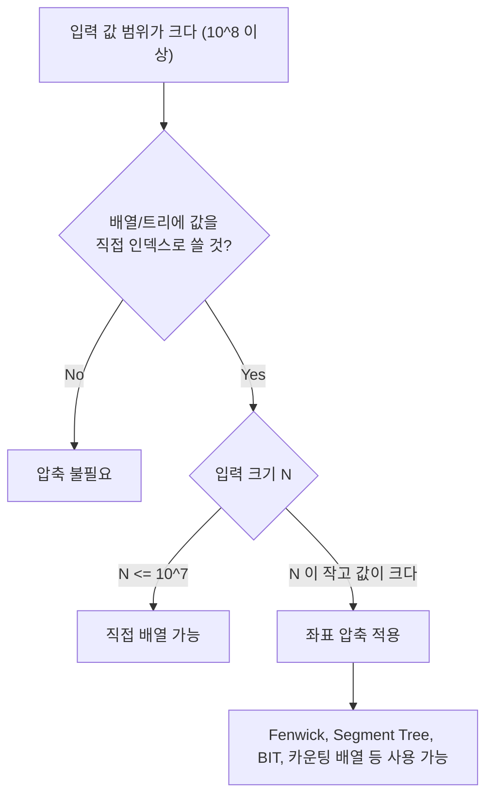

## 정의

**값 / 좌표 압축 (Coordinate Compression)** 은 큰 범위의 값 (예: 10^9) 을 정렬된 순서를 유지하며 **작은 정수 인덱스** (0..K-1) 로 매핑하는 기법. K = unique value count.

이 기법의 핵심 속성:
- **순서 보존**: 원래 값의 대소 관계가 압축 후에도 동일하게 유지.
- **가역성**: `uniq[compressed[i]] == original[i]` 로 언제든 복원 가능.
- **크기 축소**: 범위 10^9 → K ≤ N 으로, 희소한 값들을 연속 인덱스로 변환.

## 문제 상황과 동기

값의 범위가 10^9 이고 입력 크기가 10^5 라면, Fenwick tree 나 segment tree 를 값 자체를 인덱스로 사용할 수 없음. 압축하면 희소한 값들을 연속된 인덱스로 바꾸어 **배열 기반 자료구조**를 사용 가능.

핵심 통찰: *상대 순서만 중요하지 절대값은 중요하지 않다. 값을 정렬하고 중복 제거한 뒤, 각 값의 순위(index)가 곧 압축된 좌표.*

### 언제 좌표 압축이 필요한가?



## 시각화

```anim:coordinate-compression
{}
```

## 핵심 아이디어

```text
1. unique = sort(unique(set(original)))   // 정렬 + 중복 제거
2. for each value v in original:
     compressed[v] = lower_bound(unique, v)
     // unique[compressed[v]] == v
```

압축 후에는 `unique[compressed[i]]` 로 원래 값을 복원 가능.

## 알고리즘

```text
compress(a[]):
    sorted = sort unique values of a
    for each x in a:
        idx = lower_bound(sorted, x)
        print idx    // 0-based compressed coordinate

// 예: a = [-5, 10^9, 0, -5, 42]
// sorted = [-5, 0, 42, 10^9]
// compressed = [0, 3, 1, 0, 2]
```

### 단계별 흐름


## 구현

<CodeWithOutput
  variants={[
    {
      language: "cpp",
      label: "C++",
      code: `// Coordinate compression: O(N log N)
#include <bits/stdc++.h>
using namespace std;

int main() {
    ios::sync_with_stdio(false);
    cin.tie(nullptr);

    int n; cin >> n;
    vector<int> a(n);
    for (auto& v : a) cin >> v;

    // 1. Extract unique sorted values
    vector<int> uniq = a;
    sort(uniq.begin(), uniq.end());
    uniq.erase(unique(uniq.begin(), uniq.end()), uniq.end());

    // 2. Map each original value to compressed index
    for (auto& v : a) {
        v = (int)(lower_bound(uniq.begin(), uniq.end(), v)
                  - uniq.begin());
        cout << v << " ";
    }
    cout << "\\n";

    // Reconstruct original: uniq[compressed[i]]
    // for (auto v : a) cout << uniq[v] << " ";
}`,
    },
    {
      language: "python",
      label: "Python",
      code: `# Coordinate compression: O(N log N)
import sys
input = sys.stdin.readline
from bisect import bisect_left

n = int(input())
a = list(map(int, input().split()))

# 1. Extract unique sorted values
uniq = sorted(set(a))

# 2. Map each value to compressed index
compressed = [bisect_left(uniq, v) for v in a]
print(*compressed)

# uniq[compressed[i]] == original a[i]`,
    },
    {
      language: "java",
      label: "Java",
      code: `// Coordinate compression: O(N log N)
import java.util.*;
import java.io.*;

public class Main {
    public static void main(String[] args) throws IOException {
        BufferedReader br = new BufferedReader(
            new InputStreamReader(System.in));
        int n = Integer.parseInt(br.readLine());
        int[] a = new int[n];
        StringTokenizer st = new StringTokenizer(br.readLine());
        for (int i = 0; i < n; i++)
            a[i] = Integer.parseInt(st.nextToken());

        // 1. Extract unique sorted values
        int[] sorted = a.clone();
        Arrays.sort(sorted);
        int k = 1;
        for (int i = 1; i < n; i++)
            if (sorted[i] != sorted[k - 1])
                sorted[k++] = sorted[i];

        // 2. Binary search for compression
        StringBuilder sb = new StringBuilder();
        for (int v : a) {
            int idx = Arrays.binarySearch(sorted, 0, k, v);
            sb.append(idx).append(' ');
        }
        System.out.println(sb);
    }
}`,
    },
  ]}
  cases={[
    {
      label: "기본 압축",
      input: `7
-5 1000000000 0 -5 42 999999999 0`,
      output: `0 4 1 0 2 3 1`,
    },
    {
      label: "중복 없음",
      input: `5
100 200 300 400 500`,
      output: `0 1 2 3 4`,
    },
  ]}
/>

## 복잡도

| 항목 | 값 |
|:---|:---|
| **시간** | O(N log N) |
| **공간 (unique 배열)** | O(K), K = unique value count |
| **압축 크기** | K ≤ N |
| **복원 (index → value)** | O(1), `uniq[idx]` |

## 변형 / 활용

| 적용처 | 설명 |
|:---|:---|
| **Fenwick / Segment Tree** | 좌표 압축 후 값 범위가 10^9 → 10^5 로 축소 |
| **Mo's algorithm** | 값 범위를 압축해 카운팅 배열 사용 가능 |
| **Sweeping** | x, y 좌표를 각각 압축해 격자로 변환 |
| **LIS** | 음수/큰 값 좌표를 순위로 변환해 O(N log N) LIS |
| **2D 압축** | x, y 각각 압축해 희소 2D 그리드 구성 |

### LIS 와 조합 예시

LIS (Longest Increasing Subsequence) 에서 좌표 압축을 자주 활용한다.

```text
// 값 범위가 크거나 음수를 포함하는 경우
a = [100, -5, 200, -5, 50]

// 압축 후
compressed = [2, 0, 3, 0, 1]

// 이제 Fenwick tree 크기 = K = 4 로 LIS 계산 가능
```

### 2D 압축

2D 좌표 문제에서 x, y 를 각각 독립적으로 압축한다. 결과로 (최대 N)×(최대 N) 크기의 2D 배열/트리를 사용 가능.

```text
points = [(10^9, 10^8), (5, 3), (10^9, 3)]
xs = compress([10^9, 5, 10^9])  -> [1, 0, 1]
ys = compress([10^8, 3, 3])     -> [1, 0, 0]
// 결과: (1,1), (0,0), (1,0) -> 3x2 그리드
```

## 함정

### 1. 중복 제거 누락

`unique()` 또는 `set()` 으로 중복을 제거하지 않으면, 같은 값이 여러 인덱스를 가져 Fenwick 트리에서 overflow / 잘못된 결과.

```cpp
// 잘못된 예: sort만 하고 unique 안 함
vector<int> uniq = a;
sort(uniq.begin(), uniq.end());
// uniq = [-5, -5, 0, 42, 10^9] -- 중복 있음!
// -5 의 lower_bound = 0, -5 의 second occurrence = index 1
// 같은 값 두 개가 다른 인덱스를 가짐 -> 오류
```

### 2. lower_bound 대신 map 사용

Python 의 `dict` 나 C++ 의 `unordered_map` 을 쓰면 O(1) mapping 이 가능하지만, 순서가 필요한 경우 (구간 쿼리, Fenwick) 는 정렬 배열 + binary search 가 필수.

```python
# 경우에 따라 dict 도 OK (순서 필요 없을 때)
rank = {v: i for i, v in enumerate(sorted(set(a)))}
compressed = [rank[v] for v in a]
# 단: range query 에서는 인덱스 순서가 의미를 가져야 하므로 이 방식이 더 명확
```

### 3. 0-based vs 1-based

Fenwick tree 는 1-based index 가 필요. 압축 결과가 0-based (lower_bound 기본) 이면 `compressed[i] + 1` 사용.

```cpp
// Fenwick tree 와 함께 사용 시
int idx = lower_bound(uniq.begin(), uniq.end(), v) - uniq.begin();
fenwick.update(idx + 1, 1);  // 1-based!
```

### 4. 쿼리 값도 함께 압축해야 할 때

범위 쿼리 `[L, R]` 에서 L, R 도 압축된 인덱스 공간으로 변환해야 한다. 원본 배열과 쿼리 값을 합쳐서 압축하거나, L 에는 `lower_bound`, R 에는 `upper_bound` 를 적절히 사용.

## BOJ 연습 문제

| 번호 | 제목 | 정답률 | 링크 |
|:---|:---|---:|:---|
| BOJ 18870 | 좌표 압축 | - | [kokoa-lab](https://github.com/kokoa-lab/boj-problems/tree/main/organize_problems/18800-18899/18870) |
| BOJ 1015 | 수열 정렬 | - | [kokoa-lab](https://github.com/kokoa-lab/boj-problems/tree/main/organize_problems/1000-1099/1015) |
| BOJ 12015 | 가장 긴 증가하는 부분 수열 2 | - | [kokoa-lab](https://github.com/kokoa-lab/boj-problems/tree/main/organize_problems/12000-12099/12015) |
| BOJ 10815 | 숫자 카드 | - | [kokoa-lab](https://github.com/kokoa-lab/boj-problems/tree/main/organize_problems/10800-10899/10815) |

## 참고

- [[Binary Search|이분 탐색]]
- [[Fenwick Tree|펜윅 트리]]
- [[Mo|Mo's 알고리즘]]
- [[Sweeping|스위핑]]
