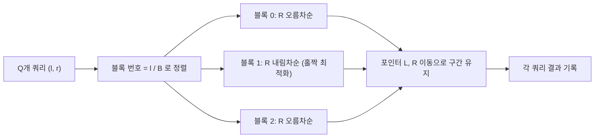

## 정의

**Mo's Algorithm** 은 오프라인 구간 쿼리를 (L, R) 정렬로 재배치해 포인터 이동을 amortized O((N+Q)√N) 으로 줄이는 기법.

## 문제 상황과 동기

크기 N 배열에 Q 개의 구간 쿼리 (l, r) 이 주어지고, 구간 안 원소들의 어떤 함수 f 를 계산해야 한다.

- **naive**: 매 쿼리마다 l..r 을 새로 순회. O(N · Q).
- **Mo**: 쿼리를 *L 이 속한 블록* -> *R* 순으로 정렬. L 과 R 포인터를 앞뒤로 움직이며 f 를 증분 갱신.

핵심 통찰: *포인터 이동을 재사용* 하면, L 은 블록 내에서만 흔들리고 R 은 단조 증가. 이동 총합이 O((N+Q)√N).

## 시각화

```anim:mo
{}
```

## 핵심 아이디어

invariant: *현재 구간 [L, R) 에 대한 정보를 유지*.

```text
sort queries by (L / B, R)   // B ≈ N/√Q
for each query (l, r):
    while L > l: add(--L)
    while R < r: add(R++)
    while L < l: remove(L++)
    while R > r: remove(--R)
    answer[qi] = current_value
```

amortized 분석:

- L 이동: 각 블록 내에서 O(B). 블록 수 O(N/B). 총 O(N).
- R 이동: 각 블록 내에서 단조 증가. 블록 당 O(N). 총 O(N · N/B) = O(N²/B).
- B = N / √Q 로 잡으면: O(N√Q + Q√N) = O((N+Q)√N).

## 블록 분할 전략

쿼리를 `(L/B, R)` 기준으로 정렬하면 포인터 이동이 amortized 최소화된다.



블록 크기 선택:
- `B = sqrt(N)`: 구현이 단순하고 대부분의 경우 충분
- `B = N / sqrt(Q)`: Q 가 N 보다 훨씬 작을 때 이론적 최적

홀짝 최적화: 홀수 번째 블록의 쿼리는 R 을 내림차순으로 정렬. 블록 경계를 넘을 때 R 이 처음부터 다시 증가하지 않아 실제 이동 거리가 최대 절반으로 감소한다.

## 알고리즘

```text
Mo(queries):
    B = int(sqrt(N)) 또는 N / sqrt(Q)
    sort by (l/B, r if odd block else -r)  // 홀짝 최적화
    L = 0, R = 0, cur = 0
    for each (l, r) in sorted order:
        while L > l: update(--L, +1)
        while R < r: update(R++, +1)
        while L < l: update(L++, -1)
        while R > r: update(--R, -1)
        ans[qi] = cur
    return ans
```

## 구현

<CodeWithOutput
  variants={[
    {
      language: "cpp",
      label: "C++",
      code: `// Mo's algorithm, distinct count in [l, r]
#include <bits/stdc++.h>
using namespace std;

int main() {
    ios_base::sync_with_stdio(false); cin.tie(nullptr);
    int n; cin >> n;
    vector<int> a(n);
    for (auto& v : a) cin >> v;
    int q; cin >> q;
    struct Q { int l, r, idx; };
    vector<Q> qs(q);
    for (int i = 0; i < q; i++) {
        cin >> qs[i].l >> qs[i].r; qs[i].l--; qs[i].r--;
        qs[i].idx = i;
    }

    int B = int(sqrt(n));
    sort(qs.begin(), qs.end(), [&](auto& x, auto& y) {
        int bx = x.l / B, by = y.l / B;
        if (bx != by) return bx < by;
        return (bx & 1) ? x.r > y.r : x.r < y.r;
    });

    vector<int> cnt(100001, 0), ans(q);
    int L = 0, R = 0, cur = 0;
    auto add = [&](int p) { if (cnt[a[p]]++ == 0) cur++; };
    auto del = [&](int p) { if (--cnt[a[p]] == 0) cur--; };

    add(0);
    for (auto& [l, r, idx] : qs) {
        while (L > l) add(--L);
        while (R < r) add(++R);
        while (L < l) del(L++);
        while (R > r) del(R--);
        ans[idx] = cur;
    }
    for (int x : ans) cout << x << "\\n";
}`,
    },
    {
      language: "python",
      label: "Python",
      code: `import sys, math
input = sys.stdin.readline
n = int(input())
a = list(map(int, input().split()))
q = int(input())
qs = []
for i in range(q):
    l, r = map(int, input().split())
    qs.append((l - 1, r - 1, i))

B = int(math.sqrt(n))
qs.sort(key=lambda x: (x[0] // B, x[1] if (x[0] // B) % 2 == 0 else -x[1]))

cnt = {}
L = R = cur = 0
cnt[a[0]] = 1
ans = [0] * q

def add(p):
    global cur
    cnt[a[p]] = cnt.get(a[p], 0) + 1
    if cnt[a[p]] == 1: cur += 1
def rem(p):
    global cur
    cnt[a[p]] -= 1
    if cnt[a[p]] == 0: cur -= 1

for l, r, idx in qs:
    while L > l: L -= 1; add(L)
    while R < r: R += 1; add(R)
    while L < l: rem(L); L += 1
    while R > r: rem(R); R -= 1
    ans[idx] = cur
print("\\n".join(map(str, ans)))`,
    },
  ]}
  cases={[
    {
      label: "기본",
      input: `5 3
1 2 1 3 2
3
1 3
2 4
1 5`,
      output: `2
3
3`,
    },
  ]}
/>

## 복잡도

| 항목 | 값 |
|:---|:---|
| **시간 (최선)** | O((N+Q)√N) |
| **시간 (평균)** | O((N+Q)√N) |
| **시간 (최악)** | O((N+Q)√N) |
| **공간** | O(N + Q) |
| **안정성** | N/A (오프라인) |

## 변형 / 활용

| 변형 | 설명 |
|:---|:---|
| **Mo with update** | 쿼리 시간축 추가. 3D Mo O(N^(5/3)). |
| **Mo on tree** | Euler tour technique 로 수열로 펴서 Mo. |
| **Mo on 2D** | (x, y) 직사각형. 정렬 차원 증가. |
| **홀짝 최적화** | block 이 홀수면 R 내림차순 정렬. R 이동 중복 감소. |

## Mo on Tree 상세

트리에서 오프라인 경로 쿼리를 해결할 때 사용한다. Euler tour 로 트리를 선형화한 뒤 표준 Mo 를 적용.

### 핵심 절차

1. DFS 로 Euler tour 를 수행: 노드 `v` 방문 시 `in[v]`, 서브트리에서 복귀 시 `out[v]` 를 기록.
2. 경로 `(u, v)` 쿼리를 구간 쿼리로 변환:
   - `u` 가 `v` 의 조상이면: `[in[u], in[v]]`
   - 그 외: `[out[u], in[v]]` 로 변환 후 LCA(u, v) 를 별도 포함/제외 처리
3. 변환된 구간 쿼리에 Mo 적용.

### 복잡도

- 전처리 LCA: O(N log N)
- Mo 실행: O((N + Q) √N)
- 공간: O(N + Q)

### 주의

Euler tour 기반 변환에서 LCA 처리가 까다롭다. `u` 와 `v` 중 depth 가 더 얕은 쪽을 항상 왼쪽 인자로 넘겨야 구간 변환이 올바르게 작동한다.

## 함정

### 1. add/remove 순서

while 문에서 add/remove 순서를 잘못 쓰면 구간 정의가 깨짐. 반드시 포인터 먼저 움직인 후 add.

### 2. 초기 구간

초기 L, R = 0 이고 원소 a[0] 이 이미 포함된 상태. 첫 add(0) 을 빼먹지 말 것.

### 3. 홀짝 최적화 없이 단순 정렬

R 이 블록마다 다시 0까지 내려가면 O(N²) 까지 가능. 홀짝 최적화는 거의 필수.

## BOJ 연습 문제

| 번호 | 제목 | 정답률 | 링크 |
|:---|:---|---:|:---|
| BOJ 13547 | 수열과 쿼리 5 | - | [kokoa-lab](https://github.com/kokoa-lab/boj-problems/tree/main/organize_problems/13500-13599/13547) |
| BOJ 2912 | 백설공주와 난쟁이 | - | [kokoa-lab](https://github.com/kokoa-lab/boj-problems/tree/main/organize_problems/2900-2999/2912) |
| BOJ 8462 | 배열의 힘 | - | [kokoa-lab](https://github.com/kokoa-lab/boj-problems/tree/main/organize_problems/8400-8499/8462) |

## 참고

- [[Sqrt Decomposition|제곱근 분할]]
- [[Segtree|세그먼트 트리]]
- [[Fenwick Tree|펜윅 트리]]
