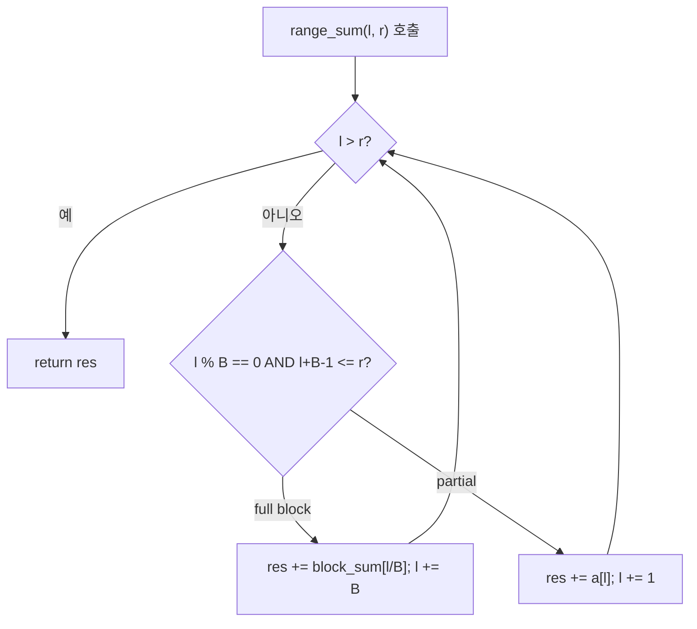

## 정의

**제곱근 분할 (Sqrt Decomposition)** 은 크기 N 배열을 √N 개씩 블록으로 나누고, 각 블록을 전처리해 구간 연산을 O(√N) 에 처리하는 자료구조 기법.

## 문제 상황과 동기

단일 원소 갱신과 구간 합 질의를 동시에 처리해야 한다.

- **naive 갱신 O(1) + 쿼리 O(N)**: Q=10^5, N=10^5 면 O(NQ) 불가.
- **prefix sum 쿼리 O(1) + 갱신 O(N)**: 갱신이 잦으면 재계산 오버헤드.
- **seg tree**: O(log N) 이지만 구현 복잡도 상승.
- **sqrt decomposition**: O(√N) 갱신 + O(√N) 쿼리. 구현은 seg tree 의 절반.

핵심 통찰: *블록 단위로 묶어 precompute* 하면, partial 블록만 순회하고 full 블록은 블록 값으로 O(1) 처리.

## 시각화

```anim:sqrt-decomposition
{}
```

## 핵심 아이디어

invariant: *블록 크기 B = √N. 각 블록의 합을 block_sum[k] 에 저장*.

```text
block_sum[k] = sum of a[k*B .. min((k+1)*B-1, N-1)]

range_add(l, r, x):
    for i in l..r:
        if i % B == 0 and i + B - 1 <= r:   # full block
            block_sum[i/B] += x * B
            i += B
        else:
            a[i] += x
            block_sum[i/B] += x
```

## 알고리즘

```text
B = int(sqrt(N)) + 1
block_cnt = (N + B - 1) / B

// 전처리
for k in 0..block_cnt-1:
    block_sum[k] = sum of a[k*B .. min((k+1)*B-1, N-1)]

// 구간 합 쿼리
range_sum(l, r):
    res = 0
    while l <= r:
        if l % B == 0 and l + B - 1 <= r:
            res += block_sum[l / B]
            l += B
        else:
            res += a[l]
            l += 1
    return res

// 점 갱신
point_update(pos, val):
    block_sum[pos / B] += val - a[pos]
    a[pos] = val
```

## 쿼리 흐름 시각화



쿼리는 **partial 블록 (양 끝)** 과 **full 블록 (중간)** 두 패턴으로 처리한다. 최악 케이스에서:
- 좌측 partial: 최대 B - 1 원소
- 우측 partial: 최대 B - 1 원소
- full 블록: 최대 ceil(N / B) 개

B = √N 으로 설정하면 세 구간 합산 O(√N). 점 갱신은 블록 합 하나만 수정하므로 O(1).

## 구현

<CodeWithOutput
  variants={[
    {
      language: "cpp",
      label: "C++",
      code: `// Sqrt decomposition, range sum + point update
#include <bits/stdc++.h>
using namespace std;
int main() {
    ios_base::sync_with_stdio(false); cin.tie(nullptr);
    int n, q; cin >> n >> q;
    vector<long long> a(n);
    for (auto& v : a) cin >> v;

    int B = (int)sqrt(n) + 1;
    int bc = (n + B - 1) / B;
    vector<long long> block(bc, 0);
    for (int i = 0; i < n; i++) block[i / B] += a[i];

    while (q--) {
        int t; cin >> t;
        if (t == 1) {
            int l, r; cin >> l >> r; l--; r--;
            long long res = 0;
            while (l <= r) {
                if (l % B == 0 && l + B - 1 <= r) {
                    res += block[l / B];
                    l += B;
                } else {
                    res += a[l];
                    l++;
                }
            }
            cout << res << "\\n";
        } else {
            int pos, val; cin >> pos >> val; pos--;
            block[pos / B] += val - a[pos];
            a[pos] = val;
        }
    }
}`,
    },
    {
      language: "python",
      label: "Python",
      code: `import sys, math
input = sys.stdin.readline
n, q = map(int, input().split())
a = list(map(int, input().split()))

B = int(math.sqrt(n)) + 1
bc = (n + B - 1) // B
block = [0] * bc
for i in range(n):
    block[i // B] += a[i]

out = []
for _ in range(q):
    t, *rest = map(int, input().split())
    if t == 1:
        l, r = rest; l -= 1; r -= 1
        res = 0
        while l <= r:
            if l % B == 0 and l + B - 1 <= r:
                res += block[l // B]
                l += B
            else:
                res += a[l]
                l += 1
        out.append(str(res))
    else:
        pos, val = rest; pos -= 1
        block[pos // B] += val - a[pos]
        a[pos] = val
print("\\n".join(out))`,
    },
  ]}
  cases={[
    {
      label: "기본",
      input: `5 4
1 2 3 4 5
1 1 3
2 3 10
1 1 3
1 1 5`,
      output: `6
13
22`,
    },
  ]}
/>

## 복잡도

| 항목 | 값 |
|:---|:---|
| **시간 (전처리)** | O(N) |
| **시간 (쿼리)** | O(√N) |
| **시간 (갱신)** | O(1) |
| **공간** | O(N) |
| **안정성** | N/A |

## 자료구조 성능 비교

| 자료구조 | 점 갱신 | 구간 쿼리 | 구현 난이도 | 비고 |
|:---|:---:|:---:|:---:|:---|
| Naive Array | O(1) | O(N) | 매우 쉬움 | 갱신 빈번, 쿼리 드물 때 |
| Prefix Sum | O(N) | O(1) | 쉬움 | 갱신 없거나 드물 때 |
| Sqrt Decomposition | O(1) | O(√N) | 보통 | 균형 + 구현 빠름 |
| Fenwick Tree | O(log N) | O(log N) | 보통 | 점 갱신 + 구간 합 |
| Segment Tree | O(log N) | O(log N) | 높음 | 범용 구간 연산 |

N=10^5 기준: √N ≈ 316, log₂N ≈ 17. 시간 제한이 넉넉하면 sqrt 로도 통과 가능. Sqrt 를 선택하는 상황:
- 대회에서 seg tree / fenwick 구현 시간이 부족할 때
- 연산이 결합법칙을 만족하지 않아 seg tree 로 표현하기 어려울 때
- Mo's Algorithm 처럼 오프라인 쿼리 재정렬로 상수 최적화를 원할 때

## 변형 / 활용

| 변형 | 설명 |
|:---|:---|
| **Range add + range sum** | block 에 lazy tag 저장. full block 은 tag, partial 은 brute. |
| **Max/Min 블록** | 각 블록의 max/min 저장. 구간 최대 최소 O(√N). |
| **Mode (최빈값)** | Mo's 가 더 빠르지만 sqrt 로도 가능. |
| **Sqrt on tree** | Heavy-Light Decomposition 의 전 단계. |

## 함정

### 1. 블록 크기 조절

sqrt(N) + 1 을 더해 B 가 0 이 되지 않게. N=1 이면 B=2.

### 2. 경계 조건

마지막 블록이 B보다 짧을 수 있음. `min((k+1)*B, N)` 으로 범위 확인.

### 3. long long overflow

N=10^5, 값=10^9 면 block 합이 10^14 까지 가능. 64-bit 필요.

## 심화: Range Add + Range Sum

점 갱신 대신 **구간 덧셈** 까지 필요하면 블록 단위 lazy 태그를 도입한다.

```text
lazy[k] = 블록 k 전체에 아직 반영하지 않은 덧셈 값

range_add(l, r, x):
    while l <= r:
        if l % B == 0 and l + B - 1 <= r:   // full block
            lazy[l / B] += x
            block_sum[l / B] += x * B
            l += B
        else:                                  // partial
            a[l] += x
            block_sum[l / B] += x
            l += 1

range_sum(l, r):
    res = 0
    while l <= r:
        if l % B == 0 and l + B - 1 <= r:   // full block
            res += block_sum[l / B]
            l += B
        else:                                  // partial: lazy 반영
            res += a[l] + lazy[l / B]
            l += 1
    return res
```

`lazy` 배열 하나로 갱신 O(√N), 쿼리 O(√N) 달성. 이 아이디어는 Segment Tree 의 lazy propagation 과 동일하지만, sqrt 분해에서는 push-down 없이 쿼리 시점에 즉시 반영한다.

**주의**: partial 블록에 lazy 를 반영할 때 `a[i]` 에는 반영하지 않고 조회 시점에만 더한다. 만약 partial 원소를 직접 갱신 (`a[i] += lazy[k]`) 하면 lazy 를 double-count 한다.

## BOJ 연습 문제

| 번호 | 제목 | 정답률 | 링크 |
|:---|:---|---:|:---|
| BOJ 14428 | 수열과 쿼리 16 | - | [kokoa-lab](https://github.com/kokoa-lab/boj-problems/tree/main/organize_problems/14400-14499/14428) |
| BOJ 16993 | 연속합과 쿼리 | - | [kokoa-lab](https://github.com/kokoa-lab/boj-problems/tree/main/organize_problems/16900-16999/16993) |
| BOJ 17469 | 블럭 | - | [kokoa-lab](https://github.com/kokoa-lab/boj-problems/tree/main/organize_problems/17400-17499/17469) |

## 참고

- [[Mo's Algorithm|Mo's Algorithm]]
- [[Segtree|세그먼트 트리]]
- [[Fenwick Tree|펜윅 트리]]
