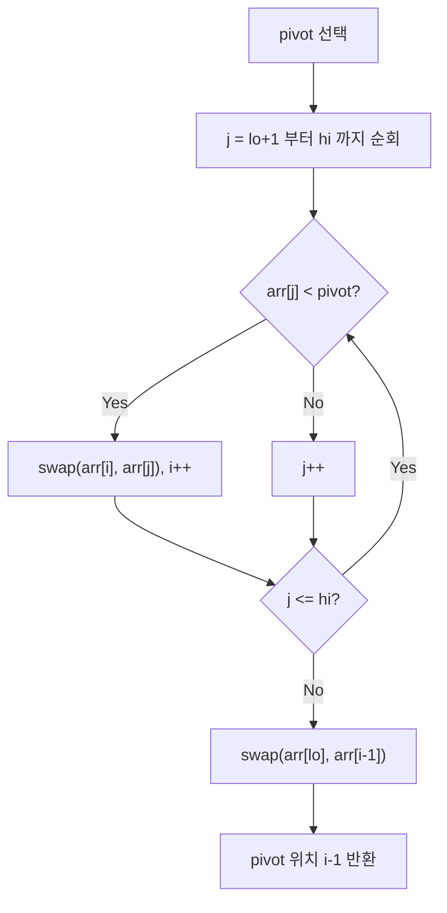

## 정의

**Quick Sort (퀵 정렬)** 는 분할 정복 (Divide & Conquer) 기반 비교 정렬. 1959 년 Tony Hoare 가 고안. 배열에서 **pivot** 을 하나 골라, 그보다 작은 것들과 큰 것들로 나누는 **partition** 을 재귀적으로 수행.

평균 O(n log n) 으로 가장 빠른 in-place 정렬 중 하나. C/C++ 의 `qsort` / `std::sort`, JavaScript V8 의 일부 케이스, 거의 모든 표준 라이브러리의 기반.

전체 비교는 [[정렬 알고리즘]] 참고.

## 문제 상황

정렬은 알고리즘의 기본. Quick Sort 가 특히 중요한 이유:

- 실제 표준 라이브러리 (C++ `std::sort`, Java `Arrays.sort`, Rust `sort_unstable`) 의 핵심 구성 요소
- RDBMS 의 in-memory 정렬 (Optimal 모드), External Sort 의 1단계 Run 생성에 쓰임
- 평균 가장 빠른 비교 정렬로, 상수항까지 고려하면 실전 최강

**흔한 함정**: 이미 정렬된 입력 / 중복이 많은 입력에서 O(n²) 로 폭주. 표준 라이브러리는 Introsort / Pdqsort 로 이를 막지만, 직접 구현 시 주의.

## 시각화

```anim:quicksort
{}
```

## 알고리즘

```text
quickSort(arr, lo, hi):
  if lo >= hi: return
  p = partition(arr, lo, hi)  // pivot 위치
  quickSort(arr, lo, p - 1)
  quickSort(arr, p + 1, hi)

partition(arr, lo, hi):
  pivot = arr[lo]  // 또는 중간값/마지막값 등
  i = lo + 1
  for j = lo + 1 to hi:
    if arr[j] < pivot:
      swap arr[i], arr[j]
      i++
  swap arr[lo], arr[i - 1]
  return i - 1
```

### Partition 의 본질

```
arr:    [5, 2, 8, 1, 9, 3, 7]
pivot = 5

좌측: < 5 인 것들
우측: >= 5 인 것들

→ [2, 1, 3, 5, 8, 9, 7]
              ↑ pivot 위치 확정
              
이제 [2, 1, 3] 과 [8, 9, 7] 을 재귀적으로 정렬
```

한 번의 partition 으로 **pivot 의 최종 위치가 확정**. 그 양쪽은 독립적으로 정렬 가능.

### Partition 동작 흐름



## 복잡도

| 항목 | 값 |
|:---|:---|
| **시간 (최선)** | O(n log n) |
| **시간 (평균)** | O(n log n) |
| **시간 (최악)** | **O(n²)** |
| **공간** | O(log n) (재귀 스택) |
| **안정성** | ✗ Unstable |
| **In-place** | ✓ |

### 최악 케이스 O(n²), 언제 발생?

Partition 이 *극단적으로 치우치면*. 예: 이미 정렬된 배열에서 첫 원소를 pivot 으로 잡으면 매 단계 한 쪽이 비어버린다.

```
[1, 2, 3, 4, 5, 6, 7, 8] (이미 정렬됨)
pivot = 1 → 좌측 [] / 우측 [2,3,4,5,6,7,8]
pivot = 2 → 좌측 [] / 우측 [3,4,5,6,7,8]
...
재귀 깊이 = n → 총 n × n = n²
```

### 회피책

1. **랜덤 pivot**: 매번 무작위 인덱스 선택
2. **Median-of-3**: 첫·중간·끝 셋 중 중앙값을 pivot
3. **Introsort**: 재귀 깊이가 2 log n 을 넘으면 [[Heap Sort]] 로 폴백 (C++ `std::sort`)
4. **Dual-Pivot Quicksort**: 두 pivot 사용 (Java `Arrays.sort` 원시 타입)

## Merge Sort 와의 비교

| 항목 | Quick Sort | Merge Sort |
|:---|:---|:---|
| 평균 시간 | O(n log n) | O(n log n) |
| **최악 시간** | O(n²) (회피 가능) | **O(n log n) 보장** |
| 공간 | O(log n) | O(n) |
| 안정성 | ✗ | ✓ |
| In-place | ✓ | ✗ |
| 캐시 친화 | ✓ (좋음) | △ |
| 실제 속도 | **평균 가장 빠름** | 약간 느림 |

**왜 Quick 이 평균 더 빠른가?**

1. **In-place** → 메모리 할당/해제 비용 없음
2. **캐시 친화적** → 인접 원소 비교/교환 (locality of reference)
3. **상수항 작음** → partition 의 inner loop 가 단순

## 다양한 변형

### Three-way Quicksort

같은 값이 많을 때 효율적. partition 을 `<`, `=`, `>` 셋으로.

```
arr = [5, 2, 5, 1, 5, 3, 5]
pivot = 5
→ [2, 1, 3] [5, 5, 5, 5] [없음]
```

중복이 많은 입력에 O(n × H) (H = entropy of distribution) 까지 향상.

### Introsort (C++ std::sort)

```text
introsort(arr):
  if depth > 2 * log(n):
    heapSort(arr)   // 폴백
  else:
    quickSort(arr)

  if remaining size <= 16:
    insertionSort(arr)  // 작은 부분
```

**Quick + Heap + Insertion 하이브리드**. 최악 O(n log n) 보장 + 평균 빠름.

### Pdqsort (Pattern-defeating Quicksort)

Rust `slice::sort_unstable` 의 알고리즘. 다음 패턴을 감지:
- 정렬된 부분
- 역정렬된 부분
- 중복이 많은 부분

각각 다른 전략으로 처리해 평균 더 빠르고 최악 O(n log n).

## RDBMS 에서의 활용

[[정렬·해시는 메모리가 부족하면 어디로 새는가, PGA, work_mem, Workspace Memory]] 글에서 다루듯, 메모리에 들어가는 작은 데이터는 **Quicksort**, 들어가지 않으면 [[External Merge Sort]] 의 Run 생성 단계에서 Quicksort 가 활용된다.

```text
External Merge Sort 의 1단계:
  for each chunk in input:
    quicksort(chunk)         ← 메모리 내 정렬
    write to disk as Run
```

## 구현

<CodeWithOutput
  variants={[
    {
      language: "cpp",
      label: "C++",
      code: `#include <bits/stdc++.h>
using namespace std;

int partition(vector<int>& arr, int lo, int hi) {
    // Median-of-3 pivot: 첫/중간/끝 중 중앙값
    int mid = lo + (hi - lo) / 2;
    if (arr[lo] > arr[mid]) swap(arr[lo], arr[mid]);
    if (arr[lo] > arr[hi])  swap(arr[lo], arr[hi]);
    if (arr[mid] > arr[hi]) swap(arr[mid], arr[hi]);
    swap(arr[mid], arr[hi - 1]);
    int pivot = arr[hi - 1], i = lo;
    for (int j = lo; j < hi - 1; j++)
        if (arr[j] <= pivot) swap(arr[i++], arr[j]);
    swap(arr[i], arr[hi - 1]);
    return i;
}

void quickSort(vector<int>& arr, int lo, int hi) {
    if (lo >= hi) return;
    int p = partition(arr, lo, hi);
    quickSort(arr, lo, p - 1);
    quickSort(arr, p + 1, hi);
}

int main() {
    int n; cin >> n;
    vector<int> arr(n);
    for (auto& x : arr) cin >> x;
    quickSort(arr, 0, n - 1);
    for (int x : arr) cout << x << " ";
    cout << endl;
}`,
    },
    {
      language: "python",
      label: "Python",
      code: `import sys
input = sys.stdin.readline

def quicksort(arr, lo, hi):
    if lo >= hi:
        return
    # Dutch National Flag partition (3-way)
    pivot = arr[(lo + hi) // 2]
    i, j = lo, hi
    while i <= j:
        while arr[i] < pivot: i += 1
        while arr[j] > pivot: j -= 1
        if i <= j:
            arr[i], arr[j] = arr[j], arr[i]
            i += 1
            j -= 1
    quicksort(arr, lo, j)
    quicksort(arr, i, hi)

n = int(input())
arr = list(map(int, input().split()))
quicksort(arr, 0, n - 1)
print(*arr)`,
    },
  ]}
  cases={[
    {
      label: "기본 정렬",
      input: `7
5 2 8 1 9 3 7`,
      output: `1 2 3 5 7 8 9`,
    },
    {
      label: "역순 입력",
      input: `5
5 4 3 2 1`,
      output: `1 2 3 4 5`,
    },
  ]}
/>

## 함정

### 1. `LIMIT N` 에는 Heapsort 가 더 빠르다

`SELECT ... ORDER BY x LIMIT 10` 같은 Top-K 쿼리는 **전체 정렬이 불필요**. Heap 으로 Top-10 만 유지하면 O(n log K). Oracle 의 옵티마이저는 자동으로 [[Heap Sort]] 선택.

### 2. 안정성이 필요한 경우 사용 금지

같은 키의 원래 순서 보존이 필요하면 [[Merge Sort]] / Timsort 사용.

### 3. 재귀 깊이 폭주

n=10⁹ 의 정렬된 입력에 단순 Quicksort 적용 → 재귀 깊이 10⁹ → 스택 오버플로. Introsort 가 이를 막는다.

## 표준 라이브러리

| 언어 | 구현 |
|:---|:---|
| C `qsort` | Quicksort (구현체별, 보통 Introsort) |
| C++ `std::sort` | **Introsort** (Quick + Heap + Insertion) |
| Java `Arrays.sort` (원시) | **Dual-Pivot Quicksort** |
| Rust `sort_unstable` | **Pdqsort** |
| Python `sorted` | Timsort (Quicksort 아님, Merge 변형) |

## BOJ 연습 문제

정렬 구현 자체보다 정렬 특성 (안정성, Merge Sort 의 역전 쌍 등) 을 묻는 문제가 대부분.

| 번호 | 제목 | 핵심 |
|:---|:---|:---|
| BOJ 2751 | 수 정렬하기 2 | O(n log n) 정렬 구현 |
| BOJ 11004 | K번째 수 | Quickselect (partition 응용) |
| BOJ 1517 | 버블 소트 | 역전 쌍 수 = Merge Sort 로 |
| BOJ 7469 | K번째 수 | 세그먼트 트리 + 정렬 |

## 참고

- [[정렬 알고리즘]]
- [[Merge Sort]]
- [[Heap Sort]]
- [[External Merge Sort]]
- [[정렬·해시는 메모리가 부족하면 어디로 새는가, PGA, work_mem, Workspace Memory]]
- Knuth, *TAOCP Vol. 3 §5.2.2*
- Robert Sedgewick, *Algorithms* (Princeton)
