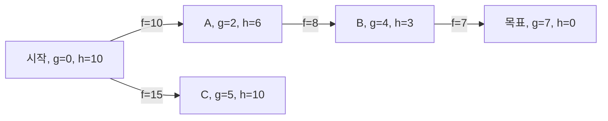

## 정의

**A\* 알고리즘** 은 **휴리스틱 기반 최단 경로 탐색** 알고리즘. f(n)=g(n)+h(n) 을 평가 함수로 사용해 시작점에서 목표까지의 최단 경로를 찾는다. 1968년 Hart, Nilsson, Raphael이 제안.

Dijkstra의 일반화로, 휴리스틱 h(n) 이 admissible(목표까지 실제 비용 이하) 이면 최적해 보장.

## 문제 상황과 동기

가중치가 있는 그래프에서 s에서 t까지 최단 경로.

- **Dijkstra**: 모든 방향 동등하게 확장. h(n)=0 인 A* 와 동일.
- **A***: "목표 방향" 정보를 h(n) 으로 주입. 불필요한 방향 확장 억제.

핵심 통찰: *남은 거리 예측치 h(n) 을 비용에 더하면 목표 방향으로 먼저 탐색.* g(n) 은 이미 지나온 비용, h(n) 은 앞으로 남은 예측.

## 시각화

```anim:a-star
{}
```

## 핵심 아이디어

open set 과 closed set 을 유지. open 에서 f(n)=g(n)+h(n) 이 가장 작은 노드를 꺼내 확장.

```text
openSet = {start}
g[start] = 0, h[start] = heuristic(start, goal)
f[start] = g[start] + h[start]

while openSet not empty:
    current = node in openSet with smallest f
    if current == goal: 복원 후 반환
    
    openSet.remove(current)
    
    for each neighbor v of current:
        tentative_g = g[current] + w(current, v)
        if tentative_g < g[v]:
            g[v] = tentative_g
            f[v] = g[v] + heuristic(v, goal)
            openSet.insert(v)
```

h(n) 이 admissible(과대추정 안 함) 이면 A* 는 항상 최적 경로를 찾는다.

## 구현

<CodeWithOutput
  variants={[
    {
      language: "cpp",
      label: "C++",
      code: `// A*, priority queue + Manhattan heuristic (grid 예제)
#include <bits/stdc++.h>
using namespace std;
using pii = pair<int,int>;

int heuristic(pii a, pii b) {
    return abs(a.first - b.first) + abs(a.second - b.second);
}

int dx[] = {0,0,1,-1};
int dy[] = {1,-1,0,0};

int astar(vector<string>& grid, pii start, pii goal) {
    int n = grid.size(), m = grid[0].size();
    vector<vector<int>> g(n, vector<int>(m, 1e9));
    priority_queue<pair<int,pii>,
                   vector<pair<int,pii>>,
                   greater<pair<int,pii>>> pq;

    g[start.first][start.second] = 0;
    int h_start = heuristic(start, goal);
    pq.push({h_start, start});

    while (!pq.empty()) {
        auto [f, cur] = pq.top(); pq.pop();
        auto [x, y] = cur;
        if (cur == goal) return g[x][y];

        for (int d = 0; d < 4; d++) {
            int nx = x + dx[d], ny = y + dy[d];
            if (nx < 0 || nx >= n || ny < 0 || ny >= m) continue;
            if (grid[nx][ny] == '#') continue;
            int ng = g[x][y] + 1;
            if (ng < g[nx][ny]) {
                g[nx][ny] = ng;
                int f = ng + heuristic({nx, ny}, goal);
                pq.push({f, {nx, ny}});
            }
        }
    }
    return -1;
}

int main() {
    vector<string> grid = {
        ".....",
        ".#.#.",
        ".#.#.",
        ".#...",
        "....."
    };
    pii start = {0,0}, goal = {4,4};
    cout << astar(grid, start, goal);
    return 0;
}`,
    },
    {
      language: "python",
      label: "Python",
      code: `# A*, heapq + Manhattan heuristic
import heapq

def heuristic(a, b):
    return abs(a[0] - b[0]) + abs(a[1] - b[1])

def astar(grid, start, goal):
    n, m = len(grid), len(grid[0])
    INF = 10**9
    g = [[INF]*m for _ in range(n)]
    g[start[0]][start[1]] = 0
    pq = [(heuristic(start, goal), start)]
    dirs = [(0,1),(0,-1),(1,0),(-1,0)]

    while pq:
        f, (x, y) = heapq.heappop(pq)
        if (x, y) == goal:
            return g[x][y]
        for dx, dy in dirs:
            nx, ny = x + dx, y + dy
            if not (0 <= nx < n and 0 <= ny < m):
                continue
            if grid[nx][ny] == '#':
                continue
            ng = g[x][y] + 1
            if ng < g[nx][ny]:
                g[nx][ny] = ng
                f = ng + heuristic((nx, ny), goal)
                heapq.heappush(pq, (f, (nx, ny)))
    return -1

grid = [".....", ".#.#.", ".#.#.", ".#...", "....."]
print(astar(grid, (0,0), (4,4)))`,
    },
  ]}
  cases={[
    {
      label: "5x5 그리드",
      input: `..... .#.#. .#.#. .#... .....`,
      output: `8`,
    },
  ]}
/>

## 복잡도

| 항목 | 값 |
|:---|:---|
| **시간 (최선)** | O(E log V) - h(n) 이 목표 방향 완벽 |
| **시간 (평균)** | O(E log V) - typical |
| **시간 (최악)** | O(V^2) - h(n) 이 나쁠 때 (Dijkstra 와 동일) |
| **공간** | O(V) |
| **최적성** | h(n) admissible 이면 보장 |

## 변형 / 활용

- **IDA\***: 반복적 깊이 심화 A*, 메모리 적게 씀.
- **D\* Lite**: 동적 환경에서 경로 재계획 (로봇).
- **Theta\***: any-angle pathfinding, 그리드 대각선 이동.
- **게임 AI**: NPC 길찾기 (Unity NavMesh, StarCraft).
- **지도 내비게이션**: 실제 도로망에서 A* 변형 사용.

## 함정

### 1. h(n) 이 admissible 하지 않으면 최적성 상실

과대추정 휴리스틱은 최단 경로를 놓칠 수 있다.

### 2. 중복 방문 관리

closed set 없이 open 만 쓰면 같은 노드를 여러 번 확장.

### 3. open set 이 너무 커지면 메모리 부담

격자형 맵에서 open set 수십만 개 가능. IDA* 고려.

## 탐색 과정 시각화

A* 의 노드 확장 순서: f 값이 낮은 노드를 먼저 확장한다.



C 방향은 f=15 로 높아 나중에 확장. B 를 거쳐 목표에 먼저 도달. Dijkstra 와 달리 목표 방향으로 편향된 탐색.

## 휴리스틱 종류와 선택

| 휴리스틱 | 수식 | 적합한 상황 |
|:---|:---|:---|
| Manhattan | `|dx| + |dy|` | 4방향 격자 (벽 없음) |
| Chebyshev | `max(|dx|, |dy|)` | 8방향 격자 |
| Euclidean | `sqrt(dx^2 + dy^2)` | 연속 공간, any-angle |
| 없음 (0) | `h(n) = 0` | Dijkstra 와 동일 |
| Octile | `max + 0.414 * min` | 8방향 격자 근사 |

*admissible 조건*: 실제 비용 이하여야 최적성 보장. Manhattan 은 4방향 격자에서 항상 admissible.

## h(n) 품질과 탐색 효율

| h(n) 품질 | 탐색 노드 수 | 비고 |
|:---|:---|:---|
| `h=0` | 최대 | Dijkstra 와 동일, 방향 정보 없음 |
| admissible 낮음 | 많음 | 보수적 추정 |
| admissible 정확 | 최소 | 목표 방향 직진 |
| inadmissible | 빠르지만 최적 아닐 수 있음 | Weighted A* |

**Weighted A\***: `f = g + w*h` (w > 1) 로 속도 우선. 최적성은 포기하고 실행 시간을 줄임. 게임 실시간 NPC 에 자주 사용.

## IDA* (Iterative Deepening A*)

메모리가 부족할 때 선택. open set 없이 DFS + 비용 임계값을 반복 상향.

```cpp
// IDA* 골격: 메모리 O(d), 시간은 A* 보다 느릴 수 있음
int threshold, INF = 1e9;

int dfs(Node node, int g, int threshold) {
    int f = g + heuristic(node, goal);
    if (f > threshold) return f;   // 임계값 초과: 가지치기
    if (node == goal) return -1;   // 목표 도달
    int min_t = INF;
    for (Node next : neighbors(node)) {
        int t = dfs(next, g + cost(node, next), threshold);
        if (t == -1) return -1;    // 경로 발견
        if (t < min_t) min_t = t;
    }
    return min_t;  // 다음 임계값 후보
}

// 메인 루프
threshold = heuristic(start, goal);
while (true) {
    int result = dfs(start, 0, threshold);
    if (result == -1) { /* 경로 발견 */ break; }
    if (result == INF) { /* 경로 없음 */ break; }
    threshold = result;  // 임계값 상향
}
```

메모리 O(d) (d = 경로 깊이). 단, 동일 노드를 반복 탐색하는 오버헤드로 A* 보다 느릴 수 있음.

## BOJ 연습 문제

| 번호 | 제목 | 정답률 | 링크 |
|:---|:---|---:|:---|
| BOJ 1238 | 파티 (Dijkstra) | - | [kokoa-lab](https://github.com/kokoa-lab/boj-problems/tree/main/organize_problems/1200-1299/1238) |
| BOJ 13549 | 숨바꼭질 3 | - | [kokoa-lab](https://github.com/kokoa-lab/boj-problems/tree/main/organize_problems/13500-13599/13549) |
| BOJ 17835 | 면접보는 승범이네 | - | [kokoa-lab](https://github.com/kokoa-lab/boj-problems/tree/main/organize_problems/17800-17899/17835) |

## 참고

- [[Dijkstra|다익스트라]] (휴리스틱 없는 버전)
- [[Bellman-Ford|벨만 포드]] (음수 가중치)
- [[BFS|BFS]] (무가중 그래프)
