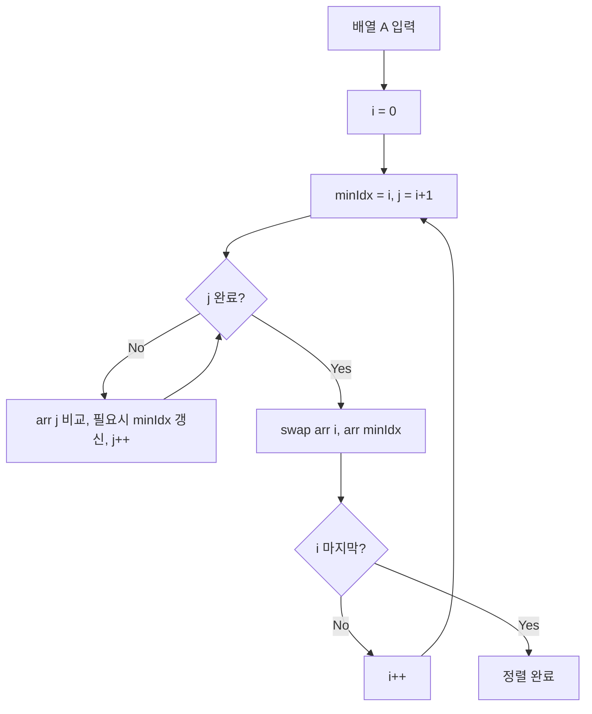

## 정의

**Selection Sort (선택 정렬)** 는 매 단계에서 **남은 원소 중 최솟값을 찾아 맨 앞으로** 보내는 정렬. n-1 번의 단계 후 정렬 완료.

다른 O(n²) 정렬과 달리 **교환 횟수가 최대 n-1 번** 으로 매우 적다. 교환 비용이 비싼 환경 (예: 큰 객체 swap, 디스크 I/O) 에서 의미 있다.

전체 비교는 [[정렬 알고리즘]] 참고.

## 문제 상황

정렬 알고리즘을 설계할 때 두 가지 비용이 중요하다: **비교 횟수**와 **교환 횟수**.

| 알고리즘 | 비교 | 교환 | 특징 |
|:---|:---:|:---:|:---|
| Bubble Sort | O(n²) | O(n²) | 인접 원소 반복 swap |
| Insertion Sort | O(n²) | O(n²) | shift 기반 이동 |
| **Selection Sort** | O(n²) | **O(n)** | 최솟값 위치 확인 후 1 회 swap |

핵심 통찰: *전체 스캔으로 최솟값 위치를 먼저 확인하고, 딱 한 번만 swap 한다.*

## 시각화

```anim:selection-sort
{}
```

## 알고리즘

```text
selectionSort(arr):
  n = length(arr)
  for i = 0 to n-1:
    minIdx = i
    for j = i+1 to n-1:
      if arr[j] < arr[minIdx]:
        minIdx = j
    swap(arr[i], arr[minIdx])
```

### 핵심 동작

배열을 *정렬된 부분* 과 *미처리 부분* 으로 나눔. 미처리 부분에서 최솟값을 찾아 정렬된 부분의 끝으로 보냄.

```text
[ 정렬됨 | 미처리 (최솟값 찾기) ]

초기:        [ | 5, 2, 8, 1, 4 ]    min = 1 (idx 3)
1단계:       [1 | 5, 2, 8, 4 ]      min = 2 (idx 2)  ← 5와 1 swap
2단계:       [1, 2 | 5, 8, 4 ]      min = 4 (idx 4)
3단계:       [1, 2, 4 | 5, 8 ]      min = 5 (idx 3)
4단계:       [1, 2, 4, 5 | 8 ]      마지막
완료:        [1, 2, 4, 5, 8]
```

### 흐름도



## 구현

<CodeWithOutput
  variants={[
    {
      language: "cpp",
      label: "C++",
      code: `#include <bits/stdc++.h>
using namespace std;

void selectionSort(vector<int>& arr) {
    int n = arr.size();
    for (int i = 0; i < n - 1; i++) {
        int minIdx = i;
        for (int j = i + 1; j < n; j++) {
            if (arr[j] < arr[minIdx]) minIdx = j;
        }
        if (minIdx != i) swap(arr[i], arr[minIdx]);
    }
}

int main() {
    int n; cin >> n;
    vector<int> arr(n);
    for (auto& v : arr) cin >> v;
    selectionSort(arr);
    for (int i = 0; i < n; i++) {
        if (i > 0) cout << " ";
        cout << arr[i];
    }
    cout << "\\n";
}`,
    },
    {
      language: "python",
      label: "Python",
      code: `def selection_sort(arr):
    n = len(arr)
    for i in range(n - 1):
        min_idx = i
        for j in range(i + 1, n):
            if arr[j] < arr[min_idx]:
                min_idx = j
        arr[i], arr[min_idx] = arr[min_idx], arr[i]
    return arr

n = int(input())
arr = list(map(int, input().split()))
print(*selection_sort(arr))`,
    },
    {
      language: "java",
      label: "Java",
      code: `import java.util.*;
public class Main {
    static void selectionSort(int[] arr) {
        int n = arr.length;
        for (int i = 0; i < n - 1; i++) {
            int minIdx = i;
            for (int j = i + 1; j < n; j++) {
                if (arr[j] < arr[minIdx]) minIdx = j;
            }
            if (minIdx != i) {
                int tmp = arr[i];
                arr[i] = arr[minIdx];
                arr[minIdx] = tmp;
            }
        }
    }
    public static void main(String[] args) {
        Scanner sc = new Scanner(System.in);
        int n = sc.nextInt();
        int[] arr = new int[n];
        for (int i = 0; i < n; i++) arr[i] = sc.nextInt();
        selectionSort(arr);
        StringBuilder sb = new StringBuilder();
        for (int i = 0; i < n; i++) {
            if (i > 0) sb.append(' ');
            sb.append(arr[i]);
        }
        System.out.println(sb);
    }
}`,
    },
  ]}
  cases={[
    {
      label: "기본 정렬",
      input: `5
5 2 8 1 4`,
      output: `1 2 4 5 8`,
    },
    {
      label: "이미 정렬된 입력",
      input: `4
1 2 3 4`,
      output: `1 2 3 4`,
    },
    {
      label: "역순 입력",
      input: `5
5 4 3 2 1`,
      output: `1 2 3 4 5`,
    },
  ]}
/>

## 복잡도

| 항목 | 값 |
|:---|:---|
| **시간 (최선)** | O(n²) (입력 무관) |
| **시간 (평균)** | O(n²) |
| **시간 (최악)** | O(n²) |
| **공간** | O(1) |
| **비교 횟수** | n(n-1)/2 (항상 같음) |
| **교환 횟수** | **최대 n-1 번** |
| **안정성** | ✗ Unstable |
| **In-place** | ✓ |

### 입력 무관 O(n²)

Insertion/Bubble 과 달리 **이미 정렬된 입력에서도 같은 시간** 이 든다. 최솟값을 찾기 위해 매번 전체를 스캔하기 때문.

```javascript
// 이미 정렬됨
[1, 2, 3, 4, 5]
// 단계 1: 4 비교 (min = 1)
// 단계 2: 3 비교 (min = 2)
// ...
// 총 비교: n(n-1)/2, swap: 0
```

## 교환 횟수가 적은 이점

매 단계에서 **최대 한 번** 의 교환. 그래서 **n-1 회 이하** 의 교환으로 정렬 완료.

| 알고리즘 | 비교 | 교환 |
|:---|:---:|:---:|
| Bubble | O(n²) | O(n²) |
| Insertion | O(n²) | O(n²) |
| **Selection** | O(n²) | **O(n)** |

**언제 의미가 있는가?**

```javascript
// 큰 객체 배열 정렬
const items = [/* 각 객체가 1MB */];
// Bubble/Insertion: 데이터 이동만 GB 단위
// Selection: n 번의 포인터 교환
```

C++ 의 `std::swap` 처럼 swap 비용이 큰 경우 Selection 이 의외로 빠를 수 있다.

## 안정 정렬이 아닌 이유

```javascript
[("A", 3), ("B", 1), ("C", 3), ("D", 2)]
// key 로 정렬 시:
// 단계 1: min = 1 (B) → A와 B swap
//   → [("B", 1), ("A", 3), ("C", 3), ("D", 2)]
// 단계 2: min = 2 (D) → A와 D swap
//   → [("B", 1), ("D", 2), ("C", 3), ("A", 3)]
// 결과: A 와 C 의 원래 순서 (A 먼저) 가 뒤바뀜 (C 가 먼저)
```

같은 key 의 원소가 swap 으로 뒤집힐 수 있다.

### 안정 변형: Stable Selection Sort

swap 대신 **삽입** 으로 처리하면 안정 정렬 가능. 단, 시간이 O(n²) 에서 O(n²) 로 변하지 않지만 공간이 O(n) 으로 증가.

## Heap Sort 와의 관계

Selection Sort 의 본질은 "남은 부분에서 최솟값 선택". **이 선택을 효율화한 것이 [[Heap Sort]]**.

| 단계 | Selection | Heap |
|:---|:---|:---|
| 최솟값 찾기 | O(n) 스캔 | O(log n) heap pop |
| 총 시간 | O(n²) | O(n log n) |

Heap Sort 는 사실상 "Selection Sort 의 효율적 구현".

## Heap Sort 와의 비교 (개념적 진화)

```text
Selection Sort:
  매번 남은 부분 전체 스캔 → O(n) × n = O(n²)

Heap Sort:
  남은 부분을 heap 으로 유지 → O(log n) × n = O(n log n)
```

## 작은 입력 + 비싼 교환 케이스

Selection 이 의미 있는 드문 케이스:

```javascript
// 노드 배열 정렬, 각 노드가 거대한 그래프 객체를 참조
const nodes = [/* 30개, 각각 100KB */];
nodes.sort(byPriority);
```

이 경우:
- Insertion / Bubble: 비교마다 데이터 이동 → 메모리 트래픽 큼
- Selection: 비교는 많지만 swap 은 30 번 이하 → 데이터 이동 최소

다만 보통의 JS / Python 정렬에서는 의미 없다 (참조만 swap 됨).

## 함정

### 1. 거의 정렬된 입력에서도 느림

Insertion Sort 가 O(n) 으로 처리하는 케이스에서 Selection 은 **여전히 O(n²)**. 이 점에서 거의 정렬된 입력에는 Insertion 이 항상 우월.

### 2. 안정성 없음

같은 키의 원래 순서를 보존해야 하면 사용 불가.

### 3. 교육 외에는 거의 안 쓰임

실무에서 Selection Sort 를 쓸 일은 사실상 없다. 작은 입력 → Insertion, 큰 입력 → Quick/Merge, in-place + 보장 → Heap.

### 4. swap 최적화 주의

`minIdx == i` 인 경우 (자기 자신이 최솟값) swap 을 생략하면 불필요한 대입 연산을 줄일 수 있다. 교환 횟수를 실제로 줄이는 작지만 실용적인 최적화.

## BOJ 연습 문제

| 번호 | 제목 | 링크 |
|:---|:---|:---|
| BOJ 2750 | 수 정렬하기 | [kokoa-lab](https://github.com/kokoa-lab/boj-problems/tree/main/organize_problems/2700-2799/2750) |
| BOJ 1427 | 소트인사이드 | [kokoa-lab](https://github.com/kokoa-lab/boj-problems/tree/main/organize_problems/1400-1499/1427) |
| BOJ 2587 | 대표값2 | [kokoa-lab](https://github.com/kokoa-lab/boj-problems/tree/main/organize_problems/2500-2599/2587) |
| BOJ 25305 | 커트라인 | [kokoa-lab](https://github.com/kokoa-lab/boj-problems/tree/main/organize_problems/25300-25399/25305) |

## 참고

- [[정렬 알고리즘]]
- [[Bubble Sort]]
- [[Insertion Sort]]
- [[Heap Sort]]
- Knuth, *TAOCP Vol. 3 §5.2.3*
