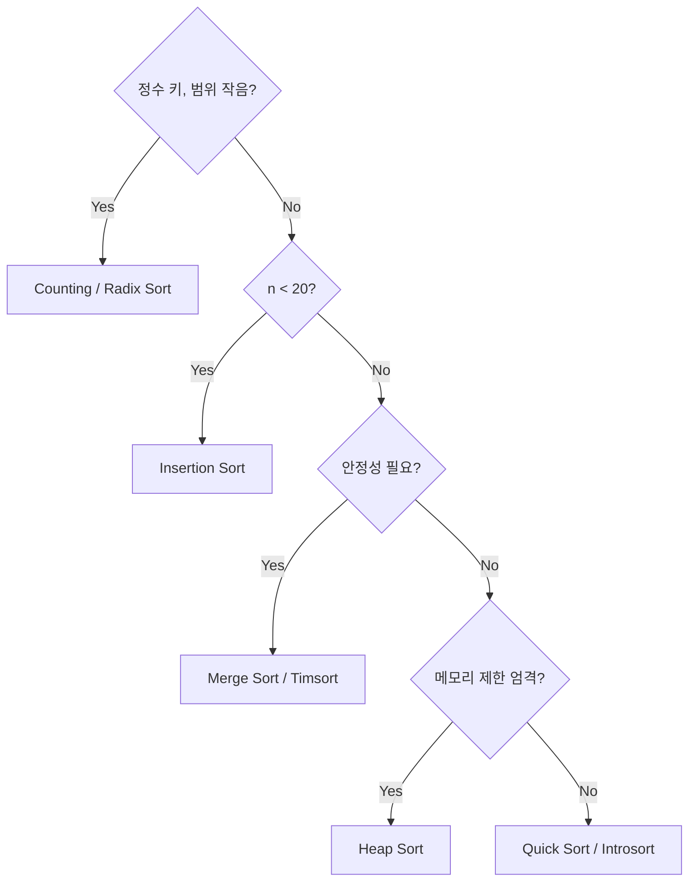
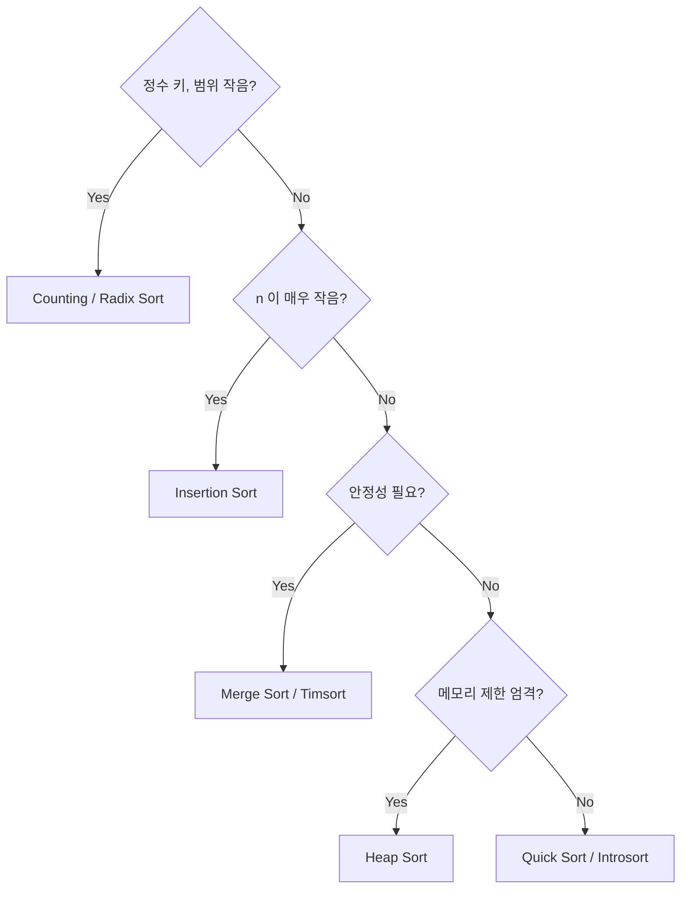

## 정의

**정렬 (sort)** 은 원소들의 컬렉션을 어떤 *전순서 (total order)* 기준으로 재배열하는 것. 알고리즘 입문의 정석 주제이자, 데이터베이스·검색·통계 등 모든 시스템의 기반.

같은 결과 (정렬된 배열) 를 만드는 방법은 수십 가지가 있고, **데이터 크기·메모리·중복 처리·하드웨어** 에 따라 최적의 선택이 달라진다.

자세한 메모리 비용 (정렬이 메모리를 다 쓰면 어떻게 디스크로 흘러가는지) 은 [[정렬·해시는 메모리가 부족하면 어디로 새는가, PGA, work_mem, Workspace Memory]] 글 참고.

## 핵심 아이디어

**비교 정렬의 정보이론적 하한**: n! 가지 순열 중 하나를 구분하려면 최소 log2(n!) ≈ n log n 번 비교해야 함. 따라서 비교 기반 정렬은 **O(n log n) 이 이론적 최적**.

분포 기반 정렬 (Counting, Radix) 은 비교를 우회하므로 이 하한을 돌파해 O(n) 도달 가능. 단, 키 범위 또는 자릿수 제약이 필요.

## 핵심 아이디어

### 비교 정렬의 정보이론적 하한

n! 가지 순열 중 하나를 구분하려면 최소 log2(n!) ≈ n log n 번 비교해야 함. 이것이 비교 기반 정렬의 **O(n log n) 이론적 하한**. 이 하한에 도달하는 알고리즘이 Merge Sort 와 Heap Sort.

결정 트리 관점: 각 비교가 2분기를 만들고 리프가 n! 개이므로 깊이 >= ceil(log2(n!)).

**분포 정렬은 이 하한을 우회**: 비교를 하지 않고 값 자체를 인덱스로 사용해 O(n) 달성. 단, 키 범위 또는 자릿수 제약이 필요.

### 실제 성능 결정 요인

이론상 O(n log n) 이 같아도 실측 속도는 크게 다르다:

- **상수항**: inner loop 연산 수
- **캐시 지역성**: Quick Sort > Merge Sort > Heap Sort (인접 메모리 접근 빈도)
- **분기 예측**: 단순 반복문이 재귀보다 예측하기 쉬움
- **입력 패턴**: 거의 정렬된 데이터라면 Insertion/Timsort 가 O(n) 에 가깝게 동작

## 핵심 분류

### 비교 정렬 vs 분포 정렬

| 구분 | 설명 | 예 |
|:---|:---|:---|
| **비교 (comparison)** | 두 원소를 비교 (`<`, `>`) 해서 순서 결정. 최소 O(n log n) 하한 | Merge, Quick, Heap, Bubble, Insertion, Selection |
| **분포 (distribution)** | 원소 값을 키로 직접 배치. O(n) 가능하지만 키 범위 제약 | Counting Sort, Radix Sort, Bucket Sort |

이 위키에서는 주로 **비교 정렬** 을 다룬다.

### In-place vs Out-of-place

- **In-place**: 입력 배열 자체를 재배열. O(1) ~ O(log n) 추가 메모리
- **Out-of-place**: 별도 메모리 필요. 일반적으로 O(n)

### Stable vs Unstable

- **Stable**: 같은 키를 가진 원소들의 *원래 순서* 가 보존됨
- **Unstable**: 같은 키 원소들의 순서가 뒤바뀔 수 있음

같은 키가 여러 번 등장하고 그 부속 정보가 중요할 때 (예: "성으로 정렬한 뒤 이름으로 정렬" -> 안정 정렬이어야 성-이름 모두 정렬됨) 안정성이 중요하다.

## 비교 정렬 한눈에

| 알고리즘 | 최선 | 평균 | 최악 | 공간 | 안정 | 비고 |
|:---|:---:|:---:|:---:|:---:|:---:|:---|
| [[Bubble Sort]] | O(n) | O(n^2) | O(n^2) | O(1) | ✓ | 교육용. 거의 정렬된 입력에 빠름 |
| [[Insertion Sort]] | O(n) | O(n^2) | O(n^2) | O(1) | ✓ | 작은 n / 거의 정렬된 입력. 표준 라이브러리에서 작은 부분에 사용 |
| [[Selection Sort]] | O(n^2) | O(n^2) | O(n^2) | O(1) | ✗ | 비교 횟수는 많지만 **교환은 최소 (n번)** |
| [[Merge Sort]] | O(n log n) | O(n log n) | O(n log n) | O(n) | ✓ | 항상 일정. 외부 정렬의 기반 |
| [[Quick Sort]] | O(n log n) | O(n log n) | O(n^2) | O(log n) | ✗ | 평균 빠름. 대부분의 표준 라이브러리 |
| [[Heap Sort]] | O(n log n) | O(n log n) | O(n log n) | O(1) | ✗ | in-place + 일정. Top-K 문제에 유용 |

> [!IMPORTANT]
> "O(n log n) 이면 다 똑같다" 는 잘못된 직관. **상수항·캐시 친화성·메모리 접근 패턴** 이 실제 성능을 좌우한다. 일반적으로 동일 점근 복잡도에서 **Quick > Heap > Merge** (in-memory 기준).

## 분포 정렬 상세

### Counting Sort

키 범위 [0, k) 에 각 원소의 등장 횟수를 배열에 세고 누적합으로 위치를 결정. **O(n + k)**.

```text
키 범위 k 가 n 에 비해 작을 때만 유리. k >> n 이면 공간 낭비 심함.
```

### Radix Sort

자릿수별로 Counting Sort 를 반복. 10진수 d 자리 정수라면 **O(d * (n + 10)) = O(dn)**.

- **LSD (Least Significant Digit)**: 낮은 자리부터 안정 정렬
- **MSD (Most Significant Digit)**: 높은 자리부터, 재귀 가능

정수 배열 정렬의 실용적 최속 알고리즘 중 하나. n = 1e7 이상 정수 정렬 시 Quick Sort 를 이긴다.

### Bucket Sort

범위를 n 개의 버킷으로 나누고 각 버킷을 내부적으로 정렬. 입력이 균등 분포를 따르면 평균 **O(n)**. 분포가 치우치면 최악 O(n^2).

## 정렬 알고리즘 선택



## 선택 가이드

| 상황 | 추천 |
|:---|:---|
| n <= 20 | Insertion Sort (작은 상수항) |
| 일반 메모리 내 정렬 | Quick Sort (또는 Introsort = Quick + Heap fallback) |
| **안정성이 필요** | Merge Sort (또는 Timsort, Java/Python 의 표준) |
| 입력이 거의 정렬됨 | Insertion Sort 또는 Timsort |
| 데이터 > 메모리 | External Merge Sort |
| 메모리 매우 제한 (in-place + 일정) | Heap Sort |
| Top-K 만 필요 | Heap (전체 정렬 X, 부분 정렬) |
| 키 범위가 작은 정수 | Counting Sort (O(n + k)) |

## 분포 정렬 상세

### Counting Sort

키 범위 [0, k) 에 각 원소의 등장 횟수를 세고 누적합으로 위치 결정. **O(n + k)**.

```text
입력: [3, 1, 2, 1, 3]  (k=4)
count:  [0, 2, 1, 2]
prefix: [0, 0, 2, 3]   (시작 위치)
출력: [1, 1, 2, 3, 3]
```

k <= n 일 때 유리. k >> n 이면 공간 낭비.

### Radix Sort

자릿수별로 Stable Counting Sort 를 반복. d 자리 b진수 정수라면 **O(d * (n + b))**.

- **LSD (Least Significant Digit)**: 낮은 자리부터 반복. 구현 단순
- **MSD (Most Significant Digit)**: 높은 자리부터 재귀 분할. 조기 종료 가능

n = 1e7 이상 정수 정렬에서 Quick Sort 를 능가. 단, 자릿수 d 가 크면 효과 감소.

### Bucket Sort

범위를 n 개 버킷으로 나누고 각 버킷 내부를 Insertion Sort 로 정렬. 균등 분포라면 평균 **O(n)**. 치우친 분포에서는 최악 O(n^2).

## 정렬 알고리즘 선택



## 외부 정렬

데이터가 메모리에 들어가지 않을 때 사용. RDBMS 가 `ORDER BY`, `GROUP BY`, `DISTINCT` 같은 연산을 처리할 때의 주력 알고리즘.

- [[External Merge Sort]], Run 생성 + K-way Merge

## 표준 라이브러리에서 무엇을 쓰는가

| 언어 | 알고리즘 | 안정 |
|:---|:---|:---:|
| C `qsort` | Quicksort 변형 | ✗ |
| C++ `std::sort` | Introsort (Quick + Heap fallback) | ✗ |
| C++ `std::stable_sort` | Merge Sort (또는 변형) | ✓ |
| Java `Arrays.sort` (객체) | Timsort | ✓ |
| Java `Arrays.sort` (원시 타입) | Dual-Pivot Quicksort | ✗ |
| Python `list.sort()` / `sorted()` | Timsort | ✓ |
| Rust `slice::sort` | Timsort 기반 | ✓ |
| Rust `slice::sort_unstable` | Pdqsort (Pattern-defeating Quicksort) | ✗ |
| JavaScript `Array.prototype.sort` | ES2019 부터 stable 의무 (V8 는 Timsort) | ✓ |

**Timsort** 가 안정 정렬의 사실상 표준. Merge + Insertion 의 하이브리드로, 실제 데이터에서 자주 나타나는 "부분적으로 정렬된" 패턴 (run) 을 활용한다.

- **Run 탐지**: 자연 오름차순 / 내림차순 연속 구간 자동 감지
- **Run 보충**: MIN_RUN (32~64) 미만이면 Insertion Sort 로 확장
- **갤로핑 (Galloping)**: 두 run 중 한 쪽이 연속으로 이기면 이진 탐색으로 빠르게 건너뜀
- 이미 정렬된 입력에서 **O(n)**, 랜덤 입력에서 **O(n log n)**

## RDBMS 와의 관계

DB 가 `ORDER BY` 를 처리할 때:

| 데이터 크기 | 알고리즘 | I/O |
|:---|:---|:---:|
| 메모리 >= 데이터 | Quicksort 또는 Heapsort (`LIMIT N`) | 0 |
| 메모리 < 데이터 <= 두 패스 한계 | External Merge Sort, 1 패스 | 2x |
| 메모리 매우 부족 | External Merge Sort, 다중 패스 | Kx |

자세한 메커니즘은 [[정렬·해시는 메모리가 부족하면 어디로 새는가, PGA, work_mem, Workspace Memory]] 참고.

## 함정

### 1. Quick Sort 최악 케이스

Naive Quick Sort 는 이미 정렬된 배열이나 모든 원소가 같은 배열에서 O(n^2). 대응: **랜덤 피벗** 또는 **median-of-three** 피벗 선택.

### 2. 안정성 착각

`std::sort` (C++) 와 `Array.prototype.sort` 의 일부 구현은 불안정. 안정 정렬이 필요하면 `std::stable_sort` 또는 key 를 (value, index) 쌍으로 확장.

### 3. 비교 함수 일관성

비교 함수가 strict weak ordering (비반사, 비대칭, 추이) 을 만족하지 않으면 UB (C++) 또는 무한 루프 (일부 언어). `a <= b` 를 비교 함수로 쓰면 안 된다 (`a == b` 일 때 `a <= b` 와 `b <= a` 가 동시에 true).

### 4. 정수 오버플로우 비교

`cmp = a - b` 패턴: a = INT_MAX, b = -1 이면 오버플로우. `return a < b ? -1 : a > b ? 1 : 0` 를 쓰거나 언어에서 제공하는 comparator 를 활용.

### 5. 캐시 영향

Heap Sort 는 random access 패턴이라 L1/L2 캐시 미스가 많음. 이론적으로는 O(n log n) 이지만 실측에서 Quick Sort 의 2~3배 느린 경우 흔함.

## BOJ 연습 문제

| 번호 | 제목 | 핵심 |
|:---|:---|:---|
| BOJ 2750 | 수 정렬하기 | 정렬 기본 |
| BOJ 11004 | K번째 수 | nth_element, partial sort |
| BOJ 10989 | 수 정렬하기 3 | Counting Sort (메모리 제한) |
| BOJ 15688 | 수 정렬하기 5 | Radix / Counting |

## 참고

- [[Merge Sort]]
- [[Quick Sort]]
- [[Heap Sort]]
- [[Bubble Sort]]
- [[Insertion Sort]]
- [[Selection Sort]]
- [[External Merge Sort]]
- [[정렬·해시는 메모리가 부족하면 어디로 새는가, PGA, work_mem, Workspace Memory]]
- Knuth, *The Art of Computer Programming, Vol. 3: Sorting and Searching*
