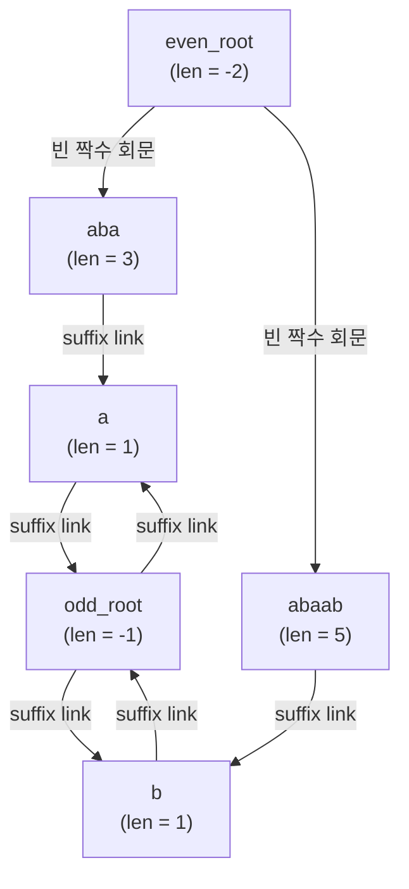
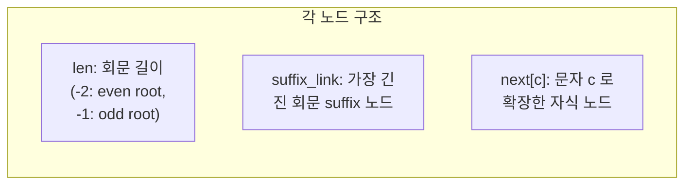

## 정의

**Palindrome Tree** (또는 **eerTree**) 는 문자열 `s` 의 모든 *서로 다른 회문 부분문자열* 을 **선형 공간 O(n)** 에 저장하는 자료구조. 2014 년 Mikhail Rubinchik 가 발표.

문자열에 회문 부분문자열은 최대 `n+1` 개 (Eertree 정리). 이 사실을 활용해 각 회문을 한 노드로, 회문 확장 관계를 트리 / suffix link 로 표현.

[[Suffix Automaton]] 이 모든 부분문자열을 표현한다면, eerTree 는 *회문만* 표현. 회문 카운트, longest palindromic substring, palindromic factorization 같은 회문 전용 문제의 표준.

## 문제 상황과 동기

회문 관련 문제는 *"문자열 s 에서 서로 다른 회문 부분문자열이 몇 개인가?"* 같은 형태로 자주 등장한다. 단순한 방법은 모든 부분문자열 O(n²) 개를 순회하며 각각 회문 여부를 O(n) 에 확인하는 **O(n³) brute-force**. 길이 1만 문자열조차 실용 불가.

[Manacher 알고리즘](https://example.com) 은 *각 위치에서의 최장 회문 반지름* 을 O(n) 에 구하지만, **서로 다른 회문의 개수**나 **회문 출현 위치 추적**은 할 수 없다. 회문 카운팅에는 명시적인 *자료구조* 가 필요.

핵심 통찰은 **문자열 s 의 회문 부분문자열은 최대 n+2 개** (Rubinchik 의 정리). 이 선형 bound 를 트리 형태로 유지하면 한 문자 추가 시 O(1) amortized 로 갱신 가능. 이 구조가 eerTree.

PS 에서는 *회문 dp*, *회문 분할*, *최장 공통 회문* 같은 고난이도 문제에서 표준.

## 구조

두 개의 트리.

- **Even Root** (길이 -2 가상 노드) → 짝수 길이 회문들의 root
- **Odd Root** (길이 -1 가상 노드) → 홀수 길이 회문들의 root
- 각 노드: 회문 문자열 + 길이 + `suffix link` (가장 긴 진 회문 suffix)

문자를 한 번에 하나씩 추가하며 트리 / suffix link 갱신. 각 문자 O(1) amortized.

## 시각화

```anim:palindrome-tree
{}
```

## 구축 알고리즘

```text
add(c):  # 문자 c 추가
    cur = last  # 이전 처리 노드
    while True:
        if s[pos - cur.len - 1] == c: break
        cur = cur.suffix_link
    if 이미 cur 의 자식에 c 가 있음:
        last = cur.child[c]; return
    new = new node with len = cur.len + 2
    if new.len == 1:
        new.suffix_link = even_root  # odd, 길이 1
    else:
        find suffix_link by walking cur.suffix_link
    cur.child[c] = new
    last = new
```

전체 O(n · alphabet) 또는 O(n) amortized (hash map 사용 시).

### 동작 예제

문자열 `"abaab"` 를 한 글자씩 추가:

```text
초기: even_root(-2), odd_root(-1)
+ a:  노드1 (len=1, "a")
+ b:  노드2 (len=1, "b")
+ a:  노드3 (len=3, "aba")  ← 중간의 b 양쪽에 a 붙어 확장
+ a:  노드1 이미 존재, 재사용
+ b:  노드4 (len=5, "abaab") ← 전체가 회문
```

suffix link 체인: 노드4 → 노드2 (마지막 1 글자) → odd_root. 총 회문 개수 = 노드 수 = 4 (a, b, aba, abaab).

## 구현

C++ 구현 (전형적인 PS 코드). 노드 ≤ n+2, O(n) 구축.

```cpp
// Palindrome Tree (eerTree), O(n) build, O(n) space
#include <bits/stdc++.h>
using namespace std;

struct Node {
    int len, link;              // 길이, suffix link
    map<char, int> next;        // 알파벳 전이 (배열로도 가능)
};

struct PalindromeTree {
    vector<Node> tree;
    string s;
    int n, last;                 // 현재 위치, 마지막 노드

    PalindromeTree() {
        tree.resize(2);
        tree[0] = {-1, 1, {}};   // even_root (len=-1, odd 길이들 조상)
        tree[1] = {0, 1, {}};    // odd_root (len=0, 실제로는 빈 문자열)
        // FIXME: 일부 구현은 even=-2, odd=-1 / 0으로 나뉨
        n = 0; last = 1;
    }

    int get_link(int v) {
        // s[n - tree[v].len - 1] == s[n] 인 노드 찾기
        while (n - tree[v].len - 1 < 0 || s[n - tree[v].len - 1] != s[n])
            v = tree[v].link;
        return v;
    }

    void add(char c) {
        s += c;
        int cur = get_link(last);
        if (tree[cur].next.count(c)) {
            last = tree[cur].next[c];
            n++; return;
        }
        int node_id = tree.size();
        tree.push_back({tree[cur].len + 2, 0, {}});
        tree[cur].next[c] = node_id;

        if (tree[node_id].len == 1) {
            tree[node_id].link = 1; // 길이 1 → odd_root
        } else {
            int p = get_link(tree[cur].link);
            tree[node_id].link = tree[p].next[c];
        }
        last = node_id; n++;
    }

    int count_distinct() { return tree.size() - 2; }
};
```

주의: 이 코드는 *교육 목적* 간소화. 실전에서는 `next[]` 를 `int[26]` 배열로 두면 더 빠름.

## 복잡도

| 작업 | 비용 |
|:---|:---|
| 한 문자 추가 | O(1) amortized |
| 전체 구축 | O(n) (또는 O(n · alphabet) 배열 사용) |
| 노드 수 | n + 2 이하 |
| 공간 | O(n · alphabet) |

## 응용

### 1. 회문 부분문자열 개수

eerTree 의 노드 수 = 서로 다른 회문 수.

### 2. 각 위치에서 끝나는 회문 개수

문자 추가 시 *suffix link 체인의 깊이*. cnt[node] += 1 후 노드 역순 누적.

### 3. Longest Palindromic Substring

가장 긴 노드의 길이.

### 4. 두 문자열의 공통 회문 / 회문 부분문자열 LCS

두 문자열을 위한 두 eerTree 를 동시 운영. 공통 회문은 같은 구조의 매칭.

### 5. Palindromic Factorization

문자열을 회문으로 분할하는 최소 / 최대 개수. eerTree + DP.

## 함정

### 1. alphabet 크기

배열 자식 (`child[26]`) 은 빠르지만 큰 알파벳에서 메모리 폭주. hash map 으로 대체 가능하지만 상수항 증가.

### 2. suffix link 초기값

짧은 회문 (길이 1, 2) 의 suffix link 가 짝수/홀수 root 로 가야 함. 헷갈리면 디버깅 어려움.

### 3. Manacher 와 혼동

[Manacher 알고리즘](https://example.com) 은 *각 위치의 최장 회문 반지름* 을 O(n) 에 구함. 회문 카운트 / 자료구조가 아님. eerTree 는 *자료구조 + 카운트 + 패턴 매칭* 까지 일반화.

## 트리 구조 시각화

문자열 `"abaab"` 를 추가한 후의 eerTree.





## suffix link 의 의미

`suffix_link` 는 *현재 회문에서 자기 자신을 제외한 가장 긴 회문 suffix* 를 가리킨다.

예) 노드 `"abaab"` (len=5) 의 suffix_link:
- `"abaab"` 의 suffix 중 회문: `"baab"` (아님), `"aab"` (아님), `"ab"` (아님), `"b"` (회문!), `""` (자명)
- 가장 긴 진 회문 suffix = `"b"` → suffix_link 는 `"b"` 노드 (len=1)

이 체인을 따라가면 현재 위치에서 끝나는 모든 회문 suffix 를 열거 가능. 그 체인의 길이가 현재 위치까지 새로 생기는 회문 수.

## 회문 DP 에서의 응용

회문 분할 최소 개수 문제.

```cpp
// dp[i] = s[0..i-1] 을 회문으로 분할하는 최소 개수
// series link = suffix link 체인 최적화
struct Node {
    int len, link, series;  // series: 같은 diff 체인의 jump
    int diff;               // len - link.len
    map<char, int> next;
};

// 초기화 후 각 문자에서
// suffix link 를 타고 올라가며 dp 전이:
// for (v = last; v != root; v = tree[v].link)
//     dp[i] = min(dp[i], dp[i - tree[v].len] + 1)
// series link 로 O(n log n) 최적화 가능
```

## Quick Link (빠른 suffix link)

길이가 길어질수록 suffix link 체인이 길어진다. Series link (또는 quick link) 로 O(n log n) 까지 압축 가능.

```text
diff[v] = len[v] - len[link[v]]

if diff[v] == diff[link[v]]:
    series[v] = series[link[v]]   // 같은 산술 등차열 묶음
else:
    series[v] = link[v]
```

DP 전이 시 series link 를 먼저 타면 같은 diff 의 체인을 건너뜀.

## 두 문자열 비교

두 문자열 `S`, `T` 의 공통 회문 부분문자열 집합을 구하려면 두 eerTree 를 별도 구축 후, 해시나 정규화된 노드 ID 로 교집합을 구한다. 또는 `S + '#' + T` 를 하나의 문자열로 구축해 `'#'` 을 포함하지 않는 노드를 공통 회문으로 판단.

## BOJ 연습 문제

| 번호 | 제목 | 링크 |
|:---|:---|:---|
| BOJ 10066 | 팰린드롬 | [kokoa-lab](https://github.com/kokoa-lab/boj-problems/tree/main/organize_problems/10000-10099/10066) |
| BOJ 15893 | 가장 긴 공통부분 팰린드롬 | [kokoa-lab](https://github.com/kokoa-lab/boj-problems/tree/main/organize_problems/15800-15899/15893) |
| BOJ 18285 | Jaki Jovsi | [kokoa-lab](https://github.com/kokoa-lab/boj-problems/tree/main/organize_problems/18200-18299/18285) |

## 참고

- [[Suffix Automaton]]
- [[Run Enumerate]]
