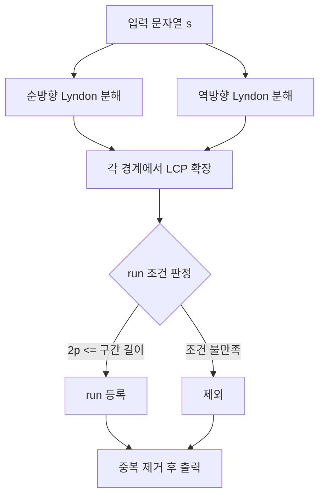

## 정의

**Run** 은 문자열에서 *주기적으로 반복되는 maximal 구간*. 정확히는 *구간 `[l, r]` 의 주기 `p` 가 `2p ≤ r - l + 1`* 이면서, 양 끝으로 확장 시 주기가 깨지는 부분.

**Run Enumerate** 는 길이 `n` 문자열의 모든 run 을 **선형 O(n)** 에 열거하는 알고리즘. *Bannai et al. 2015* 가 Lyndon decomposition 기반 O(n) 알고리즘을 발표 (그 전엔 Main-Lorentz O(n log n)).

PS 에서는 *반복 카운팅*, *반복적 회문*, *primitively rooted square 카운팅* 등 까다로운 문자열 통계 문제에 등장. 알려진 사실: **run 의 개수 ≤ n** (Bannai 의 *runs theorem*).

## 문제 상황과 동기

문자열 `s = "aabaabaa"` 는 주기적 반복 구간 (run) 을 여러 개 가진다: `"aa"` (위치 0-1), `"aabaa"` (위치 2-6) 등. *"주어진 문자열의 모든 maximal periodic substring 을 찾아라"* 같은 문제는 단순 접근으로 **O(n²)** (각 구간마다 주기 확인) 또는 *Z-algorithm / KMP failure 배열 기반 O(n²)*.

더 나쁜 것은, 구간별로 독립 검사하면 중복 / 누락이 쉽다. *maximal* 조건까지 확인하려면 양 끝 확장 여부를 모두 체크해야 해서 복잡.

핵심 통찰은 **길이 n 문자열의 run 개수는 항상 ≤ n 개** (Bannai et al. 의 정리). 이 선형 bound 를 활용해 *Lyndon factorization 경계에서 양방향 LCP 확장* 으로 모든 run 을 **O(n)** 에 찾을 수 있다. 증명은 까다롭지만 구현은 비교적 짧다 (Suffix Array + LCP / Z-function 위에서 200-400 줄).

PS 에서는 *반복 구조 분석*, *주기성 DP*, *압축 패턴 매칭* 같은 고난이도 문제에 등장.

## 시각화

```anim:run-enumerate
{}
```

## 핵심 아이디어 (Bannai et al.)

1. **Lyndon decomposition** 을 두 방향 (사전순 / 역사전순) 으로 계산
2. 각 Lyndon factor 의 경계에서 *주변으로 LCP / LCS 가 가능한 범위* 를 [[Suffix Automaton|Suffix Array + LCP]] 또는 *Z-function* 으로 확장
3. 발견된 구간 중 run 조건을 만족하는 것 수집

```text
1. Lyndon factorization l_1 l_2 ... l_k (each lexicographically smallest)
2. for each boundary i:
    period p = |l_i|
    extend left/right using string comparison
    if 2p <= length: record as run
```

증명은 까다롭지만 알고리즘은 비교적 짧다 (200 ~ 400 줄).

### 동작 예제

문자열 `"aabaabaab"`:

```text
Lyndon decomposition (사전순): "aab" + "aab" + "aab"
경계 위치: 3, 6
각 경계에서 주기 p=3 으로 좌우 확장
→ 전체 [0, 9) 가 run (주기 3, 3회 반복)

역사전순 decomposition 도 시도 (다른 패턴 발견)
→ 짧은 run 들 (예: "aa" at 0-2, 3-5, 6-8)

합치면 모든 run 열거 완료.
```

## 알고리즘 흐름도



## 구현

다음은 Duval's algorithm 을 이용한 Lyndon factorization. Run enumerate 의 핵심 전처리 단계다.

<CodeWithOutput
  variants={[
    {
      language: "cpp",
      label: "C++",
      code: `// O(n) Lyndon factorization (Duval's algorithm)
#include <bits/stdc++.h>
using namespace std;

vector<pair<int,int>> duval(const string& s) {
    int n = s.size(), i = 0;
    vector<pair<int,int>> res;
    while (i < n) {
        int j = i, k = i + 1;
        while (k < n && s[j] <= s[k]) {
            if (s[j] < s[k]) j = i;
            else j++;
            k++;
        }
        while (i <= j) { res.push_back({i, k-j}); i += k-j; }
    }
    return res;
}

int main() {
    string s; cin >> s;
    auto fs = duval(s);
    cout << "Lyndon factors (" << fs.size() << "):\\n";
    for (auto [st, len] : fs)
        cout << "  [" << st << "," << st+len-1 << "] = " << s.substr(st, len) << "\\n";
}`,
    },
    {
      language: "python",
      label: "Python",
      code: `# O(n) Lyndon factorization (Duval's algorithm)
def duval(s):
    n, i, res = len(s), 0, []
    while i < n:
        j, k = i, i + 1
        while k < n and s[j] <= s[k]:
            if s[j] < s[k]: j = i
            else: j += 1
            k += 1
        while i <= j:
            res.append((i, k - j))
            i += k - j
    return res

s = input()
factors = duval(s)
print(f"Lyndon factors ({len(factors)}):")
for st, length in factors:
    print(f"  [{st},{st+length-1}] = {s[st:st+length]}")`,
    },
  ]}
  cases={[
    {
      label: "aabaabaa",
      input: `aabaabaa`,
      output: `Lyndon factors (3):
  [0,2] = aab
  [3,5] = aab
  [6,7] = aa`,
    },
    {
      label: "abcabc",
      input: `abcabc`,
      output: `Lyndon factors (2):
  [0,2] = abc
  [3,5] = abc`,
    },
  ]}
/>

### 구현 팁

1. **Lyndon 의 양방향**: 사전순 / 역사전순 둘 다 필요. 한쪽만 하면 run 누락.
2. **LCP / LCS 확장**: Suffix Array + LCP 배열 또는 Z-function 으로 빠르게 확장.
3. **run 조건**: 주기 p 가 구간 길이의 절반 이하 (`2p ≤ length`) 여야 run.
4. **중복 제거**: 같은 run 이 여러 경로로 발견될 수 있음. set 또는 정렬 후 unique.

### Z-function 기반 LCP 확장

Z-function `Z[i]` = `s[0..]` 와 `s[i..]` 의 최장 공통 접두사 길이. 이를 이용해 경계에서 오른쪽 확장:

```text
Z_forward[i] = LCP(s, s[i:])   -> 오른쪽 확장 거리
Z_reverse[i] = LCP(rev(s), rev(s)[i:])  -> 왼쪽 확장 거리
```

각 Lyndon 경계 위치 `b` 에서 주기 `p` 로:
- 오른쪽 확장: `Z_forward[b]` 만큼
- 왼쪽 확장: `Z_reverse[n - b]` 만큼
- 합산 길이가 `2p` 이상이면 run 등록

이 방식으로 O(n) 전처리 + O(1) per boundary 로 전체 O(n).

### Library Checker 참조 구현

완전한 Run Enumerate 는 [Library Checker](https://judge.yosupo.jp/problem/runenumerate) 에 온라인 저지와 참조 구현이 있음.
반환 형식: `(l, r, p)` 형태, `[l, r]` 구간에 주기 `p` 인 run 이 존재.

```text
입력: aababab
출력 run 예시:
  (0, 1, 1)  -> "aa" at [0,1], period 1
  (2, 7, 2)  -> "ababab" at [2,7], period 2
```

## 응용

### 1. Longest Lyndon Prefix

각 위치에서 가장 긴 Lyndon prefix. run enumerate 와 동시에.

### 2. Repetition Counting

문자열 안의 모든 *반복 (xⁿ for x non-empty, n ≥ 2)* 의 개수. run 들로부터 산출.

### 3. 문자열 분해

primitively rooted squares, cubes, etc. 의 카운팅 / 위치.

### 4. Compressed Pattern Matching

LZ-style 압축에서 반복 구간 식별.

## 복잡도

| 작업 | 비용 |
|:---|:---|
| 모든 run 열거 | O(n) |
| run 개수 | ≤ n |
| 총 주기 합 | O(n log n) (Crochemore-Iliopoulos) |

## 함정

### 1. run 정의의 미묘함

*"maximal periodic substring with period p, exponent ≥ 2"* 의 한 글자 차이 (`>` vs `≥`) 가 결과를 크게 바꾼다. 문제 정의를 엄밀히.

### 2. Main-Lorentz O(n log n) vs Bannai O(n)

PS 에서 n ≤ 10⁶ 정도면 O(n log n) 도 통과한다. Bannai 의 O(n) 은 코드량이 더 크다.

### 3. Suffix Array 의존

대부분 구현이 Suffix Array + LCP 또는 Z-function 위에서 동작. 그 기반 자료구조부터 정확해야.

### 4. Lyndon 의 양방향

사전순 / 역사전순 둘 다 필요. 한쪽만 하면 run 누락.

## BOJ 연습 문제

| 번호 | 제목 | 링크 |
|:---|:---|:---|
| BOJ 23495 | Longest Lyndon Prefix | [kokoa-lab](https://github.com/kokoa-lab/boj-problems/tree/main/organize_problems/23400-23499/23495) |
| BOJ 25111 | Repetitions | [kokoa-lab](https://github.com/kokoa-lab/boj-problems/tree/main/organize_problems/25100-25199/25111) |
| BOJ 19020 | Decomposition | [kokoa-lab](https://github.com/kokoa-lab/boj-problems/tree/main/organize_problems/19000-19099/19020) |
| BOJ 16284 | Lucid Strings | [kokoa-lab](https://github.com/kokoa-lab/boj-problems/tree/main/organize_problems/16200-16299/16284) |

## 다른 출처 연습 문제

| 출처 | 제목 | 링크 |
|:---|:---|:---|
| Library Checker | Run Enumerate | https://judge.yosupo.jp/problem/runenumerate |

## 참고

- [[Suffix Automaton]]
- [[Palindrome Tree]]
