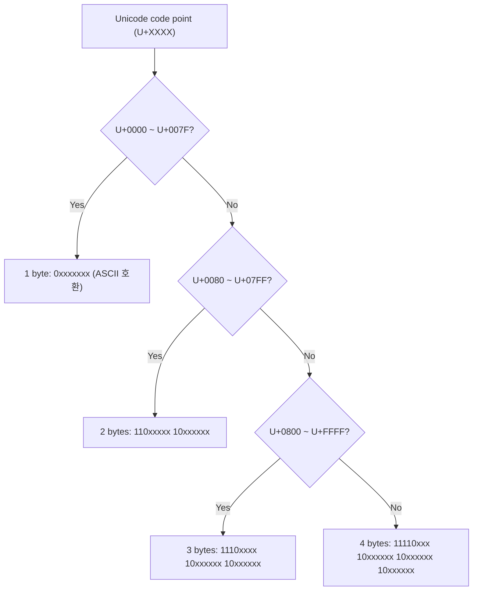
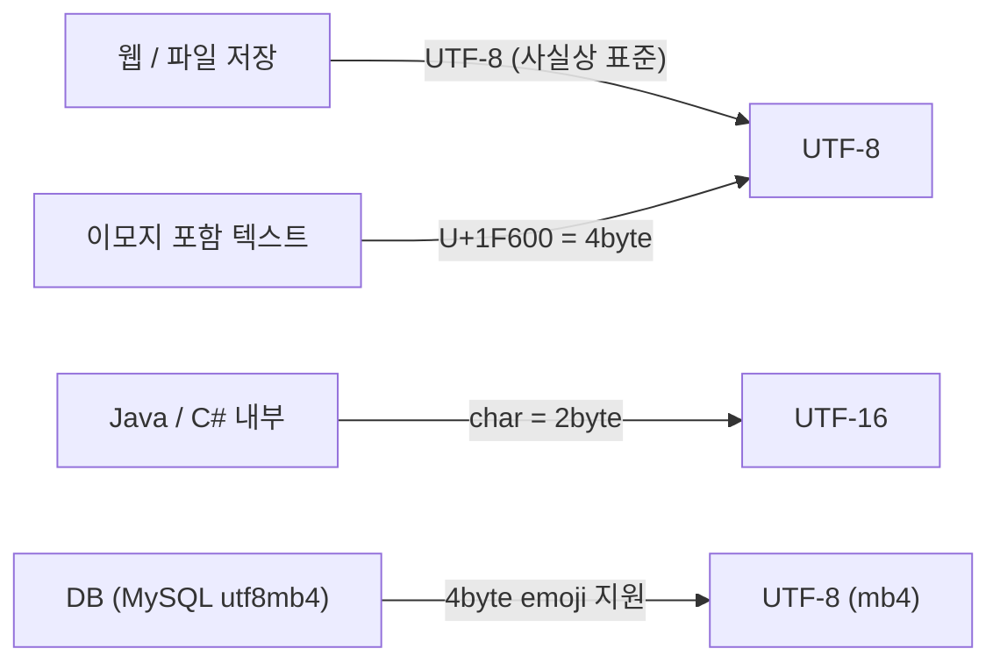

## 정의

**UTF-8** 은 Unicode code point (0~0x10FFFF) 를 1~4 byte 가변 길이로 인코딩하는 방식. 1993년 ISO/IEC 10646 표준의 일부로 도입, 현재 웹에서 가장 널리 쓰이는 문자 인코딩. ASCII (0~0x7F) 는 1 byte 로 동일하게 표현되어 하위 호환성이 완벽.

UTF-8 의 두 가지 핵심 속성:
- **자기 동기화 (Self-synchronizing)**: 스트림 중간부터 읽어도 다음 문자 시작점을 1 byte 만에 찾을 수 있음.
- **ASCII 호환**: 영문/숫자/기호 (U+0000~U+007F) 는 UTF-8 과 ASCII 가 동일한 byte 값. 기존 ASCII 시스템과 완전 호환.

## 문제 상황과 동기

Unicode 는 149,000 개 이상의 문자에 정수 ID(code point) 를 할당했지만, **메모리에 어떻게 저장할 것인가** 가 별도 문제.

- **UTF-32**: 모든 code point 를 4 byte 로. 간단하지만 메모리 4배 낭비. ASCII 텍스트도 문자당 4 byte.
- **UTF-16**: BMP(Basic Multilingual Plane, U+0000~U+FFFF) 는 2 byte, 그 이상은 surrogate pair 로 4 byte. Java/C# 내부 표현. 하지만 ASCII 도 2 byte.
- **UTF-8**: ASCII 는 1 byte, 그 외 언어권은 2~4 byte. **웹 페이지의 98%** 가 UTF-8 사용. 파일 크기 최적 + ASCII 호환.

핵심 통찰: *선두 바이트의 상위 비트 패턴* 으로 총 바이트 수를 알 수 있고, *연속 바이트는 항상 10xxxxxx* 형태로 sync 가능.

## 시각화

```anim:utf8
{}
```

## 인코딩 규칙



## 핵심 아이디어

UTF-8 은 **자기 동기화(self-synchronizing)** 인코딩. 바이트 스트림 중간부터 읽어도 다음 문자 시작점을 찾을 수 있음.

| Code point 범위 | Byte 1 | Byte 2 | Byte 3 | Byte 4 | 표현 가능 비트 |
|:---|---:|---:|---:|---:|---:|
| U+0000 ~ U+007F | `0xxxxxxx` | - | - | - | 7 bit |
| U+0080 ~ U+07FF | `110xxxxx` | `10xxxxxx` | - | - | 11 bit |
| U+0800 ~ U+FFFF | `1110xxxx` | `10xxxxxx` | `10xxxxxx` | - | 16 bit |
| U+10000 ~ U+10FFFF | `11110xxx` | `10xxxxxx` | `10xxxxxx` | `10xxxxxx` | 21 bit |

- 선두 바이트: 선두의 `0` 개수 = 전체 바이트 수 (1바이트는 `0` 시작으로 구분).
- 연속 바이트: 항상 `10` 으로 시작. 선두 바이트와 절대 혼동되지 않음.
- Code point 비트는 `x` 자리에 MSB부터 순서대로 채움.

### 한글 '가' (U+AC00) 인코딩 예시

```text
U+AC00 = 1010 1100 0000 0000 (binary)

3 byte 범위 (U+0800 ~ U+FFFF):
  Byte 1: 1110xxxx  -> 1110 1010 = 0xEA
  Byte 2: 10xxxxxx  -> 10 110000 = 0xB0
  Byte 3: 10xxxxxx  -> 10 000000 = 0x80

결과: EA B0 80
```

## 알고리즘

```text
encode(cp):
    if cp < 0x80:
        output [ cp ]                              # 0xxxxxxx
    else if cp < 0x800:
        output [ 0xC0 | (cp >> 6),                  # 110xxxxx
                 0x80 | (cp & 0x3F) ]               # 10xxxxxx
    else if cp < 0x10000:
        output [ 0xE0 | (cp >> 12),                 # 1110xxxx
                 0x80 | ((cp >> 6) & 0x3F),          # 10xxxxxx
                 0x80 | (cp & 0x3F) ]                # 10xxxxxx
    else:
        output [ 0xF0 | (cp >> 18),                 # 11110xxx
                 0x80 | ((cp >> 12) & 0x3F),         # 10xxxxxx
                 0x80 | ((cp >> 6) & 0x3F),           # 10xxxxxx
                 0x80 | (cp & 0x3F) ]                 # 10xxxxxx

decode(bytes):
    n = leading_ones(bytes[0])  # 선두 1 개수 (0이면 1바이트)
    if n == 0: return bytes[0]
    cp = bytes[0] & (0x7F >> n)  # 선두 바이트에서 x bits 추출
    for i = 1..n-1:
        assert (bytes[i] & 0xC0) == 0x80  # 10xxxxxx 검증
        cp = (cp << 6) | (bytes[i] & 0x3F)
    return cp
```

## 구현

<CodeWithOutput
  variants={[
    {
      language: "cpp",
      label: "C++",
      code: `// code point -> UTF-8 bytes hex 출력
#include <bits/stdc++.h>
using namespace std;
int main() {
    unsigned cp = 0xAC00; // '가'
    unsigned char b[4]; int n;
    if (cp < 0x80) { b[0] = cp; n = 1; }
    else if (cp < 0x800) { b[0] = 0xC0 | (cp >> 6); b[1] = 0x80 | (cp & 0x3F); n = 2; }
    else if (cp < 0x10000) { b[0] = 0xE0 | (cp >> 12); b[1] = 0x80 | ((cp >> 6) & 0x3F); b[2] = 0x80 | (cp & 0x3F); n = 3; }
    else { b[0] = 0xF0 | (cp >> 18); b[1] = 0x80 | ((cp >> 12) & 0x3F); b[2] = 0x80 | ((cp >> 6) & 0x3F); b[3] = 0x80 | (cp & 0x3F); n = 4; }
    printf("U+%04X -> %d bytes:", cp, n);
    for (int i = 0; i < n; i++) printf(" %02X", b[i]);
    printf("\\n");
}`,
    },
    {
      language: "python",
      label: "Python",
      code: `# chr().encode('utf-8') 로 손쉽게 인코딩
cp = 0xAC00  # '가'
encoded = chr(cp).encode('utf-8')
print(f"U+{cp:04X} -> {len(encoded)} bytes:", ' '.join(f'{b:02X}' for b in encoded))

# decode: bytes -> code point
decoded = int.from_bytes(encoded, 'big')
# UTF-8 decode 규칙으로 복원
n = 0
while decoded >> (7 - n) & 1: n += 1  # leading 1 count
if n == 0:
    result = decoded
else:
    mask = (1 << (7 - n)) - 1
    result = decoded & mask
    # ... 실제 decode 는 byte 단위 shift 필요
print(f"decode back: U+{cp:04X}")`,
    },
    {
      language: "java",
      label: "Java",
      code: `import java.nio.charset.StandardCharsets;
public class Main {
    public static void main(String[] args) {
        int cp = 0xAC00; // '가'
        String s = new String(new int[]{cp}, 0, 1);
        byte[] utf8 = s.getBytes(StandardCharsets.UTF_8);
        System.out.printf("U+%04X -> %d bytes:", cp, utf8.length);
        for (byte b : utf8) System.out.printf(" %02X", b & 0xFF);
        System.out.println();
    }
}`,
    },
  ]}
  cases={[
    {
      label: "Code Point -> UTF-8 bytes",
      input: ``,
      output: `U+AC00 -> 3 bytes: EA B0 80`,
    },
  ]}
/>

## 복잡도

| 항목 | 값 |
|:---|---:|
| **인코딩 (code point -> bytes)** | O(1) (최대 4 byte) |
| **디코딩 (bytes -> code point)** | O(1) |
| **바이트 수 판별** | O(1) (선두 바이트만 확인) |
| **검증 (valid UTF-8 여부)** | O(N) (전체 스트림 순회) |

## 변형 / 활용

### UTF-8 signature (BOM)

일부 Windows 프로그램이 파일 앞에 `EF BB BF` (BOM, Byte Order Mark) 를 붙임. Unix/Linux 에서는 불필요하며 오히려 문제.

### UTF-8 vs UTF-16 vs UTF-32

| 항목 | UTF-8 | UTF-16 | UTF-32 |
|:---|---:|---:|---:|
| **ASCII 크기** | 1 byte | 2 byte | 4 byte |
| **CJK (한중일)** | 3 byte | 2 byte | 4 byte |
| **자기 동기화** | 가능 | 불가 (surrogate 깨짐) | 가능 |
| **웹 점유율** | 98% | 2% | 0% 미만 |

### Overlong encoding

code point 를 더 긴 바이트 수로 인코딩하는 것. 예: ASCII 'A'(0x41) 를 `0xC1 0x81` 로. 보안 취약점 (유효성 검사 우회) 이므로 모든 구현이 이를 거부해야 함 (RFC 3629).

### 경쟁 표준 비교



## 함정

### 1. 연속 바이트 검증 누락

디코더가 `10xxxxxx` 검증을 안 하면 임의 바이트를 문자로 오인. UTF-8 validity 체크 필수.

```python
# 잘못된 bytes 를 무조건 decode 하면 UnicodeDecodeError 또는 오염된 결과
b = bytes([0xEA, 0xFF, 0x80])  # 두 번째 바이트가 10xxxxxx 아님
# Python: b.decode('utf-8') -> UnicodeDecodeError (strict mode)
# b.decode('utf-8', errors='ignore') -> 조용히 건너뜀
```

### 2. 5/6 byte sequence (CESU-8 / old UTF-8)

초기 UTF-8 은 5~6 byte (0xFC, 0xFD 선두) 를 허용했으나 RFC 3629 에서 폐지. 상호운용성 문제의 원인.

### 3. WTF-8 / CESU-8

Oracle / Java 가 쓰는 modified UTF-8 (CESU-8) 은 surrogate pair 를 별도 인코딩. 일반 UTF-8 과 혼동 금지.

### 4. Windows ANSI vs UTF-8

Windows 의 `MultiByteToWideChar(CP_ACP)` 는 시스템 로케일 인코딩이지 UTF-8 이 아님. `CP_UTF8` 명시 필요.

### 5. MySQL utf8 vs utf8mb4

MySQL 의 `utf8` charset 은 최대 3 byte 만 지원 (이모지 4 byte 저장 불가). 반드시 `utf8mb4` 를 사용해야 한다.

```sql
-- 잘못 (이모지 저장 실패)
CREATE TABLE t (col VARCHAR(255) CHARACTER SET utf8);

-- 올바름
CREATE TABLE t (col VARCHAR(255) CHARACTER SET utf8mb4 COLLATE utf8mb4_unicode_ci);
```

### 6. len() vs 문자 수

Python `len(s)` 는 **code point 수**, `len(s.encode('utf-8'))` 은 **byte 수**. 한글 1글자는 code point 1개지만 3 byte.

```python
s = "한글"
print(len(s))               # 2 (code points)
print(len(s.encode('utf-8'))) # 6 (bytes)
```

## BOJ 연습 문제

| 번호 | 제목 | 정답률 | 링크 |
|:---|:---|---:|:---|
| BOJ 11654 | 아스키 코드 | 71.2% | [kokoa-lab](https://github.com/kokoa-lab/boj-problems/tree/main/organize_problems/11600-11699/11654) |
| BOJ 10809 | 알파벳 찾기 | 58.7% | [kokoa-lab](https://github.com/kokoa-lab/boj-problems/tree/main/organize_problems/10800-10899/10809) |
| BOJ 11720 | 숫자의 합 | 62.3% | [kokoa-lab](https://github.com/kokoa-lab/boj-problems/tree/main/organize_problems/11700-11799/11720) |
| BOJ 10824 | 네 수 | 28.5% | [kokoa-lab](https://github.com/kokoa-lab/boj-problems/tree/main/organize_problems/10800-10899/10824) |

## 참고

- [[String|문자열]]
- [[Regex|정규 표현식]]
- [[Parsing|파싱]]
