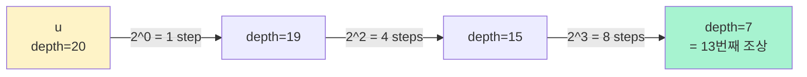

## 정의

**K번째 조상 문제 (K-th ancestor)** 는 루트 트리에서 정점 $u$ 의 조상 중 $u$ 로부터 정확히 $k$ 만큼 위에 있는 정점 (즉, $u$ 의 $k$ 번째 부모) 을 찾는 문제입니다.

정의:

$$
\text{kthAncestor}(u, k) = \begin{cases} u & (k = 0) \\ \text{parent}(u) & (k = 1) \\ \text{kthAncestor}(\text{parent}(u), k - 1) & (k \geq 2) \end{cases}
$$

$k$ 가 $u$ 의 깊이보다 크면 조상이 없음 (일반적으로 $-1$ 반환).

## 왜 어려운가

**Naive**: 부모를 한 번씩 따라 올라감. `O(k)` per query. $k = O(N)$ 이면 총 `O(NQ)` = $10^{10}$ 로 안 됨.

핵심 트릭은 [[binary-lifting|Binary Lifting]] 으로 $2^j$ 번째 조상 테이블을 O(N log N) 시간에 미리 계산하고, `k` 를 이진 표현으로 분해하여 O(log N) 안에 답합니다.

## 알고리즘: Binary Lifting

### 아이디어

$k$ 를 이진법으로 분해합니다.

$$
k = \sum_{i \in S} 2^i, \quad S \subseteq \{0, 1, 2, \ldots\}
$$

각 비트 $2^i$ 만큼 위로 올라가는 것을 **미리 저장** 해두면, `set bits` 만 순회하며 조상을 찾을 수 있습니다.

**예**: $k = 13 = 8 + 4 + 1 = 2^3 + 2^2 + 2^0$

$u$ 에서 시작해:
1. $2^0 = 1$ 번째 조상으로 이동
2. $2^2 = 4$ 번째 조상으로 이동
3. $2^3 = 8$ 번째 조상으로 이동

총 3번 점프로 13번째 조상 도달.

### 왜 이게 가능한가

관건은 **$2^i$ 번째 조상 = $2^{i-1}$ 번째 조상의 $2^{i-1}$ 번째 조상** 이라는 재귀 구조.

$$
\text{up}[u][i] = \text{up}[\text{up}[u][i-1]][i-1]
$$

이 함성 관계로 $O(N \log N)$ 전처리.

자세한 시각화는 [[binary-lifting|Binary Lifting]] 참조.

### 시각화: k = 13 조상 찾기



한 번의 O(log k) 순회로 13 = 1 + 4 + 8 을 조합.

## 알고리즘 (의사코드)

```text
전처리 (트리 DFS):
  up[u][0] = parent[u]
  for i in 1..LOG:
    up[u][i] = up[up[u][i-1]][i-1]

쿼리 kthAncestor(u, k):
  for i in 0..LOG:
    if k & (1 << i):
      u = up[u][i]
      if u == -1: return -1
  return u
```

`LOG = ceil(log2(N))`. $N \leq 10^5$ 이면 `LOG = 17` 로 충분.

## 구현

<CodeWithOutput
  variants={[
    {
      language: "cpp",
      label: "C++",
      code: `#include <bits/stdc++.h>
using namespace std;

const int MAXN = 500005;
const int LOG = 20;
int up[MAXN][LOG];
int depth[MAXN];
vector<int> adj[MAXN];

void dfs(int u, int p) {
    up[u][0] = p;
    for (int i = 1; i < LOG; i++) {
        up[u][i] = up[u][i-1] < 0 ? -1 : up[up[u][i-1]][i-1];
    }
    for (int v : adj[u]) if (v != p) {
        depth[v] = depth[u] + 1;
        dfs(v, u);
    }
}

int kthAncestor(int u, int k) {
    for (int i = 0; i < LOG; i++) {
        if (k & (1 << i)) {
            u = up[u][i];
            if (u < 0) return -1;
        }
    }
    return u;
}

int main() {
    int n, q;
    cin >> n;
    for (int i = 0; i < n - 1; i++) {
        int a, b;
        cin >> a >> b;
        a--; b--;
        adj[a].push_back(b);
        adj[b].push_back(a);
    }
    depth[0] = 0;
    dfs(0, -1);
    cin >> q;
    while (q--) {
        int u, k;
        cin >> u >> k;
        u--;
        int ans = kthAncestor(u, k);
        cout << (ans < 0 ? -1 : ans + 1) << "\\n";
    }
}`,
    },
    {
      language: "python",
      label: "Python",
      code: `import sys
from math import log2, ceil
sys.setrecursionlimit(600000)
input = sys.stdin.readline

def main():
    n = int(input())
    adj = [[] for _ in range(n)]
    for _ in range(n - 1):
        a, b = map(int, input().split())
        adj[a-1].append(b-1)
        adj[b-1].append(a-1)

    LOG = max(1, ceil(log2(n)) + 1)
    up = [[-1] * LOG for _ in range(n)]
    depth = [0] * n

    # iterative DFS
    stack = [(0, -1, False)]
    order = []
    while stack:
        u, p, processed = stack.pop()
        if processed:
            continue
        up[u][0] = p
        order.append((u, p))
        for v in adj[u]:
            if v != p:
                depth[v] = depth[u] + 1
                stack.append((v, u, False))

    # 층별 up 테이블 (BFS 순서로 안전)
    for i in range(1, LOG):
        for u in range(n):
            mid = up[u][i-1]
            up[u][i] = up[mid][i-1] if mid >= 0 else -1

    def kth(u, k):
        for i in range(LOG):
            if k & (1 << i):
                u = up[u][i]
                if u < 0:
                    return -1
        return u

    q = int(input())
    out = []
    for _ in range(q):
        u, k = map(int, input().split())
        ans = kth(u-1, k)
        out.append('-1' if ans < 0 else str(ans + 1))
    print('\\n'.join(out))

main()`,
    },
    {
      language: "java",
      label: "Java",
      code: `import java.util.*;
import java.io.*;
public class Main {
    static int LOG;
    static int[][] up;
    static int[] depth;
    static List<Integer>[] adj;

    static void dfs(int root) {
        int n = adj.length;
        int[] parent = new int[n];
        int[] order = new int[n];
        int idx = 0;
        int[] stack = new int[n];
        int top = 0;
        stack[top++] = root;
        parent[root] = -1;
        boolean[] seen = new boolean[n];
        seen[root] = true;
        while (top > 0) {
            int u = stack[--top];
            order[idx++] = u;
            up[u][0] = parent[u];
            for (int v : adj[u]) if (!seen[v]) {
                seen[v] = true;
                parent[v] = u;
                depth[v] = depth[u] + 1;
                stack[top++] = v;
            }
        }
        for (int i = 1; i < LOG; i++) {
            for (int u = 0; u < n; u++) {
                int mid = up[u][i-1];
                up[u][i] = mid < 0 ? -1 : up[mid][i-1];
            }
        }
    }

    static int kth(int u, int k) {
        for (int i = 0; i < LOG; i++) {
            if ((k & (1 << i)) != 0) {
                u = up[u][i];
                if (u < 0) return -1;
            }
        }
        return u;
    }

    public static void main(String[] args) throws IOException {
        BufferedReader br = new BufferedReader(new InputStreamReader(System.in));
        int n = Integer.parseInt(br.readLine().trim());
        adj = new ArrayList[n];
        for (int i = 0; i < n; i++) adj[i] = new ArrayList<>();
        for (int i = 0; i < n - 1; i++) {
            StringTokenizer st = new StringTokenizer(br.readLine());
            int a = Integer.parseInt(st.nextToken()) - 1;
            int b = Integer.parseInt(st.nextToken()) - 1;
            adj[a].add(b); adj[b].add(a);
        }
        LOG = (int) Math.ceil(Math.log(n) / Math.log(2)) + 1;
        up = new int[n][LOG];
        depth = new int[n];
        dfs(0);
        int q = Integer.parseInt(br.readLine().trim());
        StringBuilder sb = new StringBuilder();
        while (q-- > 0) {
            StringTokenizer st = new StringTokenizer(br.readLine());
            int u = Integer.parseInt(st.nextToken()) - 1;
            int k = Integer.parseInt(st.nextToken());
            int ans = kth(u, k);
            sb.append(ans < 0 ? -1 : ans + 1).append('\\n');
        }
        System.out.print(sb);
    }
}`,
    },
  ]}
  cases={[
    {
      label: "예시",
      input: `5
1 2
1 3
2 4
2 5
3
5 2
4 1
5 4`,
      output: `1
2
-1`,
    },
  ]}
/>

## 복잡도

| 항목 | 값 |
|:---|:---|
| **전처리** | O(N log N) 시간, O(N log N) 공간 |
| **쿼리** | O(log N) |
| **전체** | O((N + Q) log N) |

## 응용

### 1. LCA (Lowest Common Ancestor)

$u, v$ 의 [[lca|LCA]] 를 구할 때:
1. 깊이 차이만큼 낮은 쪽을 K번째 조상으로 올림 ($k = |depth(u) - depth(v)|$).
2. 남은 부분은 두 정점 동시에 위로 (top-down doubling).

K번째 조상은 LCA 의 핵심 부품.

### 2. Path sum on tree

$u$ 에서 $u$ 의 $k$ 번째 조상까지의 경로 위 값 합계. 방문 순서에 따른 부분합 + K번째 조상 위치로 계산.

자세한 것은 [[path-sum-on-tree|Path sum on tree]] 참조.

### 3. Level Ancestor (LA)

일반화 문제. $u$ 에서 특정 깊이 $d$ 의 조상 = $\text{kth}(u, \text{depth}(u) - d)$.

### 4. Functional Graph K-th successor

트리 대신 각 정점이 하나의 다음 정점을 가리키는 그래프에서 $k$ 번째 후속자.

같은 doubling 기법. 예: BOJ 17435 합성함수와 쿼리.

### 5. 문자열 서픽스 링크 (Suffix Automaton)

Suffix automaton 의 link 그래프도 트리 형태. 특정 상태의 $k$ 번째 조상 상태.

## 함정

### 1. LOG 계산

`LOG = ceil(log2(N)) + 1` 로 여유. $N = 500000$ 이면 `LOG >= 20`.

### 2. Off-by-one

- `kth(u, 0)` = `u` 자신 (조상 아님)
- `kth(u, 1)` = 부모
- $k > depth(u)$ = `-1`

### 3. 재귀 스택 오버플로

$N = 5 \times 10^5$ 이면 Python / C++ 모두 스택 부족 가능. **BFS 방식 iterative DFS** 사용.

### 4. Doubling 채우기 순서

`up[u][i] = up[up[u][i-1]][i-1]` 를 계산할 때 `up[?][i-1]` 이 이미 채워져 있어야 함. DFS 방문 순서로 채우면 부모가 먼저 처리되므로 안전.

## BOJ 연습 문제

| 번호 | 제목 | 링크 |
|:---|:---|:---|
| BOJ 3653 | 영화 수집 | [BOJ](https://www.acmicpc.net/problem/3653) |
| BOJ 17435 | 합성함수와 쿼리 | [BOJ](https://www.acmicpc.net/problem/17435) |
| BOJ 3176 | 도로 네트워크 | [BOJ](https://www.acmicpc.net/problem/3176) |
| BOJ 13511 | 트리와 쿼리 2 | [BOJ](https://www.acmicpc.net/problem/13511) |

## 참고

- [[binary-lifting|Binary Lifting]] - 근간 기법
- [[lca|LCA (최소 공통 조상)]] - K번째 조상의 대표 응용
- [[path-sum-on-tree|Path sum on tree]] - 조상 경로 합
- [[euler-tour-technique|Euler Tour]] - 트리 쿼리 대안
- [[sparse-table|희소 배열]] - 유사한 doubling 아이디어
