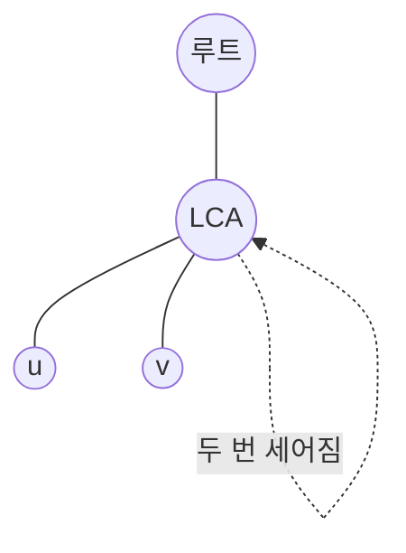

## 정의

**트리 경로 합 (Path Sum on Tree)** 는 트리에서 두 정점 $u, v$ 사이의 유일 경로 위 정점 (또는 간선) 값의 합 을 구하는 문제입니다.

문제 상황은 크게 두 가지.

- **정적 (static)**: 값은 고정. 쿼리 $\text{pathSum}(u, v)$ 여러 번.
- **동적 (dynamic)**: 값 갱신 + 경로 합 쿼리 혼합.

## 왜 어려운가

**Naive**: $u, v$ 의 LCA 까지 각각 올라가며 값을 더함. `O(depth)` per query. 최악 `O(N)`.

$N = Q = 10^5$ 이면 `O(NQ) = 10^{10}` 로 안 됨.

**핵심 통찰**: 트리에는 유일 경로가 있으므로 다음 관계를 이용:

$$
\text{pathSum}(u, v) = S(u) + S(v) - 2 \cdot S(\text{lca}(u, v)) + \text{val}[\text{lca}(u, v)]
$$

여기서 $S(x)$ 는 루트에서 $x$ 까지의 경로 합. 즉 **"루트 기준 접두합 (prefix sum on root-path)"**.

## 시각화



- $S(u) + S(v)$ 는 $R \to L$ 구간이 **두 번** 세어짐.
- $2 \cdot S(L)$ 을 빼면 $R \to L$ 이 제거.
- 하지만 $L$ 자체가 원래 경로 위 정점이므로 $\text{val}[L]$ 은 살려야 함. 따라서 `+ val[L]`.

정확히:

$$
\text{pathSum}(u, v) = \underbrace{S(u)}_{R \to u} + \underbrace{S(v)}_{R \to v} - \underbrace{2 \cdot S(L)}_{R \to L 두번} + \underbrace{\text{val}[L]}_{L \text{보정}}
$$

## 간선 값 경로 합

값이 **간선** 에 있으면 보정이 다릅니다.

$w(e)$ 를 간선 $e$ 의 값이라 하고 $E(x)$ 를 루트에서 $x$ 까지의 간선 합이라 하면:

$$
\text{edgePathSum}(u, v) = E(u) + E(v) - 2 \cdot E(\text{lca}(u, v))
$$

간선 값은 정점 값과 달리 LCA 자체가 경로 안에 포함되지 않으므로 `+ val[L]` 보정이 없습니다.

**변환 트릭**: 간선 $(p, c)$ 의 값을 자식 $c$ 의 정점 값으로 옮겨 저장하면 정점 값 문제로 통일 가능.

## 정적 알고리즘 (변경 없음)

### 전처리 (DFS)

```text
dfs(u, parent):
    S[u] = S[parent] + val[u]
    for v in adj[u]:
        if v != parent:
            dfs(v, u)
```

### 쿼리

```text
pathSum(u, v):
    L = lca(u, v)
    return S[u] + S[v] - 2 * S[L] + val[L]
```

- **전처리**: O(N) DFS + O(N log N) [[binary-lifting|Binary Lifting]] for LCA
- **쿼리**: O(log N) (LCA)
- **전체**: O((N + Q) log N)

## 구현 (정적)

<CodeWithOutput
  variants={[
    {
      language: "cpp",
      label: "C++",
      code: `#include <bits/stdc++.h>
using namespace std;

const int MAXN = 100005, LOG = 20;
int up[MAXN][LOG];
int depth[MAXN];
long long S[MAXN];
long long val[MAXN];
vector<int> adj[MAXN];

void dfs(int u, int p) {
    up[u][0] = p;
    for (int i = 1; i < LOG; i++) {
        up[u][i] = up[u][i-1] < 0 ? -1 : up[up[u][i-1]][i-1];
    }
    for (int v : adj[u]) if (v != p) {
        depth[v] = depth[u] + 1;
        S[v] = S[u] + val[v];
        dfs(v, u);
    }
}

int lca(int u, int v) {
    if (depth[u] < depth[v]) swap(u, v);
    int diff = depth[u] - depth[v];
    for (int i = 0; i < LOG; i++) {
        if (diff & (1 << i)) u = up[u][i];
    }
    if (u == v) return u;
    for (int i = LOG - 1; i >= 0; i--) {
        if (up[u][i] != up[v][i]) {
            u = up[u][i]; v = up[v][i];
        }
    }
    return up[u][0];
}

long long pathSum(int u, int v) {
    int L = lca(u, v);
    return S[u] + S[v] - 2 * S[L] + val[L];
}

int main() {
    int n, q;
    cin >> n >> q;
    for (int i = 0; i < n; i++) cin >> val[i];
    for (int i = 0; i < n - 1; i++) {
        int a, b;
        cin >> a >> b;
        a--; b--;
        adj[a].push_back(b); adj[b].push_back(a);
    }
    S[0] = val[0];
    dfs(0, -1);
    while (q--) {
        int u, v;
        cin >> u >> v;
        cout << pathSum(u-1, v-1) << "\\n";
    }
}`,
    },
    {
      language: "python",
      label: "Python",
      code: `import sys
from math import log2, ceil
input = sys.stdin.readline

def main():
    n, q = map(int, input().split())
    val = list(map(int, input().split()))
    adj = [[] for _ in range(n)]
    for _ in range(n - 1):
        a, b = map(int, input().split())
        adj[a-1].append(b-1); adj[b-1].append(a-1)

    LOG = max(1, ceil(log2(n)) + 1)
    up = [[-1] * LOG for _ in range(n)]
    depth = [0] * n
    S = [0] * n

    # iterative DFS
    stack = [(0, -1)]
    seen = [False] * n
    order = []
    S[0] = val[0]
    while stack:
        u, p = stack.pop()
        if seen[u]:
            continue
        seen[u] = True
        up[u][0] = p
        order.append(u)
        for v in adj[u]:
            if not seen[v]:
                depth[v] = depth[u] + 1
                S[v] = S[u] + val[v]
                stack.append((v, u))

    for i in range(1, LOG):
        for u in range(n):
            mid = up[u][i-1]
            up[u][i] = up[mid][i-1] if mid >= 0 else -1

    def lca(u, v):
        if depth[u] < depth[v]:
            u, v = v, u
        diff = depth[u] - depth[v]
        for i in range(LOG):
            if diff & (1 << i):
                u = up[u][i]
        if u == v:
            return u
        for i in range(LOG - 1, -1, -1):
            if up[u][i] != up[v][i]:
                u = up[u][i]; v = up[v][i]
        return up[u][0]

    out = []
    for _ in range(q):
        u, v = map(int, input().split())
        L = lca(u-1, v-1)
        out.append(str(S[u-1] + S[v-1] - 2 * S[L] + val[L]))
    print('\\n'.join(out))

main()`,
    },
  ]}
  cases={[
    {
      label: "정점 값",
      input: `5 3
1 2 3 4 5
1 2
1 3
2 4
2 5
4 5
4 3
3 5`,
      output: `11
10
11`,
    },
  ]}
/>

## 동적 알고리즘 (값 변경 지원)

정적 접근은 `S[u]` 를 미리 계산해두므로 **값이 변하면 전체 재계산** 필요. 동적 지원에는 다음 옵션:

### 옵션 A: Euler Tour + Fenwick

[[euler-tour-technique|Euler Tour]] 로 트리를 배열로 펼치고, [[fenwick-tree|Fenwick]] 로 구간 합.

`in-time`, `out-time` 을 이용해 **정점 값을 두 번 (in 에 +val, out 에 -val)** 넣으면:

$$
\text{root-to-}u\text{ sum} = \text{prefix}(\text{in}[u])
$$

- Update: O(log N)
- Query (path sum): 2 * LCA + O(log N)

### 옵션 B: Heavy-Light Decomposition (HLD)

경로를 O(log N) 개의 chain 으로 나누어 각 chain 에 [[segtree|Segment Tree]].

- Update: O(log N)
- Query: O(log^2 N)

강력하지만 구현 복잡.

### 옵션 C: Link-Cut Tree (LCT)

트리 구조 자체도 동적 변경 지원. 매우 복잡.

## 시각화: LCA 를 통한 경로 합 공식

```
루트 R
 \
  L (LCA)
 / \
A   B
|   |
u   v

pathSum(u, v) = pathSum(u -> L) + pathSum(L -> v) - val[L]
              = (S[u] - S[L] + val[L]) + (S[v] - S[L] + val[L]) - val[L]
              = S[u] + S[v] - 2*S[L] + val[L]
```

## 확장

### 경로 위 최댓값 / 최솟값

합 대신 max/min. **Idempotent** 연산이라 [[sparse-table|Sparse Table]] 로 O(1) 쿼리 가능:

```
maxOnPath(u, v):
    L = lca(u, v)
    return max(maxToRoot(u, L), maxToRoot(v, L), val[L])
```

각 `maxToRoot` 는 binary lifting 확장 (max 도 함께 저장).

### 경로 위 XOR

XOR 은 자기 역원이라 `xor(a, a) = 0`. LCA 방식이 더 깔끔:

$$
\text{xorPath}(u, v) = X(u) \oplus X(v) \oplus \text{val}[L]
$$

$-2 \cdot X(L)$ 이 XOR 에서는 항상 0.

### 경로 위 곱 (mod)

모듈러 곱셈. mod 소수면 modular inverse 로 나눗셈 가능:

$$
\text{prodPath}(u, v) = P(u) \cdot P(v) \cdot P(L)^{-2} \cdot \text{val}[L] \pmod{p}
$$

## 함정

### 1. 정점 값 vs 간선 값 보정

- 정점: `+ val[L]`
- 간선: 보정 없음

혼동하면 오답. 문제 정의를 명확히.

### 2. 배열 오버플로

정점 값이 큰 경우 (`10^9`) 총합은 `N * 10^9 = 10^14` 로 `int64` 필수.

### 3. 자기 자신 경로

`pathSum(u, u) = val[u]` (LCA = u, S[u] + S[u] - 2*S[u] + val[u] = val[u]).

### 4. 여러 컴포넌트

숲 (forest) 인 경우 각 트리별 처리. `lca` 가 다른 트리면 정의 없음.

### 5. LCA 를 안 쓰고 [[euler-tour-technique|ETT]] 만 로 경로 합?

ETT 는 서브트리 합만 자연스럽게. 경로 합은 LCA + prefix trick 이 표준. 두 정점의 in-time 만으로 경로 합은 못 함.

## BOJ 연습 문제

| 번호 | 제목 | 링크 |
|:---|:---|:---|
| BOJ 13511 | 트리와 쿼리 2 | [BOJ](https://www.acmicpc.net/problem/13511) |
| BOJ 1761 | 정점들의 거리 | [BOJ](https://www.acmicpc.net/problem/1761) |
| BOJ 3176 | 도로 네트워크 | [BOJ](https://www.acmicpc.net/problem/3176) |
| BOJ 1626 | 두 번째로 작은 스패닝 트리 | [BOJ](https://www.acmicpc.net/problem/1626) |

## 참고

- [[lca|LCA (최소 공통 조상)]] - 필수 부품
- [[binary-lifting|Binary Lifting]] - LCA 구현
- [[kth-ancestor|K번째 조상]] - 관련 기법
- [[euler-tour-technique|Euler Tour]] - 동적 확장
- [[fenwick-tree|Fenwick 트리]] - 동적 합 자료구조
- [[hld|HLD]] - 복잡한 경로 쿼리
- [[sparse-table|희소 배열]] - Max/Min 경로
