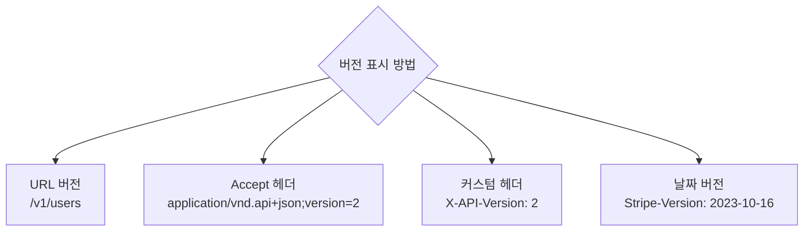
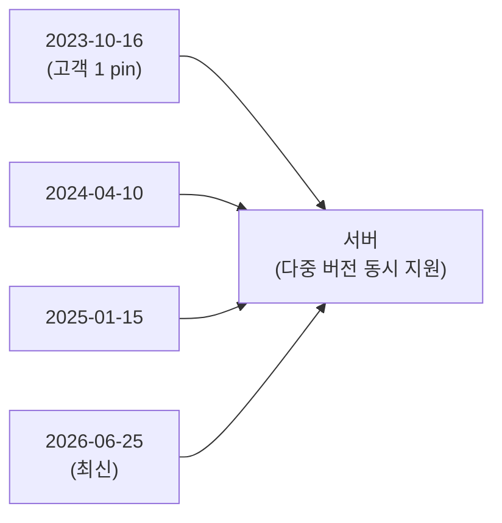
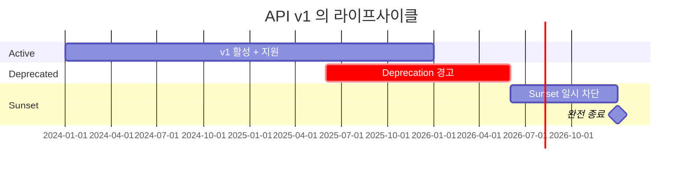
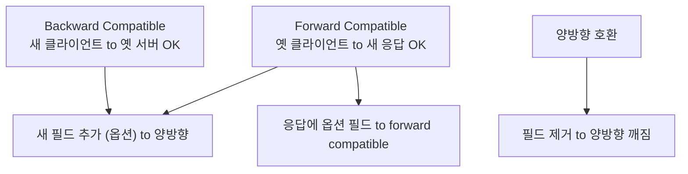

## 정의

**API Versioning** 은 *breaking change 를 클라이언트에 강요 없이* 호환성을 유지하는 전략. 잘못 잡으면 *모든 클라이언트 동시 마이그레이션 강요*.

## 무엇이 Breaking Change?

| Breaking | Non-breaking |
|---|---|
| 필드 제거 / 이름 변경 | 새 필드 추가 (옵션) |
| 필드 타입 변경 | 새 endpoint 추가 |
| 필수 필드 추가 | 새 enum 값 추가 (옵션 일 때만) |
| Enum 값 제거 | 새 query param (옵션) |
| Endpoint 삭제 | 새 응답 헤더 |
| 응답 status code 변경 | rate limit 조정 |
| Auth 방식 변경 | 에러 메시지 개선 (코드 유지) |

## 4가지 버전 전략



### 1. URL 버전 (`/v1/...`)

```
GET /v1/users/42
GET /v2/users/42
```

**장점**: 명시적, 브라우저 친화, 캐시 가능, debugging 쉬움.
**단점**: URL 영구 변경. 자원이 *같은데 URL 다름*.

> 가장 흔한 방식. *시작점으로 권장*.

### 2. Accept 헤더

```http
GET /users/42
Accept: application/vnd.example+json;version=2
```

**장점**: URL 유지.
**단점**: 디버깅 어려움 (`curl` 시 헤더 잊음), 캐싱 복잡.

### 3. 커스텀 헤더

```http
GET /users/42
X-API-Version: 2
```

**장점**: 단순.
**단점**: 표준 아님.

### 4. 날짜 기반 (Stripe 방식)

```http
GET /users/42
Stripe-Version: 2023-10-16
```

> *Stripe* 는 *모든 변경에 발표 날짜*. 클라이언트는 *고정 날짜로 pin*. 새 버전으로 *명시적 upgrade*.



## 기업 사례

### Google (URL 버전)

```
GET https://www.googleapis.com/calendar/v3/calendars/primary
GET https://youtube.googleapis.com/youtube/v3/videos
```

*모든 Google API 가 `/v{N}/` URL 버전* 채택. 버전 N = 대규모 재설계 시점.

### Stripe (날짜 버전)

```http
GET /v1/charges
Stripe-Version: 2023-10-16
```

- *매 변경마다* 날짜 버전 발행
- 기존 API key 는 *발급 당시 최신 버전으로 고정*
- 개발자가 *명시적 upgrade* 결정
- 같은 `/v1/` 경로, 날짜로 세분화

### GitHub (Accept 헤더 버전)

```http
GET /repos/octocat/hello-world
Accept: application/vnd.github.v3+json
X-GitHub-Api-Version: 2022-11-28
```

- 날짜 기반 버전 (2022-11-28 형식)
- `X-GitHub-Api-Version` 커스텀 헤더로 전달

### Twitter / X (URL 버전)

```
GET https://api.twitter.com/2/tweets
GET https://api.twitter.com/1.1/statuses/show.json
```

v1.1, v2 를 *장기간 병행 지원* (마이그레이션 부담 최소화).

## Deprecation Policy



| 단계 | 의미 | 헤더 |
|---|---|---|
| **Active** | 정상 사용 | - |
| **Deprecated** | 새 사용 자제 | `Sunset: <date>`, `Deprecation: <bool>` |
| **Sunset (graceful)** | 사용 가능, 적극 경고 | 응답에 경고, 일부 endpoint 410 |
| **Removed** | 410 Gone | - |

> [!IMPORTANT]
> Sunset 까지 *최소 6-12개월* 예고가 정통. *고객사가 단순 라이브러리만 따라잡으면 되도록*.

## Sunset 헤더 구현 (RFC 8594)

```typescript
// Express 미들웨어 예시
function deprecationMiddleware(req: Request, res: Response, next: NextFunction) {
  if (req.path.startsWith("/v1/")) {
    // RFC 8594: Sunset 헤더
    res.set("Sunset", "Sat, 31 Dec 2026 23:59:59 GMT");
    // draft RFC: Deprecation 헤더
    res.set("Deprecation", "Tue, 01 Jun 2025 00:00:00 GMT");
    res.set("Link", '</v2/docs>; rel="successor-version"');
  }
  next();
}
```

클라이언트 측에서 Sunset 헤더를 감지해 알림:

```typescript
const response = await fetch("/v1/users");
const sunset = response.headers.get("Sunset");
if (sunset) {
  const sunsetDate = new Date(sunset);
  console.warn(`[API] v1 가 ${sunsetDate.toLocaleDateString()} 에 종료됩니다. v2 로 마이그레이션 필요.`);
}
```

## Breaking Change 감지 도구

| 도구 | 기능 |
|---|---|
| **openapi-diff** | 두 OpenAPI spec 의 breaking change 리포트 |
| **oasdiff** | CLI, PR check 에서 자동 실행 |
| **Bump.sh** | SaaS, spec 변경 시 changelog 자동 생성 |
| **Optic** | CI/CD 통합, traffic 기반 spec 추출 |

```bash
# oasdiff 로 breaking change 감지
oasdiff breaking openapi-v1.yaml openapi-v2.yaml

# 출력 예시:
# GET /users/{id} response property 'email' removed (breaking)
# POST /users request body property 'phone' required (breaking)
```

## 호환성 카테고리



## 클라이언트 라이브러리 정책

| 정책 | 효과 |
|---|---|
| *Unknown field 무시* | forward compatible. *클라이언트 라이브러리의 기본* |
| *Unknown field 에러* | 엄격하지만 *호환성 깨짐* |
| Optional 만 처리 | 가장 안전 |

> Protobuf, JSON 모두 *unknown field 무시* 가 기본.

## Changelog 관리 패턴

```markdown
## 2026-06-25

### Breaking Changes
- `GET /v1/users` 응답에서 `full_name` 필드 제거 (`first_name` + `last_name` 분리)

### New Features
- `GET /v2/users` 에 `first_name`, `last_name` 추가
- `POST /v2/users/bulk` 배치 생성 endpoint 추가

### Deprecations
- `GET /v1/users` 2026-12-31 에 종료 예정
```

> *Changelog 는 클라이언트가 마이그레이션 결정 시 참고하는 핵심 문서*. 자동화 도구 (Bump.sh, Optic) 로 PR 단계에서 자동 생성 권장.

## 흔한 함정

> [!WARNING]
> 1. **버전 *없이* 시작** = breaking change 강요. 처음부터 *v1* 박기.
> 2. **`POST` 응답에 *enum 값 추가*** = 클라이언트의 *switch case 폭발*. *unknown case* 처리 강제.
> 3. **deprecation *없이* 종료** = 고객 폭동. 최소 6개월 전 알림.
> 4. **버전 수 *폭증*** = 5개 동시 지원 = 코드 분기 폭발. *최대 2-3개* 동시 지원 권장.
> 5. **Sunset 헤더 없는 deprecation** = 클라이언트가 *종료 일정 파악 불가*. RFC 8594 헤더 적극 활용.

## 관련 위키

- [[REST API Design]]
- [[OpenAPI Swagger]]
- [[Zero Downtime Deployment]]
- [[Idempotency Keys]]
