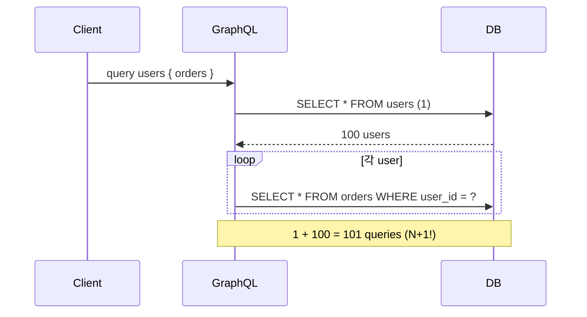
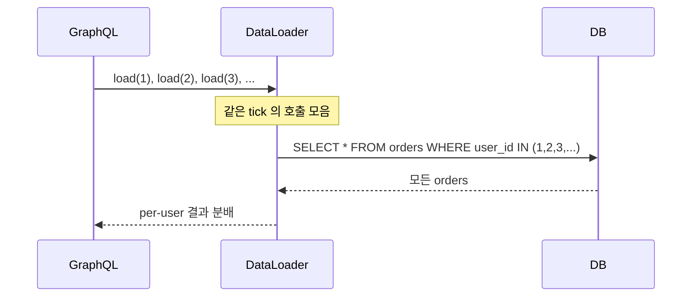
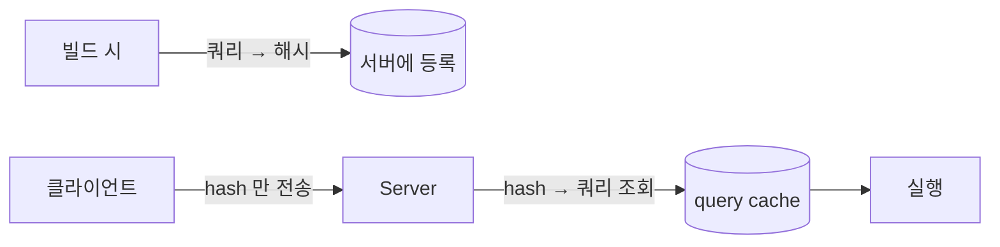
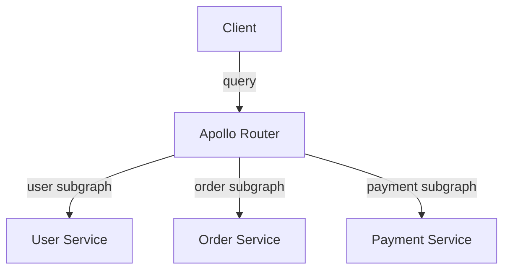

## 정의

**GraphQL** (Facebook, 2015) 은 *클라이언트가 필요한 필드만 명시* 하는 query language + 런타임. *단일 endpoint*, *typed schema*, *over-fetching / under-fetching 해소*.

## REST vs GraphQL

| 항목 | REST | GraphQL |
|---|---|---|
| Endpoint | 여러 개 | 단일 (`/graphql`) |
| 응답 형태 | 서버 결정 | 클라이언트 결정 |
| Over-fetching | 흔함 | 적음 |
| Multiple resources | N 번 요청 | 1번 쿼리 |
| Type | 옵션 (OpenAPI) | *필수 (SDL)* |
| 캐싱 | HTTP cache | 응답 단위 (별도) |
| 모니터링 | URL 별 | 쿼리 별 (복잡) |
| 학습 곡선 | 낮음 | 중간 |

## Schema (SDL)

```graphql
type Query {
  user(id: ID!): User
  users(limit: Int = 10, cursor: String): UserConnection!
}

type Mutation {
  createUser(input: CreateUserInput!): User!
  deleteUser(id: ID!): Boolean!
}

type User {
  id: ID!
  name: String!
  email: String!
  orders(status: OrderStatus): [Order!]!
}

enum OrderStatus { PENDING PAID CANCELLED }
```

## Query / Response

```graphql
query GetUserWithOrders($id: ID!) {
  user(id: $id) {
    name
    email
    orders(status: PAID) {
      id
      total
      items {
        product { name }
        quantity
      }
    }
  }
}
```

```json
{
  "data": {
    "user": {
      "name": "koa",
      "email": "koa@x.com",
      "orders": [
        {
          "id": "o_1",
          "total": 19900,
          "items": [{ "product": { "name": "Book" }, "quantity": 2 }]
        }
      ]
    }
  }
}
```

## N+1 문제 (GraphQL 의 함정)

```graphql
query {
  users {              # 1 query
    name
    orders {           # 각 user 마다 별도 query → N+1!
      total
    }
  }
}
```



### 해결: DataLoader

```js
const orderLoader = new DataLoader(async (userIds) => {
  const orders = await db.orders.find({ user_id: { $in: userIds } });
  return userIds.map(uid => orders.filter(o => o.user_id === uid));
});

const resolvers = {
  User: {
    orders: (user) => orderLoader.load(user.id),
  },
};
```

DataLoader 가 *같은 tick 의 모든 load() 호출을 모아 1 query 로*:



> [!IMPORTANT]
> DataLoader 는 *GraphQL 의 *필수* 동반자*. 없으면 거의 모든 nested query 가 *N+1*.

## Persisted Queries

매 요청에 *전체 쿼리 문자열* 보내면 *대역폭 + 보안 문제* (악의적 deep nested query 로 DoS).

**Persisted Query**: *쿼리를 미리 등록 + 해시로 호출*.



- 대역폭 *대폭 감소* (긴 쿼리 → 32바이트 해시).
- *whitelisted query* 만 실행 → *보안 강화*.
- Apollo Persisted Queries / Relay Compiler 가 자동.

## Subscription (실시간)

WebSocket 또는 SSE 위에서.

```graphql
subscription OnNewMessage($roomId: ID!) {
  messageAdded(roomId: $roomId) {
    id
    body
    sender { name }
  }
}
```

내부적으로 *WebSocket (graphql-ws)* 또는 *SSE*.

## Federation (단일 graph, 다중 서비스)

여러 서비스가 *각자 schema 일부* 를 담당. *gateway 가 통합 schema*.



마이크로서비스 환경의 *GraphQL 표준 패턴*.

## 캐싱

GraphQL 은 *HTTP cache 가 어려움* (POST + body):

- **응답 캐시**: 같은 query + 변수 → 같은 응답. CDN level 어렵, *Apollo Cache* / *@cacheControl* 디렉티브.
- **DataLoader**: per-request 캐싱.
- **Persisted Query + GET** = *URL 캐시 가능*. CDN 친화.

## 깊이 / 복잡도 제한 (보안)

```js
import depthLimit from 'graphql-depth-limit';
import { createComplexityLimitRule } from 'graphql-validation-complexity';

const server = new ApolloServer({
  schema,
  validationRules: [
    depthLimit(7),
    createComplexityLimitRule(1000),
  ],
});
```

> [!CAUTION]
> 클라이언트가 *극단적 nested query* (`user { friends { friends { friends { ... } } } }`) 를 보내면 *서버 DoS*. *depth + complexity 제한* 필수.

## 흔한 함정

> [!WARNING]
> 1. **DataLoader 미사용** = 모든 nested 필드 N+1. *처음부터 도입*.
> 2. **Depth limit 없음** = DoS 공격.
> 3. **모든 필드 *nullable*** = 응답 전체가 *null union* 형태. 명확한 nullability 명시.
> 4. **HTTP cache 의 *부재*** = GraphQL 의 큰 단점. 무거운 쿼리는 *외부 cache* + *persisted query*.

## 관련 위키

- [[REST API Design]]
- [[gRPC]]
- [[n-plus-one-problem]]
- [[Redis Cache Patterns]] (응답 캐싱)
