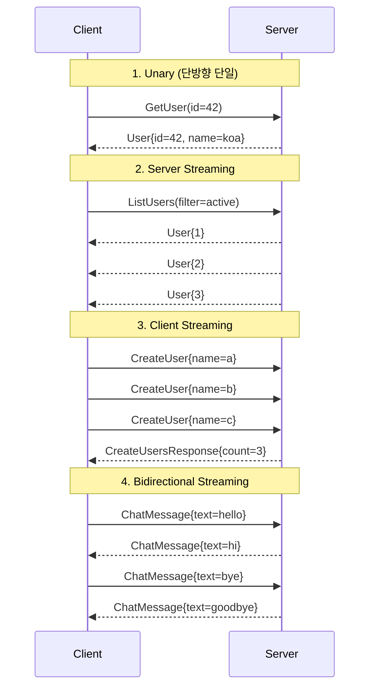
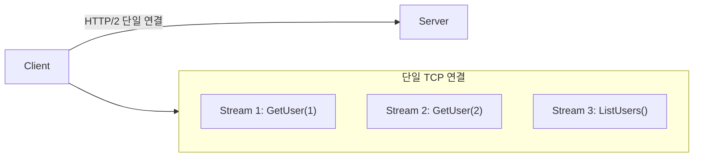
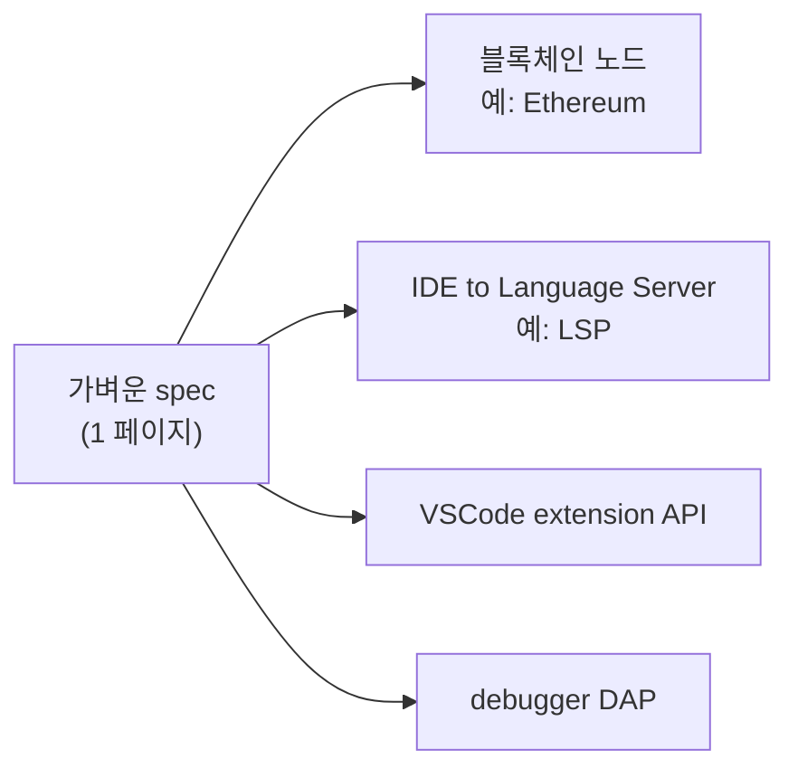
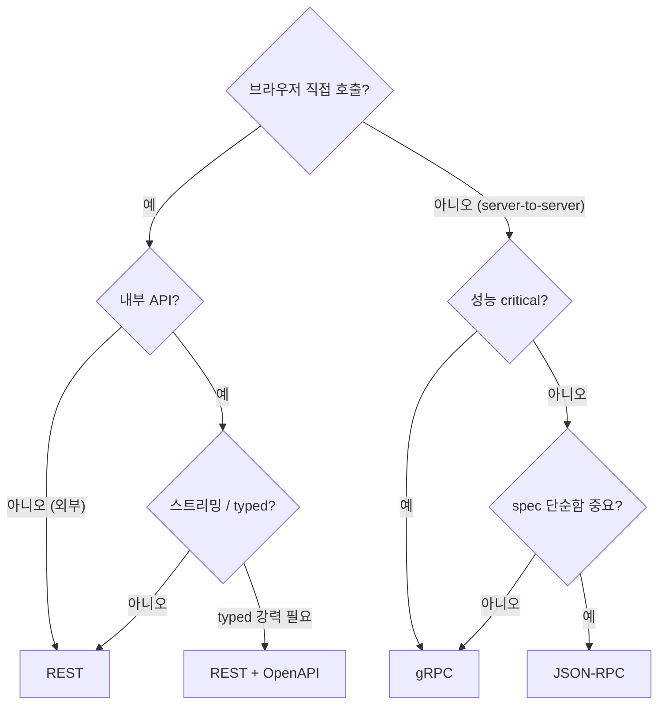
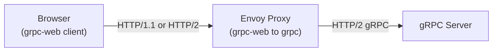

## 정의

**RPC (Remote Procedure Call)** = *원격 함수 호출* 추상화. 세 가지 주요 형태:

1. **JSON-RPC**: JSON 위 RPC. 가벼움.
2. **gRPC**: Protobuf + HTTP/2.
3. **REST** (RPC 스타일): `POST /api/getUser` 같이 동사 endpoint.

## JSON-RPC 2.0 메시지

```json
// 요청
{
  "jsonrpc": "2.0",
  "method": "getUser",
  "params": { "id": 42 },
  "id": 1
}

// 성공 응답
{
  "jsonrpc": "2.0",
  "result": { "id": 42, "name": "koa" },
  "id": 1
}

// 에러 응답
{
  "jsonrpc": "2.0",
  "error": {
    "code": -32601,
    "message": "Method not found"
  },
  "id": 1
}

// 알림 (응답 없음)
{
  "jsonrpc": "2.0",
  "method": "log",
  "params": ["info", "user logged in"]
}

// Batch (배열)
[
  { "jsonrpc": "2.0", "method": "a", "id": 1 },
  { "jsonrpc": "2.0", "method": "b", "id": 2 }
]
```

| 표준 에러 코드 | 의미 |
|---|---|
| -32700 | Parse error |
| -32600 | Invalid request |
| -32601 | Method not found |
| -32602 | Invalid params |
| -32603 | Internal error |
| -32000 ~ -32099 | server error |

## gRPC: Protobuf + HTTP/2

**Protocol Buffers (.proto)** 로 서비스 정의:

```protobuf
syntax = "proto3";
package user;

service UserService {
  // Unary: 단일 요청, 단일 응답
  rpc GetUser(GetUserRequest) returns (User);
  // Server streaming: 단일 요청, 스트림 응답
  rpc ListUsers(ListUsersRequest) returns (stream User);
  // Client streaming: 스트림 요청, 단일 응답
  rpc CreateUsers(stream CreateUserRequest) returns (CreateUsersResponse);
  // Bidirectional streaming: 양방향 스트림
  rpc Chat(stream ChatMessage) returns (stream ChatMessage);
}

message GetUserRequest {
  string id = 1;
}

message User {
  string id = 1;
  string name = 2;
  string email = 3;
  int64 created_at = 4;
}
```

코드 생성:

```bash
# Go 코드 생성
protoc --go_out=. --go-grpc_out=. user.proto

# TypeScript 코드 생성
protoc-gen-ts --ts_out=. user.proto

# Python 코드 생성
python -m grpc_tools.protoc -I. --python_out=. --grpc_python_out=. user.proto
```

## gRPC 4가지 Streaming 모드



| 모드 | 요청 | 응답 | 사용 |
|---|---|---|---|
| Unary | 단일 | 단일 | CRUD, 일반 API |
| Server Streaming | 단일 | 스트림 | 실시간 피드, 파일 다운로드 |
| Client Streaming | 스트림 | 단일 | 파일 업로드, 배치 처리 |
| Bidirectional | 스트림 | 스트림 | 실시간 채팅, 게임, 협업 도구 |

## 세 가지 RPC 비교

| 항목 | JSON-RPC | gRPC | REST (RPC 스타일) |
|---|---|---|---|
| Wire 포맷 | JSON | Protobuf | JSON |
| 전송 | HTTP/WS/TCP | HTTP/2 | HTTP/1.1+ |
| Schema | 옵션 | *필수 (proto)* | OpenAPI |
| Streaming | 없음 | *4 모드* | SSE/WS 별도 |
| 코드 생성 | 옵션 | *자동* | OpenAPI |
| 크기 / 속도 | JSON 만큼 | *수배 작고 빠름* | JSON |
| 브라우저 | 직접 | grpc-web 필요 | *직접* |
| Batch | *기본 지원* | 없음 | 없음 |

## HTTP/2 와 gRPC

gRPC 는 HTTP/2 를 필수로 사용한다:



| HTTP/2 기능 | gRPC 에서의 효과 |
|---|---|
| 멀티플렉싱 | 단일 연결 다중 RPC (Head-of-Line blocking 없음) |
| Header 압축 (HPACK) | gRPC metadata 오버헤드 감소 |
| Binary framing | Protobuf 와 자연스럽게 결합 |
| Server Push | streaming 기반 구현 |

## JSON-RPC 의 강점



| 표준 | RPC 토대 |
|---|---|
| **LSP** (Language Server Protocol) | JSON-RPC |
| **DAP** (Debug Adapter Protocol) | JSON-RPC |
| **MCP** (Model Context Protocol) | JSON-RPC |
| Ethereum JSON-RPC | JSON-RPC |
| Bitcoin RPC | JSON-RPC |

> [!IMPORTANT]
> JSON-RPC 는 *VSCode / LSP / MCP / 블록체인* 의 *de facto*. *복잡도 vs gRPC* 의 sweet spot.

## 언제 어떤 RPC?



## grpc-web: 브라우저에서 gRPC

브라우저는 *HTTP/2 raw frame* 에 접근 불가 → **grpc-web** 프록시 필요:



```yaml
# Envoy 설정 (grpc-web 트랜스코딩)
filters:
  - name: envoy.filters.http.grpc_web
  - name: envoy.filters.http.cors
```

## JSON-RPC TypeScript 구현 예시

```typescript
type JsonRpcRequest = {
  jsonrpc: "2.0";
  method: string;
  params?: unknown;
  id: string | number;
};

type JsonRpcResponse<T> =
  | { jsonrpc: "2.0"; result: T; id: string | number }
  | { jsonrpc: "2.0"; error: { code: number; message: string }; id: string | number };

async function callRpc<T>(method: string, params?: unknown): Promise<T> {
  const response = await fetch("/rpc", {
    method: "POST",
    headers: { "Content-Type": "application/json" },
    body: JSON.stringify({ jsonrpc: "2.0", method, params, id: Date.now() }),
  });
  const data: JsonRpcResponse<T> = await response.json();
  if ("error" in data) throw new Error(data.error.message);
  return data.result;
}
```

## JSON-RPC 의 함정

> [!WARNING]
> 1. **method 이름 충돌** = namespace 없음. 큰 시스템에서 *접두사* (`user.get`, `order.create`) 필요.
> 2. **HTTP status code 무관** = JSON-RPC 는 *항상 200*. error 는 *body 의 error 객체*. 모니터링 도구가 *에러 못 잡음*.
> 3. **Batch + notification 의 응답 매핑** = id 기반 매핑이 복잡. 잘못하면 응답이 *섞임*.
> 4. **버전 관리 없음** = *spec 자체에 버전 없음*. 직접 method 이름에 *v2* 박는 식.
> 5. **gRPC 브라우저 제약** = grpc-web 프록시 없으면 브라우저에서 직접 호출 불가.

## 관련 위키

- [[REST API Design]]
- [[gRPC]]
- [[GraphQL]]
- [[OpenAPI Swagger]]
