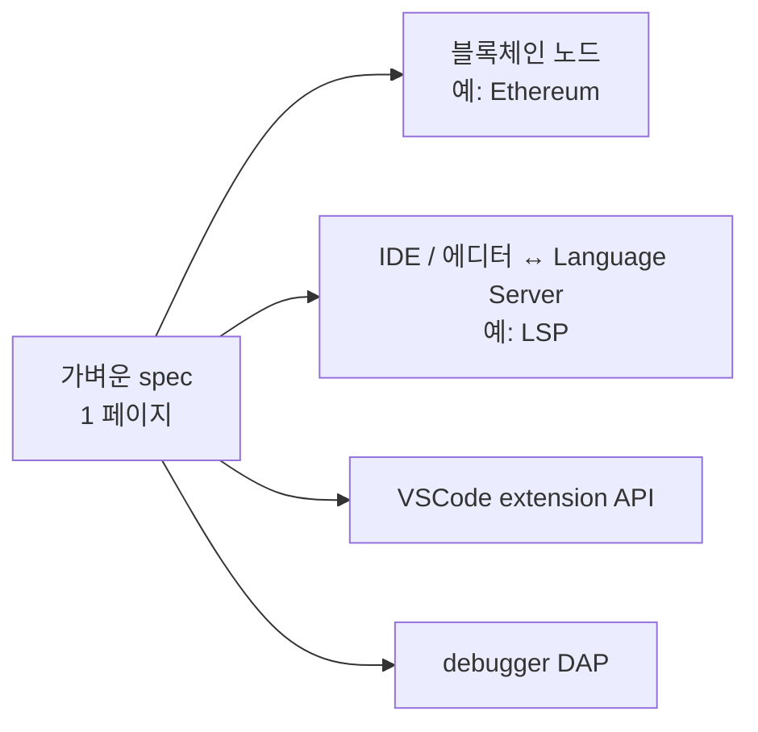
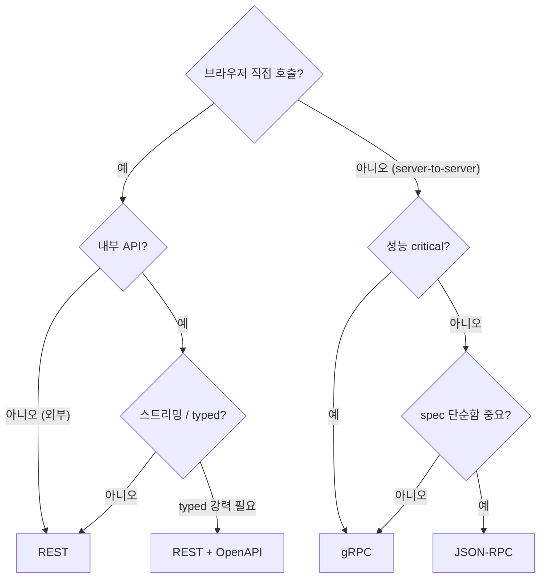

## 정의

**RPC (Remote Procedure Call)** = *원격 함수 호출* 추상화. 세 가지 주요 형태:

1. **JSON-RPC**: JSON 위 RPC. 가벼움.
2. **gRPC**: Protobuf + HTTP/2.
3. **REST** (RPC 스타일): `POST /api/getUser` 같이 동사 endpoint.

## JSON-RPC 2.0 메시지

```json
// 요청
{
  "jsonrpc": "2.0",
  "method": "getUser",
  "params": { "id": 42 },
  "id": 1
}

// 성공 응답
{
  "jsonrpc": "2.0",
  "result": { "id": 42, "name": "koa" },
  "id": 1
}

// 에러 응답
{
  "jsonrpc": "2.0",
  "error": {
    "code": -32601,
    "message": "Method not found"
  },
  "id": 1
}

// 알림 (응답 없음)
{
  "jsonrpc": "2.0",
  "method": "log",
  "params": ["info", "user logged in"]
}

// Batch (배열)
[
  { "jsonrpc": "2.0", "method": "a", "id": 1 },
  { "jsonrpc": "2.0", "method": "b", "id": 2 }
]
```

| 표준 에러 코드 | 의미 |
|---|---|
| -32700 | Parse error |
| -32600 | Invalid request |
| -32601 | Method not found |
| -32602 | Invalid params |
| -32603 | Internal error |
| -32000 ~ -32099 | server error |

## 세 가지 RPC 비교

| 항목 | JSON-RPC | gRPC | REST (RPC 스타일) |
|---|---|---|---|
| Wire 포맷 | JSON | Protobuf | JSON |
| 전송 | HTTP/WS/TCP | HTTP/2 | HTTP/1.1+ |
| Schema | 옵션 | *필수 (proto)* | OpenAPI |
| Streaming | 없음 | *4 모드* | SSE/WS 별도 |
| 코드 생성 | 옵션 | *자동* | OpenAPI |
| 크기 / 속도 | JSON 만큼 | *수배 작고 빠름* | JSON |
| 브라우저 | 직접 | grpc-web 필요 | *직접* |
| Batch | *기본 지원* | 없음 | 없음 |

## JSON-RPC 의 강점



| 표준 | RPC 토대 |
|---|---|
| **LSP** (Language Server Protocol) | JSON-RPC |
| **DAP** (Debug Adapter Protocol) | JSON-RPC |
| **MCP** (Model Context Protocol) | JSON-RPC |
| Ethereum JSON-RPC | JSON-RPC |
| Bitcoin RPC | JSON-RPC |

> [!IMPORTANT]
> JSON-RPC 는 *VSCode / LSP / MCP / 블록체인* 의 *de facto*. *복잡도 vs gRPC* 의 sweet spot.

## 언제 어떤 RPC?



## JSON-RPC 의 함정

> [!WARNING]
> 1. **method 이름 충돌** = namespace 없음. 큰 시스템에서 *접두사* (`user.get`, `order.create`) 필요.
> 2. **HTTP status code 무관** = JSON-RPC 는 *항상 200*. error 는 *body 의 error 객체*. 모니터링 도구가 *에러 못 잡음*.
> 3. **Batch + notification 의 응답 매핑** = id 기반 매핑이 복잡. 잘못하면 응답이 *섞임*.
> 4. **버전 관리 없음** = *spec 자체에 버전 없음*. 직접 method 이름에 *v2* 박는 식.

## 관련 위키

- [[REST API Design]]
- [[gRPC]]
- [[GraphQL]]
- [[OpenAPI Swagger]]
