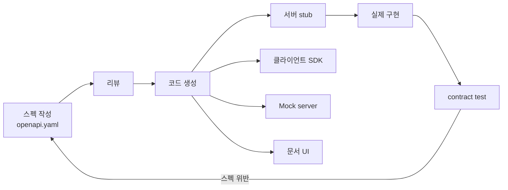
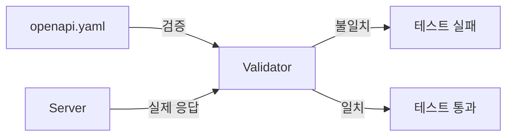
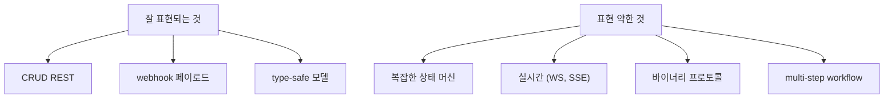

## 정의

**OpenAPI Specification (OAS)** 은 *REST API 를 기술하는 YAML/JSON 형식*. 옛 이름 *Swagger*. 2017 부터 *OpenAPI Initiative* (Linux Foundation) 관리.

핵심 가치:

- 사람이 읽는 *문서* (Swagger UI, Redoc)
- *클라이언트 SDK 자동 생성* (다국어)
- *서버 stub 생성*
- *contract testing* (스펙 ↔ 실제 응답 검증)
- *mock server*

## 기본 구조

```yaml
openapi: 3.1.0
info:
  title: Shop API
  version: 1.0.0
servers:
  - url: https://api.example.com/v1
paths:
  /items/{id}:
    get:
      summary: Get item by ID
      parameters:
        - in: path
          name: id
          required: true
          schema:
            type: string
      responses:
        '200':
          description: OK
          content:
            application/json:
              schema:
                $ref: '#/components/schemas/Item'
        '404':
          description: Not found
components:
  schemas:
    Item:
      type: object
      required: [id, name, price]
      properties:
        id:
          type: string
        name:
          type: string
        price:
          type: integer
          minimum: 0
```

## 워크플로 (API-first)



## OpenAPI 3.1 의 주요 기능

| 기능 | 의미 |
|---|---|
| `$ref` | 정의 재사용 |
| `components.schemas` | 모델 분리 |
| `components.parameters` | 공통 파라미터 |
| `components.responses` | 공통 응답 |
| `components.securitySchemes` | 인증 방식 |
| `oneOf` / `anyOf` / `allOf` | 다형성 |
| `discriminator` | type 필드로 분기 |
| `links` | HATEOAS 표현 |
| Webhooks (3.1+) | 비동기 콜백 |

## 인증 표현

```yaml
components:
  securitySchemes:
    bearerAuth:
      type: http
      scheme: bearer
      bearerFormat: JWT
    apiKeyAuth:
      type: apiKey
      in: header
      name: X-API-Key
    oauth2:
      type: oauth2
      flows:
        authorizationCode:
          authorizationUrl: https://example.com/oauth/authorize
          tokenUrl: https://example.com/oauth/token
          scopes:
            read:items: Read items
            write:items: Modify items

security:
  - bearerAuth: []
```

## 코드 생성 (openapi-generator)

```bash
# TypeScript axios 클라이언트
openapi-generator-cli generate \
  -i openapi.yaml \
  -g typescript-axios \
  -o ./generated/client

# Spring Boot 서버 stub
openapi-generator-cli generate \
  -i openapi.yaml \
  -g spring \
  -o ./generated/server
```

지원 언어 *수십 가지*. 모든 *주요 stack* 의 *클라이언트 SDK* 가 자동.

## Contract Testing

스펙과 *실제 응답* 이 일치하는지 검증:



도구: [Schemathesis](https://schemathesis.readthedocs.io/), [Dredd](https://dredd.org/), [Prism](https://meta.stoplight.io/docs/prism/).

```bash
# Schemathesis 로 spec 기반 fuzzing
schemathesis run openapi.yaml --url=https://api.example.com
```

> spec 의 *모든 endpoint + 가능한 입력 조합* 자동 생성 + 응답 검증.

## 문서 UI

| 도구 | 특징 |
|---|---|
| Swagger UI | 표준, *try it out* 패널 |
| Redoc | 세련된 정적 문서, 사이드 nav |
| Scalar | 신예, dark mode + 빠름 |
| Stoplight Elements | 임베드 친화 |

## OpenAPI 의 한계



> *gRPC* 는 *proto*, *GraphQL* 은 *SDL*, *AsyncAPI* 는 *비동기 / 이벤트* 의 OpenAPI 등가체.

## 흔한 함정

> [!WARNING]
> 1. **스펙과 *실제 응답* 의 표류** = contract test 없으면 *문서가 거짓말*. CI 에 포함.
> 2. **모든 응답을 *200 OK* 로 spec** = 4xx/5xx 도 *명시*. 클라이언트 SDK 의 error type 이 정확해짐.
> 3. **`oneOf` 의 *없는 discriminator*** = 클라이언트가 *어떤 타입인지 구분 못함*. 항상 discriminator 명시.
> 4. **너무 늦게 spec 작성** = *코드부터 작성 후 spec* 은 *retrospective spec* 으로 *문서 정확도 떨어짐*. *API-first* 가 정통.

## 관련 위키

- [[REST API Design]]
- [[gRPC]] (proto 대안)
- [[GraphQL]] (SDL 대안)
- [[JWT]] (인증 표현)
