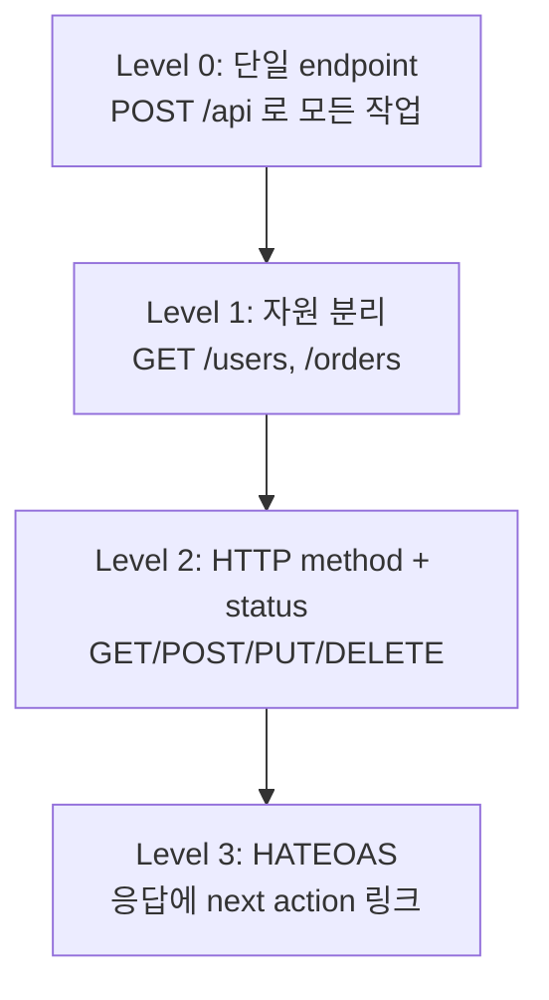
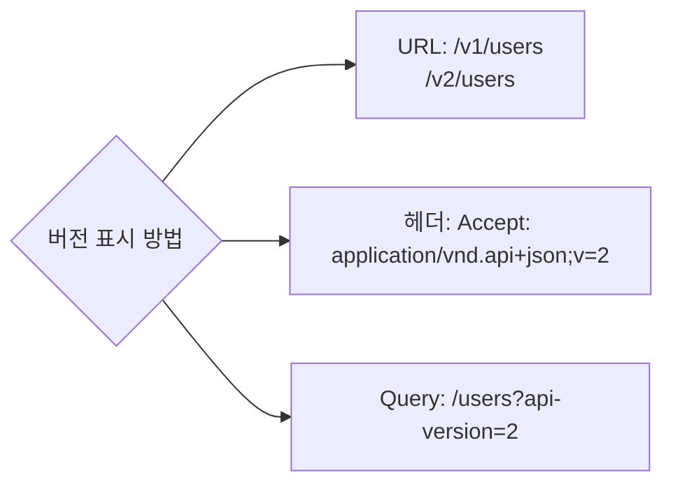
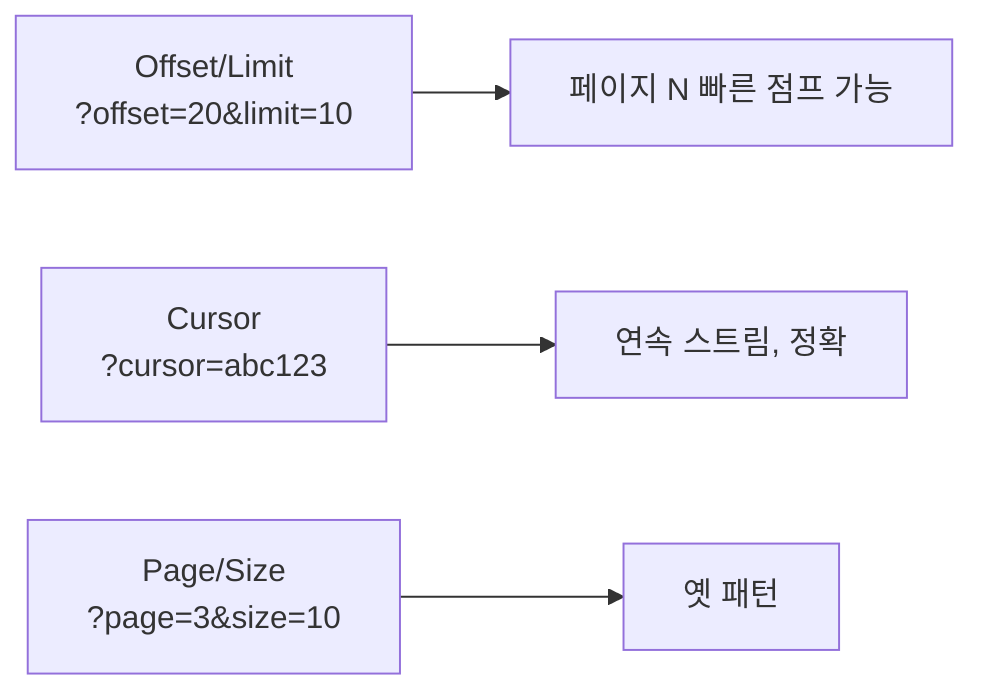

## 정의

**REST (Representational State Transfer)** 는 Roy Fielding 의 2000년 박사논문에서 정립된 *분산 시스템 아키텍처 스타일*. HTTP 의 *자원 / 표현 / 상태 전이* 를 자연스럽게 활용.

> [!IMPORTANT]
> "REST" 라는 단어는 *대부분 실무에서 *HTTP+JSON CRUD* 를 의미*. Fielding 의 *순수 REST* (HATEOAS 포함) 는 *드물게* 적용. 이 페이지는 *실무 REST* 와 *진짜 REST* 둘 다 정리.

## Richardson Maturity Model (REST 의 4 단계)



*실무 대부분은 Level 2 에 머문다*. Level 3 은 *Stripe, GitHub API 의 일부* 정도.

## 자원 모델링

| 좋은 패턴 | 나쁜 패턴 |
|---|---|
| `GET /users/42` | `GET /getUser?id=42` |
| `POST /users` (생성) | `POST /createUser` |
| `DELETE /users/42` | `POST /deleteUser` |
| `GET /users/42/orders` | `GET /userOrders?uid=42` |
| `POST /users/42/email/verify` (action) | `GET /verifyUserEmail?uid=42` |

규칙:

1. *명사로 자원 표현* (`users`, `orders`)
2. *복수형* 권장 (`users` not `user`)
3. *상태 변경* 은 HTTP method 로
4. *체이닝* 자원으로 *관계 표현* (`/users/42/orders/9`)
5. *비-CRUD action* 은 *복합 명사* (`/orders/9/cancel`, `/payments/p_123/refund`)

## HTTP Method 매핑

| Method | 멱등 | 안전 | 사용 |
|---|---|---|---|
| GET | O | O | 조회 |
| HEAD | O | O | 헤더만 |
| POST | X | X | 생성, 비-멱등 action |
| PUT | O | X | 전체 교체 |
| PATCH | X (대개) | X | 부분 갱신 |
| DELETE | O | X | 삭제 |

> [!NOTE]
> *PUT* 은 *idempotent*. 두 번 호출 = 한 번 호출 결과 같음. *POST* 는 *매번 새 자원 생성*.

## Status Code 패턴

| 코드 | 사용 |
|---|---|
| 200 | 성공 (GET, PUT, PATCH) |
| 201 | 생성 (POST). `Location` 헤더로 새 자원 URL |
| 202 | 비동기 접수 |
| 204 | 본문 없음 성공 (DELETE) |
| 400 | 입력 형식 / 필수 누락 |
| 401 | 인증 필요 |
| 403 | 인증 됐지만 권한 없음 |
| 404 | 자원 없음 |
| 409 | 충돌 (중복, 동시성) |
| 422 | 형식은 OK, 의미 검증 실패 |
| 429 | rate limit 초과 |

## API 버전 관리



| 방식 | 장점 | 단점 |
|---|---|---|
| URL (`/v1/`) | 명시적, 캐싱 친화 | URL 영구 변경 |
| Accept 헤더 | URL 깔끔 | 디버깅 / 캐시 어려움 |
| Query | 단순 | URL 변형 |

> *Stripe* 는 *날짜 기반 버전* (`Stripe-Version: 2023-10-16`). 가장 *세밀하고 안전한 호환성*.

## 페이지네이션



| 방식 | 장점 | 단점 |
|---|---|---|
| Offset | 임의 점프 | 큰 offset 시 *O(N) DB query* |
| Cursor | 빠름, 정확 | 임의 점프 불가 |
| Keyset | offset + cursor 의 장점 | 구현 복잡 |

> [!TIP]
> *대량 데이터 + 무한 스크롤* = 거의 항상 *cursor 기반*. *Stripe, GitHub, Twitter API* 모두.

## 응답 포맷 (envelope)

```json
{
  "data": [...],
  "meta": {
    "total": 1024,
    "page": 1,
    "per_page": 20
  },
  "links": {
    "self": "...",
    "next": "...",
    "prev": null
  }
}
```

또는 *납작* (JSON:API 스펙):

```json
{
  "data": [{ "id": "1", "type": "users", "attributes": { ... } }]
}
```

> [!CAUTION]
> envelope 의 *너무 깊은 nesting* 은 *클라이언트 코드 복잡*. *flat + 표준 (RFC 7807 problem details for errors)* 권장.

## 에러 응답 (RFC 7807)

```json
{
  "type": "https://example.com/probs/validation",
  "title": "Validation failed",
  "status": 422,
  "detail": "Email is required",
  "instance": "/requests/12345",
  "errors": [
    { "field": "email", "code": "REQUIRED" }
  ]
}
```

## HATEOAS

응답에 *다음 가능 action 의 링크* 포함:

```json
{
  "id": "o_123",
  "status": "pending",
  "links": {
    "self": "/orders/o_123",
    "cancel": "/orders/o_123/cancel",
    "pay": "/orders/o_123/pay"
  }
}
```

> [!NOTE]
> 클라이언트가 *URL 을 미리 알 필요 없이* 응답의 링크만 따라 가는 *진짜 REST*. 실무에서는 *드물지만 GitHub API 가 좋은 예*.

## 흔한 함정

> [!WARNING]
> 1. **`/users/getById` 같은 *동사 URL*** = REST 의 *자원 사상* 위반.
> 2. **모든 변경에 `PUT`** = PATCH 가 적절한 부분 갱신에도 PUT 사용 → race condition.
> 3. **`POST` 의 *비-멱등* 위험** = 네트워크 재시도 시 *중복 생성*. *Idempotency-Key* 헤더로 해결.
> 4. **버전 *없이* 시작** = breaking change 시 *모든 클라이언트 동시 마이그레이션* 강요.

## 관련 위키

- [[GraphQL]] (대안)
- [[gRPC]] (RPC)
- [[OpenAPI Swagger]]
- [[Idempotency Keys]]
- [[HTTP/1.1]]
